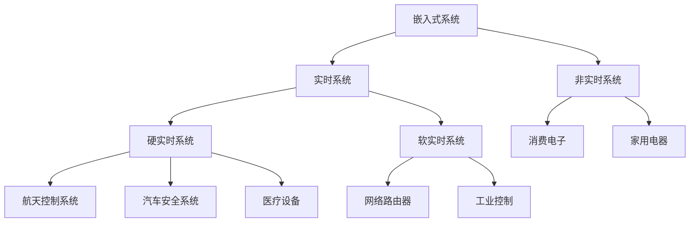

# 嵌入式系统设计入门

## 嵌入式系统的定义与特点

### 什么是嵌入式系统？

嵌入式系统是一种**专用计算机系统**，被设计用来执行特定的功能或任务，通常作为更大系统的一部分。与我们日常使用的通用计算机不同，嵌入式系统具有以下关键特征：

#### 核心特征

1. **专用性强**
   - 针对特定应用优化设计
   - 功能单一但高度专业化
   - 硬件和软件紧密集成

2. **资源受限**
   - 有限的计算能力（CPU性能）
   - 有限的内存（RAM和ROM）
   - 有限的存储空间
   - 有限的功耗预算

3. **实时性要求**
   - **硬实时系统**：必须在严格的时间限制内完成任务
   - **软实时系统**：允许偶尔的时间延迟，但整体性能需要保证

4. **可靠性要求高**
   - 长期稳定运行
   - 错误恢复机制
   - 环境适应性

### 嵌入式系统的分类

#### 按实时性分类



#### 按复杂度分类

1. **简单嵌入式系统**
   - 8位或16位微控制器
   - 无操作系统（裸机开发）
   - 例如：电子玩具、简单家电

2. **复杂嵌入式系统**
   - 32位或64位处理器
   - 运行实时操作系统（RTOS）
   - 例如：智能手机、汽车ECU

3. **网络嵌入式系统**
   - 具备网络通信能力
   - 运行完整操作系统
   - 例如：路由器、智能家居网关

## 嵌入式系统的应用领域

### 消费电子
- **智能手机**：ARM处理器 + Android/iOS系统
- **智能电视**：媒体处理 + 网络连接
- **可穿戴设备**：低功耗 + 传感器集成
- **游戏机**：高性能图形处理 + 实时响应

### 汽车电子
- **发动机控制单元（ECU）**：实时控制燃油喷射
- **防抱死系统（ABS）**：硬实时安全系统
- **高级驾驶辅助系统（ADAS）**：传感器融合 + 决策控制
- **车载娱乐系统**：多媒体处理 + 网络连接

### 工业控制
- **PLC（可编程逻辑控制器）**：工业自动化控制
- **SCADA系统**：监控和数据采集
- **机器人控制系统**：多轴协调 + 实时反馈
- **智能传感器**：数据采集 + 预处理

### 医疗设备
- **心脏起搏器**：超低功耗 + 极高可靠性
- **血糖监测仪**：精确测量 + 数据记录
- **医学影像设备**：信号处理 + 图像重建
- **患者监护仪**：多参数监测 + 报警系统

### 航空航天
- **飞行控制系统**：关键安全系统
- **卫星系统**：辐射硬化 + 远程维护
- **导航设备**：精确定位 + 抗干扰
- **通信系统**：远距离数据传输

## Python在嵌入式系统中的优势

### 为什么选择Python？

传统上，嵌入式系统开发主要使用C/C++语言，但随着Python的不断发展，它在嵌入式领域的应用越来越广泛。

#### 开发效率优势

1. **语法简洁**
   ```python
   # Python：简洁明了
   import machine
   led = machine.Pin("LED", machine.Pin.OUT)
   led.on()

   # C：需要更多样板代码
   #include <hardware/gpio.h>
   #include <hardware/timer.h>

   void led_init() {
       gpio_init(LED_PIN);
       gpio_set_dir(LED_PIN, GPIO_OUT);
   }

   void led_on() {
       gpio_put(LED_PIN, 1);
   }
   ```

2. **快速原型开发**
   - 无需编译，直接运行
   - 交互式调试
   - 丰富的库生态系统

3. **跨平台性**
   - 代码可移植性强
   - 相同的代码可在不同硬件平台运行
   - 降低开发成本

#### MicroPython的优势

MicroPython是Python 3的精简实现，专门为微控制器和嵌入式系统设计：

```python
# MicroPython特性示例
import machine
import utime
import uasyncio

# 硬件访问简化
adc = machine.ADC(26)          # 模数转换器
pwm = machine.PWM(machine.Pin(25))  # PWM输出
i2c = machine.I2C(0, scl=machine.Pin(1), sda=machine.Pin(0))

# 异步编程支持
async def blink_led(interval):
    led = machine.Pin("LED", machine.Pin.OUT)
    while True:
        led.on()
        await uasyncio.sleep(interval)
        led.off()
        await uasyncio.sleep(interval)
```

#### 内存优化

MicroPython的内存管理特点：

1. **垃圾回收机制**
   - 自动内存管理
   - 避免内存泄漏
   - 适合资源受限环境

2. **内置数据结构优化**
   ```python
   # MicroPython优化的数据结构
   from ucollections import namedtuple
   from uarray import array

   # 节省内存的数据结构
   Point = namedtuple('Point', ['x', 'y'])
   sensor_data = array('f', [1.0, 2.0, 3.0])  # 浮点数组
   ```

## 开发环境搭建

### 硬件选择

#### Raspberry Pi Pico
- **优势**：低成本、易上手、丰富的文档
- **规格**：ARM Cortex-M0+ @ 133MHz, 264KB RAM
- **适用场景**：学习、原型开发、简单项目

```python
# Pico特有功能示例
import rp2
from machine import Pin

# PIO编程（可编程I/O）
@rp2.asm_pio(set_init=rp2.PIO.OUT_LOW, out_shiftdir=rp2.PIO.SHIFT_RIGHT)
def blink():
    wrap_target()
    set(pins, 1) [31]
    set(pins, 0) [31]
    wrap()
```

#### ESP32
- **优势**：内置Wi-Fi/蓝牙、双核处理器
- **规格**：Xtensa LX6双核 @ 240MHz, 520KB RAM
- **适用场景**：IoT项目、网络应用、复杂传感器系统

```python
# ESP32特有功能示例
import network
import machine

# WiFi连接
def connect_wifi(ssid, password):
    wlan = network.WLAN(network.STA_IF)
    wlan.active(True)
    wlan.connect(ssid, password)

    # 等待连接
    while not wlan.isconnected():
        print('Connecting...')
        time.sleep(1)

    print('Connected! IP:', wlan.ifconfig()[0])
```

#### STM32系列
- **优势**：工业级性能、丰富的外设
- **规格**：ARM Cortex-M系列，多种型号可选
- **适用场景**：工业控制、专业设备

### 软件工具链

#### Thonny IDE（推荐初学者）
- **优点**：专为MicroPython设计，集成REPL
- **功能**：代码编辑、调试、文件管理
- **设置**：解释器选择MicroPython (Raspberry Pi Pico)

```bash
# 安装Thonny
# Windows: https://thonny.org/
# Mac: brew install --cask thonny
# Linux: sudo apt install thonny
```

#### VS Code + 插件（推荐进阶用户）
- **优点**：强大的编辑功能，插件生态丰富
- **必要插件**：
  - Python
  - Pylance
  - MicroPython
  - PlatformIO

```json
// VS Code 配置文件 .vscode/settings.json
{
    "python.analysis.autoImportCompletions": true,
    "python.analysis.typeCheckingMode": "off",
    "micropython.board": "raspberrypi_pico",
    "micropython.pythonPath": "micropython"
}
```

#### PlatformIO（推荐专业开发）
- **优点**：多平台支持，构建系统完善
- **功能**：依赖管理、版本控制、持续集成

```ini
; platformio.ini 配置文件
[env:pico]
platform = raspberrypi
framework = arduino
board = pico
monitor_speed = 115200
lib_deps =
    adafruit/Adafruit Unified Sensor@^1.1.4
    adafruit/Adafruit BME280 Library@^2.0.1
```

### 第一个MicroPython程序

#### 基础LED闪烁

```python
"""
LED闪烁程序 - 嵌入式系统Hello World
这是学习嵌入式系统开发的第一个程序
"""

import machine
import time

class LEDController:
    """
    LED控制器类
    封装LED控制功能，支持多种闪烁模式
    """

    def __init__(self, pin_name="LED"):
        """
        初始化LED控制器

        参数:
            pin_name: LED引脚名称或编号
        """
        self.led = machine.Pin(pin_name, machine.Pin.OUT)
        self.state = False
        print(f"LED控制器初始化完成，引脚: {pin_name}")

    def toggle(self):
        """切换LED状态"""
        self.state = not self.state
        self.led.value(1 if self.state else 0)
        return self.state

    def on(self):
        """点亮LED"""
        self.state = True
        self.led.value(1)
        return True

    def off(self):
        """熄灭LED"""
        self.state = False
        self.led.value(0)
        return False

    def blink_pattern(self, pattern):
        """
        按指定模式闪烁LED

        参数:
            pattern: 闪烁模式列表 [on_time, off_time, repeat]
        """
        on_time, off_time, repeat = pattern

        for _ in range(repeat):
            self.on()
            time.sleep(on_time)
            self.off()
            time.sleep(off_time)

def main():
    """
    主函数 - 演示多种LED控制模式
    """
    print("=== 嵌入式系统LED控制示例 ===")
    print("开始LED闪烁演示...")

    # 创建LED控制器
    led = LEDController()

    try:
        while True:
            print("模式1: 简单闪烁 (1秒亮，1秒灭)")
            for _ in range(3):
                led.toggle()
                time.sleep(1)

            print("模式2: 快速闪烁 (0.2秒亮，0.2秒灭)")
            led.blink_pattern([0.2, 0.2, 5])

            print("模式3: SOS信号")
            sos_pattern = [
                (0.3, 0.3, 3),   # 三短 (S)
                (0.6, 0.6, 3),   # 三长 (O)
                (0.3, 0.3, 3)    # 三短 (S)
            ]
            for pattern in sos_pattern:
                led.blink_pattern(pattern)
                time.sleep(1)

            print("完成一个循环，休息2秒...")
            time.sleep(2)

    except KeyboardInterrupt:
        print("\n程序停止")
        led.off()
        print("LED已关闭")

if __name__ == "__main__":
    main()
```

#### 进阶：带状态指示的LED控制

```python
"""
带状态指示的LED控制系统
演示状态机的使用和系统状态管理
"""

import machine
import time
from enum import Enum

class SystemState(Enum):
    """系统状态枚举"""
    INIT = "初始化"
    NORMAL = "正常"
    WARNING = "警告"
    ERROR = "错误"
    MAINTENANCE = "维护"

class LEDIndicator:
    """
    LED状态指示器
    根据系统状态显示不同的LED模式
    """

    def __init__(self, red_pin=25, green_pin=15, blue_pin=14):
        """
        初始化RGB LED

        参数:
            red_pin: 红色LED引脚
            green_pin: 绿色LED引脚
            blue_pin: 蓝色LED引脚
        """
        self.red = machine.Pin(red_pin, machine.Pin.OUT)
        self.green = machine.Pin(green_pin, machine.Pin.OUT)
        self.blue = machine.Pin(blue_pin, machine.Pin.OUT)

        # PWM控制亮度
        self.red_pwm = machine.PWM(self.red)
        self.green_pwm = machine.PWM(self.green)
        self.blue_pwm = machine.PWM(self.blue)

        self.red_pwm.freq(1000)
        self.green_pwm.freq(1000)
        self.blue_pwm.freq(1000)

        self.set_color(0, 0, 0)  # 初始关闭

    def set_color(self, r, g, b):
        """
        设置LED颜色

        参数:
            r, g, b: RGB值 (0-255)
        """
        # 转换为PWM值 (0-65535)
        self.red_pwm.duty_u16(int(r * 65535 / 255))
        self.green_pwm.duty_u16(int(g * 65535 / 255))
        self.blue_pwm.duty_u16(int(b * 65535 / 255))

    def set_brightness(self, brightness):
        """
        设置整体亮度

        参数:
            brightness: 亮度值 (0-100)
        """
        factor = brightness / 100
        self.red_pwm.duty_u16(int(self.red_pwm.duty_u16() * factor))
        self.green_pwm.duty_u16(int(self.green_pwm.duty_u16() * factor))
        self.blue_pwm.duty_u16(int(self.blue_pwm.duty_u16() * factor))

    def indicate_state(self, state):
        """
        根据系统状态指示

        参数:
            state: SystemState枚举值
        """
        if state == SystemState.INIT:
            self.blink_color(255, 255, 0, 0.2)  # 黄色快速闪烁
        elif state == SystemState.NORMAL:
            self.set_color(0, 255, 0)  # 绿色常亮
        elif state == SystemState.WARNING:
            self.blink_color(255, 255, 0, 0.5)  # 黄色慢速闪烁
        elif state == SystemState.ERROR:
            self.blink_color(255, 0, 0, 0.1)  # 红色快速闪烁
        elif state == SystemState.MAINTENANCE:
            self.set_color(0, 0, 255)  # 蓝色常亮

    def blink_color(self, r, g, b, interval):
        """
        指定颜色闪烁

        参数:
            r, g, b: RGB值
            interval: 闪烁间隔
        """
        self.set_color(r, g, b)
        time.sleep(interval)
        self.set_color(0, 0, 0)
        time.sleep(interval)

class SystemMonitor:
    """
    系统监控器
    监控系统状态并控制LED指示
    """

    def __init__(self):
        """初始化系统监控器"""
        self.led = LEDIndicator()
        self.state = SystemState.INIT
        self.error_count = 0
        self.warning_count = 0

        print("系统监控器初始化完成")

    def set_state(self, new_state):
        """
        设置系统状态

        参数:
            new_state: 新的系统状态
        """
        old_state = self.state
        self.state = new_state

        print(f"系统状态变更: {old_state.value} -> {new_state.value}")
        self.led.indicate_state(new_state)

    def report_error(self):
        """报告错误"""
        self.error_count += 1
        if self.error_count > 3:
            self.set_state(SystemState.ERROR)
        else:
            self.set_state(SystemState.WARNING)

    def report_warning(self):
        """报告警告"""
        self.warning_count += 1
        if self.state == SystemState.NORMAL:
            self.set_state(SystemState.WARNING)

    def reset_counters(self):
        """重置计数器"""
        self.error_count = 0
        self.warning_count = 0
        if self.state != SystemState.MAINTENANCE:
            self.set_state(SystemState.NORMAL)

    def get_status(self):
        """获取系统状态信息"""
        return {
            'state': self.state.value,
            'error_count': self.error_count,
            'warning_count': self.warning_count,
            'uptime': time.time()
        }

def main():
    """
    主函数 - 演示状态监控系统
    """
    print("=== 嵌入式系统状态监控示例 ===")

    monitor = SystemMonitor()

    try:
        # 模拟系统运行过程
        monitor.set_state(SystemState.INIT)
        time.sleep(2)

        monitor.set_state(SystemState.NORMAL)
        time.sleep(3)

        # 模拟警告
        print("模拟警告事件...")
        monitor.report_warning()
        time.sleep(3)

        # 模拟错误
        print("模拟错误事件...")
        monitor.report_error()
        time.sleep(3)

        # 更多错误
        monitor.report_error()
        monitor.report_error()
        monitor.report_error()
        time.sleep(3)

        # 进入维护模式
        print("进入维护模式...")
        monitor.set_state(SystemState.MAINTENANCE)
        time.sleep(3)

        # 恢复正常
        monitor.reset_counters()
        time.sleep(3)

        # 显示最终状态
        status = monitor.get_status()
        print(f"最终状态: {status}")

    except KeyboardInterrupt:
        print("\n程序停止")
        monitor.led.set_color(0, 0, 0)

if __name__ == "__main__":
    main()
```

## 实践练习

### 练习1：环境搭建验证

**目标**：验证开发环境是否正确配置

**步骤**：
1. 安装Thonny IDE
2. 连接Raspberry Pi Pico
3. 在Thonny中选择MicroPython解释器
4. 运行上述LED闪烁程序

**验证要点**：
- 是否能成功上传代码
- LED是否按预期闪烁
- 是否能正常停止程序

### 练习2：LED控制模式扩展

**目标**：扩展LED控制功能，实现更多模式

**要求**：
1. 实现呼吸灯效果
2. 添加按键控制功能
3. 实现LED亮度调节

**扩展功能**：
```python
def breathing_effect(led, min_brightness=0, max_brightness=100, duration=2.0):
    """
    呼吸灯效果

    参数:
        led: LED控制器
        min_brightness: 最小亮度 (0-100)
        max_brightness: 最大亮度 (0-100)
        duration: 一个周期的时间 (秒)
    """
    steps = 50
    step_time = duration / (2 * steps)

    while True:
        # 亮度递增
        for i in range(steps):
            brightness = min_brightness + (max_brightness - min_brightness) * i / steps
            led.set_brightness(brightness)
            time.sleep(step_time)

        # 亮度递减
        for i in range(steps):
            brightness = max_brightness - (max_brightness - min_brightness) * i / steps
            led.set_brightness(brightness)
            time.sleep(step_time)
```

### 练习3：系统状态机设计

**目标**：设计一个完整的状态机系统

**要求**：
1. 定义至少5种系统状态
2. 每种状态有不同的LED指示模式
3. 状态之间有明确的转换条件
4. 添加事件处理机制

## 课后作业

### 作业1：嵌入式设备调研
**要求**：
1. 找出你身边的3个嵌入式系统设备
2. 分析每个设备的：
   - 主要功能
   - 硬件组成
   - 使用的处理器类型
   - 操作系统（如果有）
   - 功耗特点
3. 提交一份详细的分析报告

### 作业2：Python vs C/C++对比分析
**要求**：
1. 同样的LED闪烁功能，分别用Python和C语言实现
2. 对比两种实现的：
   - 代码行数
   - 开发时间
   - 执行效率
   - 内存使用
   - 可维护性
3. 总结各自的优缺点和适用场景

### 作业3：创新项目构思
**要求**：
1. 构思一个创新的嵌入式系统应用
2. 设计系统的：
   - 功能需求
   - 硬件架构
   - 软件架构
   - 用户交互
3. 评估项目的可行性和市场价值

## 总结

嵌入式系统设计是一个融合硬件和软件的综合性学科。通过本章的学习，你应该：

1. **理解嵌入式系统的基本概念**和特点
2. **掌握Python在嵌入式开发中的优势**
3. **成功搭建开发环境**
4. **能够编写基本的嵌入式程序**
5. **理解状态机等设计模式的应用**

在下一章中，我们将深入探讨微控制器的基础知识，包括ARM Cortex-M架构、寄存器操作和中断处理等内容。

## 拓展阅读

1. **《嵌入式系统基础》** - David E. Simon
2. **《Making Embedded Systems》** - Elecia White
3. **《MicroPython for the Internet of Things》** - Charles Bell
4. **ARM Cortex-M系列处理器参考手册**
5. **MicroPython官方文档** - https://docs.micropython.org/

## 下一章预告

**第二章：微控制器基础**
- ARM Cortex-M架构详解
- 寄存器和内存映射
- 中断和异常处理
- 时钟系统和电源管理
- 调试技术入门