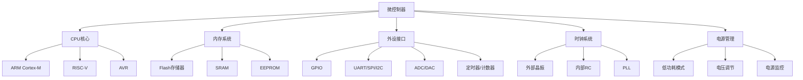
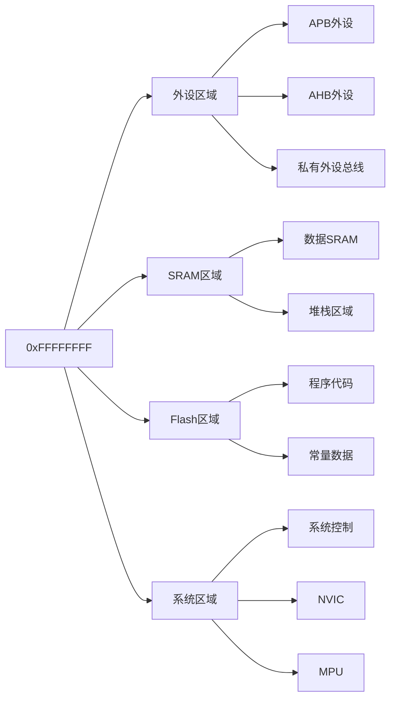

# 微控制器基础

## 微控制器架构概述

### 什么是微控制器？

微控制器（Microcontroller Unit，MCU）是一种**集成的计算系统**，将处理器核心、内存、输入/输出接口和外设集成在单一芯片上。与通用处理器不同，微控制器专门为嵌入式应用设计，具有功耗低、成本低、体积小的特点。

#### 微控制器的核心组件



### ARM Cortex-M系列架构

ARM Cortex-M系列是专为嵌入式应用设计的32位RISC处理器架构，在微控制器市场占据主导地位。

#### Cortex-M系列对比

| 特性 | Cortex-M0+ | Cortex-M3 | Cortex-M4 | Cortex-M7 |
|------|------------|-----------|-----------|-----------|
| 架构 | ARMv6-M | ARMv7-M | ARMv7E-M | ARMv7E-M |
| 性能 | 0.9 DMIPS/MHz | 1.25 DMIPS/MHz | 1.25 DMIPS/MHz | 2.14 DMIPS/MHz |
| DSP指令 | 无 | 无 | 有 | 有 |
| FPU | 无 | 无 | 单精度 | 单/双精度 |
| 中断延迟 | 最短 | 最短 | 最短 | 最短 |
| 典型应用 | 简单控制 | 通用控制 | 信号处理 | 高性能应用 |

#### Cortex-M核心特性

**流水线架构**
```python
# Cortex-M3/4/7采用3级流水线
class PipelineStage:
    FETCH = "取指"    # 从Flash取指令
    DECODE = "译码"    # 译码指令
    EXECUTE = "执行"  # 执行指令

# 流水线执行过程
def demonstrate_pipeline():
    pipeline = []
    instructions = ["MOV R0, #1", "ADD R1, R0, #2", "STR R1, [R2]"]

    for cycle in range(5):
        stage = {}
        if cycle < len(instructions):
            stage['fetch'] = instructions[cycle]
        if cycle > 0 and cycle-1 < len(instructions):
            stage['decode'] = instructions[cycle-1]
        if cycle > 1 and cycle-2 < len(instructions):
            stage['execute'] = instructions[cycle-2]

        pipeline.append(stage)
        print(f"周期 {cycle}: {stage}")

    return pipeline
```

**Thumb-2指令集**
```python
# Thumb-2指令集特点
def thumb2_features():
    """
    Thumb-2混合16位和32位指令
    既保持代码密度，又提供32位性能
    """
    features = {
        "指令长度": ["16位", "32位"],
        "代码密度": "比纯32位指令提高30%",
        "性能": "接近纯32位指令",
        "向后兼容": "兼容Thumb指令集"
    }

    # 32位指令示例
    instructions_32bit = [
        "MOVW R0, #0x1234",  # 立即数加载（宽）
        "MOVT R0, #0x5678",  # 立即数加载（高位）
        "BL function",       # 长调用
        "CBNZ R0, label"     # 比较并跳转（如果不为零）
    ]

    # 16位指令示例
    instructions_16bit = [
        "MOV R0, #5",        # 小立即数加载
        "ADD R1, R2",        # 寄存器加法
        "BX LR",             # 函数返回
        "B label"            # 无条件跳转
    ]

    return features, instructions_16bit, instructions_32bit
```

### 内存映射与地址空间

#### 内存映射概念

微控制器的**内存映射**是指将所有外设和内存统一编址到一个连续的地址空间中。Cortex-M处理器使用32位地址空间，支持4GB寻址范围。



#### Raspberry Pi Pico (RP2040) 内存映射

```python
# RP2040内存映射示例
def rp2040_memory_map():
    """
    RP2040内存映射布局
    """
    memory_map = {
        # 系统区域
        0xE0000000: "Cortex-M0+内部外设 (NVIC, SysTick等)",
        0x40000000: "RP2040外设 (GPIO, UART, SPI等)",
        0x20000000: "SRAM (264KB)",
        0x10000000: "QSPI总线 (外部Flash)",
        0x00000000: "BootROM (16KB)"
    }

    # 常用外设地址
    peripherals = {
        "GPIO": 0x40014000,
        "UART0": 0x40034000,
        "SPI0": 0x4003C000,
        "I2C0": 0x40044000,
        "ADC": 0x4004C000,
        "PWM": 0x40050000,
        "TIMER": 0x40008000,
        "SYSCTRL": 0x40018000
    }

    return memory_map, peripherals

# 寄存器访问示例
def register_access_example():
    """
    演示如何通过内存映射访问寄存器
    """
    import machine
    import uctypes

    # GPIO寄存器映射
    GPIO_REGS = {
        'GPIO_IN': 0x00004,    # GPIO输入值
        'GPIO_OUT': 0x00010,   # GPIO输出值
        'GPIO_OE': 0x00020,    # GPIO输出使能
        'GPIO_INTE': 0x00028,  # 中断使能
        'GPIO_INTF': 0x00030,  # 中断触发
        'GPIO_INTS': 0x00038,  # 中断状态
    }

    # 使用machine模块直接访问
    gpio = machine.Pin(25, machine.Pin.OUT)

    # 或者通过内存映射访问
    gpio_base = 0x40014000
    gpio_out_addr = gpio_base + GPIO_REGS['GPIO_OUT']

    print(f"GPIO基地址: 0x{gpio_base:08X}")
    print(f"GPIO输出寄存器地址: 0x{gpio_out_addr:08X}")
```

## 寄存器编程

### 寄存器基础概念

**寄存器**是微控制器内部的小容量高速存储单元，用于：
- 临时存储数据
- 控制外设功能
- 存储状态信息
- 配置系统参数

#### 寄存器分类

```python
class RegisterTypes:
    """
    寄存器类型分类
    """

    def __init__(self):
        self.control_registers = [
            "GPIO_OUT",    # GPIO输出控制
            "UART_CR",     # UART控制寄存器
            "SPI_CR",      # SPI控制寄存器
        ]

        self.status_registers = [
            "GPIO_IN",     # GPIO输入状态
            "UART_SR",     # UART状态寄存器
            "SPI_SR",      # SPI状态寄存器
        ]

        self.configuration_registers = [
            "GPIO_OE",     # GPIO方向配置
            "UART_BRGR",   # UART波特率配置
            "SPI_CDR",     # SPI时钟分频
        ]

        self.interrupt_registers = [
            "NVIC_ISER",   # 中断使能
            "NVIC_ICER",   # 中断禁止
            "NVIC_ISPR",   # 中断挂起
        ]

    def describe_register(self, reg_name):
        """
        描述寄存器功能
        """
        descriptions = {
            "GPIO_OUT": "控制GPIO引脚输出状态，每个位对应一个引脚",
            "GPIO_IN": "读取GPIO引脚输入状态，每个位对应一个引脚",
            "GPIO_OE": "配置GPIO引脚方向，1=输出，0=输入",
            "UART_CR": "控制UART启用/禁用、数据格式等",
            "UART_SR": "指示UART状态（数据就绪、发送完成等）",
            "NVIC_ISER": "嵌套向量中断控制器使能寄存器",
        }

        return descriptions.get(reg_name, "未知寄存器")
```

### 位操作技术

在嵌入式系统中，经常需要对寄存器的特定位进行操作。掌握位操作技术是嵌入式开发的基本功。

#### 基本位操作

```python
class BitOperations:
    """
    位操作工具类
    """

    @staticmethod
    def set_bit(value, bit_position):
        """
        设置指定位为1

        参数:
            value: 原始值
            bit_position: 位位置 (0-31)

        返回:
            修改后的值
        """
        return value | (1 << bit_position)

    @staticmethod
    def clear_bit(value, bit_position):
        """
        清除指定位为0

        参数:
            value: 原始值
            bit_position: 位位置 (0-31)

        返回:
            修改后的值
        """
        return value & ~(1 << bit_position)

    @staticmethod
    def toggle_bit(value, bit_position):
        """
        翻转指定位

        参数:
            value: 原始值
            bit_position: 位位置 (0-31)

        返回:
            修改后的值
        """
        return value ^ (1 << bit_position)

    @staticmethod
    def get_bit(value, bit_position):
        """
        获取指定位的值

        参数:
            value: 原始值
            bit_position: 位位置 (0-31)

        返回:
            位的值 (0或1)
        """
        return (value >> bit_position) & 1

    @staticmethod
    def set_bits(value, bits_value, start_bit, num_bits):
        """
        设置多个位

        参数:
            value: 原始值
            bits_value: 要设置的值
            start_bit: 起始位位置
            num_bits: 位数

        返回:
            修改后的值
        """
        # 创建掩码
        mask = (1 << num_bits) - 1
        # 清除目标位
        value &= ~(mask << start_bit)
        # 设置新值
        value |= (bits_value & mask) << start_bit
        return value

    @staticmethod
    def get_bits(value, start_bit, num_bits):
        """
        获取多个位的值

        参数:
            value: 原始值
            start_bit: 起始位位置
            num_bits: 位数

        返回:
            提取的值
        """
        mask = (1 << num_bits) - 1
        return (value >> start_bit) & mask

# 位操作示例
def bit_operation_examples():
    """
    位操作示例演示
    """
    ops = BitOperations()

    # 示例1：LED控制
    print("=== LED控制示例 ===")
    gpio_out = 0x00000000  # 初始所有GPIO输出为0

    # 设置GPIO25为高电平
    gpio_out = ops.set_bit(gpio_out, 25)
    print(f"设置GPIO25后: 0x{gpio_out:08X}")

    # 设置GPIO15为高电平
    gpio_out = ops.set_bit(gpio_out, 15)
    print(f"设置GPIO15后: 0x{gpio_out:08X}")

    # 清除GPIO25
    gpio_out = ops.clear_bit(gpio_out, 25)
    print(f"清除GPIO25后: 0x{gpio_out:08X}")

    # 示例2：UART配置
    print("\n=== UART配置示例 ===")
    uart_cr = 0x00000000  # UART控制寄存器初始值

    # 启用UART (bit0)
    uart_cr = ops.set_bit(uart_cr, 0)
    print(f"启用UART后: 0x{uart_cr:08X}")

    # 启用发送器 (bit2)
    uart_cr = ops.set_bit(uart_cr, 2)
    print(f"启用发送器后: 0x{uart_cr:08X}")

    # 启用接收器 (bit1)
    uart_cr = ops.set_bit(uart_cr, 1)
    print(f"启用接收器后: 0x{uart_cr:08X}")

    # 检查UART是否启用
    uart_enabled = ops.get_bit(uart_cr, 0)
    print(f"UART启用状态: {uart_enabled}")

    # 示例3：定时器分频器设置
    print("\n=== 定时器配置示例 ===")
    timer_div = 0x00000000

    # 设置分频器值为255 (8位)
    timer_div = ops.set_bits(timer_div, 255, 0, 8)
    print(f"分频器值: {timer_div}")

    # 设置预分频器值为63 (6位)
    timer_div = ops.set_bits(timer_div, 63, 8, 6)
    print(f"完整配置: 0x{timer_div:08X}")

    # 读取分频器值
    div_value = ops.get_bits(timer_div, 0, 8)
    prescale_value = ops.get_bits(timer_div, 8, 6)
    print(f"分频器: {div_value}, 预分频器: {prescale_value}")

    return ops
```

### 寄存器映射编程

使用MicroPython的machine模块进行寄存器映射编程：

```python
class GPIOController:
    """
    GPIO控制器 - 通过寄存器映射实现
    """
    def __init__(self, base_addr=0x40014000):
        """
        初始化GPIO控制器

        参数:
            base_addr: GPIO寄存器基地址
        """
        self.base_addr = base_addr

        # 寄存器偏移地址
        self.GPIO_OUT = 0x00010
        self.GPIO_OE = 0x00020
        self.GPIO_IN = 0x00004

        # 创建寄存器映射
        self._setup_registers()

    def _setup_registers(self):
        """
        设置寄存器映射
        """
        # 使用uctypes创建寄存器映射结构
        import uctypes

        self.gpio_regs = uctypes.struct(
            self.base_addr,
            {
                "gpio_in": uctypes.UINT32 | 0x04,
                "gpio_out": uctypes.UINT32 | 0x10,
                "gpio_oe": uctypes.UINT32 | 0x20,
            }
        )

    def set_pin_mode(self, pin, mode):
        """
        设置引脚模式

        参数:
            pin: 引脚号 (0-29)
            mode: 'input' 或 'output'
        """
        if mode == 'output':
            # 设置为输出模式
            self.gpio_regs.gpio_oe |= (1 << pin)
        elif mode == 'input':
            # 设置为输入模式
            self.gpio_regs.gpio_oe &= ~(1 << pin)

    def write_pin(self, pin, value):
        """
        写入引脚值

        参数:
            pin: 引脚号 (0-29)
            value: 0或1
        """
        if value:
            self.gpio_regs.gpio_out |= (1 << pin)
        else:
            self.gpio_regs.gpio_out &= ~(1 << pin)

    def read_pin(self, pin):
        """
        读取引脚值

        参数:
            pin: 引脚号 (0-29)

        返回:
            引脚值 (0或1)
        """
        return (self.gpio_regs.gpio_in >> pin) & 1

    def toggle_pin(self, pin):
        """
        翻转引脚值

        参数:
            pin: 引脚号 (0-29)
        """
        self.gpio_regs.gpio_out ^= (1 << pin)

class UARTController:
    """
    UART控制器 - 通过寄存器映射实现
    """
    def __init__(self, base_addr=0x40034000):
        """
        初始化UART控制器

        参数:
            base_addr: UART寄存器基地址
        """
        self.base_addr = base_addr

        # 寄存器偏移地址
        self.UART_DR = 0x00000   # 数据寄存器
        self.UART_SR = 0x00004   # 状态寄存器
        self.UART_CR = 0x00008   # 控制寄存器
        self.UART_IBRD = 0x0000C  # 整数波特率分频器
        self.UART_FBRD = 0x00010  # 小数波特率分频器
        self.UART_LCRH = 0x0000C  # 线路控制寄存器

        # 状态寄存器位定义
        self.TXFE = 7    # 发送FIFO空
        self.RXFF = 6    # 接收FIFO满
        self.TXFF = 5    # 发送FIFO满
        self.RXFE = 4    # 接收FIFO空
        self.BUSY = 3    # UART忙
        self.DSR = 2     # 数据设置就绪

        # 控制寄存器位定义
        self.UARTEN = 0  # UART使能
        self.TXE = 8    # 发送使能
        self.RXE = 9    # 接收使能

    def init(self, baudrate=115200, data_bits=8, stop_bits=1, parity='none'):
        """
        初始化UART

        参数:
            baudrate: 波特率
            data_bits: 数据位数 (5-8)
            stop_bits: 停止位数 (1-2)
            parity: 校验位 ('none', 'odd', 'even')
        """
        # 禁用UART
        self.write_reg(self.UART_CR, 0)

        # 设置波特率
        self.set_baudrate(baudrate)

        # 设置数据格式
        self.set_format(data_bits, stop_bits, parity)

        # 启用UART
        cr_value = (1 << self.UARTEN) | (1 << self.TXE) | (1 << self.RXE)
        self.write_reg(self.UART_CR, cr_value)

        print(f"UART初始化完成，波特率: {baudrate}")

    def write_reg(self, offset, value):
        """
        写入寄存器

        参数:
            offset: 寄存器偏移地址
            value: 写入的值
        """
        import machine
        addr = self.base_addr + offset
        machine.mem32[addr] = value

    def read_reg(self, offset):
        """
        读取寄存器

        参数:
            offset: 寄存器偏移地址

        返回:
            寄存器值
        """
        import machine
        addr = self.base_addr + offset
        return machine.mem32[addr]

    def set_baudrate(self, baudrate):
        """
        设置波特率

        参数:
            baudrate: 目标波特率
        """
        # 假设系统时钟为125MHz
        sys_clock = 125_000_000
        uart_clock = sys_clock // 8  # UART时钟分频

        # 计算波特率分频器
        baud_divisor = uart_clock // baudrate
        ibrd = baud_divisor >> 6
        fbrd = ((baud_divisor & 0x3F) * 64 + 32) // 64

        self.write_reg(self.UART_IBRD, ibrd)
        self.write_reg(self.UART_FBRD, fbrd)

    def set_format(self, data_bits, stop_bits, parity):
        """
        设置数据格式

        参数:
            data_bits: 数据位数
            stop_bits: 停止位数
            parity: 校验位
        """
        lcrh_value = 0

        # 设置数据位数
        if data_bits == 8:
            lcrh_value |= (3 << 5)  # 8位数据
        elif data_bits == 7:
            lcrh_value |= (2 << 5)  # 7位数据
        elif data_bits == 6:
            lcrh_value |= (1 << 5)  # 6位数据
        elif data_bits == 5:
            lcrh_value |= (0 << 5)  # 5位数据

        # 设置停止位数
        if stop_bits == 2:
            lcrh_value |= (1 << 3)  # 2位停止

        # 设置校验位
        if parity == 'even':
            lcrh_value |= (1 << 1) | (1 << 4)  # 偶校验
        elif parity == 'odd':
            lcrh_value |= (1 << 1) | (0 << 4)  # 奇校验

        self.write_reg(self.UART_LCRH, lcrh_value)

    def write_byte(self, data):
        """
        写入一个字节

        参数:
            data: 要写入的数据 (0-255)
        """
        # 等待发送FIFO为空
        while self.read_reg(self.UART_SR) & (1 << self.TXFE) == 0:
            pass

        # 写入数据
        self.write_reg(self.UART_DR, data)

    def read_byte(self):
        """
        读取一个字节

        返回:
            读取的数据，如果没有数据返回None
        """
        # 检查接收FIFO是否为空
        if self.read_reg(self.UART_SR) & (1 << self.RXFE) == 0:
            return self.read_reg(self.UART_DR) & 0xFF
        return None

    def write_string(self, text):
        """
        写入字符串

        参数:
            text: 要写入的字符串
        """
        for char in text:
            self.write_byte(ord(char))

    def flush(self):
        """
        等待发送完成
        """
        while self.read_reg(self.UART_SR) & (1 << self.BUSY):
            pass
```

## 中断和异常处理

### 中断系统概述

**中断**是微控制器响应外部或内部事件的重要机制。当中断发生时，处理器会暂停当前任务，转而执行中断服务程序（ISR），处理完后再返回原任务。

#### 中断类型

```python
class InterruptTypes:
    """
    中断类型分类
    """

    def __init__(self):
        self.external_interrupts = [
            "GPIO中断",
            "外部中断引脚",
            "通信接口中断",
        ]

        self.internal_interrupts = [
            "定时器中断",
            "系统滴答中断",
            "看门狗中断",
        ]

        self.software_interrupts = [
            "PendSV",
            "SysTick",
            "SVCall",
        ]

        self.exceptions = [
            "复位",
            "NMI (不可屏蔽中断)",
            "硬故障",
            "内存管理故障",
            "总线故障",
            "使用故障",
            "调试故障",
        ]

    def describe_interrupt(self, irq_type):
        """
        描述中断类型
        """
        descriptions = {
            "GPIO中断": "GPIO引脚状态变化触发的中断",
            "定时器中断": "定时器计数到达设定值触发的中断",
            "系统滴答中断": "系统定时器中断，用于任务调度",
            "硬故障": "严重的硬件错误，无法恢复",
            "内存管理故障": "内存访问权限错误",
            "总线故障": "总线访问错误",
            "使用故障": "指令执行错误",
        }

        return descriptions.get(irq_type, "未知中断类型")
```

### NVIC (嵌套向量中断控制器)

NVIC是ARM Cortex-M处理器的中断管理器，支持：
- 多达240个外部中断
- 可编程的优先级
- 中断嵌套
- 中断屏蔽

```python
class NVICController:
    """
    NVIC控制器示例
    """
    def __init__(self):
        self.nvic_base = 0xE000E100

        # 寄存器偏移
        self.ISER = 0x0000  # 中断使能寄存器
        self.ICER = 0x0080  # 中断清除寄存器
        self.ISPR = 0x0100  # 中断挂起寄存器
        self.ICPR = 0x0180  # 中断清除挂起寄存器
        self.IABR = 0x0200  # 中断活跃位寄存器
        self.IP = 0x0300    # 中断优先级寄存器

    def enable_irq(self, irq_number):
        """
        使能中断

        参数:
            irq_number: 中断号 (0-239)
        """
        reg_offset = (irq_number // 32) * 4
        bit_position = irq_number % 32

        addr = self.nvic_base + self.ISER + reg_offset
        machine.mem32[addr] = (1 << bit_position)

    def disable_irq(self, irq_number):
        """
        禁用中断

        参数:
            irq_number: 中断号 (0-239)
        """
        reg_offset = (irq_number // 32) * 4
        bit_position = irq_number % 32

        addr = self.nvic_base + self.ICER + reg_offset
        machine.mem32[addr] = (1 << bit_position)

    def set_priority(self, irq_number, priority):
        """
        设置中断优先级

        参数:
            irq_number: 中断号
            priority: 优先级 (0-255, 数字越小优先级越高)
        """
        addr = self.nvic_base + self.IP + irq_number
        machine.mem32[addr] = priority

    def get_priority(self, irq_number):
        """
        获取中断优先级

        参数:
            irq_number: 中断号

        返回:
            优先级值
        """
        addr = self.nvic_base + self.IP + irq_number
        return machine.mem32[addr] & 0xFF

    def set_pending(self, irq_number):
        """
        设置中断挂起

        参数:
            irq_number: 中断号
        """
        reg_offset = (irq_number // 32) * 4
        bit_position = irq_number % 32

        addr = self.nvic_base + self.ISPR + reg_offset
        machine.mem32[addr] = (1 << bit_position)

    def clear_pending(self, irq_number):
        """
        清除中断挂起

        参数:
            irq_number: 中断号
        """
        reg_offset = (irq_number // 32) * 4
        bit_position = irq_number % 32

        addr = self.nvic_base + self.ICPR + reg_offset
        machine.mem32[addr] = (1 << bit_position)

    def is_active(self, irq_number):
        """
        检查中断是否活跃

        参数:
            irq_number: 中断号

        返回:
            True如果中断活跃
        """
        reg_offset = (irq_number // 32) * 4
        bit_position = irq_number % 32

        addr = self.nvic_base + self.IABR + reg_offset
        return (machine.mem32[addr] & (1 << bit_position)) != 0
```

### 中断服务程序示例

```python
class InterruptExample:
    """
    中断示例：按钮控制LED
    """
    def __init__(self):
        self.led = machine.Pin(25, machine.Pin.OUT)
        self.button = machine.Pin(16, machine.Pin.IN, machine.Pin.PULL_UP)
        self.button_count = 0

        # 初始化NVIC
        self.nvic = NVICController()

    def button_isr(self, pin):
        """
        按钮中断服务程序
        """
        # 简单的消抖处理
        time.sleep_ms(50)

        if self.button.value() == 0:  # 确认按钮按下
            self.button_count += 1
            print(f"按钮按下次数: {self.button_count}")

            # 切换LED状态
            self.led.value(not self.led.value())

    def setup_interrupt(self):
        """
        设置中断
        """
        # 配置GPIO16为中断输入
        self.button.irq(
            trigger=machine.Pin.IRQ_FALLING,
            handler=self.button_isr
        )

        # 使能GPIO中断 (假设GPIO16对应IRQ号26)
        self.nvic.enable_irq(26)

        # 设置中断优先级
        self.nvic.set_priority(26, 128)  # 中等优先级

        print("中断设置完成")

    def run(self):
        """
        运行中断示例
        """
        print("=== 中断示例开始 ===")
        print("按下GPIO16按钮控制LED")

        self.setup_interrupt()

        try:
            while True:
                # 主循环可以执行其他任务
                print(f"系统运行中，按钮计数: {self.button_count}")
                time.sleep(1)

        except KeyboardInterrupt:
            print("\n程序停止")
            self.led.off()
```

### 高级中断处理

```python
class AdvancedInterruptHandler:
    """
    高级中断处理器
    """
    def __init__(self):
        self.interrupt_count = {}
        self.interrupt_handlers = {}
        self.nvic = NVICController()

    def register_handler(self, irq_number, handler, priority=128):
        """
        注册中断处理器

        参数:
            irq_number: 中断号
            handler: 处理函数
            priority: 优先级
        """
        self.interrupt_handlers[irq_number] = handler
        self.interrupt_count[irq_number] = 0

        # 设置优先级
        self.nvic.set_priority(irq_number, priority)

        # 使能中断
        self.nvic.enable_irq(irq_number)

        print(f"注册中断 {irq_number} 处理器，优先级 {priority}")

    def dispatch_interrupt(self, irq_number):
        """
        分发中断
        """
        self.interrupt_count[irq_number] += 1

        if irq_number in self.interrupt_handlers:
            try:
                self.interrupt_handlers[irq_number]()
            except Exception as e:
                print(f"中断 {irq_number} 处理器错误: {e}")

    def get_statistics(self):
        """
        获取中断统计
        """
        stats = {}
        for irq_number, count in self.interrupt_count.items():
            stats[irq_number] = {
                'count': count,
                'priority': self.nvic.get_priority(irq_number),
                'active': self.nvic.is_active(irq_number)
            }
        return stats

    def print_statistics(self):
        """
        打印中断统计
        """
        print("=== 中断统计 ===")
        stats = self.get_statistics()

        for irq_number, stat in stats.items():
            print(f"IRQ {irq_number}: 次数={stat['count']}, "
                  f"优先级={stat['priority']}, "
                  f"活跃={stat['active']}")
```

## 时钟系统

### 时钟系统概述

微控制器的时钟系统为整个芯片提供时序基准，包括：
- 系统时钟
- 外设时钟
- 定时器时钟
- 通信接口时钟

#### RP2040时钟系统

```python
class ClockSystem:
    """
    时钟系统控制器
    """
    def __init__(self):
        self.sysctrl_base = 0x40018000

        # 时钟寄存器
        self.CLK_GPOUT0_CTRL = 0x00008
        self.CLK_GPOUT1_CTRL = 0x0000C
        self.CLK_GPOUT2_CTRL = 0x00010
        self.CLK_GPOUT3_CTRL = 0x00014
        self.CLK_REF_CTRL = 0x00018
        self.CLK_SYS_CTRL = 0x0001C
        self.CLK_PERI_CTRL = 0x00020
        self.CLK_USB_CTRL = 0x00024
        self.CLK_ADC_CTRL = 0x00028
        self.CLK_RTC_CTRL = 0x0002C

        # 时钟源
        self.clock_sources = {
            'rosc': "内部振荡器",
            'xosc': "外部晶振",
            'gpio_in0': "GPIO输入0",
            'gpio_in1': "GPIO输入1",
            'pll_sys': "系统PLL",
            'pll_usb': "USB PLL"
        }

    def set_sys_clock(self, source='pll_sys', div_int=1, div_frac=0):
        """
        设置系统时钟

        参数:
            source: 时钟源
            div_int: 整数分频器
            div_frac: 小数分频器
        """
        # 禁用系统时钟
        addr = self.sysctrl_base + self.CLK_SYS_CTRL
        machine.mem32[addr] = (0 << 11)  # 禁用

        # 等待时钟停止
        while machine.mem32[addr] & (1 << 31):
            pass

        # 设置时钟源和分频器
        auxsrc_value = self._get_auxsrc_value(source)
        div_value = (div_int << 8) | div_frac

        machine.mem32[addr] = (auxsrc_value << 5) | div_value

        # 启用时钟
        machine.mem32[addr] |= (1 << 11)

        print(f"系统时钟设置完成: 源={source}, 分频={div_int}.{div_frac}")

    def _get_auxsrc_value(self, source):
        """
        获取时钟源值
        """
        source_map = {
            'rosc': 0,
            'xosc': 1,
            'gpio_in0': 2,
            'gpio_in1': 3,
            'pll_sys': 4,
            'pll_usb': 5
        }
        return source_map.get(source, 4)

    def get_sys_clock_freq(self):
        """
        获取系统时钟频率
        """
        # 读取系统时钟控制寄存器
        addr = self.sysctrl_base + self.CLK_SYS_CTRL
        ctrl_value = machine.mem32[addr]

        # 获取时钟源
        auxsrc = (ctrl_value >> 5) & 0x1F
        div_int = (ctrl_value >> 8) & 0xFFFF
        div_frac = ctrl_value & 0xFF

        # 计算实际频率
        if auxsrc == 4:  # PLL SYS
            base_freq = 125_000_000
        elif auxsrc == 5:  # PLL USB
            base_freq = 48_000_000
        else:
            base_freq = 12_000_000  # 默认值

        actual_freq = base_freq * 65536 // (div_int * 65536 + div_frac)
        return actual_freq

    def enable_peripheral_clock(self, periph_name):
        """
        使能外设时钟
        """
        periph_map = {
            'uart0': (0, 0),
            'uart1': (0, 1),
            'spi0': (0, 2),
            'spi1': (0, 3),
            'i2c0': (0, 4),
            'i2c1': (0, 5),
            'adc': (0, 6),
            'pwm': (0, 7),
        }

        if periph_name in periph_map:
            bank, bit = periph_map[periph_name]
            addr = self.sysctrl_base + 0x00030 + bank * 4
            machine.mem32[addr] |= (1 << bit)
            print(f"使能 {periph_name} 时钟")
        else:
            print(f"未知外设: {periph_name}")

    def disable_peripheral_clock(self, periph_name):
        """
        禁用外设时钟
        """
        periph_map = {
            'uart0': (0, 0),
            'uart1': (0, 1),
            'spi0': (0, 2),
            'spi1': (0, 3),
            'i2c0': (0, 4),
            'i2c1': (0, 5),
            'adc': (0, 6),
            'pwm': (0, 7),
        }

        if periph_name in periph_map:
            bank, bit = periph_map[periph_name]
            addr = self.sysctrl_base + 0x00030 + bank * 4
            machine.mem32[addr] &= ~(1 << bit)
            print(f"禁用 {periph_name} 时钟")
        else:
            print(f"未知外设: {periph_name}")
```

## 实践练习

### 练习1：寄存器LED控制

**目标**：仅使用寄存器操作控制LED

**要求**：
1. 使用内存映射访问GPIO寄存器
2. 实现LED的开启、关闭和闪烁
3. 添加状态指示功能

```python
# 参考实现框架
def register_led_control():
    """
    使用寄存器操作控制LED
    """
    import machine

    # GPIO寄存器基地址
    GPIO_BASE = 0x40014000
    GPIO_OUT = 0x00010
    GPIO_OE = 0x00020

    # 设置GPIO25为输出
    gpio_oe_addr = GPIO_BASE + GPIO_OE
    machine.mem32[gpio_oe_addr] |= (1 << 25)

    # 控制LED
    gpio_out_addr = GPIO_BASE + GPIO_OUT

    # LED闪烁
    for i in range(5):
        machine.mem32[gpio_out_addr] |= (1 << 25)  # 开启LED
        time.sleep(0.5)
        machine.mem32[gpio_out_addr] &= ~(1 << 25)  # 关闭LED
        time.sleep(0.5)
```

### 练习2：中断按钮计数

**目标**：使用中断实现按钮计数器

**要求**：
1. 配置GPIO中断
2. 实现中断服务程序
3. 显示按钮按下次数
4. 添加消抖处理

### 练习3：UART寄存器通信

**目标**：通过寄存器操作实现UART通信

**要求**：
1. 配置UART寄存器
2. 实现字符发送
3. 实现字符接收
4. 添加回显功能

## 课后作业

### 作业1：微控制器架构分析

**要求**：
1. 选择一款主流微控制器（如STM32F4、ESP32等）
2. 分析其：
   - 处理器架构
   - 内存映射
   - 主要外设
   - 时钟系统
   - 中断系统
3. 与RP2040进行对比分析

### 作业2：寄存器编程实现

**要求**：
1. 不使用machine.Pin，仅通过寄存器操作实现：
   - LED控制
   - 按钮读取
   - UART通信
   - 定时器功能
2. 提供完整的代码和注释

### 作业3：中断系统设计

**要求**：
1. 设计一个多中断系统：
   - 至少3个不同的中断源
   - 不同的优先级设置
   - 中断嵌套处理
   - 统计和监控功能
2. 分析中断延迟和响应时间

## 总结

通过本章的学习，你应该：

1. **深入理解微控制器架构**和组成
2. **掌握寄存器编程技术**和位操作
3. **理解中断系统的工作原理**
4. **能够配置和使用NVIC**
5. **了解时钟系统的配置方法**
6. **能够实现基本的硬件控制**

这些是嵌入式系统开发的基础知识，为后续学习更复杂的内容打下坚实基础。

## 下一章预告

**第三章：硬件交互编程**
- GPIO编程深入
- ADC/DAC操作
- 定时器和计数器
- PWM和输出比较
- 实践项目：数字钟实现