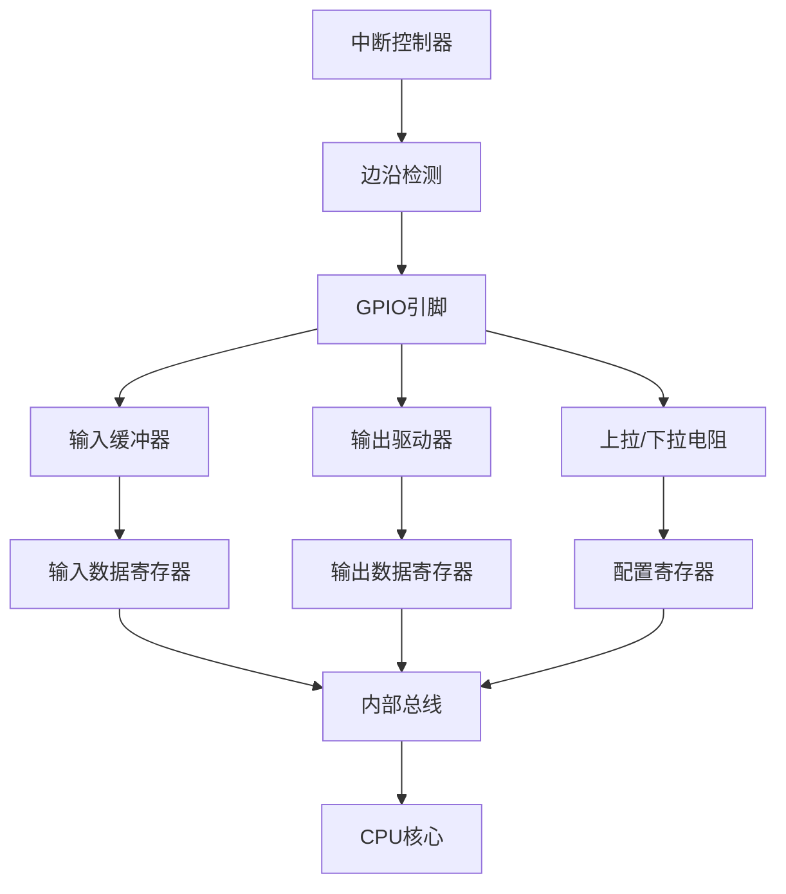
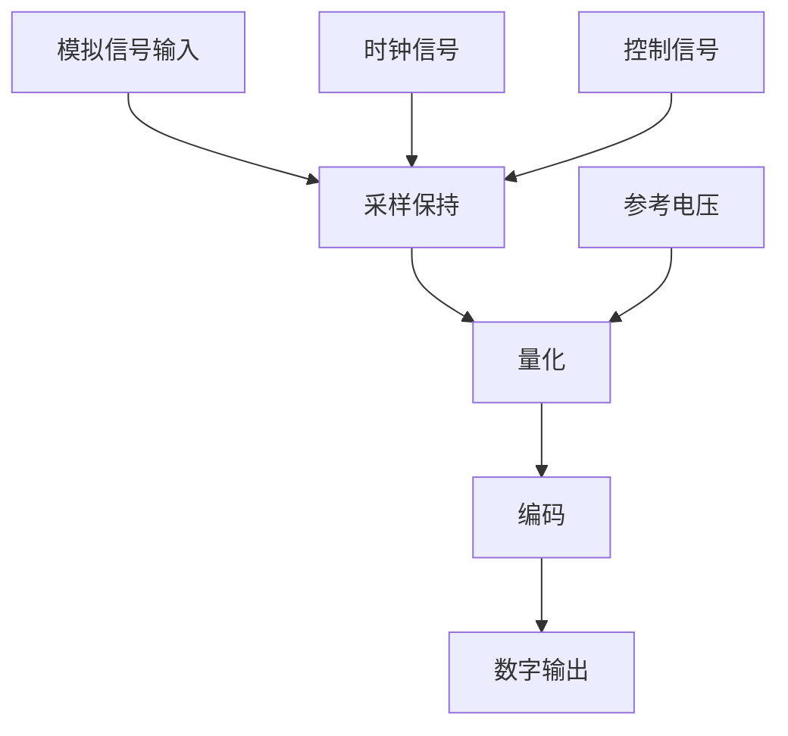
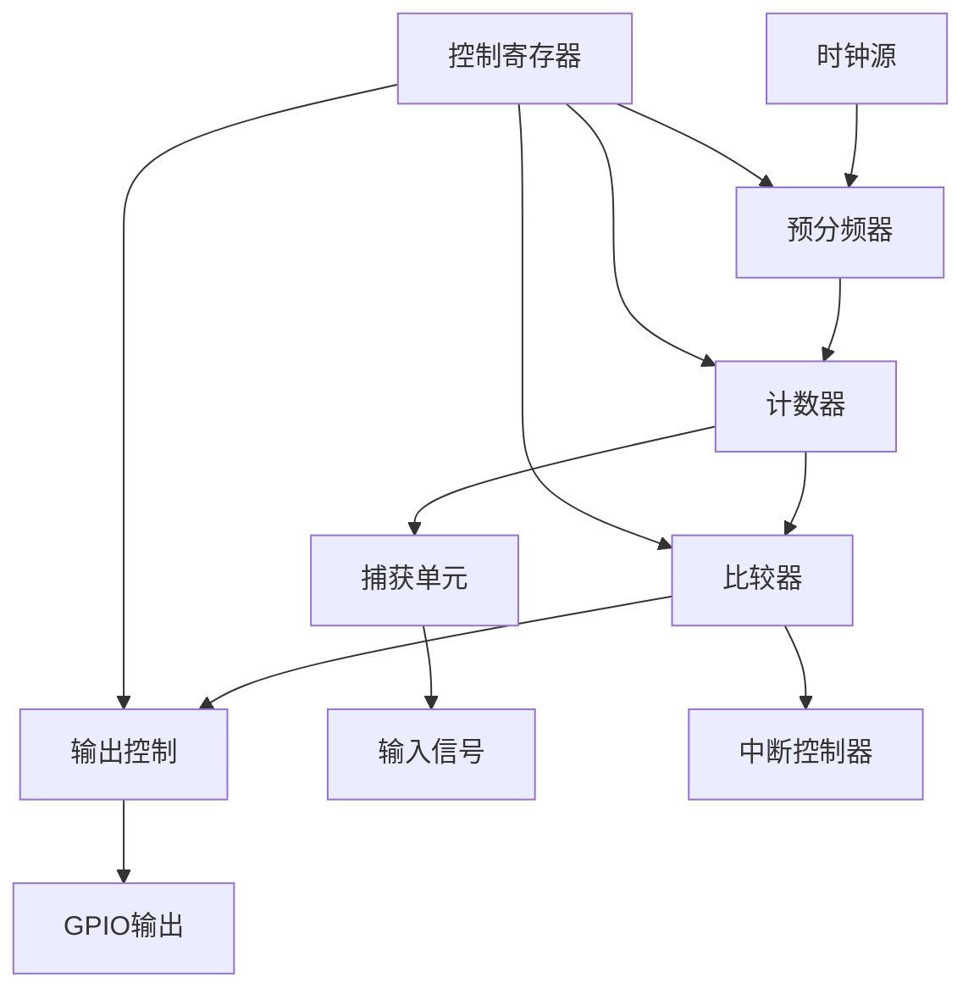

# 硬件交互编程

## GPIO编程深入

### GPIO工作原理

**GPIO (General Purpose Input/Output)** 是微控制器最基础的外设接口，用于控制数字信号的输入和输出。理解GPIO的工作原理对嵌入式开发至关重要。

#### GPIO硬件结构



#### GPIO配置模式

```python
class GPIOConfig:
    """
    GPIO配置模式定义
    """

    # 输入模式
    INPUT = 0          # 浮空输入
    INPUT_PULLUP = 1   # 上拉输入
    INPUT_PULLDOWN = 2 # 下拉输入
    INPUT_ANALOG = 3   # 模拟输入

    # 输出模式
    OUTPUT = 4         # 推挽输出
    OUTPUT_OD = 5      # 开漏输出
    OUTPUT_OD_PULLUP = 6 # 开漏输出上拉

    # 复用功能
    AF0 = 8            # 复用功能0
    AF1 = 9            # 复用功能1
    AF2 = 10           # 复用功能2
    AF3 = 11           # 复用功能3

    def __init__(self):
        self.mode_descriptions = {
            self.INPUT: "浮空输入 - 引脚悬空状态",
            self.INPUT_PULLUP: "上拉输入 - 内部上拉到VCC",
            self.INPUT_PULLDOWN: "下拉输入 - 内部下拉到GND",
            self.INPUT_ANALOG: "模拟输入 - 用于ADC采样",
            self.OUTPUT: "推挽输出 - 强制高低电平",
            self.OUTPUT_OD: "开漏输出 - 只能输出低电平",
            self.OUTPUT_OD_PULLUP: "开漏输出上拉 - 需要外部上拉",
        }

    def describe_mode(self, mode):
        """描述GPIO模式"""
        return self.mode_descriptions.get(mode, "未知模式")
```

### 高级GPIO编程

#### 带保护的GPIO控制器

```python
class ProtectedGPIOController:
    """
    带保护的GPIO控制器
    防止配置错误和硬件损坏
    """

    def __init__(self):
        self.gpio_pins = {}
        self.pin_configs = {}
        self.protected_pins = set()

    def register_pin(self, pin_num, max_voltage=3.3, max_current=20):
        """
        注册GPIO引脚

        参数:
            pin_num: 引脚编号
            max_voltage: 最大电压(V)
            max_current: 最大电流(mA)
        """
        self.gpio_pins[pin_num] = {
            'max_voltage': max_voltage,
            'max_current': max_current,
            'current_mode': None,
            'current_state': 0
        }

    def protect_pin(self, pin_num):
        """保护引脚不被修改"""
        if pin_num in self.gpio_pins:
            self.protected_pins.add(pin_num)

    def unprotect_pin(self, pin_num):
        """取消引脚保护"""
        self.protected_pins.discard(pin_num)

    def configure_pin(self, pin_num, mode):
        """
        配置GPIO引脚

        参数:
            pin_num: 引脚编号
            mode: 配置模式
        """
        if pin_num not in self.gpio_pins:
            raise ValueError(f"引脚 {pin_num} 未注册")

        if pin_num in self.protected_pins:
            raise ValueError(f"引脚 {pin_num} 已保护，不能修改")

        # 检查模式是否支持
        if mode not in [GPIOConfig.INPUT, GPIOConfig.OUTPUT]:
            raise ValueError(f"不支持的配置模式: {mode}")

        # 实际配置GPIO
        if mode == GPIOConfig.INPUT:
            gpio = machine.Pin(pin_num, machine.Pin.IN)
        elif mode == GPIOConfig.OUTPUT:
            gpio = machine.Pin(pin_num, machine.Pin.OUT)

        self.pin_configs[pin_num] = {
            'gpio': gpio,
            'mode': mode,
            'configured_at': time.time()
        }

        self.gpio_pins[pin_num]['current_mode'] = mode

        print(f"GPIO {pin_num} 配置为 {GPIOConfig().describe_mode(mode)}")

    def write_pin(self, pin_num, value):
        """
        写入GPIO值

        参数:
            pin_num: 引脚编号
            value: 值 (0或1)
        """
        if pin_num not in self.gpio_pins:
            raise ValueError(f"引脚 {pin_num} 未注册")

        if self.gpio_pins[pin_num]['current_mode'] != GPIOConfig.OUTPUT:
            raise ValueError(f"引脚 {pin_num} 未配置为输出模式")

        config = self.pin_configs[pin_num]
        config['gpio'].value(value)
        self.gpio_pins[pin_num]['current_state'] = value

    def read_pin(self, pin_num):
        """
        读取GPIO值

        参数:
            pin_num: 引脚编号

        返回:
            引脚值 (0或1)
        """
        if pin_num not in self.gpio_pins:
            raise ValueError(f"引脚 {pin_num} 未注册")

        config = self.pin_configs[pin_num]
        return config['gpio'].value()

    def toggle_pin(self, pin_num):
        """
        切换GPIO状态

        参数:
            pin_num: 引脚编号
        """
        current = self.read_pin(pin_num)
        self.write_pin(pin_num, 1 - current)

    def get_pin_info(self, pin_num):
        """
        获取引脚信息

        参数:
            pin_num: 引脚编号

        返回:
            引脚信息字典
        """
        if pin_num not in self.gpio_pins:
            return None

        pin_info = self.gpio_pins[pin_num].copy()
        pin_info['protected'] = pin_num in self.protected_pins

        if pin_num in self.pin_configs:
            config = self.pin_configs[pin_num]
            pin_info['mode'] = config['mode']
            pin_info['configured_at'] = config['configured_at']

        return pin_info
```

#### GPIO批量操作

```python
class GPIOBulkOperations:
    """
    GPIO批量操作控制器
    提高多引脚操作效率
    """

    def __init__(self, base_addr=0x40014000):
        """
        初始化GPIO批量操作

        参数:
            base_addr: GPIO寄存器基地址
        """
        self.base_addr = base_addr

        # 寄存器偏移
        self.GPIO_OUT = 0x00010
        self.GPIO_OE = 0x00020
        self.GPIO_IN = 0x00004

    def set_multiple_pins(self, pin_mask):
        """
        同时设置多个GPIO引脚

        参数:
            pin_mask: 引脚掩码，每个位对应一个引脚
        """
        addr = self.base_addr + self.GPIO_OUT
        machine.mem32[addr] |= pin_mask

    def clear_multiple_pins(self, pin_mask):
        """
        同时清除多个GPIO引脚

        参数:
            pin_mask: 引脚掩码，每个位对应一个引脚
        """
        addr = self.base_addr + self.GPIO_OUT
        machine.mem32[addr] &= ~pin_mask

    def write_multiple_pins(self, pin_mask, value_mask):
        """
        同时写入多个GPIO引脚

        参数:
            pin_mask: 要操作的引脚掩码
            value_mask: 要写入的值掩码
        """
        addr = self.base_addr + self.GPIO_OUT
        current = machine.mem32[addr]
        current &= ~pin_mask  # 清除目标位
        current |= value_mask & pin_mask  # 设置目标位
        machine.mem32[addr] = current

    def read_multiple_pins(self, pin_mask):
        """
        同时读取多个GPIO引脚

        参数:
            pin_mask: 要读取的引脚掩码

        返回:
            读取的值掩码
        """
        addr = self.base_addr + self.GPIO_IN
        return machine.mem32[addr] & pin_mask

    def configure_multiple_outputs(self, pin_mask):
        """
        配置多个引脚为输出模式

        参数:
            pin_mask: 要配置的引脚掩码
        """
        addr = self.base_addr + self.GPIO_OE
        machine.mem32[addr] |= pin_mask

    def configure_multiple_inputs(self, pin_mask):
        """
        配置多个引脚为输入模式

        参数:
            pin_mask: 要配置的引脚掩码
        """
        addr = self.base_addr + self.GPIO_OE
        machine.mem32[addr] &= ~pin_mask

# 批量操作示例
def bulk_operations_example():
    """
    GPIO批量操作示例
    """
    bulk = GPIOBulkOperations()

    # LED引脚掩码 (假设LED在25, 24, 23引脚)
    led_mask = (1 << 25) | (1 << 24) | (1 << 23)

    # 配置LED引脚为输出
    bulk.configure_multiple_outputs(led_mask)

    # LED流水灯效果
    for i in range(10):
        # 逐个点亮LED
        bulk.set_multiple_pins(1 << 25)
        time.sleep(0.2)
        bulk.clear_multiple_pins(1 << 25)

        bulk.set_multiple_pins(1 << 24)
        time.sleep(0.2)
        bulk.clear_multiple_pins(1 << 24)

        bulk.set_multiple_pins(1 << 23)
        time.sleep(0.2)
        bulk.clear_multiple_pins(1 << 23)

    # 同时点亮所有LED
    bulk.set_multiple_pins(led_mask)
    time.sleep(1)
    bulk.clear_multiple_pins(led_mask)
```

### 中断处理优化

#### 带队列的中断处理

```python
class InterruptQueue:
    """
    中断事件队列
    用于处理高频中断
    """

    def __init__(self, max_size=100):
        """
        初始化中断队列

        参数:
            max_size: 队列最大长度
        """
        self.queue = []
        self.max_size = max_size
        self.overflow_count = 0
        self.processing = False

    def enqueue(self, event):
        """
        加入中断事件

        参数:
            event: 中断事件数据
        """
        if len(self.queue) < self.max_size:
            self.queue.append(event)
        else:
            self.overflow_count += 1
            print(f"中断队列溢出，丢弃事件")

    def dequeue(self):
        """
        取出中断事件

        返回:
            中断事件或None
        """
        if self.queue:
            return self.queue.pop(0)
        return None

    def is_empty(self):
        """检查队列是否为空"""
        return len(self.queue) == 0

    def get_stats(self):
        """获取队列统计"""
        return {
            'queue_size': len(self.queue),
            'max_size': self.max_size,
            'overflow_count': self.overflow_count,
            'processing': self.processing
        }

class DebouncedInterrupt:
    """
    带消抖的中断处理器
    """

    def __init__(self, pin, debounce_time=50, trigger=machine.Pin.IRQ_FALLING):
        """
        初始化消抖中断

        参数:
            pin: GPIO引脚
            debounce_time: 消抖时间(毫秒)
            trigger: 触发条件
        """
        self.pin = machine.Pin(pin, machine.Pin.IN, machine.Pin.PULL_UP)
        self.debounce_time = debounce_time
        self.trigger = trigger
        self.last_interrupt_time = 0
        self.interrupt_queue = InterruptQueue()

        # 注册中断
        self.pin.irq(trigger=self.trigger, handler=self._interrupt_handler)

    def _interrupt_handler(self, pin):
        """
        中断处理程序
        """
        current_time = time.ticks_ms()

        # 消抖检查
        if time.ticks_diff(current_time, self.last_interrupt_time) < self.debounce_time:
            return

        self.last_interrupt_time = current_time

        # 记录中断事件
        event = {
            'pin': pin,
            'timestamp': current_time,
            'value': pin.value()
        }

        self.interrupt_queue.enqueue(event)

    def get_interrupt_count(self):
        """获取中断计数"""
        return self.interrupt_queue.get_stats()['overflow_count']

    def process_events(self, callback):
        """
        处理中断事件

        参数:
            callback: 回调函数
        """
        while not self.interrupt_queue.is_empty():
            event = self.interrupt_queue.dequeue()
            callback(event)
```

## ADC/DAC编程

### ADC工作原理

**ADC (Analog-to-Digital Converter)** 将模拟信号转换为数字信号，是连接模拟世界和数字世界的桥梁。

#### ADC转换过程



#### ADC参数说明

```python
class ADCParameters:
    """
    ADC参数说明
    """

    def __init__(self):
        self.parameters = {
            'resolution': {
                'description': '分辨率，决定ADC能区分的最小电压变化',
                'units': 'bits',
                'common_values': [8, 10, 12, 16, 24],
                'formula': 'LSB = Vref / (2^N - 1)'
            },
            'sampling_rate': {
                'description': '采样率，每秒转换次数',
                'units': 'SPS (Samples Per Second)',
                'common_values': [1000, 10000, 100000, 1000000],
                'formula': 'f_s = 1 / T_s'
            },
            'reference_voltage': {
                'description': '参考电压，决定ADC的测量范围',
                'units': 'Volts',
                'common_values': [1.024, 2.048, 2.5, 3.3, 5.0],
                'formula': 'V_in = (Digital_Value / 2^N) * Vref'
            },
            'input_range': {
                'description': '输入电压范围',
                'units': 'Volts',
                'typical': '0 to Vref'
            },
            'accuracy': {
                'description': '转换精度，包括偏移误差、增益误差等',
                'units': 'LSB or %FSR',
                'formula': 'Accuracy = ±(Offset_Error + Gain_Error + INL_Error)'
            }
        }

    def calculate_digital_value(self, analog_voltage, reference_voltage, resolution):
        """
        计算ADC数字值

        参数:
            analog_voltage: 模拟电压
            reference_voltage: 参考电压
            resolution: 分辨率(bits)

        返回:
            数字值
        """
        max_value = (1 << resolution) - 1
        digital_value = int((analog_voltage / reference_voltage) * max_value)
        return min(digital_value, max_value)

    def calculate_analog_voltage(self, digital_value, reference_voltage, resolution):
        """
        计算模拟电压

        参数:
            digital_value: 数字值
            reference_voltage: 参考电压
            resolution: 分辨率(bits)

        返回:
            模拟电压
        """
        max_value = (1 << resolution) - 1
        return (digital_value / max_value) * reference_voltage
```

### 高级ADC编程

#### 带校准的ADC读取

```python
class CalibratedADC:
    """
    带校准的ADC读取器
    """

    def __init__(self, adc_pin, reference_voltage=3.3, resolution=12):
        """
        初始化校准ADC

        参数:
            adc_pin: ADC引脚
            reference_voltage: 参考电压
            resolution: 分辨率
        """
        self.adc = machine.ADC(adc_pin)
        self.reference_voltage = reference_voltage
        self.resolution = resolution
        self.max_value = (1 << resolution) - 1

        # 校准参数
        self.offset = 0.0  # 偏移误差
        self.gain = 1.0    # 增益误差
        self.calibrated = False

        # 滤波参数
        self.filter_window = 10
        self.filter_buffer = []

    def calibrate(self, known_voltages):
        """
        校准ADC

        参数:
            known_voltages: 已知电压值列表 [(measured_value, actual_voltage)]
        """
        if len(known_voltages) < 2:
            raise ValueError("至少需要2个校准点")

        # 计算偏移和增益
        measurements = []
        actual_voltages = []

        for measured_val, actual_val in known_voltages:
            measurements.append(measured_val)
            actual_voltages.append(actual_val)

        # 线性回归计算
        n = len(measurements)
        sum_x = sum(measurements)
        sum_y = sum(actual_voltages)
        sum_xy = sum(m * v for m, v in zip(measurements, actual_voltages))
        sum_x2 = sum(m * m for m in measurements)

        # 计算增益和偏移
        self.gain = (n * sum_xy - sum_x * sum_y) / (n * sum_x2 - sum_x * sum_x)
        self.offset = (sum_y - self.gain * sum_x) / n

        self.calibrated = True
        print(f"ADC校准完成: gain={self.gain:.6f}, offset={self.offset:.6f}")

    def read_raw(self):
        """
        读取原始ADC值
        """
        return self.adc.read_u16()

    def read_voltage(self):
        """
        读取电压值
        """
        raw_value = self.read_raw()

        # 转换为电压
        voltage = (raw_value / self.max_value) * self.reference_voltage

        # 应用校准
        if self.calibrated:
            voltage = voltage * self.gain + self.offset

        return voltage

    def read_filtered(self):
        """
        读取滤波后的电压值
        """
        voltage = self.read_voltage()

        # 添加到滤波缓冲区
        self.filter_buffer.append(voltage)

        # 保持缓冲区大小
        if len(self.filter_buffer) > self.filter_window:
            self.filter_buffer.pop(0)

        # 计算移动平均
        return sum(self.filter_buffer) / len(self.filter_buffer)

    def set_filter_window(self, window_size):
        """
        设置滤波窗口大小

        参数:
            window_size: 窗口大小
        """
        self.filter_window = window_size
        self.filter_buffer = []  # 清空缓冲区

    def get_statistics(self, sample_count=100):
        """
        获取ADC统计信息

        参数:
            sample_count: 采样次数

        返回:
            统计信息字典
        """
        samples = []
        for _ in range(sample_count):
            samples.append(self.read_voltage())
            time.sleep_ms(1)

        return {
            'min': min(samples),
            'max': max(samples),
            'avg': sum(samples) / len(samples),
            'std': (sum((x - sum(samples)/len(samples))**2 for x in samples) / len(samples))**0.5,
            'range': max(samples) - min(samples)
        }
```

#### 多通道ADC扫描

```python
class ADCScanner:
    """
    ADC多通道扫描器
    """

    def __init__(self, adc_pins, reference_voltage=3.3, resolution=12):
        """
        初始化ADC扫描器

        参数:
            adc_pins: ADC引脚列表
            reference_voltage: 参考电压
            resolution: 分辨率
        """
        self.adc_pins = adc_pins
        self.reference_voltage = reference_voltage
        self.resolution = resolution
        self.max_value = (1 << resolution) - 1

        # 创建ADC对象
        self.adcs = [machine.ADC(pin) for pin in adc_pins]

        # 数据存储
        self.scan_data = []
        self.channel_data = [[] for _ in adc_pins]

    def scan_channels(self):
        """
        扫描所有通道
        """
        readings = []
        for i, adc in enumerate(self.adcs):
            raw_value = adc.read_u16()
            voltage = (raw_value / self.max_value) * self.reference_voltage

            readings.append({
                'channel': i,
                'raw_value': raw_value,
                'voltage': voltage
            })

            # 保存历史数据
            self.channel_data[i].append(voltage)
            if len(self.channel_data[i]) > 1000:  # 保持最近1000个数据点
                self.channel_data[i].pop(0)

        self.scan_data.append(readings)
        if len(self.scan_data) > 1000:
            self.scan_data.pop(0)

        return readings

    def get_channel_data(self, channel, count=10):
        """
        获取指定通道的数据

        参数:
            channel: 通道号
            count: 数据点数

        返回:
            数据列表
        """
        if 0 <= channel < len(self.channel_data):
            return self.channel_data[channel][-count:]
        return []

    def get_channel_statistics(self, channel):
        """
        获取通道统计信息

        参数:
            channel: 通道号

        返回:
            统计信息
        """
        data = self.channel_data[channel]
        if not data:
            return None

        return {
            'count': len(data),
            'min': min(data),
            'max': max(data),
            'avg': sum(data) / len(data),
            'latest': data[-1]
        }

    def find_anomalies(self, channel, threshold=2.0):
        """
        查找异常数据

        参数:
            channel: 通道号
            threshold: 异常阈值(标准差倍数)

        返回:
            异常数据索引列表
        """
        data = self.channel_data[channel]
        if len(data) < 10:
            return []

        avg = sum(data) / len(data)
        std = (sum((x - avg)**2 for x in data) / len(data))**0.5

        anomalies = []
        for i, value in enumerate(data):
            if abs(value - avg) > threshold * std:
                anomalies.append(i)

        return anomalies
```

### DAC编程

#### DAC输出控制器

```python
class DACController:
    """
    DAC输出控制器
    """

    def __init__(self, dac_pin, reference_voltage=3.3, resolution=8):
        """
        初始化DAC控制器

        参数:
            dac_pin: DAC引脚
            reference_voltage: 参考电压
            resolution: 分辨率
        """
        self.dac = machine.DAC(dac_pin)
        self.reference_voltage = reference_voltage
        self.resolution = resolution
        self.max_value = (1 << resolution) - 1

        # 波形生成参数
        self.waveform_type = None
        self.waveform_frequency = 0
        self.waveform_amplitude = 0
        self.waveform_offset = 0
        self.running = False

    def write_voltage(self, voltage):
        """
        写入电压值

        参数:
            voltage: 电压值
        """
        if voltage < 0 or voltage > self.reference_voltage:
            raise ValueError(f"电压超出范围: 0-{self.reference_voltage}V")

        digital_value = int((voltage / self.reference_voltage) * self.max_value)
        self.dac.write(digital_value)

    def write_raw(self, raw_value):
        """
        写入原始值

        参数:
            raw_value: 原始值
        """
        if raw_value < 0 or raw_value > self.max_value:
            raise ValueError(f"原始值超出范围: 0-{self.max_value}")

        self.dac.write(raw_value)

    def generate_sine_wave(self, frequency, amplitude, offset=0, duration=None):
        """
        生成正弦波

        参数:
            frequency: 频率(Hz)
            amplitude: 幅度(V)
            offset: 直流偏移(V)
            duration: 持续时间(秒)
        """
        self.waveform_type = 'sine'
        self.waveform_frequency = frequency
        self.waveform_amplitude = amplitude
        self.waveform_offset = offset
        self.running = True

        start_time = time.time()
        sample_rate = 1000  # 1kHz采样率

        try:
            while self.running:
                if duration and (time.time() - start_time) > duration:
                    break

                # 计算当前时间点
                t = time.time() - start_time

                # 生成正弦波
                voltage = offset + amplitude * math.sin(2 * math.pi * frequency * t)

                # 限制电压范围
                voltage = max(0, min(voltage, self.reference_voltage))

                # 输出电压
                self.write_voltage(voltage)

                # 控制采样率
                time.sleep(1.0 / sample_rate)

        except KeyboardInterrupt:
            print("波形生成停止")

        self.running = False

    def generate_square_wave(self, frequency, amplitude, offset=0, duty_cycle=0.5, duration=None):
        """
        生成方波

        参数:
            frequency: 频率(Hz)
            amplitude: 幅度(V)
            offset: 直流偏移(V)
            duty_cycle: 占空比(0-1)
            duration: 持续时间(秒)
        """
        self.waveform_type = 'square'
        self.waveform_frequency = frequency
        self.waveform_amplitude = amplitude
        self.waveform_offset = offset
        self.running = True

        start_time = time.time()
        period = 1.0 / frequency
        on_time = period * duty_cycle
        off_time = period * (1 - duty_cycle)

        try:
            while self.running:
                if duration and (time.time() - start_time) > duration:
                    break

                # 高电平
                voltage = offset + amplitude
                voltage = max(0, min(voltage, self.reference_voltage))
                self.write_voltage(voltage)
                time.sleep(on_time)

                # 低电平
                voltage = offset - amplitude
                voltage = max(0, min(voltage, self.reference_voltage))
                self.write_voltage(voltage)
                time.sleep(off_time)

        except KeyboardInterrupt:
            print("波形生成停止")

        self.running = False

    def generate_triangle_wave(self, frequency, amplitude, offset=0, duration=None):
        """
        生成三角波

        参数:
            frequency: 频率(Hz)
            amplitude: 幅度(V)
            offset: 直流偏移(V)
            duration: 持续时间(秒)
        """
        self.waveform_type = 'triangle'
        self.waveform_frequency = frequency
        self.waveform_amplitude = amplitude
        self.waveform_offset = offset
        self.running = True

        start_time = time.time()
        period = 1.0 / frequency
        sample_rate = 1000

        try:
            while self.running:
                if duration and (time.time() - start_time) > duration:
                    break

                t = time.time() - start_time
                phase = (t % period) / period

                # 生成三角波
                if phase < 0.5:
                    voltage = offset + amplitude * (4 * phase - 1)
                else:
                    voltage = offset + amplitude * (3 - 4 * phase)

                voltage = max(0, min(voltage, self.reference_voltage))
                self.write_voltage(voltage)
                time.sleep(1.0 / sample_rate)

        except KeyboardInterrupt:
            print("波形生成停止")

        self.running = False

    def stop(self):
        """停止波形生成"""
        self.running = False

    def get_status(self):
        """获取状态信息"""
        return {
            'running': self.running,
            'waveform_type': self.waveform_type,
            'frequency': self.waveform_frequency,
            'amplitude': self.waveform_amplitude,
            'offset': self.waveform_offset
        }
```

## 定时器和计数器

### 定时器工作原理

**定时器/计数器** 是微控制器中重要的时序控制外设，可用于：
- 精确定时
- 事件计数
- PWM生成
- 输入捕获
- 输出比较

#### 定时器架构



### 高级定时器编程

#### 精确定时器类

```python
class PrecisionTimer:
    """
    精确定时器类
    """

    def __init__(self, timer_id=0, frequency=1000000):
        """
        初始化定时器

        参数:
            timer_id: 定时器ID
            frequency: 定时器频率
        """
        self.timer = machine.Timer(timer_id)
        self.frequency = frequency
        self.callbacks = []
        self.running = False

    def init(self, period_ms, mode=machine.Timer.PERIODIC):
        """
        初始化定时器

        参数:
            period_ms: 周期(毫秒)
            mode: 定时器模式
        """
        self.timer.init(period=period_ms, mode=mode)
        print(f"定时器初始化: 周期={period_ms}ms, 频率={frequency}Hz")

    def start_periodic(self, period_ms, callback):
        """
        启动周期定时器

        参数:
            period_ms: 周期(毫秒)
            callback: 回调函数
        """
        self.timer.init(period=period_ms, mode=machine.Timer.PERIODIC, callback=callback)
        self.running = True
        print(f"周期定时器启动: {period_ms}ms")

    def start_one_shot(self, delay_ms, callback):
        """
        启动单次定时器

        参数:
            delay_ms: 延迟(毫秒)
            callback: 回调函数
        """
        self.timer.init(period=delay_ms, mode=machine.Timer.ONE_SHOT, callback=callback)
        print(f"单次定时器启动: {delay_ms}ms")

    def stop(self):
        """停止定时器"""
        self.timer.deinit()
        self.running = False
        print("定时器停止")

    def add_callback(self, callback):
        """
        添加回调函数

        参数:
            callback: 回调函数
        """
        self.callbacks.append(callback)

    def get_status(self):
        """获取定时器状态"""
        return {
            'running': self.running,
            'frequency': self.frequency,
            'callbacks_count': len(self.callbacks)
        }
```

#### PWM控制器

```python
class PWMController:
    """
    PWM控制器
    """

    def __init__(self, pwm_pin, frequency=1000):
        """
        初始化PWM控制器

        参数:
            pwm_pin: PWM引脚
            frequency: PWM频率
        """
        self.pwm = machine.PWM(machine.Pin(pwm_pin))
        self.frequency = frequency
        self.duty_cycle = 0
        self.pwm.freq(frequency)

        # 缓变参数
        self.fade_active = False
        self.fade_start_value = 0
        self.fade_end_value = 0
        self.fade_duration = 0
        self.fade_start_time = 0

    def set_frequency(self, frequency):
        """
        设置PWM频率

        参数:
            frequency: 频率(Hz)
        """
        self.frequency = frequency
        self.pwm.freq(frequency)

    def set_duty_cycle(self, duty_cycle):
        """
        设置占空比

        参数:
            duty_cycle: 占空比(0-100)
        """
        self.duty_cycle = max(0, min(100, duty_cycle))
        duty_u16 = int(self.duty_cycle * 65535 / 100)
        self.pwm.duty_u16(duty_u16)

    def fade(self, start_duty, end_duty, duration_ms):
        """
        PWM淡入淡出

        参数:
            start_duty: 起始占空比
            end_duty: 结束占空比
            duration_ms: 持续时间(毫秒)
        """
        self.fade_active = True
        self.fade_start_value = start_duty
        self.fade_end_value = end_duty
        self.fade_duration = duration_ms
        self.fade_start_time = time.ticks_ms()

    def update(self):
        """
        更新PWM状态
        """
        if self.fade_active:
            current_time = time.ticks_ms()
            elapsed = time.ticks_diff(current_time, self.fade_start_time)

            if elapsed >= self.fade_duration:
                # 淡变完成
                self.set_duty_cycle(self.fade_end_value)
                self.fade_active = False
            else:
                # 计算当前占空比
                progress = elapsed / self.fade_duration
                current_duty = self.fade_start_value + (self.fade_end_value - self.fade_start_value) * progress
                self.set_duty_cycle(current_duty)

    def breathing_effect(self, intensity=100, period_ms=2000):
        """
        呼吸灯效果

        参数:
            intensity: 最大强度(0-100)
            period_ms: 呼吸周期(毫秒)
        """
        self.fade(0, intensity, period_ms // 4)
        while self.fade_active:
            self.update()
            time.sleep_ms(10)

        self.fade(intensity, 0, period_ms // 4)
        while self.fade_active:
            self.update()
            time.sleep_ms(10)

    def stop(self):
        """停止PWM输出"""
        self.pwm.deinit()
        self.fade_active = False
```

### 输入捕获和输出比较

#### 输入捕获测量

```python
class InputCapture:
    """
    输入捕获测量
    """

    def __init__(self, capture_pin, timer_id=1):
        """
        初始化输入捕获

        参数:
            capture_pin: 捕获引脚
            timer_id: 定时器ID
        """
        self.pin = machine.Pin(capture_pin, machine.Pin.IN)
        self.timer = machine.Timer(timer_id)
        self.captured_edges = []
        self.frequency = 0
        self.duty_cycle = 0
        self.measuring = False

    def measure_frequency(self, measure_time=1000):
        """
        测量频率和占空比

        参数:
            measure_time: 测量时间(毫秒)
        """
        self.captured_edges = []
        self.measuring = True
        start_time = time.ticks_ms()

        # 设置中断捕获边沿
        def capture_handler(pin):
            if self.measuring:
                current_time = time.ticks_us()
                self.captured_edges.append(current_time)

        self.pin.irq(trigger=machine.Pin.IRQ_RISING | machine.Pin.IRQ_FALLING, handler=capture_handler)

        # 等待测量完成
        while time.ticks_diff(time.ticks_ms(), start_time) < measure_time:
            time.sleep_ms(10)

        self.measuring = False

        # 分析捕获数据
        if len(self.captured_edges) >= 4:
            # 计算频率 (上升沿到上升沿)
            rising_edges = []
            falling_edges = []

            # 分离上升沿和下降沿
            for i in range(len(self.captured_edges) - 1):
                if self.captured_edges[i] < self.captured_edges[i + 1]:
                    # 上升沿
                    if i % 2 == 0:
                        rising_edges.append(self.captured_edges[i])
                else:
                    # 下降沿
                    if i % 2 == 1:
                        falling_edges.append(self.captured_edges[i])

            # 计算频率
            if len(rising_edges) >= 2:
                period = rising_edges[-1] - rising_edges[-2]
                self.frequency = 1000000 / period if period > 0 else 0

            # 计算占空比
            if len(rising_edges) > 0 and len(falling_edges) > 0:
                # 取最后一个完整周期
                if len(rising_edges) > 0:
                    last_rising = rising_edges[-1]
                    for falling in falling_edges:
                        if falling > last_rising:
                            high_time = falling - last_rising
                            total_period = period
                            self.duty_cycle = (high_time / total_period) * 100 if total_period > 0 else 0
                            break

        return {
            'frequency': self.frequency,
            'duty_cycle': self.duty_cycle,
            'captured_edges': len(self.captured_edges)
        }
```

## 实践项目：数字时钟

### 项目概述

设计一个功能完整的数字时钟，包含：
- 时间显示（时:分:秒）
- 日期显示（年-月-日）
- 温度显示
- 设置功能
- 闹钟功能

### 硬件准备

- Raspberry Pi Pico
- OLED显示屏 (I2C)
- DS3231实时时钟 (I2C)
- 按钮 × 3
- 蜂鸣器

### 软件实现

```python
class DigitalClock:
    """
    数字时钟项目
    """

    def __init__(self):
        """
        初始化数字时钟
        """
        # 硬件初始化
        self.init_hardware()

        # 时间设置
        self.current_time = {
            'year': 2024,
            'month': 1,
            'day': 1,
            'hour': 0,
            'minute': 0,
            'second': 0
        }

        # 闹钟设置
        self.alarms = []
        self.alarm_enabled = False

        # 显示模式
        self.display_mode = 'time'  # 'time', 'date', 'temperature'
        self.setting_mode = False
        self.setting_item = 'hour'

        # 定时器
        self.update_timer = None

    def init_hardware(self):
        """初始化硬件"""
        # I2C初始化
        self.i2c = machine.I2C(0, scl=machine.Pin(1), sda=machine.Pin(0), freq=100000)

        # 显示屏
        self.display = I2CDisplay(self.i2c)

        # 实时时钟
        self.rtc = DS3231(self.i2c)

        # 按钮
        self.button_mode = machine.Pin(16, machine.Pin.IN, machine.Pin.PULL_UP)
        self.button_set = machine.Pin(17, machine.Pin.IN, machine.Pin.PULL_UP)
        self.button_up = machine.Pin(18, machine.Pin.IN, machine.Pin.PULL_UP)

        # 蜂鸣器
        self.buzzer = machine.Pin(19, machine.Pin.OUT)

        # 温度传感器
        self.temp_sensor = machine.ADC(26)

        # 设置按钮中断
        self.button_mode.irq(trigger=machine.Pin.IRQ_FALLING, handler=self.mode_button_isr)
        self.button_set.irq(trigger=machine.Pin.IRQ_FALLING, handler=self.set_button_isr)
        self.button_up.irq(trigger=machine.Pin.IRQ_FALLING, handler=self.up_button_isr)

    def mode_button_isr(self, pin):
        """模式按钮中断"""
        time.sleep_ms(50)  # 消抖
        if pin.value() == 0:
            if self.setting_mode:
                # 切换设置项目
                setting_items = ['hour', 'minute', 'year', 'month', 'day']
                current_index = setting_items.index(self.setting_item)
                self.setting_item = setting_items[(current_index + 1) % len(setting_items)]
            else:
                # 切换显示模式
                modes = ['time', 'date', 'temperature']
                current_index = modes.index(self.display_mode)
                self.display_mode = modes[(current_index + 1) % len(modes)]

    def set_button_isr(self, pin):
        """设置按钮中断"""
        time.sleep_ms(50)  # 消抖
        if pin.value() == 0:
            self.setting_mode = not self.setting_mode
            self.setting_item = 'hour'

    def up_button_isr(self, pin):
        """增加按钮中断"""
        time.sleep_ms(50)  # 消抖
        if pin.value() == 0 and self.setting_mode:
            if self.setting_item == 'hour':
                self.current_time['hour'] = (self.current_time['hour'] + 1) % 24
            elif self.setting_item == 'minute':
                self.current_time['minute'] = (self.current_time['minute'] + 1) % 60
            elif self.setting_item == 'year':
                self.current_time['year'] += 1
            elif self.setting_item == 'month':
                self.current_time['month'] = (self.current_time['month'] % 12) + 1
            elif self.setting_item == 'day':
                self.current_time['day'] = (self.current_time['day'] % 31) + 1

    def update_time(self):
        """更新时间"""
        # 从RTC读取时间
        try:
            rtc_time = self.rtc.get_time()
            self.current_time.update(rtc_time)
        except:
            # 如果RTC读取失败，使用内部定时器
            self.current_time['second'] += 1
            if self.current_time['second'] >= 60:
                self.current_time['second'] = 0
                self.current_time['minute'] += 1
                if self.current_time['minute'] >= 60:
                    self.current_time['minute'] = 0
                    self.current_time['hour'] += 1
                    if self.current_time['hour'] >= 24:
                        self.current_time['hour'] = 0

    def check_alarms(self):
        """检查闹钟"""
        if not self.alarm_enabled:
            return

        current_hour = self.current_time['hour']
        current_minute = self.current_time['minute']

        for alarm in self.alarms:
            if alarm['hour'] == current_hour and alarm['minute'] == current_minute:
                if not alarm.get('triggered', False):
                    self.trigger_alarm(alarm)
                    alarm['triggered'] = True
            else:
                alarm['triggered'] = False

    def trigger_alarm(self, alarm):
        """触发闹钟"""
        print(f"闹钟触发: {alarm['hour']:02d}:{alarm['minute']:02d}")

        # 蜂鸣器报警
        for _ in range(10):
            self.buzzer.on()
            time.sleep_ms(200)
            self.buzzer.off()
            time.sleep_ms(200)

    def read_temperature(self):
        """读取温度"""
        # 读取ADC值并转换为温度
        adc_value = self.temp_sensor.read_u16()
        voltage = adc_value * 3.3 / 65535
        # 简化的温度计算（假设是NTC热敏电阻）
        temperature = 25 + (voltage - 1.65) * 10
        return temperature

    def update_display(self):
        """更新显示"""
        self.display.clear()

        if self.display_mode == 'time':
            # 显示时间
            time_str = f"{self.current_time['hour']:02d}:{self.current_time['minute']:02d}:{self.current_time['second']:02d}"
            self.display.text(time_str, 0, 0)

            if self.setting_mode:
                # 显示设置模式
                setting_str = f"设置 {self.setting_item}"
                self.display.text(setting_str, 0, 16)

        elif self.display_mode == 'date':
            # 显示日期
            date_str = f"{self.current_time['year']}-{self.current_time['month']:02d}-{self.current_time['day']:02d}"
            self.display.text(date_str, 0, 0)

        elif self.display_mode == 'temperature':
            # 显示温度
            temp = self.read_temperature()
            temp_str = f"温度: {temp:.1f}C"
            self.display.text(temp_str, 0, 0)

        # 显示闹钟状态
        if self.alarm_enabled:
            self.display.text("闹钟: 开", 0, 48)

        self.display.show()

    def run(self):
        """运行数字时钟"""
        print("数字时钟启动")

        # 启动更新定时器
        self.update_timer = machine.Timer(0)
        self.update_timer.init(period=1000, mode=machine.Timer.PERIODIC, callback=lambda t: self.update())

        def update():
            """更新函数"""
            self.update_time()
            self.check_alarms()
            self.update_display()

        # 主循环
        try:
            while True:
                update()
                time.sleep_ms(100)

        except KeyboardInterrupt:
            print("数字时钟停止")
            self.update_timer.deinit()
            self.buzzer.off()

    def update(self):
        """更新定时器回调"""
        pass

# 辅助类
class I2CDisplay:
    """简化的I2C显示类"""
    def __init__(self, i2c, addr=0x3C):
        self.i2c = i2c
        self.addr = addr

    def clear(self):
        """清空显示"""
        pass

    def text(self, text, x, y):
        """显示文本"""
        pass

    def show(self):
        """更新显示"""
        pass

class DS3231:
    """DS3231实时时钟类"""
    def __init__(self, i2c, addr=0x68):
        self.i2c = i2c
        self.addr = addr

    def get_time(self):
        """获取时间"""
        # 简化实现
        return {
            'year': 2024,
            'month': 1,
            'day': 1,
            'hour': 0,
            'minute': 0,
            'second': 0
        }
```

## 实践练习

### 练习1：LED呼吸灯
使用PWM实现LED呼吸灯效果

### 练习2：温度监测器
使用ADC读取温度并显示

### 练习3：频率测量器
使用输入捕获测量信号频率

## 课后作业

### 作业1：硬件控制项目
设计一个完整的硬件控制项目

### 作业2：传感器集成
集成多种传感器并处理数据

### 作业3：实时系统设计
设计一个实时控制系统

## 总结

本章深入学习了硬件交互编程，包括GPIO、ADC、DAC、定时器等外设的使用。通过理论学习和实践项目，掌握了嵌入式系统硬件控制的核心技术。

## 下一章预告

**第四章：通信协议编程**
- I2C、SPI、UART详解
- 通信协议实现
- 多设备通信
- 实践项目：传感器网络