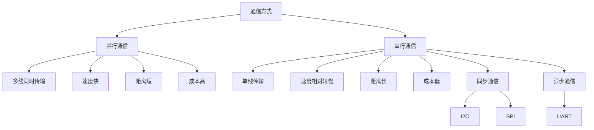
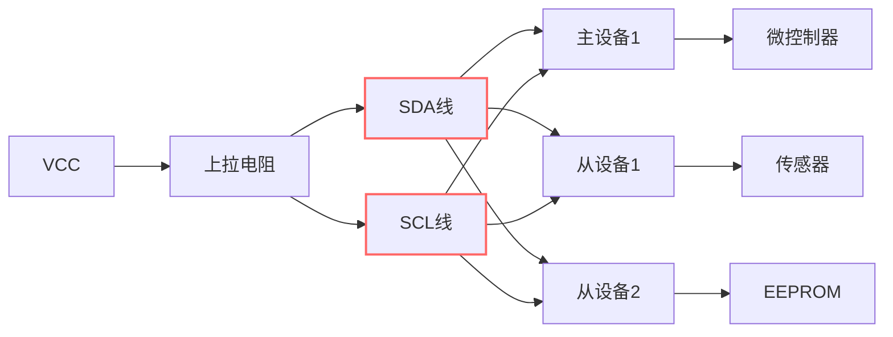
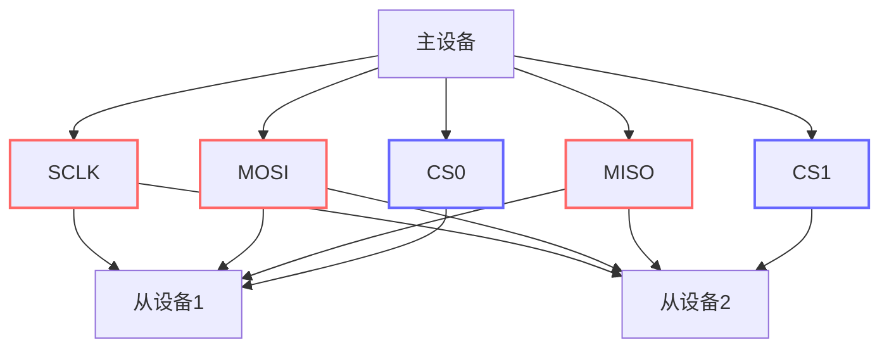
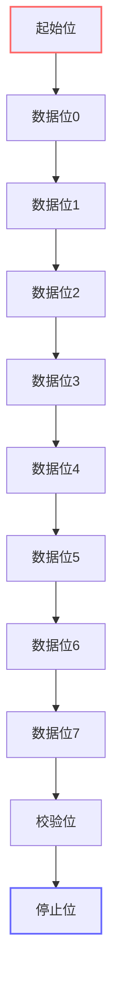

# 通信协议编程

## 通信协议概述

嵌入式系统中的通信协议是设备间数据交换的基础，理解这些协议对于构建复杂的嵌入式系统至关重要。

### 通信协议分类

#### 并行vs串行通信



#### 同步vs异步通信

```python
class CommunicationTypes:
    """
    通信类型分类
    """

    def __init__(self):
        self.synchronous_protocols = {
            'I2C': {
                'type': '双线同步串行',
                'speed': '100kHz-3.4MHz',
                'distance': '短距离',
                'devices': '多主多从',
                'complexity': '中等',
                'use_cases': '传感器、EEPROM、RTC'
            },
            'SPI': {
                'type': '四线同步串行',
                'speed': '1MHz-50MHz',
                'distance': '短距离',
                'devices': '单主多从',
                'complexity': '简单',
                'use_cases': '显示屏、Flash存储器、ADC/DAC'
            }
        }

        self.asynchronous_protocols = {
            'UART': {
                'type': '异步串行',
                'speed': '300bps-4Mbps',
                'distance': '长距离',
                'devices': '点对点',
                'complexity': '简单',
                'use_cases': '串口调试、GPS、Modem'
            },
            'CAN': {
                'type': '异步串行',
                'speed': '40kbps-1Mbps',
                'distance': '中等距离',
                'devices': '多主多从',
                'complexity': '复杂',
                'use_cases': '汽车网络、工业控制'
            }
        }

    def compare_protocols(self):
        """
        比较不同协议的特点
        """
        comparison = {
            'Speed': ['SPI > I2C > UART > CAN', 'SPI最快，适合高速数据传输'],
            'Complexity': ['CAN > I2C > SPI > UART', 'UART最简单，CAN最复杂'],
            'Distance': ['UART > CAN > I2C > SPI', 'UART适合长距离通信'],
            'Cost': ['UART < SPI < I2C < CAN', 'UART成本最低'],
            'Reliability': ['CAN > SPI > I2C > UART', 'CAN具有错误检测和纠正']
        }

        return comparison
```

## I2C协议详解

### I2C协议原理

**I2C (Inter-Integrated Circuit)** 是由Philips公司开发的两线式串行总线，用于连接微控制器及其外围芯片。

#### 物理层特性



#### I2C时序分析

```python
class I2CTiming:
    """
    I2C时序分析器
    """

    def __init__(self, frequency=100000):
        """
        初始化I2C时序分析器

        参数:
            frequency: I2C总线频率(Hz)
        """
        self.frequency = frequency
        self.period = 1.0 / frequency

        # 标准模式时序参数
        self.timing_params = {
            't_HD_STA': 4.0e-6,    # START条件保持时间
            't_LOW': 4.7e-6,       # SCL低电平时间
            't_HIGH': 4.0e-6,      # SCL高电平时间
            't_SU_STA': 4.7e-6,    # START条件建立时间
            't_HD_DAT': 5.0e-6,    # 数据保持时间
            't_SU_DAT': 250e-9,     # 数据建立时间
            't_SU_STO': 4.0e-6,    # STOP条件建立时间
            't_BUF': 4.7e-6        # 总线空闲时间
        }

        # 快速模式时序参数
        if frequency >= 400000:
            self.timing_params.update({
                't_HD_STA': 0.6e-6,
                't_LOW': 1.3e-6,
                't_HIGH': 0.6e-6,
                't_SU_STA': 0.6e-6,
                't_HD_DAT': 0.0e-6,
                't_SU_DAT': 100e-9,
                't_SU_STO': 0.6e-6,
                't_BUF': 1.3e-6
            })

    def calculate_timing_margins(self, actual_times):
        """
        计算时序裕度

        参数:
            actual_times: 实际测量时间字典

        返回:
            时序裕度字典
        """
        margins = {}

        for param, min_time in self.timing_params.items():
            if param in actual_times:
                margin = actual_times[param] - min_time
                margins[param] = {
                    'required': min_time,
                    'actual': actual_times[param],
                    'margin': margin,
                    'pass': margin >= 0
                }

        return margins

    def generate_start_condition(self):
        """
        生成START条件时序
        """
        timing = []

        # SCL高电平时，SDA从高到低跳变
        timing.append({
            'event': 'SDA_HIGH_TO_LOW',
            'scl_state': 'HIGH',
            'description': 'START条件开始'
        })

        # 保持START条件
        timing.append({
            'event': 'HOLD_START',
            'duration': self.timing_params['t_HD_STA'],
            'description': f'保持START条件 {self.timing_params["t_HD_STA"]*1e6:.1f}μs'
        })

        return timing

    def generate_stop_condition(self):
        """
        生成STOP条件时序
        """
        timing = []

        # SCL高电平时，SDA从低到高跳变
        timing.append({
            'event': 'SCL_HIGH',
            'description': 'SCL拉高'
        })

        timing.append({
            'event': 'SDA_LOW_TO_HIGH',
            'scl_state': 'HIGH',
            'description': 'STOP条件'
        })

        return timing
```

### 高级I2C实现

#### I2C主控制器

```python
class I2CMasterController:
    """
    I2C主控制器
    """

    def __init__(self, scl_pin, sda_pin, frequency=100000):
        """
        初始化I2C主控制器

        参数:
            scl_pin: SCL引脚
            sda_pin: SDA引脚
            frequency: 总线频率
        """
        self.scl_pin = machine.Pin(scl_pin, machine.Pin.OUT)
        self.sda_pin = machine.Pin(sda_pin, machine.Pin.OUT)

        self.frequency = frequency
        self.half_period = 0.5 / frequency

        # 使用MicroPython内置I2C
        self.i2c = machine.I2C(0, scl=machine.Pin(scl_pin), sda=machine.Pin(sda_pin), freq=frequency)

        # 事务状态
        self.bus_busy = False
        self.last_error = None

        # 统计信息
        self.stats = {
            'transactions': 0,
            'errors': 0,
            'nacks': 0,
            'timeouts': 0
        }

    def scan_devices(self):
        """
        扫描I2C设备

        返回:
            发现的设备地址列表
        """
        devices = self.i2c.scan()
        print(f"发现I2C设备: {[hex(addr) for addr in devices]}")
        return devices

    def read_byte(self, device_addr, register_addr):
        """
        读取一个字节

        参数:
            device_addr: 设备地址
            register_addr: 寄存器地址

        返回:
            读取的字节值或None(失败)
        """
        try:
            self.stats['transactions'] += 1

            # 写入寄存器地址
            self.i2c.writeto(device_addr, bytes([register_addr]))

            # 读取数据
            data = self.i2c.readfrom(device_addr, 1)

            return data[0]

        except OSError as e:
            self.stats['errors'] += 1
            self.last_error = str(e)
            return None

    def read_bytes(self, device_addr, register_addr, length):
        """
        读取多个字节

        参数:
            device_addr: 设备地址
            register_addr: 寄存器地址
            length: 读取长度

        返回:
            读取的字节列表或None(失败)
        """
        try:
            self.stats['transactions'] += 1

            # 写入寄存器地址
            self.i2c.writeto(device_addr, bytes([register_addr]))

            # 读取数据
            data = self.i2c.readfrom(device_addr, length)

            return list(data)

        except OSError as e:
            self.stats['errors'] += 1
            self.last_error = str(e)
            return None

    def write_byte(self, device_addr, register_addr, data):
        """
        写入一个字节

        参数:
            device_addr: 设备地址
            register_addr: 寄存器地址
            data: 要写入的数据

        返回:
            成功返回True，失败返回False
        """
        try:
            self.stats['transactions'] += 1

            # 构造写入数据
            write_data = bytes([register_addr, data])

            # 写入数据
            self.i2c.writeto(device_addr, write_data)

            return True

        except OSError as e:
            self.stats['errors'] += 1
            self.last_error = str(e)
            return False

    def write_bytes(self, device_addr, register_addr, data):
        """
        写入多个字节

        参数:
            device_addr: 设备地址
            register_addr: 寄存器地址
            data: 要写入的数据列表

        返回:
            成功返回True，失败返回False
        """
        try:
            self.stats['transactions'] += 1

            # 构造写入数据
            write_data = bytes([register_addr] + data)

            # 写入数据
            self.i2c.writeto(device_addr, write_data)

            return True

        except OSError as e:
            self.stats['errors'] += 1
            self.last_error = str(e)
            return False

    def read_mem(self, device_addr, mem_addr, mem_addr_size=1, length=1):
        """
        从内存地址读取数据

        参数:
            device_addr: 设备地址
            mem_addr: 内存地址
            mem_addr_size: 内存地址大小(字节)
            length: 读取长度

        返回:
            读取的数据或None(失败)
        """
        try:
            self.stats['transactions'] += 1

            # 构造内存地址
            if mem_addr_size == 1:
                addr_bytes = [mem_addr & 0xFF]
            elif mem_addr_size == 2:
                addr_bytes = [(mem_addr >> 8) & 0xFF, mem_addr & 0xFF]
            else:
                return None

            # 写入内存地址
            self.i2c.writeto(device_addr, bytes(addr_bytes))

            # 读取数据
            data = self.i2c.readfrom(device_addr, length)

            return list(data)

        except OSError as e:
            self.stats['errors'] += 1
            self.last_error = str(e)
            return None

    def write_mem(self, device_addr, mem_addr, data, mem_addr_size=1):
        """
        写入数据到内存地址

        参数:
            device_addr: 设备地址
            mem_addr: 内存地址
            data: 要写入的数据
            mem_addr_size: 内存地址大小(字节)

        返回:
            成功返回True，失败返回False
        """
        try:
            self.stats['transactions'] += 1

            # 构造内存地址
            if mem_addr_size == 1:
                addr_bytes = [mem_addr & 0xFF]
            elif mem_addr_size == 2:
                addr_bytes = [(mem_addr >> 8) & 0xFF, mem_addr & 0xFF]
            else:
                return False

            # 构造写入数据
            write_data = bytes(addr_bytes + data)

            # 写入数据
            self.i2c.writeto(device_addr, write_data)

            return True

        except OSError as e:
            self.stats['errors'] += 1
            self.last_error = str(e)
            return False

    def get_stats(self):
        """
        获取统计信息

        返回:
            统计信息字典
        """
        return self.stats.copy()

    def clear_stats(self):
        """清空统计信息"""
        self.stats = {
            'transactions': 0,
            'errors': 0,
            'nacks': 0,
            'timeouts': 0
        }
```

#### I2C设备驱动框架

```python
class I2CDeviceDriver:
    """
    I2C设备驱动框架
    """

    def __init__(self, i2c_controller, device_addr, device_name="Unknown"):
        """
        初始化设备驱动

        参数:
            i2c_controller: I2C控制器
            device_addr: 设备地址
            device_name: 设备名称
        """
        self.i2c = i2c_controller
        self.device_addr = device_addr
        self.device_name = device_name

        # 设备配置
        self.config = {}
        self.registers = {}
        self.initialized = False

        # 设备信息
        self.info = {
            'manufacturer': 'Unknown',
            'version': 'Unknown',
            'serial_number': None
        }

    def init_device(self):
        """
        初始化设备
        子类需要重写此方法
        """
        raise NotImplementedError("子类必须实现init_device方法")

    def read_register(self, register, length=1):
        """
        读取寄存器

        参数:
            register: 寄存器地址
            length: 读取长度

        返回:
            读取的数据或None
        """
        if length == 1:
            return self.i2c.read_byte(self.device_addr, register)
        else:
            return self.i2c.read_bytes(self.device_addr, register, length)

    def write_register(self, register, data):
        """
        写入寄存器

        参数:
            register: 寄存器地址
            data: 要写入的数据

        返回:
            成功返回True，失败返回False
        """
        if isinstance(data, int):
            return self.i2c.write_byte(self.device_addr, register, data)
        elif isinstance(data, (list, bytes)):
            return self.i2c.write_bytes(self.device_addr, register, data)
        else:
            return False

    def test_device(self):
        """
        测试设备是否存在

        返回:
            设备存在返回True，否则返回False
        """
        try:
            # 尝试读取一个字节
            data = self.i2c.read_byte(self.device_addr, 0x00)
            return data is not None
        except:
            return False

    def get_device_info(self):
        """
        获取设备信息

        返回:
            设备信息字典
        """
        return {
            'name': self.device_name,
            'address': hex(self.device_addr),
            'initialized': self.initialized,
            'info': self.info
        }

# 温度传感器驱动示例
class TemperatureSensorDriver(I2CDeviceDriver):
    """
    I2C温度传感器驱动 (模拟LM75)
    """

    def __init__(self, i2c_controller, device_addr=0x48):
        """
        初始化温度传感器

        参数:
            i2c_controller: I2C控制器
            device_addr: 设备地址
        """
        super().__init__(i2c_controller, device_addr, "LM75 Temperature Sensor")

        # 寄存器定义
        self.registers = {
            'TEMP': 0x00,        # 温度寄存器
            'CONFIG': 0x01,     # 配置寄存器
            'T_HYST': 0x02,     # 温度滞后寄存器
            'T_OS': 0x03        # 过温关断寄存器
        }

        # 设备配置
        self.config = {
            'resolution': 9,    # 9位分辨率
            'fault_queue': 1,    # 故障队列
            'os_polarity': 0,    # OS极性
            'os_mode': 0         # OS模式
        }

    def init_device(self):
        """
        初始化设备
        """
        # 设置配置寄存器
        config_value = 0
        if self.config['os_polarity']:
            config_value |= (1 << 2)
        if self.config['os_mode']:
            config_value |= (1 << 1)

        self.write_register(self.registers['CONFIG'], config_value)
        self.initialized = True
        print(f"{self.device_name} 初始化完成")

    def read_temperature(self):
        """
        读取温度值

        返回:
            温度值(摄氏度)
        """
        if not self.initialized:
            self.init_device()

        # 读取温度寄存器 (2字节)
        data = self.read_register(self.registers['TEMP'], 2)
        if data is None or len(data) < 2:
            return None

        # 转换为温度值
        temp_raw = (data[0] << 8 | data[1]) >> 4

        # 处理负温度
        if temp_raw & 0x800:
            temp_c = -((~temp_raw + 1) & 0xFFF) * 0.0625
        else:
            temp_c = temp_raw * 0.0625

        return temp_c

    def set_threshold(self, temp_hyst, temp_os):
        """
        设置温度阈值

        参数:
            temp_hyst: 温度滞后阈值
            temp_os: 过温关断阈值
        """
        # 转换温度为寄存器值
        hyst_raw = int(temp_hyst / 0.0625) & 0xFF
        os_raw = int(temp_os / 0.0625) & 0xFF

        # 写入阈值
        self.write_register(self.registers['T_HYST'], hyst_raw)
        self.write_register(self.registers['T_OS'], os_raw)

    def get_config(self):
        """
        获取配置信息

        返回:
            配置字典
        """
        config_raw = self.read_register(self.registers['CONFIG'])
        if config_raw is None:
            return None

        return {
            'shutdown': bool(config_raw & 0x01),
            'interrupt_mode': bool(config_raw & 0x02),
            'os_polarity': bool(config_raw & 0x04),
            'fault_queue': (config_raw >> 3) & 0x03
        }
```

## SPI协议详解

### SPI协议原理

**SPI (Serial Peripheral Interface)** 是一种全双工、同步、串行通信接口，广泛用于短距离高速通信。

#### SPI物理连接



#### SPI模式配置

```python
class SPIModes:
    """
    SPI模式配置
    """

    def __init__(self):
        self.modes = {
            0: {
                'CPOL': 0,  # 时钟极性：空闲时为低电平
                'CPHA': 0,  # 时钟相位：第一个边沿采样
                'description': 'CPOL=0, CPHA=0 - 时钟空闲低电平，上升沿采样'
            },
            1: {
                'CPOL': 0,  # 时钟极性：空闲时为低电平
                'CPHA': 1,  # 时钟相位：第二个边沿采样
                'description': 'CPOL=0, CPHA=1 - 时钟空闲低电平，下降沿采样'
            },
            2: {
                'CPOL': 1,  # 时钟极性：空闲时为高电平
                'CPHA': 0,  # 时钟相位：第一个边沿采样
                'description': 'CPOL=1, CPHA=0 - 时钟空闲高电平，下降沿采样'
            },
            3: {
                'CPOL': 1,  # 时钟极性：空闲时为高电平
                'CPHA': 1,  # 时钟相位：第二个边沿采样
                'description': 'CPOL=1, CPHA=1 - 时钟空闲高电平，上升沿采样'
            }
        }

    def get_mode_config(self, mode):
        """
        获取SPI模式配置

        参数:
            mode: SPI模式 (0-3)

        返回:
            模式配置字典
        """
        return self.modes.get(mode, None)

    def recommend_mode_for_device(self, device_type):
        """
        为设备类型推荐SPI模式

        参数:
            device_type: 设备类型

        返回:
            推荐的SPI模式
        """
        recommendations = {
            'EEPROM': 0,
            'Flash': 0,
            'SD Card': 0,
            'OLED Display': 0,
            'ADC': 1,
            'DAC': 1,
            'RTC': 3,
            'Temperature Sensor': 0,
            'Accelerometer': 3
        }

        return recommendations.get(device_type, 0)
```

### 高级SPI实现

#### SPI主控制器

```python
class SPIMasterController:
    """
    SPI主控制器
    """

    def __init__(self, spi_id=0, baudrate=1000000, polarity=0, phase=0,
                 sck_pin=2, mosi_pin=3, miso_pin=4, cs_pins=None):
        """
        初始化SPI主控制器

        参数:
            spi_id: SPI编号
            baudrate: 波特率
            polarity: 时钟极性
            phase: 时钟相位
            sck_pin: SCK引脚
            mosi_pin: MOSI引脚
            miso_pin: MISO引脚
            cs_pins: CS引脚列表
        """
        # 初始化SPI
        self.spi = machine.SPI(spi_id, baudrate=baudrate, polarity=polarity, phase=phase,
                              sck=machine.Pin(sck_pin), mosi=machine.Pin(mosi_pin),
                              miso=machine.Pin(miso_pin))

        # 初始化CS引脚
        self.cs_pins = {}
        if cs_pins:
            for name, pin in cs_pins.items():
                self.cs_pins[name] = machine.Pin(pin, machine.Pin.OUT)
                self.cs_pins[name].value(1)  # 初始状态为高电平

        # 配置参数
        self.config = {
            'baudrate': baudrate,
            'polarity': polarity,
            'phase': phase,
            'bits': 8,
            'firstbit': machine.SPI.MSB
        }

        # 统计信息
        self.stats = {
            'transactions': 0,
            'bytes_transferred': 0,
            'errors': 0
        }

    def set_baudrate(self, baudrate):
        """
        设置波特率

        参数:
            baudrate: 波特率
        """
        self.config['baudrate'] = baudrate
        self.spi.init(baudrate=baudrate)

    def set_mode(self, polarity, phase):
        """
        设置SPI模式

        参数:
            polarity: 时钟极性
            phase: 时钟相位
        """
        self.config['polarity'] = polarity
        self.config['phase'] = phase
        self.spi.init(polarity=polarity, phase=phase)

    def select_device(self, cs_name):
        """
        选择设备

        参数:
            cs_name: CS名称
        """
        if cs_name in self.cs_pins:
            self.cs_pins[cs_name].value(0)

    def deselect_device(self, cs_name):
        """
        取消选择设备

        参数:
            cs_name: CS名称
        """
        if cs_name in self.cs_pins:
            self.cs_pins[cs_name].value(1)

    def write_bytes(self, data, cs_name=None):
        """
        写入数据

        参数:
            data: 要写入的数据
            cs_name: CS名称

        返回:
            成功返回True，失败返回False
        """
        try:
            if cs_name:
                self.select_device(cs_name)

            self.spi.write(data)
            self.stats['transactions'] += 1
            self.stats['bytes_transferred'] += len(data)

            if cs_name:
                self.deselect_device(cs_name)

            return True

        except Exception as e:
            self.stats['errors'] += 1
            if cs_name:
                self.deselect_device(cs_name)
            return False

    def read_bytes(self, length, cs_name=None):
        """
        读取数据

        参数:
            length: 读取长度
            cs_name: CS名称

        返回:
            读取的数据或None
        """
        try:
            if cs_name:
                self.select_device(cs_name)

            data = self.spi.read(length)
            self.stats['transactions'] += 1
            self.stats['bytes_transferred'] += length

            if cs_name:
                self.deselect_device(cs_name)

            return data

        except Exception as e:
            self.stats['errors'] += 1
            if cs_name:
                self.deselect_device(cs_name)
            return None

    def write_read_bytes(self, write_data, read_length, cs_name=None):
        """
        同时写入和读取数据

        参数:
            write_data: 要写入的数据
            read_length: 读取长度
            cs_name: CS名称

        返回:
            读取的数据或None
        """
        try:
            if cs_name:
                self.select_device(cs_name)

            read_data = bytearray(read_length)
            self.spi.write_readinto(write_data, read_data)
            self.stats['transactions'] += 1
            self.stats['bytes_transferred'] += len(write_data) + read_length

            if cs_name:
                self.deselect_device(cs_name)

            return bytes(read_data)

        except Exception as e:
            self.stats['errors'] += 1
            if cs_name:
                self.deselect_device(cs_name)
            return None

    def transfer(self, data, cs_name=None):
        """
        数据传输（写入的同时读取）

        参数:
            data: 要传输的数据
            cs_name: CS名称

        返回:
            读取的数据
        """
        return self.write_read_bytes(data, len(data), cs_name)

    def get_stats(self):
        """
        获取统计信息

        返回:
            统计信息字典
        """
        return self.stats.copy()

    def clear_stats(self):
        """清空统计信息"""
        self.stats = {
            'transactions': 0,
            'bytes_transferred': 0,
            'errors': 0
        }
```

#### SPI设备驱动框架

```python
class SPIDeviceDriver:
    """
    SPI设备驱动框架
    """

    def __init__(self, spi_controller, cs_name, device_name="Unknown"):
        """
        初始化SPI设备驱动

        参数:
            spi_controller: SPI控制器
            cs_name: CS名称
            device_name: 设备名称
        """
        self.spi = spi_controller
        self.cs_name = cs_name
        self.device_name = device_name

        # 设备配置
        self.config = {}
        self.registers = {}
        self.initialized = False

        # 设备信息
        self.info = {
            'manufacturer': 'Unknown',
            'version': 'Unknown',
            'serial_number': None
        }

    def init_device(self):
        """
        初始化设备
        子类需要重写此方法
        """
        raise NotImplementedError("子类必须实现init_device方法")

    def write_register(self, register, data):
        """
        写入寄存器

        参数:
            register: 寄存器地址
            data: 要写入的数据

        返回:
            成功返回True，失败返回False
        """
        try:
            write_data = bytearray([register])
            if isinstance(data, int):
                write_data.append(data)
            elif isinstance(data, (list, bytes)):
                write_data.extend(data)

            self.spi.write_bytes(write_data, self.cs_name)
            return True

        except Exception as e:
            print(f"写入寄存器失败: {e}")
            return False

    def read_register(self, register, length=1):
        """
        读取寄存器

        参数:
            register: 寄存器地址
            length: 读取长度

        返回:
            读取的数据或None
        """
        try:
            write_data = bytearray([register, 0x00])  # 读取时需要写入虚拟数据
            read_data = self.spi.write_read_bytes(write_data, length + 1, self.cs_name)
            return read_data[1:]  # 跳过第一个字节（寄存器地址）

        except Exception as e:
            print(f"读取寄存器失败: {e}")
            return None

    def transfer_data(self, data):
        """
        传输数据

        参数:
            data: 要传输的数据

        返回:
            接收的数据
        """
        return self.spi.transfer(data, self.cs_name)

    def get_device_info(self):
        """
        获取设备信息

        返回:
            设备信息字典
        """
        return {
            'name': self.device_name,
            'cs': self.cs_name,
            'initialized': self.initialized,
            'info': self.info
        }

# OLED显示屏驱动示例
class OLEDDisplayDriver(SPIDeviceDriver):
    """
    SPI OLED显示屏驱动 (模拟SSD1306)
    """

    def __init__(self, spi_controller, cs_name, dc_pin, reset_pin=None, device_name="SSD1306 OLED"):
        """
        初始化OLED显示屏

        参数:
            spi_controller: SPI控制器
            cs_name: CS名称
            dc_pin: DC引脚
            reset_pin: 复位引脚
            device_name: 设备名称
        """
        super().__init__(spi_controller, cs_name, device_name)

        # 控制引脚
        self.dc_pin = machine.Pin(dc_pin, machine.Pin.OUT)
        self.reset_pin = machine.Pin(reset_pin, machine.Pin.OUT) if reset_pin else None

        # 显示参数
        self.width = 128
        self.height = 64
        self.pages = self.height // 8

        # 显示缓冲区
        self.buffer = bytearray(self.width * self.pages)

        # 寄存器定义
        self.registers = {
            'SET_CONTRAST': 0x81,
            'DISPLAY_ON': 0xAF,
            'DISPLAY_OFF': 0xAE,
            'NORMAL_DISPLAY': 0xA6,
            'INVERSE_DISPLAY': 0xA7,
            'SET_MULTIPLEX_RATIO': 0xA8,
            'SET_DISPLAY_OFFSET': 0xD3,
            'SET_START_LINE': 0x40,
            'CHARGE_PUMP': 0x8D,
            'MEMORY_MODE': 0x20,
            'COLUMN_ADDR': 0x21,
            'PAGE_ADDR': 0x22,
            'COM_OUTPUT_DIR': 0xC0,
            'COM_OUTPUT_REMAP': 0xC8,
            'SET_SEGMENT_REMAP': 0xA1,
            'SET_COM_PINS': 0xDA,
            'SET_DISPLAY_CLK_DIV': 0xD5,
            'SET_PRECHARGE': 0xD9,
            'SET_VCOM_DESELECT': 0xDB,
            'SET_CHARGE_PUMP': 0x8D
        }

    def init_device(self):
        """
        初始化OLED显示屏
        """
        # 硬件复位
        if self.reset_pin:
            self.reset_pin.value(0)
            time.sleep_ms(10)
            self.reset_pin.value(1)
            time.sleep_ms(10)

        # 初始化命令序列
        init_commands = [
            (self.registers['DISPLAY_OFF'], None),
            (self.registers['SET_DISPLAY_CLK_DIV'], [0x80]),
            (self.registers['SET_MULTIPLEX_RATIO'], [self.height - 1]),
            (self.registers['SET_DISPLAY_OFFSET'], [0x00]),
            (self.registers['SET_START_LINE'], [0x00]),
            (self.registers['CHARGE_PUMP'], [0x14]),
            (self.registers['MEMORY_MODE'], [0x00]),
            (self.registers['SET_SEGMENT_REMAP'], None),
            (self.registers['COM_OUTPUT_REMAP'], None),
            (self.registers['SET_COM_PINS'], [0x12]),
            (self.registers['SET_CONTRAST'], [0xCF]),
            (self.registers['SET_PRECHARGE'], [0xF1]),
            (self.registers['SET_VCOM_DESELECT'], [0x40]),
            (self.registers['NORMAL_DISPLAY'], None),
            (self.registers['DISPLAY_ON'], None)
        ]

        for cmd, data in init_commands:
            self.write_command(cmd, data)

        self.clear()
        self.display()
        self.initialized = True
        print(f"{self.device_name} 初始化完成")

    def write_command(self, command, data=None):
        """
        写入命令

        参数:
            command: 命令
            data: 数据
        """
        self.dc_pin.value(0)  # 命令模式

        if data is None:
            self.write_register(command, [])
        else:
            write_data = bytearray([command] + data)
            self.spi.write_bytes(write_data, self.cs_name)

    def write_data(self, data):
        """
        写入数据

        参数:
            data: 数据
        """
        self.dc_pin.value(1)  # 数据模式
        self.spi.write_bytes(data, self.cs_name)

    def clear(self):
        """
        清空显示缓冲区
        """
        self.buffer = bytearray(len(self.buffer))

    def pixel(self, x, y, color=1):
        """
        设置像素点

        参数:
            x: x坐标
            y: y坐标
            color: 颜色 (0=黑, 1=白)
        """
        if x < 0 or x >= self.width or y < 0 or y >= self.height:
            return

        if color:
            self.buffer[x + (y // 8) * self.width] |= (1 << (y % 8))
        else:
            self.buffer[x + (y // 8) * self.width] &= ~(1 << (y % 8))

    def text(self, text, x, y, color=1, size=1):
        """
        显示文本

        参数:
            text: 文本
            x: x坐标
            y: y坐标
            color: 颜色
            size: 字体大小
        """
        # 简化的字体显示
        for i, char in enumerate(text):
            char_x = x + i * 6 * size
            if char_x < self.width - 6 * size:
                # 这里应该实现完整的字体渲染
                pass

    def display(self):
        """
        更新显示
        """
        # 设置列地址
        self.write_command(self.registers['COLUMN_ADDR'], [0, self.width - 1])
        self.write_command(self.registers['PAGE_ADDR'], [0, self.pages - 1])

        # 写入显示数据
        self.dc_pin.value(1)  # 数据模式
        for i in range(0, len(self.buffer), 16):
            chunk = self.buffer[i:i+16]
            self.spi.write_bytes(chunk, self.cs_name)

    def set_contrast(self, contrast):
        """
        设置对比度

        参数:
            contrast: 对比度 (0-255)
        """
        self.write_command(self.registers['SET_CONTRAST'], [contrast])

    def invert_display(self, invert):
        """
        反转显示

        参数:
            invert: 是否反转
        """
        cmd = self.registers['INVERSE_DISPLAY'] if invert else self.registers['NORMAL_DISPLAY']
        self.write_command(cmd)
```

## UART通信

### UART协议原理

**UART (Universal Asynchronous Receiver/Transmitter)** 是一种通用的异步串行通信协议，广泛用于设备间的点对点通信。

#### UART数据帧格式



### 高级UART实现

#### UART控制器

```python
class UARTController:
    """
    UART控制器
    """

    def __init__(self, uart_id=0, baudrate=115200, tx_pin=0, rx_pin=1,
                 data_bits=8, parity=None, stop_bits=1):
        """
        初始化UART控制器

        参数:
            uart_id: UART编号
            baudrate: 波特率
            tx_pin: 发送引脚
            rx_pin: 接收引脚
            data_bits: 数据位 (5-9)
            parity: 校验位 (None, 0, 1)
            stop_bits: 停止位 (1, 2)
        """
        self.uart = machine.UART(uart_id, baudrate=baudrate, tx=tx_pin, rx=rx_pin,
                                bits=data_bits, parity=parity, stop=stop_bits)

        # 配置参数
        self.config = {
            'baudrate': baudrate,
            'data_bits': data_bits,
            'parity': parity,
            'stop_bits': stop_bits
        }

        # 缓冲区
        self.rx_buffer = bytearray(1024)
        self.tx_buffer = bytearray(1024)
        self.rx_head = 0
        self.rx_tail = 0
        self.tx_head = 0
        self.tx_tail = 0

        # 统计信息
        self.stats = {
            'bytes_sent': 0,
            'bytes_received': 0,
            'framing_errors': 0,
            'parity_errors': 0,
            'overrun_errors': 0
        }

    def set_baudrate(self, baudrate):
        """
        设置波特率

        参数:
            baudrate: 波特率
        """
        self.config['baudrate'] = baudrate
        self.uart.init(baudrate=baudrate)

    def write_byte(self, data):
        """
        写入一个字节

        参数:
            data: 字节数据
        """
        self.uart.write(bytes([data]))
        self.stats['bytes_sent'] += 1

    def write_bytes(self, data):
        """
        写入多个字节

        参数:
            data: 字节数据
        """
        if isinstance(data, str):
            data = data.encode('utf-8')
        elif isinstance(data, int):
            data = bytes([data])

        self.uart.write(data)
        self.stats['bytes_sent'] += len(data)

    def read_byte(self):
        """
        读取一个字节

        返回:
            字节数据或None
        """
        if self.uart.any():
            data = self.uart.read(1)
            if data:
                self.stats['bytes_received'] += 1
                return data[0]
        return None

    def read_bytes(self, length=None, timeout_ms=1000):
        """
        读取多个字节

        参数:
            length: 读取长度 (None表示读取所有可用数据)
            timeout_ms: 超时时间

        返回:
            读取的数据
        """
        if length is None:
            # 读取所有可用数据
            if self.uart.any():
                data = self.uart.read()
                self.stats['bytes_received'] += len(data)
                return data
            return b''

        # 读取指定长度的数据
        start_time = time.ticks_ms()
        buffer = bytearray()

        while len(buffer) < length:
            if self.uart.any():
                data = self.uart.read(min(length - len(buffer), self.uart.any()))
                buffer.extend(data)
                self.stats['bytes_received'] += len(data)
            elif time.ticks_diff(time.ticks_ms(), start_time) > timeout_ms:
                break
            else:
                time.sleep_ms(1)

        return bytes(buffer)

    def read_line(self, timeout_ms=1000):
        """
        读取一行数据

        参数:
            timeout_ms: 超时时间

        返回:
            行数据或None
        """
        start_time = time.ticks_ms()
        buffer = bytearray()

        while time.ticks_diff(time.ticks_ms(), start_time) < timeout_ms:
            if self.uart.any():
                byte = self.uart.read(1)[0]
                if byte == ord('\n'):
                    return bytes(buffer).decode('utf-8')
                elif byte == ord('\r'):
                    continue
                else:
                    buffer.append(byte)
            time.sleep_ms(1)

        return None

    def write_string(self, text):
        """
        写入字符串

        参数:
            text: 字符串
        """
        self.write_bytes(text.encode('utf-8'))

    def write_line(self, text):
        """
        写入一行

        参数:
            text: 文本
        """
        self.write_string(text + '\r\n')

    def available(self):
        """
        检查是否有可用数据

        返回:
            可用字节数
        """
        return self.uart.any()

    def flush(self):
        """
        等待发送完成
        """
        while self.uart.txdone() == 0:
            time.sleep_ms(1)

    def get_stats(self):
        """
        获取统计信息

        返回:
            统计信息字典
        """
        return self.stats.copy()

    def clear_stats(self):
        """清空统计信息"""
        self.stats = {
            'bytes_sent': 0,
            'bytes_received': 0,
            'framing_errors': 0,
            'parity_errors': 0,
            'overrun_errors': 0
        }
```

#### UART协议实现

```python
class UARTProtocol:
    """
    UART协议处理器
    """

    def __init__(self, uart_controller):
        """
        初始化UART协议处理器

        参数:
            uart_controller: UART控制器
        """
        self.uart = uart_controller

        # 协议配置
        self.config = {
            'start_marker': b'\xAA\x55',
            'end_marker': b'\x55\xAA',
            'max_payload_size': 256,
            'checksum_type': 'crc16'  # 'none', 'sum8', 'crc16'
        }

        # 协议状态
        self.state = 'WAIT_START'
        self.buffer = bytearray()
        self.payload_length = 0
        self.checksum = 0

        # 消息队列
        self.message_queue = []
        self.max_queue_size = 100

        # 回调函数
        self.message_callback = None

    def set_message_callback(self, callback):
        """
        设置消息回调函数

        参数:
            callback: 回调函数
        """
        self.message_callback = callback

    def send_message(self, message_type, payload=None):
        """
        发送消息

        参数:
            message_type: 消息类型
            payload: 消息载荷
        """
        if payload is None:
            payload = b''

        # 构造消息
        message = bytearray()

        # 添加起始标记
        message.extend(self.config['start_marker'])

        # 添加消息类型和长度
        message.append(message_type)
        message.append(len(payload) & 0xFF)
        message.append((len(payload) >> 8) & 0xFF)

        # 添加载荷
        message.extend(payload)

        # 添加校验和
        if self.config['checksum_type'] == 'sum8':
            checksum = sum(message[4:]) & 0xFF
            message.append(checksum)
        elif self.config['checksum_type'] == 'crc16':
            checksum = self.calculate_crc16(message[4:])
            message.append(checksum & 0xFF)
            message.append((checksum >> 8) & 0xFF)

        # 添加结束标记
        message.extend(self.config['end_marker'])

        # 发送消息
        self.uart.write_bytes(message)

    def calculate_crc16(self, data):
        """
        计算CRC16校验和

        参数:
            data: 数据

        返回:
            CRC16值
        """
        crc = 0xFFFF
        for byte in data:
            crc ^= byte
            for _ in range(8):
                if crc & 0x0001:
                    crc = (crc >> 1) ^ 0xA001
                else:
                    crc = (crc >> 1)
        return crc

    def process_byte(self, byte):
        """
        处理接收到的字节

        参数:
            byte: 字节
        """
        if self.state == 'WAIT_START':
            # 等待起始标记
            self.buffer.append(byte)
            if len(self.buffer) >= len(self.config['start_marker']):
                if self.buffer[-len(self.config['start_marker']):] == self.config['start_marker']:
                    self.state = 'READ_HEADER'
                    self.buffer = bytearray(self.buffer[-len(self.config['start_marker']):])
                elif len(self.buffer) > len(self.config['start_marker']):
                    self.buffer.pop(0)

        elif self.state == 'READ_HEADER':
            # 读取消息头
            self.buffer.append(byte)
            if len(self.buffer) >= len(self.config['start_marker']) + 3:
                # 解析消息类型和长度
                self.message_type = self.buffer[2]
                self.payload_length = self.buffer[3] | (self.buffer[4] << 8)

                if self.payload_length > self.config['max_payload_size']:
                    # 载荷长度超限
                    self.state = 'WAIT_START'
                    self.buffer = bytearray()
                else:
                    self.state = 'READ_PAYLOAD'
                    self.buffer = bytearray()

        elif self.state == 'READ_PAYLOAD':
            # 读取载荷
            self.buffer.append(byte)
            if len(self.buffer) >= self.payload_length:
                self.state = 'READ_CHECKSUM'
                self.payload = bytearray(self.buffer[:self.payload_length])

        elif self.state == 'READ_CHECKSUM':
            # 读取校验和
            self.buffer.append(byte)
            checksum_size = 1 if self.config['checksum_type'] == 'sum8' else 2

            if len(self.buffer) >= checksum_size:
                # 验证校验和
                if self.verify_checksum():
                    # 校验成功，处理消息
                    self.process_message()
                else:
                    print("校验和错误")

                # 重置状态
                self.state = 'WAIT_START'
                self.buffer = bytearray()

    def verify_checksum(self):
        """
        验证校验和

        返回:
            校验成功返回True
        """
        if self.config['checksum_type'] == 'none':
            return True

        elif self.config['checksum_type'] == 'sum8':
            received_checksum = self.buffer[0]
            calculated_checksum = sum(self.payload) & 0xFF
            return received_checksum == calculated_checksum

        elif self.config['checksum_type'] == 'crc16':
            received_checksum = self.buffer[0] | (self.buffer[1] << 8)
            calculated_checksum = self.calculate_crc16(self.payload)
            return received_checksum == calculated_checksum

        return False

    def process_message(self):
        """
        处理消息
        """
        message = {
            'type': self.message_type,
            'payload': bytes(self.payload),
            'timestamp': time.time()
        }

        # 添加到队列
        if len(self.message_queue) < self.max_queue_size:
            self.message_queue.append(message)
        else:
            print("消息队列已满")

        # 调用回调函数
        if self.message_callback:
            self.message_callback(message)

    def get_message(self):
        """
        获取消息

        返回:
            消息或None
        """
        if self.message_queue:
            return self.message_queue.pop(0)
        return None

    def process_rx_data(self):
        """
        处理接收到的数据
        """
        while self.uart.available():
            byte = self.uart.read_byte()
            if byte is not None:
                self.process_byte(byte)

# JSON over UART实现
class JSONOverUART:
    """
    JSON over UART 实现
    """

    def __init__(self, uart_controller):
        """
        初始化JSON over UART

        参数:
            uart_controller: UART控制器
        """
        self.uart = uart_controller
        self.protocol = UARTProtocol(uart_controller)
        self.protocol.set_message_callback(self.on_message)

        # 命令处理器
        self.command_handlers = {}

    def on_message(self, message):
        """
        消息处理回调

        参数:
            message: 消息
        """
        try:
            # 解析JSON载荷
            payload = message['payload'].decode('utf-8')
            json_data = json.loads(payload)

            # 处理命令
            command = json_data.get('command')
            if command in self.command_handlers:
                self.command_handlers[command](json_data)

        except Exception as e:
            print(f"消息处理错误: {e}")

    def register_command_handler(self, command, handler):
        """
        注册命令处理器

        参数:
            command: 命令名称
            handler: 处理函数
        """
        self.command_handlers[command] = handler

    def send_command(self, command, params=None):
        """
        发送命令

        参数:
            command: 命令名称
            params: 参数
        """
        if params is None:
            params = {}

        json_data = {
            'command': command,
            'params': params,
            'timestamp': time.time()
        }

        payload = json.dumps(json_data).encode('utf-8')
        self.protocol.send_message(0x01, payload)

    def process(self):
        """
        处理接收数据
        """
        self.protocol.process_rx_data()
```

## 实践项目：传感器网络

### 项目概述

构建一个基于多种通信协议的传感器网络系统，包含：
- I2C温度传感器
- SPI OLED显示屏
- UART串口通信
- 实时数据监控

### 硬件准备

- Raspberry Pi Pico
- LM75温度传感器 (I2C)
- SSD1306 OLED显示屏 (SPI)
- 按钮和LED
- 连接线

### 软件实现

```python
class SensorNetwork:
    """
    传感器网络系统
    """

    def __init__(self):
        """
        初始化传感器网络
        """
        # 初始化硬件
        self.init_hardware()

        # 初始化传感器
        self.init_sensors()

        # 初始化显示器
        self.init_display()

        # 初始化通信
        self.init_communication()

        # 数据存储
        self.sensor_data = {
            'temperature': [],
            'humidity': [],
            'timestamp': []
        }

        # 系统状态
        self.running = True
        self.display_mode = 'normal'

    def init_hardware(self):
        """初始化硬件"""
        # I2C初始化
        self.i2c = machine.I2C(0, scl=machine.Pin(1), sda=machine.Pin(0), freq=100000)

        # SPI初始化
        self.spi = machine.SPI(0, baudrate=1000000, polarity=0, phase=0,
                              sck=machine.Pin(2), mosi=machine.Pin(3), miso=machine.Pin(4))
        self.cs = machine.Pin(5, machine.Pin.OUT)
        self.dc = machine.Pin(6, machine.Pin.OUT)

        # UART初始化
        self.uart = machine.UART(0, baudrate=115200, tx=machine.Pin(8), rx=machine.Pin(9))

        # 按钮初始化
        self.button = machine.Pin(16, machine.Pin.IN, machine.Pin.PULL_UP)
        self.button.irq(trigger=machine.Pin.IRQ_FALLING, handler=self.button_isr)

    def init_sensors(self):
        """初始化传感器"""
        # 温度传感器
        self.temp_sensor = TemperatureSensorDriver(
            I2CMasterController(self.i2c.scl_pin, self.i2c.sda_pin, 100000),
            0x48
        )
        self.temp_sensor.init_device()

        # 湿度传感器 (模拟)
        self.humidity_sensor = machine.ADC(26)

    def init_display(self):
        """初始化显示器"""
        self.display = OLEDDisplayDriver(
            SPIMasterController(
                self.spi.sck_pin, self.spi.mosi_pin, self.spi.miso_pin,
                1000000, 0, 0,
                cs_pins={'display': self.cs.pin}
            ),
            'display',
            self.dc.pin
        )
        self.display.init_device()

    def init_communication(self):
        """初始化通信"""
        self.json_uart = JSONOverUART(UARTController(self.uart))

        # 注册命令处理器
        self.json_uart.register_command_handler('get_data', self.handle_get_data)
        self.json_uart.register_command_handler('set_mode', self.handle_set_mode)
        self.json_uart.register_command_handler('reset', self.handle_reset)

    def button_isr(self, pin):
        """按钮中断处理"""
        time.sleep_ms(50)  # 消抖
        if pin.value() == 0:
            # 切换显示模式
            modes = ['normal', 'detail', 'graph']
            current_index = modes.index(self.display_mode)
            self.display_mode = modes[(current_index + 1) % len(modes)]
            print(f"显示模式切换到: {self.display_mode}")

    def handle_get_data(self, params):
        """处理获取数据命令"""
        data = {
            'temperature': self.get_average_temperature(),
            'humidity': self.get_average_humidity(),
            'timestamp': time.time()
        }
        self.json_uart.send_command('data_response', data)

    def handle_set_mode(self, params):
        """处理设置模式命令"""
        mode = params.get('mode', 'normal')
        self.display_mode = mode
        print(f"显示模式设置为: {mode}")

    def handle_reset(self, params):
        """处理重置命令"""
        print("系统重置")
        self.reset_data()

    def get_average_temperature(self):
        """获取平均温度"""
        if not self.sensor_data['temperature']:
            return 0.0
        return sum(self.sensor_data['temperature']) / len(self.sensor_data['temperature'])

    def get_average_humidity(self):
        """获取平均湿度"""
        if not self.sensor_data['humidity']:
            return 0.0
        return sum(self.sensor_data['humidity']) / len(self.sensor_data['humidity'])

    def read_sensors(self):
        """读取传感器数据"""
        try:
            # 读取温度
            temperature = self.temp_sensor.read_temperature()
            if temperature is not None:
                self.sensor_data['temperature'].append(temperature)

            # 读取湿度 (模拟)
            humidity_value = self.humidity_sensor.read_u16()
            humidity = (humidity_value / 65535) * 100
            self.sensor_data['humidity'].append(humidity)

            # 添加时间戳
            self.sensor_data['timestamp'].append(time.time())

            # 保持数据长度
            max_data_points = 100
            for key in self.sensor_data:
                if len(self.sensor_data[key]) > max_data_points:
                    self.sensor_data[key].pop(0)

        except Exception as e:
            print(f"传感器读取错误: {e}")

    def update_display(self):
        """更新显示"""
        self.display.clear()

        if self.display_mode == 'normal':
            # 正常模式显示当前数据
            temp = self.get_average_temperature()
            humidity = self.get_average_humidity()

            self.display.text(f"Temp: {temp:.1f}C", 0, 0)
            self.display.text(f"Hum: {humidity:.1f}%", 0, 16)
            self.display.text(f"Mode: {self.display_mode}", 0, 32)

        elif self.display_mode == 'detail':
            # 详细模式显示统计信息
            if self.sensor_data['temperature']:
                temp_min = min(self.sensor_data['temperature'])
                temp_max = max(self.sensor_data['temperature'])
                temp_avg = self.get_average_temperature()

                self.display.text(f"T Min: {temp_min:.1f}C", 0, 0)
                self.display.text(f"T Max: {temp_max:.1f}C", 0, 16)
                self.display.text(f"T Avg: {temp_avg:.1f}C", 0, 32)

        elif self.display_mode == 'graph':
            # 图表模式显示趋势
            self.draw_temperature_graph()

        self.display.display()

    def draw_temperature_graph(self):
        """绘制温度趋势图"""
        if len(self.sensor_data['temperature']) < 2:
            return

        # 获取最近的数据点
        data_points = self.sensor_data['temperature'][-60:]  # 最近60个点

        if not data_points:
            return

        # 计算缩放
        min_temp = min(data_points)
        max_temp = max(data_points)
        temp_range = max_temp - min_temp if max_temp > min_temp else 1

        # 绘制图表
        graph_width = 128
        graph_height = 40
        graph_x = 0
        graph_y = 24

        # 绘制边框
        for x in range(graph_width):
            self.display.pixel(x, graph_y, 1)
            self.display.pixel(x, graph_y + graph_height, 1)

        for y in range(graph_height):
            self.display.pixel(graph_x, graph_y + y, 1)
            self.display.pixel(graph_x + graph_width - 1, graph_y + y, 1)

        # 绘制数据点
        for i, temp in enumerate(data_points):
            x = int(i * graph_width / len(data_points))
            y = int(graph_y + graph_height - ((temp - min_temp) / temp_range) * graph_height)
            if 0 <= x < graph_width and graph_y <= y < graph_y + graph_height:
                self.display.pixel(x, y, 1)

    def process_communication(self):
        """处理通信"""
        self.json_uart.process()

    def reset_data(self):
        """重置数据"""
        for key in self.sensor_data:
            self.sensor_data[key].clear()

    def run(self):
        """运行传感器网络"""
        print("传感器网络启动")

        try:
            while self.running:
                # 读取传感器
                self.read_sensors()

                # 更新显示
                self.update_display()

                # 处理通信
                self.process_communication()

                # 延迟
                time.sleep_ms(1000)

        except KeyboardInterrupt:
            print("传感器网络停止")
            self.running = False

if __name__ == "__main__":
    network = SensorNetwork()
    network.run()
```

## 实践练习

### 练习1：I2C设备扫描
实现I2C设备扫描和识别

### 练习2：SPI显示屏控制
控制SPI显示屏显示图形和文本

### 练习3：UART协议通信
实现基于UART的通信协议

## 课后作业

### 作业1：多协议通信系统
设计支持I2C、SPI、UART的多协议通信系统

### 作业2：通信协议优化
优化通信协议的性能和可靠性

### 作业3：网络协议实现
实现简单的网络通信协议

## 总结

本章深入学习了各种通信协议的实现和应用，通过实践项目掌握了传感器网络的构建技术。

## 下一章预告

**第五章：实时操作系统**
- RTOS概念和原理
- 任务管理和调度
- 同步和通信
- 内存管理
- 实践项目：RTOS应用