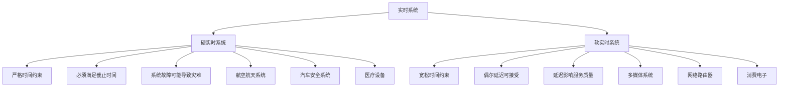
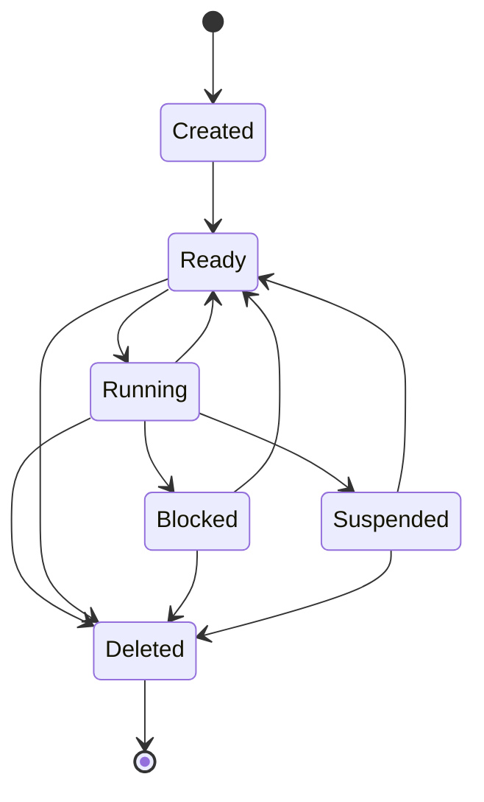
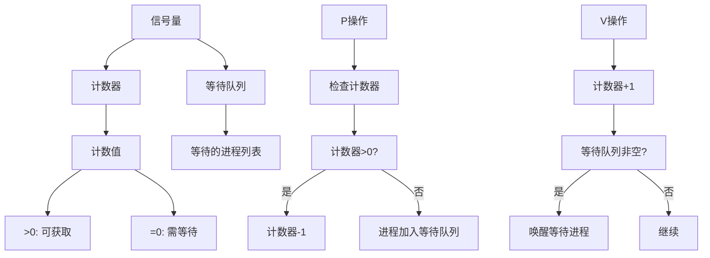
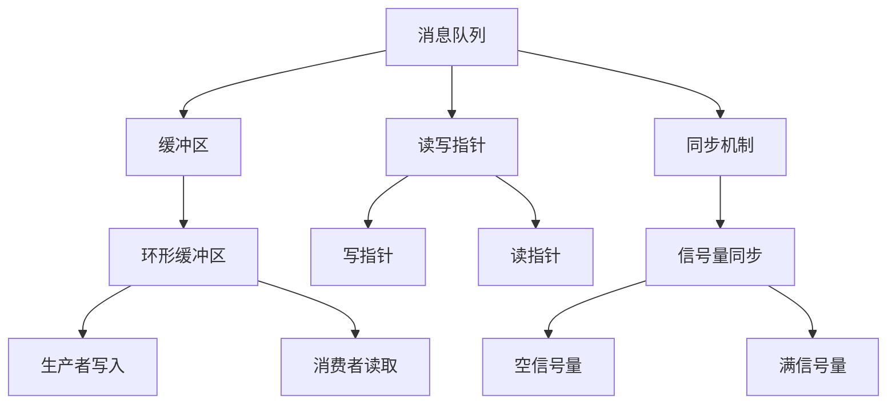

# 实时操作系统

## RTOS概述

实时操作系统（Real-Time Operating System，RTOS）是专门为嵌入式系统设计的操作系统，能够在确定的时间内完成任务，并满足实时性要求。

### RTOS基本概念

#### 实时系统分类



#### RTOS vs 通用操作系统

```python
class OSComparison:
    """
    操作系统对比分析
    """

    def __init__(self):
        self.comparison = {
            '调度策略': {
                'RTOS': '优先级抢占式调度',
                'General_OS': '时间片轮转调度',
                'Difference': 'RTOS保证高优先级任务立即执行'
            },
            '响应时间': {
                'RTOS': '微秒级响应',
                'General_OS': '毫秒级响应',
                'Difference': 'RTOS响应时间可预测'
            },
            '内存管理': {
                'RTOS': '静态分配为主，动态分配受限',
                'General_OS': '虚拟内存，分页管理',
                'Difference': 'RTOS内存使用确定'
            },
            '中断处理': {
                'RTOS': '中断延迟最小化',
                'General_OS': '中断处理相对复杂',
                'Difference': 'RTOS中断处理时间确定'
            },
            '可预测性': {
                'RTOS': '高可预测性',
                'General_OS': '低可预测性',
                'Difference': 'RTOS行为可预测'
            }
        }

    def get_rtos_advantages(self):
        """
        获取RTOS优势
        """
        return {
            '实时性': '能够在确定时间内响应外部事件',
            '可预测性': '系统行为可以预测和分析',
            '可靠性': '长时间稳定运行',
            '资源效率': '适合资源受限环境',
            '确定性': '执行时间可确定'
        }

    def get_rtos_applications(self):
        """
        获取RTOS应用场景
        """
        return {
            '工业控制': [
                'PLC编程',
                '运动控制',
                '过程自动化',
                '机器人控制'
            ],
            '汽车电子': [
                '发动机控制',
                '刹车系统',
                '安全气囊',
                '车载娱乐系统'
            ],
            '医疗设备': [
                '心脏监护仪',
                '输液泵',
                '医学成像',
                '患者监护'
            ],
            '航空航天': [
                '飞行控制',
                '导航系统',
                '通信系统',
                '监控系统'
            ]
        }
```

## 任务管理

### 任务概念和状态

#### 任务状态机



#### 任务优先级

```python
class TaskPriority:
    """
    任务优先级管理
    """

    def __init__(self):
        self.priority_levels = {
            'CRITICAL': 0,      # 关键任务 - 系统核心功能
            'HIGH': 1,          # 高优先级 - 实时任务
            'MEDIUM': 2,        # 中优先级 - 普通任务
            'LOW': 3,           # 低优先级 - 后台任务
            'IDLE': 255         # 空闲任务 - 最低优先级
        }

        self.priority_description = {
            'CRITICAL': '系统关键任务，不能被阻塞',
            'HIGH': '实时响应任务，需要快速响应',
            'MEDIUM': '普通应用任务，正常执行',
            'LOW': '后台维护任务，可延迟执行',
            'IDLE': '空闲时执行的任务'
        }

    def get_priority_by_task_type(self, task_type):
        """
        根据任务类型获取优先级
        """
        task_priority_map = {
            'interrupt_handler': 'CRITICAL',
            'motor_control': 'HIGH',
            'sensor_reading': 'HIGH',
            'data_processing': 'MEDIUM',
            'user_interface': 'MEDIUM',
            'data_logging': 'LOW',
            'system_monitor': 'LOW',
            'background_task': 'IDLE'
        }

        return self.priority_levels.get(task_priority_map.get(task_type, 'MEDIUM'))

    def validate_priority(self, priority):
        """
        验证优先级是否有效
        """
        valid_priorities = [0, 1, 2, 3, 255]
        return priority in valid_priorities
```

### 任务调度算法

#### 优先级调度

```python
class PriorityScheduler:
    """
    优先级调度器
    """

    def __init__(self, max_tasks=32):
        """
        初始化调度器

        参数:
            max_tasks: 最大任务数
        """
        self.max_tasks = max_tasks
        self.tasks = []
        self.current_task = None
        self.task_counter = 0

        # 调度统计
        self.sched_stats = {
            'context_switches': 0,
            'task_preemptions': 0,
            'idle_time': 0
        }

    def create_task(self, name, function, priority, stack_size=1024, params=None):
        """
        创建任务

        参数:
            name: 任务名称
            function: 任务函数
            priority: 优先级
            stack_size: 栈大小
            params: 参数

        返回:
            任务ID或None
        """
        if len(self.tasks) >= self.max_tasks:
            print("任务数量已达上限")
            return None

        task = {
            'id': self.task_counter,
            'name': name,
            'function': function,
            'priority': priority,
            'stack_size': stack_size,
            'params': params or {},
            'state': 'READY',
            'stack': bytearray(stack_size),
            'created_time': time.time(),
            'execution_time': 0,
            'last_run_time': 0
        }

        self.tasks.append(task)
        self.task_counter += 1

        print(f"创建任务: {name} (ID: {task['id']}, 优先级: {priority})")
        return task['id']

    def delete_task(self, task_id):
        """
        删除任务

        参数:
            task_id: 任务ID
        """
        for i, task in enumerate(self.tasks):
            if task['id'] == task_id:
                self.tasks.pop(i)
                if self.current_task and self.current_task['id'] == task_id:
                    self.current_task = None
                print(f"删除任务: {task['name']}")
                return

        print(f"未找到任务ID: {task_id}")

    def get_ready_tasks(self):
        """
        获取就绪任务列表

        返回:
            按优先级排序的就绪任务列表
        """
        ready_tasks = [task for task in self.tasks if task['state'] == 'READY']
        ready_tasks.sort(key=lambda x: x['priority'])
        return ready_tasks

    def schedule(self):
        """
        执行调度
        """
        ready_tasks = self.get_ready_tasks()

        if not ready_tasks:
            # 没有就绪任务，执行空闲任务
            self.sched_stats['idle_time'] += 1
            return None

        highest_priority_task = ready_tasks[0]

        # 检查是否需要上下文切换
        if (self.current_task is None or
            highest_priority_task['priority'] < self.current_task['priority'] or
            self.current_task['state'] != 'RUNNING'):

            if self.current_task and self.current_task['state'] == 'RUNNING':
                # 任务被抢占
                self.current_task['state'] = 'READY'
                self.sched_stats['task_preemptions'] += 1

            # 切换到新任务
            if self.current_task != highest_priority_task:
                self.sched_stats['context_switches'] += 1
                print(f"上下文切换: {self.current_task['name'] if self.current_task else 'None'} -> {highest_priority_task['name']}")

            highest_priority_task['state'] = 'RUNNING'
            self.current_task = highest_priority_task

            return highest_priority_task

        return self.current_task

    def task_yield(self):
        """
        任务主动让出CPU
        """
        if self.current_task:
            self.current_task['state'] = 'READY'
            self.current_task = None

    def task_sleep(self, task_id, sleep_time):
        """
        任务睡眠

        参数:
            task_id: 任务ID
            sleep_time: 睡眠时间
        """
        for task in self.tasks:
            if task['id'] == task_id:
                task['state'] = 'BLOCKED'
                task['wake_time'] = time.time() + sleep_time
                break

    def check_sleeping_tasks(self):
        """
        检查睡眠任务是否应该唤醒
        """
        current_time = time.time()
        for task in self.tasks:
            if (task['state'] == 'BLOCKED' and
                'wake_time' in task and
                current_time >= task['wake_time']):
                task['state'] = 'READY'
                del task['wake_time']
                print(f"唤醒任务: {task['name']}")

    def get_statistics(self):
        """
        获取调度统计
        """
        return {
            'total_tasks': len(self.tasks),
            'ready_tasks': len([t for t in self.tasks if t['state'] == 'READY']),
            'running_tasks': len([t for t in self.tasks if t['state'] == 'RUNNING']),
            'blocked_tasks': len([t for t in self.tasks if t['state'] == 'BLOCKED']),
            'context_switches': self.sched_stats['context_switches'],
            'task_preemptions': self.sched_stats['task_preemptions'],
            'idle_time': self.sched_stats['idle_time']
        }
```

#### 时间片轮转调度

```python
class RoundRobinScheduler:
    """
    时间片轮转调度器
    """

    def __init__(self, time_slice=10):
        """
        初始化轮转调度器

        参数:
            time_slice: 时间片长度(毫秒)
        """
        self.time_slice = time_slice
        self.ready_queue = []
        self.current_task = None
        self.task_start_time = 0
        self.task_counter = 0

    def create_task(self, name, function, params=None):
        """
        创建任务
        """
        task = {
            'id': self.task_counter,
            'name': name,
            'function': function,
            'params': params or {},
            'state': 'READY',
            'time_used': 0,
            'total_time': 0
        }

        self.ready_queue.append(task)
        self.task_counter += 1

        print(f"创建任务: {name} (ID: {task['id']})")
        return task['id']

    def schedule(self):
        """
        执行调度
        """
        current_time = time.time()

        # 检查当前任务是否用完时间片
        if self.current_task:
            time_used = (current_time - self.task_start_time) * 1000

            if time_used >= self.time_slice:
                # 时间片用完，重新排队
                self.current_task['time_used'] = 0
                self.ready_queue.append(self.current_task)
                self.current_task = None
            else:
                # 继续执行当前任务
                self.current_task['time_used'] = time_used
                return self.current_task

        # 选择下一个任务
        if self.ready_queue:
            self.current_task = self.ready_queue.pop(0)
            self.task_start_time = current_time
            self.current_task['state'] = 'RUNNING'

        return self.current_task

    def task_complete(self, task_id):
        """
        任务完成
        """
        if self.current_task and self.current_task['id'] == task_id:
            current_time = time.time()
            time_used = (current_time - self.task_start_time) * 1000
            self.current_task['total_time'] = self.current_task.get('total_time', 0) + time_used
            self.current_task = None
```

## 同步和通信

### 信号量

#### 信号量原理



#### 信号量实现

```python
class Semaphore:
    """
    信号量实现
    """

    def __init__(self, initial_count=1, max_count=1):
        """
        初始化信号量

        参数:
            initial_count: 初始计数
            max_count: 最大计数
        """
        self.count = initial_count
        self.max_count = max_count
        self.wait_queue = []

        # 统计信息
        self.stats = {
            'acquires': 0,
            'releases': 0,
            'timeouts': 0,
            'max_waiters': 0
        }

    def acquire(self, timeout_ms=None):
        """
        获取信号量

        参数:
            timeout_ms: 超时时间(毫秒)，None表示无限等待

        返回:
            成功返回True，超时返回False
        """
        self.stats['acquires'] += 1

        if self.count > 0:
            # 立即获取信号量
            self.count -= 1
            return True

        # 需要等待
        wait_event = {
            'task_id': self._get_current_task_id(),
            'start_time': time.time(),
            'completed': False
        }

        self.wait_queue.append(wait_event)
        self.stats['max_waiters'] = max(self.stats['max_waiters'], len(self.wait_queue))

        # 等待信号量
        while not wait_event['completed']:
            if timeout_ms is not None:
                elapsed_ms = (time.time() - wait_event['start_time']) * 1000
                if elapsed_ms >= timeout_ms:
                    # 超时，移除等待事件
                    self.wait_queue.remove(wait_event)
                    self.stats['timeouts'] += 1
                    return False

            # 让出CPU
            time.sleep_ms(1)

        return True

    def release(self):
        """
        释放信号量
        """
        self.stats['releases'] += 1

        if self.count < self.max_count:
            self.count += 1

        # 唤醒等待的任务
        if self.wait_queue:
            wait_event = self.wait_queue.pop(0)
            wait_event['completed'] = True
            self.count -= 1  # 被唤醒的任务会获取信号量

    def get_count(self):
        """
        获取信号量计数
        """
        return self.count

    def get_waiter_count(self):
        """
        获取等待任务数
        """
        return len(self.wait_queue)

    def get_statistics(self):
        """
        获取统计信息
        """
        return self.stats.copy()

    def _get_current_task_id(self):
        """
        获取当前任务ID (简化实现)
        """
        return id(time.time())  # 简化实现

# 互斥信号量
class Mutex(Semaphore):
    """
    互斥信号量
    """

    def __init__(self):
        """
        初始化互斥信号量
        """
        super().__init__(initial_count=1, max_count=1)
        self.owner = None
        self.recursion_count = 0

    def acquire(self, timeout_ms=None):
        """
        获取互斥信号量

        参数:
            timeout_ms: 超时时间

        返回:
            成功返回True，超时返回False
        """
        current_task = self._get_current_task_id()

        if self.owner == current_task:
            # 递归获取
            self.recursion_count += 1
            return True

        if super().acquire(timeout_ms):
            self.owner = current_task
            self.recursion_count = 1
            return True

        return False

    def release(self):
        """
        释放互斥信号量
        """
        current_task = self._get_current_task_id()

        if self.owner != current_task:
            raise RuntimeError("Attempt to release mutex owned by another task")

        self.recursion_count -= 1

        if self.recursion_count == 0:
            self.owner = None
            super().release()

    def is_owned_by_current_task(self):
        """
        检查是否被当前任务拥有
        """
        return self.owner == self._get_current_task_id()

# 计数信号量
class CountingSemaphore(Semaphore):
    """
    计数信号量
    """

    def __init__(self, initial_count=0, max_count=255):
        """
        初始化计数信号量

        参数:
            initial_count: 初始计数
            max_count: 最大计数
        """
        super().__init__(initial_count, max_count)
```

### 消息队列

#### 消息队列原理



#### 消息队列实现

```python
class MessageQueue:
    """
    消息队列实现
    """

    def __init__(self, capacity=10, message_size=256):
        """
        初始化消息队列

        参数:
            capacity: 队列容量
            message_size: 消息大小
        """
        self.capacity = capacity
        self.message_size = message_size

        # 环形缓冲区
        self.buffer = bytearray(capacity * message_size)
        self.head = 0  # 写指针
        self.tail = 0  # 读指针
        self.count = 0  # 当前消息数

        # 同步信号量
        self.empty_semaphore = Semaphore(initial_count=0, max_count=capacity)
        self.full_semaphore = Semaphore(initial_count=capacity, max_count=capacity)
        self.mutex = Mutex()

        # 统计信息
        self.stats = {
            'messages_sent': 0,
            'messages_received': 0,
            'queue_overflows': 0,
            'max_queue_usage': 0
        }

    def send(self, message, timeout_ms=None):
        """
        发送消息

        参数:
            message: 消息数据
            timeout_ms: 超时时间

        返回:
            成功返回True，超时返回False
        """
        if len(message) > self.message_size:
            raise ValueError(f"消息大小超过限制: {len(message)} > {self.message_size}")

        # 等待队列不满
        if not self.full_semaphore.acquire(timeout_ms):
            return False

        # 获取互斥锁
        if not self.mutex.acquire(timeout_ms):
            self.full_semaphore.release()
            return False

        try:
            # 写入消息
            start_index = self.head * self.message_size
            for i, byte in enumerate(message):
                self.buffer[start_index + i] = byte

            # 更新指针
            self.head = (self.head + 1) % self.capacity
            self.count += 1

            # 更新统计
            self.stats['messages_sent'] += 1
            self.stats['max_queue_usage'] = max(self.stats['max_queue_usage'], self.count)

        finally:
            # 释放互斥锁
            self.mutex.release()

        # 通知消费者
        self.empty_semaphore.release()

        return True

    def receive(self, timeout_ms=None):
        """
        接收消息

        参数:
            timeout_ms: 超时时间

        返回:
            接收的消息或None
        """
        # 等待队列不空
        if not self.empty_semaphore.acquire(timeout_ms):
            return None

        # 获取互斥锁
        if not self.mutex.acquire(timeout_ms):
            self.empty_semaphore.release()
            return None

        try:
            # 读取消息
            start_index = self.tail * self.message_size
            message = self.buffer[start_index:start_index + self.message_size]

            # 更新指针
            self.tail = (self.tail + 1) % self.capacity
            self.count -= 1

            # 更新统计
            self.stats['messages_received'] += 1

        finally:
            # 释放互斥锁
            self.mutex.release()

        # 通知生产者
        self.full_semaphore.release()

        return bytes(message)

    def is_empty(self):
        """
        检查队列是否为空
        """
        return self.count == 0

    def is_full(self):
        """
        检查队列是否已满
        """
        return self.count == self.capacity

    def get_count(self):
        """
        获取队列中的消息数
        """
        return self.count

    def get_statistics(self):
        """
        获取统计信息
        """
        return {
            'capacity': self.capacity,
            'current_count': self.count,
            'messages_sent': self.stats['messages_sent'],
            'messages_received': self.stats['messages_received'],
            'queue_overflows': self.stats['queue_overflows'],
            'max_queue_usage': self.stats['max_queue_usage'],
            'usage_percent': (self.count / self.capacity) * 100
        }

    def clear(self):
        """
        清空队列
        """
        with self.mutex:
            self.head = 0
            self.tail = 0
            self.count = 0

            # 重置信号量
            self.empty_semaphore = Semaphore(initial_count=0, max_count=self.capacity)
            self.full_semaphore = Semaphore(initial_count=self.capacity, max_count=self.capacity)
```

### 事件标志组

#### 事件标志组实现

```python
class EventFlags:
    """
    事件标志组
    """

    def __init__(self, flags=0xFFFFFFFF):
        """
        初始化事件标志组

        参数:
            flags: 初始标志位
        """
        self.flags = flags
        self.wait_tasks = []

        # 标志位说明
        self.flag_descriptions = {
            0x00000001: '系统启动完成',
            0x00000002: '数据就绪',
            0x00000004: '错误发生',
            0x00000008: '用户输入',
            0x00000010: '定时器到期',
            0x00000020: '通信完成',
            0x00000040: '传感器就绪',
            0x00000080: '设备就绪'
        }

    def set_flags(self, flags_to_set):
        """
        设置标志位

        参数:
            flags_to_set: 要设置的标志位
        """
        self.flags |= flags_to_set
        self._check_waiting_tasks()

    def clear_flags(self, flags_to_clear):
        """
        清除标志位

        参数:
            flags_to_clear: 要清除的标志位
        """
        self.flags &= ~flags_to_clear

    def get_flags(self):
        """
        获取当前标志位
        """
        return self.flags

    def wait_flags(self, flags_to_wait, timeout_ms=None, clear_on_exit=True):
        """
        等待标志位

        参数:
            flags_to_wait: 要等待的标志位
            timeout_ms: 超时时间
            clear_on_exit: 退出时是否清除标志位

        返回:
            成功返回True，超时返回False
        """
        current_task = self._get_current_task_id()

        # 检查标志位是否已设置
        if (self.flags & flags_to_wait) == flags_to_wait:
            if clear_on_exit:
                self.clear_flags(flags_to_wait)
            return True

        # 创建等待事件
        wait_event = {
            'task_id': current_task,
            'flags_to_wait': flags_to_wait,
            'clear_on_exit': clear_on_exit,
            'start_time': time.time(),
            'completed': False
        }

        self.wait_tasks.append(wait_event)

        # 等待标志位
        while not wait_event['completed']:
            if timeout_ms is not None:
                elapsed_ms = (time.time() - wait_event['start_time']) * 1000
                if elapsed_ms >= timeout_ms:
                    # 超时，移除等待事件
                    self.wait_tasks.remove(wait_event)
                    return False

            time.sleep_ms(1)

        return True

    def _check_waiting_tasks(self):
        """
        检查等待任务
        """
        for wait_event in self.wait_tasks[:]:  # 创建副本以避免修改问题
            if (self.flags & wait_event['flags_to_wait']) == wait_event['flags_to_wait']:
                # 标志位已设置，唤醒任务
                if wait_event['clear_on_exit']:
                    self.clear_flags(wait_event['flags_to_wait'])

                wait_event['completed'] = True
                self.wait_tasks.remove(wait_event)

    def get_flag_description(self, flag):
        """
        获取标志位描述
        """
        return self.flag_descriptions.get(flag, '未知标志')

    def _get_current_task_id(self):
        """
        获取当前任务ID (简化实现)
        """
        return id(time.time())
```

## 内存管理

### 内存分配策略

#### 静态内存分配

```python
class StaticMemoryAllocator:
    """
    静态内存分配器
    """

    def __init__(self, total_size):
        """
        初始化静态内存分配器

        参数:
            total_size: 总内存大小
        """
        self.memory = bytearray(total_size)
        self.allocated = [False] * total_size
        self.total_size = total_size
        self.allocated_size = 0

        # 统计信息
        self.stats = {
            'allocations': 0,
            'deallocations': 0,
            'fragmentation': 0,
            'peak_usage': 0
        }

    def allocate(self, size, alignment=4):
        """
        分配内存

        参数:
            size: 分配大小
            alignment: 对齐要求

        返回:
            分配的内存地址或None
        """
        # 对齐检查
        aligned_size = (size + alignment - 1) & ~(alignment - 1)

        # 查找连续的空闲空间
        for start in range(0, self.total_size - aligned_size + 1):
            if not any(self.allocated[start:start + aligned_size]):
                # 找到空闲空间
                for i in range(start, start + aligned_size):
                    self.allocated[i] = True

                self.allocated_size += aligned_size
                self.stats['allocations'] += 1
                self.stats['peak_usage'] = max(self.stats['peak_usage'], self.allocated_size)

                return start

        return None

    def deallocate(self, address, size):
        """
        释放内存

        参数:
            address: 内存地址
            size: 释放大小
        """
        if address is None or address < 0 or address + size > self.total_size:
            return

        # 释放内存
        for i in range(address, address + size):
            self.allocated[i] = False

        self.allocated_size -= size
        self.stats['deallocations'] += 1

    def get_usage(self):
        """
        获取内存使用情况
        """
        return {
            'total_size': self.total_size,
            'allocated_size': self.allocated_size,
            'free_size': self.total_size - self.allocated_size,
            'usage_percent': (self.allocated_size / self.total_size) * 100,
            'fragmentation': self._calculate_fragmentation()
        }

    def _calculate_fragmentation(self):
        """
        计算内存碎片化程度
        """
        free_blocks = []
        current_block = 0

        for i in range(self.total_size):
            if not self.allocated[i]:
                current_block += 1
            else:
                if current_block > 0:
                    free_blocks.append(current_block)
                    current_block = 0

        if current_block > 0:
            free_blocks.append(current_block)

        if not free_blocks:
            return 0

        max_free = max(free_blocks)
        total_free = sum(free_blocks)
        return (1 - max_free / total_free) * 100 if total_free > 0 else 0
```

#### 动态内存分配

```python
class DynamicMemoryAllocator:
    """
    动态内存分配器 (简化版malloc/free)
    """

    class MemoryBlock:
        """内存块结构"""
        def __init__(self, address, size, free=True):
            self.address = address
            self.size = size
            self.free = free
            self.next = None

    def __init__(self, total_size):
        """
        初始化动态内存分配器

        参数:
            total_size: 总内存大小
        """
        self.total_size = total_size
        self.memory = bytearray(total_size)
        self.free_list = self.MemoryBlock(0, total_size, True)

        # 统计信息
        self.stats = {
            'allocations': 0,
            'deallocations': 0,
            'fragments': 0,
            'coalesces': 0
        }

    def malloc(self, size):
        """
        分配内存

        参数:
            size: 分配大小

        返回:
            分配的内存地址或None
        """
        # 首次适应算法
        prev = None
        current = self.free_list

        while current:
            if current.free and current.size >= size:
                # 找到合适的块
                if current.size > size + 16:  # 剩余空间足够大，分割
                    new_block = self.MemoryBlock(
                        current.address + size,
                        current.size - size,
                        True
                    )
                    current.size = size
                    new_block.next = current.next
                    current.next = new_block

                current.free = False
                self.stats['allocations'] += 1
                return current.address

            prev = current
            current = current.next

        return None

    def free(self, address):
        """
        释放内存

        参数:
            address: 要释放的内存地址
        """
        # 查找对应的块
        prev = None
        current = self.free_list

        while current:
            if current.address == address:
                if current.free:
                    return  # 已经释放

                current.free = True
                self.stats['deallocations'] += 1

                # 合并相邻的空闲块
                self._coalesce_blocks(prev, current)
                return

            prev = current
            current = current.next

    def _coalesce_blocks(self, prev, block):
        """
        合并相邻的空闲块
        """
        # 合并后面的块
        while block.next and block.next.free:
            block.size += block.next.size
            block.next = block.next.next
            self.stats['coalesces'] += 1

        # 合并前面的块
        if prev and prev.free:
            prev.size += block.size
            prev.next = block.next
            self.stats['coalesces'] += 1

    def get_usage(self):
        """
        获取内存使用情况
        """
        total_allocated = 0
        total_free = 0
        fragment_count = 0

        current = self.free_list
        while current:
            if current.free:
                total_free += current.size
                fragment_count += 1
            else:
                total_allocated += current.size
            current = current.next

        return {
            'total_size': self.total_size,
            'allocated_size': total_allocated,
            'free_size': total_free,
            'fragment_count': fragment_count,
            'usage_percent': (total_allocated / self.total_size) * 100
        }
```

## 实践项目：RTOS应用

### 项目概述

构建一个基于MicroPython的RTOS应用系统，包含：
- 多任务管理
- 任务间通信
- 同步机制
- 内存管理
- 实时监控

### 软件实现

```python
class MicroRTOS:
    """
    MicroPython实时操作系统
    """

    def __init__(self, max_tasks=16, stack_size=1024):
        """
        初始化MicroRTOS

        参数:
            max_tasks: 最大任务数
            stack_size: 默认栈大小
        """
        self.max_tasks = max_tasks
        self.stack_size = stack_size
        self.tasks = []
        self.current_task = None
        self.running = False

        # 调度器
        self.scheduler = PriorityScheduler(max_tasks)

        # 系统时钟
        self.system_tick = 0
        self.tick_interval = 10  # 10ms

        # 内存管理
        self.memory_allocator = DynamicMemoryAllocator(65536)  # 64KB内存池

        # 系统对象
        self.semaphores = {}
        self.message_queues = {}
        self.event_flags = {}

        # 统计信息
        self.system_stats = {
            'uptime': 0,
            'context_switches': 0,
            'tasks_created': 0,
            'tasks_deleted': 0
        }

    def create_task(self, name, function, priority=2, params=None, stack_size=None):
        """
        创建任务

        参数:
            name: 任务名称
            function: 任务函数
            priority: 优先级
            params: 参数
            stack_size: 栈大小

        返回:
            任务ID
        """
        if len(self.tasks) >= self.max_tasks:
            raise RuntimeError("任务数量已达上限")

        task_stack = stack_size or self.stack_size

        task_id = self.scheduler.create_task(name, function, priority, task_stack, params)

        if task_id is not None:
            task = {
                'id': task_id,
                'name': name,
                'stack': bytearray(task_stack),
                'state': 'READY',
                'created_at': time.time()
            }
            self.tasks.append(task)
            self.system_stats['tasks_created'] += 1

        return task_id

    def delete_task(self, task_id):
        """
        删除任务
        """
        self.scheduler.delete_task(task_id)

        for i, task in enumerate(self.tasks):
            if task['id'] == task_id:
                self.tasks.pop(i)
                self.system_stats['tasks_deleted'] += 1
                break

    def create_semaphore(self, name, initial_count=1, max_count=1):
        """
        创建信号量

        参数:
            name: 信号量名称
            initial_count: 初始计数
            max_count: 最大计数

        返回:
            信号量对象
        """
        semaphore = Semaphore(initial_count, max_count)
        self.semaphores[name] = semaphore
        return semaphore

    def create_message_queue(self, name, capacity=10, message_size=256):
        """
        创建消息队列

        参数:
            name: 队列名称
            capacity: 容量
            message_size: 消息大小

        返回:
            消息队列对象
        """
        queue = MessageQueue(capacity, message_size)
        self.message_queues[name] = queue
        return queue

    def create_event_flags(self, name, initial_flags=0):
        """
        创建事件标志组

        参数:
            name: 标志组名称
            initial_flags: 初始标志

        返回:
            事件标志组对象
        """
        flags = EventFlags(initial_flags)
        self.event_flags[name] = flags
        return flags

    def start(self):
        """
        启动RTOS
        """
        self.running = True
        print("MicroRTOS启动")

        # 启动系统时钟
        self._start_system_timer()

        # 主调度循环
        try:
            while self.running:
                self._system_tick()
                self._schedule()
                time.sleep_ms(1)

        except KeyboardInterrupt:
            print("MicroRTOS停止")
            self.running = False

    def _system_tick(self):
        """
        系统时钟滴答
        """
        current_time = time.time()
        if hasattr(self, '_last_tick_time'):
            if current_time - self._last_tick_time >= self.tick_interval / 1000:
                self.system_tick += 1
                self._last_tick_time = current_time
        else:
            self._last_tick_time = current_time

    def _start_system_timer(self):
        """
        启动系统定时器
        """
        # 创建定时器任务
        def timer_task():
            while self.running:
                self.system_tick += 1
                time.sleep_ms(self.tick_interval)

        self.create_task("SystemTimer", timer_task, priority=0)

    def _schedule(self):
        """
        执行调度
        """
        # 检查睡眠任务
        self.scheduler.check_sleeping_tasks()

        # 执行调度
        current_task = self.scheduler.schedule()

        if current_task and current_task != self.scheduler.current_task:
            self.system_stats['context_switches'] += 1

    def get_system_statistics(self):
        """
        获取系统统计信息
        """
        scheduler_stats = self.scheduler.get_statistics()
        memory_stats = self.memory_allocator.get_usage()

        return {
            'system_stats': self.system_stats,
            'scheduler_stats': scheduler_stats,
            'memory_stats': memory_stats,
            'system_tick': self.system_tick,
            'uptime': time.time() - getattr(self, '_start_time', time.time())
        }

    def print_system_status(self):
        """
        打印系统状态
        """
        stats = self.get_system_statistics()

        print("\n=== MicroRTOS 系统状态 ===")
        print(f"运行时间: {stats['uptime']:.1f}s")
        print(f"系统时钟: {stats['system_tick']} ticks")
        print(f"任务总数: {stats['scheduler_stats']['total_tasks']}")
        print(f"上下文切换: {stats['system_stats']['context_switches']}")
        print(f"内存使用: {stats['memory_stats']['usage_percent']:.1f}%")
        print("=" * 30)

# 生产者-消费者示例
def producer_consumer_example():
    """
    生产者-消费者示例
    """
    rtos = MicroRTOS()

    # 创建消息队列
    queue = rtos.create_message_queue("data_queue", capacity=5, message_size=32)

    # 生产者任务
    def producer_task():
        counter = 0
        while True:
            message = f"Data_{counter}".encode('utf-8')
            if queue.send(message, timeout_ms=1000):
                print(f"生产者: 发送 {message.decode('utf-8')}")
                counter += 1
            else:
                print("生产者: 队列满，等待中...")
            time.sleep_ms(500)

    # 消费者任务
    def consumer_task():
        while True:
            message = queue.receive(timeout_ms=2000)
            if message:
                print(f"消费者: 接收 {message.decode('utf-8')}")
            else:
                print("消费者: 队列空，等待中...")
            time.sleep_ms(800)

    # 创建任务
    rtos.create_task("Producer", producer_task, priority=2)
    rtos.create_task("Consumer", consumer_task, priority=2)

    # 启动RTOS
    rtos.start()

# 多任务同步示例
def multi_task_sync_example():
    """
    多任务同步示例
    """
    rtos = MicroRTOS()

    # 创建信号量
    data_ready = rtos.create_semaphore("data_ready", initial_count=0)
    processing_done = rtos.create_semaphore("processing_done", initial_count=0)

    # 数据采集任务
    def data_acquisition_task():
        while True:
            print("数据采集: 采集传感器数据...")
            time.sleep_ms(1000)
            print("数据采集: 数据就绪")
            data_ready.release()

            # 等待处理完成
            processing_done.acquire()
            print("数据采集: 可以开始下一次采集")

    # 数据处理任务
    def data_processing_task():
        while True:
            # 等待数据就绪
            data_ready.acquire()
            print("数据处理: 处理数据...")
            time.sleep_ms(1500)
            print("数据处理: 处理完成")
            processing_done.release()

    # 创建任务
    rtos.create_task("DataAcquisition", data_acquisition_task, priority=1)
    rtos.create_task("DataProcessing", data_processing_task, priority=1)

    # 启动RTOS
    rtos.start()

# 事件标志示例
def event_flags_example():
    """
    事件标志示例
    """
    rtos = MicroRTOS()

    # 创建事件标志组
    event_flags = rtos.create_event_flags("system_events")

    # 事件监控任务
    def event_monitor_task():
        while True:
            print("事件监控: 等待系统事件...")
            if event_flags.wait_flags(0x01 | 0x02, timeout_ms=5000):
                print("事件监控: 收到系统事件")
            else:
                print("事件监控: 超时，继续等待")

    # 事件产生任务
    def event_generator_task():
        while True:
            time.sleep_ms(2000)
            flags = 0x01 if time.time() % 4 < 2 else 0x02
            print(f"事件产生: 设置标志 0x{flags:02X}")
            event_flags.set_flags(flags)

    # 创建任务
    rtos.create_task("EventMonitor", event_monitor_task, priority=2)
    rtos.create_task("EventGenerator", event_generator_task, priority=3)

    # 启动RTOS
    rtos.start()

if __name__ == "__main__":
    # 运行示例
    print("选择示例:")
    print("1. 生产者-消费者")
    print("2. 多任务同步")
    print("3. 事件标志")

    choice = input("请输入选择 (1-3): ")

    if choice == "1":
        producer_consumer_example()
    elif choice == "2":
        multi_task_sync_example()
    elif choice == "3":
        event_flags_example()
    else:
        print("无效选择")
```

## 实践练习

### 练习1：任务调度器实现
实现不同调度算法的任务调度器

### 练习2：同步机制应用
使用信号量和消息队列解决生产者-消费者问题

### 练习3：内存管理器
实现高效的内存分配和回收算法

## 课后作业

### 作业1：RTOS设计文档
设计一个完整的RTOS系统架构

### 作业2：实时性能分析
分析RTOS的实时性能和响应时间

### 作业3：任务优先级设计
设计合理的任务优先级分配策略

## 总结

本章深入学习了RTOS的核心概念和实现技术，包括任务管理、同步机制、内存管理等。

## 下一章预告

**第六章：项目实战**
- 智能家居系统完整实现
- 环境监测站完整实现
- 系统集成和测试
- 性能优化
- 项目部署