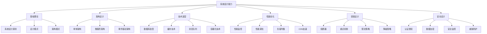

# 课程总结与后续学习

## 课程回顾

经过10周的系统设计学习，我们已经从零基础成长为能够设计大型分布式系统的架构师。让我们回顾一下整个学习历程：

### 第1周：系统设计思维
- **核心概念**：理解了系统设计的定义、重要性和基本思维模式
- **关键技能**：抽象化思维、分层设计、模块化设计
- **实践应用**：系统需求分析和基础架构设计

### 第2周：设计模式与软件架构
- **核心概念**：掌握了GoF 23种设计模式的分类和应用
- **关键技能**：创建型、结构型、行为型模式的实现
- **实践应用**：电商平台设计模式应用案例

### 第3周：数据存储与数据库设计
- **核心概念**：关系型数据库vs NoSQL、数据建模、分片策略
- **关键技能**：数据库设计、性能优化、数据一致性
- **实践应用**：多数据库架构设计和优化

### 第4周：缓存策略与性能优化
- **核心概念**：缓存类型、失效策略、分布式缓存
- **关键技能**：缓存设计、性能调优、监控分析
- **实践应用**：多层缓存架构实现

### 第5周：消息队列与异步处理
- **核心概念**：发布订阅模式、事件驱动架构
- **关键技能**：消息队列设计、异步编程、错误处理
- **实践应用**：事件驱动系统实现

### 第6周：微服务架构设计
- **核心概念**：微服务定义、服务拆分、服务通信
- **关键技能**：API网关、服务发现、容错机制
- **实践应用**：完整微服务架构设计

### 第7周：容错与高可用设计
- **核心概念**：容错模式、高可用架构、故障恢复
- **关键技能**：熔断器、重试机制、限流降级
- **实践应用**：高可用系统设计

### 第8周：安全设计与最佳实践
- **核心概念**：认证授权、数据安全、安全架构
- **关键技能**：安全设计模式、威胁建模、安全测试
- **实践应用**：安全系统设计

### 第9周：大规模系统案例分析
- **核心概念**：大型系统架构剖析、性能优化
- **关键技能**：架构分析、性能瓶颈识别、优化策略
- **实践应用**：系统重构项目

### 第10周：毕业项目实战
- **核心概念**：完整系统设计、技术选型、部署方案
- **关键技能**：项目管理、技术决策、团队协作
- **实践应用**：综合项目实现

## 知识体系总结

### 核心能力矩阵



### 技术栈图谱

#### 前端技术栈
```
前端层
├── 框架：React/Vue/Angular
├── 状态管理：Redux/Vuex/MobX
├── UI组件：Ant Design/Material-UI
└── 构建工具：Webpack/Vite
```

#### 后端技术栈
```
后端层
├── 语言：Java/Python/Go/Node.js
├── 框架：Spring Boot/Django/Gin/Express
├── API设计：REST/gRPC/GraphQL
└── 安全：JWT/OAuth/OpenID Connect
```

#### 数据存储技术栈
```
数据层
├── 关系型数据库：PostgreSQL/MySQL
├── NoSQL数据库：MongoDB/Cassandra
├── 缓存：Redis/Memcached
├── 搜索引擎：Elasticsearch/Solr
└── 对象存储：AWS S3/MinIO
```

#### 中间件技术栈
```
中间件层
├── 消息队列：Kafka/RabbitMQ
├── API网关：Kong/Zuul
├── 服务发现：Consul/Eureka
├── 配置中心：Apollo/Consul
└── 监控：Prometheus/Grafana
```

#### 运维技术栈
```
运维层
├── 容器化：Docker/Kubernetes
├── CI/CD：Jenkins/GitLab CI
├── 监控：ELK Stack/Prometheus
├── 日志：EFK Stack/Loki
└── 部署：AWS/Azure/GCP
```

## 学习建议

### 1. 持续学习策略

#### 理论与实践结合
- **理论学习**：阅读经典书籍，关注技术博客，参加技术分享
- **实践应用**：参与开源项目，构建个人项目，解决实际问题
- **反思总结**：记录学习心得，分享技术见解，参与技术讨论

#### 构建知识体系
```python
# 知识体系构建策略
class KnowledgeSystem:
    def __init__(self):
        self.concepts = set()
        self.connections = {}
        self.projects = []

    def add_concept(self, concept):
        """添加概念"""
        self.concepts.add(concept)

    def connect_concepts(self, concept1, concept2, relationship):
        """连接概念"""
        if concept1 not in self.connections:
            self.connections[concept1] = []
        self.connections[concept1].append((concept2, relationship))

    def build_project(self, project_name, concepts_used):
        """构建项目"""
        project = {
            "name": project_name,
            "concepts": concepts_used,
            "date": datetime.now().isoformat()
        }
        self.projects.append(project)

    def review_knowledge(self):
        """复习知识"""
        print(f"已掌握 {len(self.concepts)} 个概念")
        print(f"构建了 {len(self.projects)} 个项目")
        print(f"建立了 {len(self.connections)} 个概念连接")

# 使用示例
knowledge = KnowledgeSystem()

# 添加概念
knowledge.add_concept("微服务架构")
knowledge.add_concept("事件驱动")
knowledge.add_concept("CQRS")

# 连接概念
knowledge.connect_concepts("微服务架构", "事件驱动", "通信模式")
knowledge.connect_concepts("事件驱动", "CQRS", "数据模式")

# 构建项目
knowledge.build_project("电商平台", [
    "微服务架构",
    "事件驱动",
    "CQRS",
    "API网关",
    "服务发现"
])

knowledge.review_knowledge()
```

### 2. 技术深度与广度

#### 技术深度
- **专注领域**：选择1-2个核心技术领域深入钻研
- **源码阅读**：阅读优秀开源项目的源码
- **性能分析**：深入理解系统性能瓶颈和优化策略
- **架构演进**：跟踪技术发展趋势，理解架构演进规律

#### 技术广度
- **跨领域学习**：了解不同技术领域的知识
- **新兴技术**：关注新兴技术和发展趋势
- **最佳实践**：学习不同场景下的最佳实践
- **工具链**：掌握完整的开发工具链

### 3. 项目实践建议

#### 个人项目
1. **博客系统**：实践Web开发、数据库设计、用户认证
2. **电商系统**：实践微服务架构、支付集成、库存管理
3. **社交应用**：实践实时通信、推送通知、内容推荐
4. **数据平台**：实践数据处理、分析可视化、机器学习

#### 开源贡献
1. **选择项目**：选择与自身兴趣相关的开源项目
2. **从简单开始**：从文档改进、bug修复开始
3. **逐步深入**：参与功能开发、架构设计
4. **持续贡献**：建立长期的开源贡献习惯

#### 技术分享
1. **写博客**：记录学习心得和技术见解
2. **做演讲**：参加技术会议，分享技术经验
3. **参与社区**：加入技术社区，参与讨论
4. **指导他人**：帮助初学者，提升技术领导力

## 进阶学习路径

### 1. 专业认证

#### 云计算认证
- **AWS认证**：AWS Solutions Architect
- **Azure认证**：Azure Solutions Architect
- **Google Cloud认证**：Professional Cloud Architect

#### 容器化认证
- **Docker认证**：Docker Certified Associate
- **Kubernetes认证**：CKA/CKAD/CKS

#### 数据库认证
- **Oracle认证**：Oracle Database Administrator
- **MongoDB认证**：MongoDB Certified Developer
- **Redis认证**：Redis Certified Developer

### 2. 深入学习领域

#### 分布式系统
- **分布式算法**：Paxos、Raft、Gossip
- **分布式事务**：2PC、3PC、Saga模式
- **分布式锁**：Redis锁、Zookeeper锁
- **分布式追踪**：Jaeger、Zipkin、OpenTelemetry

#### 大数据处理
- **流处理**：Kafka Streams、Flink、Spark Streaming
- **批处理**：Hadoop、Spark、MapReduce
- **数据湖**：Delta Lake、Apache Iceberg
- **实时分析**：ClickHouse、Druid

#### 机器学习工程
- **模型部署**：TensorFlow Serving、MLflow
- **特征工程**：Feast、Tecton
- **模型监控**：Evidently、WhyLogs
- **MLOps**：Kubeflow、MLflow

#### 安全工程
- **应用安全**：OWASP Top 10、安全编码
- **云安全**：云原生安全、零信任架构
- **数据安全**：加密算法、密钥管理
- **安全运维**：SIEM、SOAR、威胁情报

### 3. 技术趋势跟踪

#### 关注的技术博客
- **Netflix TechBlog**：Netflix的技术实践
- **AWS Architecture Blog**：AWS架构最佳实践
- **Google Cloud Blog**：Google Cloud技术文章
- **Martin Fowler**：软件架构设计模式
- **High Scalability**：大规模系统架构案例

#### 技术会议
- **AWS re:Invent**：AWS技术大会
- **Google Cloud Next**：Google Cloud技术大会
- **KubeCon**：Kubernetes和云原生技术大会
- **QCon**：全球软件开发大会
- **ArchSummit**：全球架构师峰会

#### 开源项目
- **CNCF项目**：云原生计算基金会项目
- **Apache项目**：Apache软件基金会项目
- **Linux基金会**：Linux基金会项目
- **GitHub趋势**：GitHub热门开源项目

## 职业发展建议

### 1. 职业路径

#### 技术专家路径
```
初级开发工程师 → 中级开发工程师 → 高级开发工程师 → 技术专家 → 首席技术专家
```

#### 架构师路径
```
开发工程师 → 高级开发工程师 → 系统架构师 → 解决方案架构师 → 首席架构师
```

#### 管理路径
```
开发工程师 → 高级开发工程师 → 技术主管 → 技术经理 → 技术总监 → CTO
```

### 2. 技能提升

#### 硬技能
- **编程语言**：精通1-2门主流编程语言
- **框架技术**：熟练使用主流框架和工具
- **系统设计**：具备大型系统设计能力
- **数据库**：深入理解数据库原理和优化
- **云计算**：熟悉主流云平台服务

#### 软技能
- **沟通能力**：清晰表达技术想法和方案
- **团队协作**：与团队成员有效协作
- **项目管理**：具备项目管理能力
- **问题解决**：分析和解决复杂问题
- **学习能力**：持续学习新技术

#### 业务能力
- **业务理解**：深入理解业务需求
- **产品思维**：具备产品设计和优化能力
- **数据分析**：通过数据驱动决策
- **用户思维**：从用户角度思考问题

### 3. 建立个人品牌

#### 技术影响力
- **技术博客**：持续输出高质量技术文章
- **开源项目**：创建和维护开源项目
- **技术演讲**：在技术会议上分享
- **社交媒体**：在技术社区活跃

#### 专业网络
- **LinkedIn**：维护专业的LinkedIn档案
- **GitHub**：展示代码和项目经验
- **Stack Overflow**：回答技术问题
- **技术社区**：参与技术社区讨论

## 资源推荐

### 1. 经典书籍

#### 系统设计
- 《系统设计面试》
- 《数据密集型应用系统设计》
- 《大型网站技术架构》
- 《亿级流量网站架构核心技术》

#### 设计模式
- 《设计模式：可复用面向对象软件的基础》
- 《Head First设计模式》
- 《设计模式的艺术》
- 《重构：改善既有代码的设计》

#### 分布式系统
- 《分布式系统：概念与设计》
- 《大规模分布式存储系统》
- 《从Paxos到Zookeeper》
- 《微服务设计》

#### 云计算
- 《云计算：概念、技术与架构》
- 《AWS云架构设计实践》
- 《Kubernetes权威指南》
- 《Docker容器与容器云》

### 2. 在线课程

#### 系统设计
- Coursera：Software Design and Architecture
- Udemy：Grokking the System Design Interview
- edX：Introduction to Cloud Computing
- 极客时间：系统设计面试

#### 架构设计
- Pluralsight：Software Architecture Path
- LinkedIn Learning：Software Architecture Fundamentals
- 慕课网：系统架构设计师
- 网易云课堂：分布式系统架构

#### 云原生
- Kubernetes官方文档
- CNCF培训课程
- AWS Training and Certification
- Google Cloud Training

### 3. 实践平台

#### 系统设计练习
- LeetCode：系统设计题目
- HackerRank：系统设计挑战
- Pramp：系统设计面试练习
- Interviewing.io：系统设计模拟面试

#### 云平台实践
- AWS Free Tier
- Azure Free Account
- Google Cloud Free Tier
- 阿里云免费试用

#### 开源项目
- GitHub：参与开源项目
- GitLab：托管个人项目
- Bitbucket：团队协作开发
- Gitee：国内开源平台

## 结语

系统设计是一个持续学习和实践的过程。通过这10周的学习，你已经建立了扎实的理论基础和实践经验。但要成为一名优秀的系统架构师，还需要：

1. **持续学习**：技术发展日新月异，保持学习的热情
2. **深度实践**：通过实际项目巩固理论知识
3. **反思总结**：不断反思和总结经验教训
4. **分享交流**：与他人分享知识，共同成长

记住，优秀的系统设计师不仅需要扎实的技术功底，还需要：
- **业务理解**：深入理解业务需求和目标
- **平衡取舍**：在技术选型和架构设计中做出合理取舍
- **前瞻思维**：考虑系统的长期演进和可扩展性
- **团队协作**：与团队成员有效沟通和协作

**祝愿你在系统设计的道路上越走越远，成为一名优秀的技术架构师！**

---

**系统设计学习是一个持续的过程，保持好奇心和学习热情是成功的关键！** 🚀