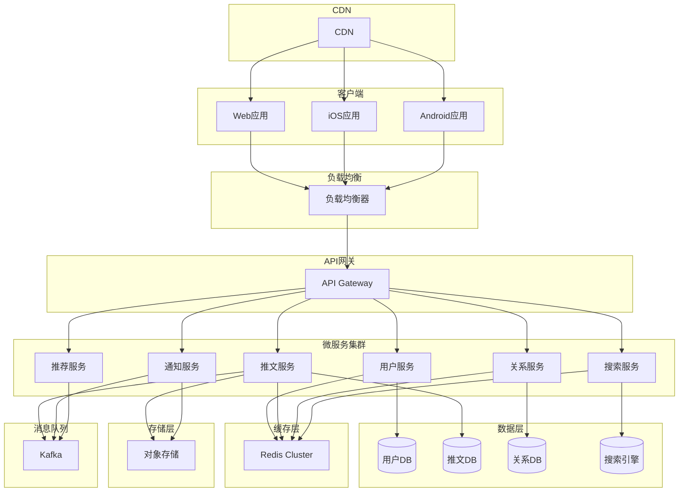

# 项目案例 - 设计一个社交媒体系统

## 项目概述

本项目将设计一个类似Twitter的社交媒体系统，应用前几周学习的系统设计知识，包括系统设计思维、设计模式、微服务架构等。

## 需求分析

### 功能需求

1. **用户管理**
   - 用户注册和登录
   - 个人资料管理
   - 关注/取消关注其他用户
   - 用户权限管理

2. **内容管理**
   - 发布推文（文本、图片、视频）
   - 编辑和删除推文
   - 推文转发和引用
   - 推文搜索功能

3. **社交互动**
   - 点赞推文
   - 评论推文
   - 私信功能
   - 通知系统

4. **信息流**
   - 时间线展示
   - 推荐内容
   - 热门话题
   - 趋势分析

### 非功能需求

1. **性能要求**
   - 页面加载时间 < 2秒
   - API响应时间 < 200ms
   - 支持100万日活用户
   - 峰值QPS：10,000

2. **可扩展性**
   - 支持用户量增长到1000万
   - 数据量增长到10TB
   - 支持全球部署

3. **可用性**
   - 99.9%的系统可用性
   - 故障恢复时间 < 5分钟
   - 数据备份和恢复

4. **安全性**
   - 用户数据加密
   - 防止SQL注入
   - API访问控制
   - 内容审核

## 系统架构设计

### 整体架构



### 微服务拆分

#### 1. 用户服务 (User Service)
- **职责**：用户注册、登录、资料管理、认证授权
- **数据模型**：用户基本信息、认证信息、设置偏好
- **API接口**：
  - `POST /api/users/register` - 用户注册
  - `POST /api/users/login` - 用户登录
  - `GET /api/users/{id}` - 获取用户信息
  - `PUT /api/users/{id}` - 更新用户信息

```python
# 用户服务核心代码
from fastapi import FastAPI, HTTPException, Depends
from pydantic import BaseModel
from typing import Optional
import bcrypt
import jwt
from datetime import datetime, timedelta

app = FastAPI()

class User(BaseModel):
    id: Optional[str] = None
    username: str
    email: str
    password: str
    full_name: str
    bio: Optional[str] = None
    avatar_url: Optional[str] = None
    created_at: Optional[datetime] = None

class UserResponse(BaseModel):
    id: str
    username: str
    email: str
    full_name: str
    bio: Optional[str] = None
    avatar_url: Optional[str] = None
    created_at: datetime

class UserService:
    def __init__(self, db_client, redis_client):
        self.db_client = db_client
        self.redis_client = redis_client
        self.jwt_secret = "your-secret-key"

    async def register_user(self, user_data: dict) -> UserResponse:
        """注册用户"""
        # 检查用户名是否已存在
        if await self.db_client.users.find_one({"username": user_data["username"]}):
            raise HTTPException(status_code=400, detail="Username already exists")

        # 检查邮箱是否已存在
        if await self.db_client.users.find_one({"email": user_data["email"]}):
            raise HTTPException(status_code=400, detail="Email already exists")

        # 加密密码
        hashed_password = bcrypt.hashpw(
            user_data["password"].encode('utf-8'),
            bcrypt.gensalt()
        )

        # 创建用户
        user = {
            "username": user_data["username"],
            "email": user_data["email"],
            "password": hashed_password,
            "full_name": user_data["full_name"],
            "bio": user_data.get("bio"),
            "avatar_url": user_data.get("avatar_url"),
            "created_at": datetime.utcnow()
        }

        result = await self.db_client.users.insert_one(user)
        user_id = str(result.inserted_id)

        # 缓存用户信息
        await self.redis_client.set(f"user:{user_id}", json.dumps(user, default=str))

        return UserResponse(id=user_id, **user)

    async def authenticate_user(self, username: str, password: str) -> str:
        """用户认证"""
        user = await self.db_client.users.find_one({"username": username})
        if not user or not bcrypt.checkpw(password.encode('utf-8'), user["password"]):
            raise HTTPException(status_code=401, detail="Invalid credentials")

        # 生成JWT token
        token = jwt.encode({
            "user_id": str(user["_id"]),
            "exp": datetime.utcnow() + timedelta(days=7)
        }, self.jwt_secret, algorithm="HS256")

        return token

    async def get_user(self, user_id: str) -> Optional[UserResponse]:
        """获取用户信息"""
        # 先从缓存获取
        cached_user = await self.redis_client.get(f"user:{user_id}")
        if cached_user:
            user_data = json.loads(cached_user)
            return UserResponse(id=user_id, **user_data)

        # 从数据库获取
        user = await self.db_client.users.find_one({"_id": ObjectId(user_id)})
        if user:
            user_data = {
                "username": user["username"],
                "email": user["email"],
                "full_name": user["full_name"],
                "bio": user.get("bio"),
                "avatar_url": user.get("avatar_url"),
                "created_at": user["created_at"]
            }
            # 缓存用户信息
            await self.redis_client.set(f"user:{user_id}", json.dumps(user_data, default=str))
            return UserResponse(id=user_id, **user_data)

        return None

# API端点
@app.post("/register", response_model=UserResponse)
async def register(user_data: dict):
    """用户注册"""
    return await user_service.register_user(user_data)

@app.post("/login")
async def login(username: str, password: str):
    """用户登录"""
    token = await user_service.authenticate_user(username, password)
    return {"access_token": token}

@app.get("/users/{user_id}", response_model=UserResponse)
async def get_user(user_id: str):
    """获取用户信息"""
    user = await user_service.get_user(user_id)
    if not user:
        raise HTTPException(status_code=404, detail="User not found")
    return user
```

#### 2. 推文服务 (Tweet Service)
- **职责**：推文发布、编辑、删除、查询
- **数据模型**：推文内容、媒体文件、统计信息
- **API接口**：
  - `POST /api/tweets` - 发布推文
  - `GET /api/tweets/{id}` - 获取推文
  - `PUT /api/tweets/{id}` - 编辑推文
  - `DELETE /api/tweets/{id}` - 删除推文

```python
# 推文服务核心代码
from fastapi import FastAPI, HTTPException, File, UploadFile
from pydantic import BaseModel
from typing import List, Optional
from datetime import datetime
import json
import aiofiles

app = FastAPI()

class Tweet(BaseModel):
    id: Optional[str] = None
    user_id: str
    content: str
    media_urls: List[str] = []
    reply_to_id: Optional[str] = None
    retweet_id: Optional[str] = None
    created_at: Optional[datetime] = None
    updated_at: Optional[datetime] = None

class TweetResponse(BaseModel):
    id: str
    user_id: str
    content: str
    media_urls: List[str]
    reply_to_id: Optional[str]
    retweet_id: Optional[str]
    created_at: datetime
    updated_at: datetime
    likes_count: int
    retweets_count: int
    replies_count: int

class TweetService:
    def __init__(self, db_client, redis_client, storage_client, kafka_producer):
        self.db_client = db_client
        self.redis_client = redis_client
        self.storage_client = storage_client
        self.kafka_producer = kafka_producer

    async def create_tweet(self, user_id: str, tweet_data: dict) -> TweetResponse:
        """创建推文"""
        tweet = {
            "user_id": user_id,
            "content": tweet_data["content"],
            "media_urls": tweet_data.get("media_urls", []),
            "reply_to_id": tweet_data.get("reply_to_id"),
            "retweet_id": tweet_data.get("retweet_id"),
            "created_at": datetime.utcnow(),
            "updated_at": datetime.utcnow(),
            "likes_count": 0,
            "retweets_count": 0,
            "replies_count": 0
        }

        result = await self.db_client.tweets.insert_one(tweet)
        tweet_id = str(result.inserted_id)

        # 缓存推文
        await self.redis_client.set(f"tweet:{tweet_id}", json.dumps(tweet, default=str))

        # 发布推文创建事件
        await self.kafka_producer.send("tweet_events", {
            "event_type": "tweet_created",
            "tweet_id": tweet_id,
            "user_id": user_id
        })

        return TweetResponse(id=tweet_id, **tweet)

    async def get_tweet(self, tweet_id: str) -> Optional[TweetResponse]:
        """获取推文"""
        # 先从缓存获取
        cached_tweet = await self.redis_client.get(f"tweet:{tweet_id}")
        if cached_tweet:
            tweet_data = json.loads(cached_tweet)
            return TweetResponse(id=tweet_id, **tweet_data)

        # 从数据库获取
        tweet = await self.db_client.tweets.find_one({"_id": ObjectId(tweet_id)})
        if tweet:
            tweet_data = {
                "user_id": str(tweet["user_id"]),
                "content": tweet["content"],
                "media_urls": tweet["media_urls"],
                "reply_to_id": str(tweet["reply_to_id"]) if tweet["reply_to_id"] else None,
                "retweet_id": str(tweet["retweet_id"]) if tweet["retweet_id"] else None,
                "created_at": tweet["created_at"],
                "updated_at": tweet["updated_at"],
                "likes_count": tweet["likes_count"],
                "retweets_count": tweet["retweets_count"],
                "replies_count": tweet["replies_count"]
            }
            # 缓存推文
            await self.redis_client.set(f"tweet:{tweet_id}", json.dumps(tweet_data, default=str))
            return TweetResponse(id=tweet_id, **tweet_data)

        return None

    async def upload_media(self, user_id: str, file: UploadFile) -> str:
        """上传媒体文件"""
        # 生成文件名
        file_extension = file.filename.split('.')[-1]
        filename = f"{user_id}_{datetime.utcnow().timestamp()}.{file_extension}"

        # 上传到对象存储
        file_path = f"media/{filename}"
        async with aiofiles.open(f"/tmp/{filename}", 'wb') as f:
            content = await file.read()
            await f.write(content)

        await self.storage_client.upload_file(f"/tmp/{filename}", file_path)

        return f"https://cdn.example.com/{file_path}"

    async def get_timeline(self, user_id: str, limit: int = 20, offset: int = 0) -> List[TweetResponse]:
        """获取用户时间线"""
        # 获取用户关注的人
        following = await self.db_client.follows.find(
            {"follower_id": ObjectId(user_id)}
        ).to_list(length=1000)

        following_ids = [str(f["following_id"]) for f in following]

        # 获取推文
        tweets = await self.db_client.tweets.find({
            "user_id": {"$in": [ObjectId(uid) for uid in following_ids]}
        }).sort("created_at", -1).skip(offset).limit(limit).to_list(length=limit)

        return [
            TweetResponse(
                id=str(tweet["_id"]),
                user_id=str(tweet["user_id"]),
                content=tweet["content"],
                media_urls=tweet["media_urls"],
                reply_to_id=str(tweet["reply_to_id"]) if tweet["reply_to_id"] else None,
                retweet_id=str(tweet["retweet_id"]) if tweet["retweet_id"] else None,
                created_at=tweet["created_at"],
                updated_at=tweet["updated_at"],
                likes_count=tweet["likes_count"],
                retweets_count=tweet["retweets_count"],
                replies_count=tweet["replies_count"]
            )
            for tweet in tweets
        ]

# API端点
@app.post("/tweets", response_model=TweetResponse)
async def create_tweet(tweet_data: dict, current_user: dict = Depends(get_current_user)):
    """创建推文"""
    return await tweet_service.create_tweet(current_user["user_id"], tweet_data)

@app.get("/tweets/{tweet_id}", response_model=TweetResponse)
async def get_tweet(tweet_id: str):
    """获取推文"""
    tweet = await tweet_service.get_tweet(tweet_id)
    if not tweet:
        raise HTTPException(status_code=404, detail="Tweet not found")
    return tweet

@app.post("/tweets/{tweet_id}/media")
async def upload_tweet_media(tweet_id: str, file: UploadFile = File(...)):
    """上传推文媒体文件"""
    # 验证推文是否存在
    tweet = await tweet_service.get_tweet(tweet_id)
    if not tweet:
        raise HTTPException(status_code=404, detail="Tweet not found")

    # 上传媒体文件
    media_url = await tweet_service.upload_media(tweet.user_id, file)

    # 更新推文
    await tweet_service.update_tweet_media(tweet_id, media_url)

    return {"media_url": media_url}

@app.get("/timeline", response_model=List[TweetResponse])
async def get_timeline(
    limit: int = 20,
    offset: int = 0,
    current_user: dict = Depends(get_current_user)
):
    """获取用户时间线"""
    return await tweet_service.get_timeline(current_user["user_id"], limit, offset)
```

#### 3. 关系服务 (Relationship Service)
- **职责**：用户关注/取消关注、好友关系管理
- **数据模型**：关注关系、好友关系、拉黑关系
- **API接口**：
  - `POST /api/follow/{user_id}` - 关注用户
  - `DELETE /api/follow/{user_id}` - 取消关注
  - `GET /api/followers/{user_id}` - 获取粉丝列表
  - `GET /api/following/{user_id}` - 获取关注列表

```python
# 关系服务核心代码
from fastapi import FastAPI, HTTPException
from pydantic import BaseModel
from typing import List
from datetime import datetime

app = FastAPI()

class Follow(BaseModel):
    follower_id: str
    following_id: str
    created_at: datetime

class RelationshipService:
    def __init__(self, db_client, redis_client):
        self.db_client = db_client
        self.redis_client = redis_client

    async def follow_user(self, follower_id: str, following_id: str) -> bool:
        """关注用户"""
        # 检查是否已经关注
        existing_follow = await self.db_client.follows.find_one({
            "follower_id": ObjectId(follower_id),
            "following_id": ObjectId(following_id)
        })

        if existing_follow:
            raise HTTPException(status_code=400, detail="Already following")

        # 创建关注关系
        follow = {
            "follower_id": ObjectId(follower_id),
            "following_id": ObjectId(following_id),
            "created_at": datetime.utcnow()
        }

        await self.db_client.follows.insert_one(follow)

        # 更新缓存
        await self.redis_client.sadd(f"following:{follower_id}", following_id)
        await self.redis_client.sadd(f"followers:{following_id}", follower_id)

        return True

    async def unfollow_user(self, follower_id: str, following_id: str) -> bool:
        """取消关注"""
        # 删除关注关系
        result = await self.db_client.follows.delete_one({
            "follower_id": ObjectId(follower_id),
            "following_id": ObjectId(following_id)
        })

        if result.deleted_count == 0:
            raise HTTPException(status_code=404, detail="Not following")

        # 更新缓存
        await self.redis_client.srem(f"following:{follower_id}", following_id)
        await self.redis_client.srem(f"followers:{following_id}", follower_id)

        return True

    async def get_followers(self, user_id: str, limit: int = 20) -> List[str]:
        """获取粉丝列表"""
        # 先从缓存获取
        cached_followers = await self.redis_client.smembers(f"followers:{user_id}")
        if cached_followers:
            return list(cached_followers)[:limit]

        # 从数据库获取
        follows = await self.db_client.follows.find({
            "following_id": ObjectId(user_id)
        }).limit(limit).to_list(length=limit)

        followers = [str(f["follower_id"]) for f in follows]

        # 缓存结果
        for follower_id in followers:
            await self.redis_client.sadd(f"followers:{user_id}", follower_id)

        return followers

    async def get_following(self, user_id: str, limit: int = 20) -> List[str]:
        """获取关注列表"""
        # 先从缓存获取
        cached_following = await self.redis_client.smembers(f"following:{user_id}")
        if cached_following:
            return list(cached_following)[:limit]

        # 从数据库获取
        follows = await self.db_client.follows.find({
            "follower_id": ObjectId(user_id)
        }).limit(limit).to_list(length=limit)

        following = [str(f["following_id"]) for f in follows]

        # 缓存结果
        for following_id in following:
            await self.redis_client.sadd(f"following:{user_id}", following_id)

        return following

    async def get_follow_counts(self, user_id: str) -> dict:
        """获取关注统计"""
        followers_count = await self.redis_client.scard(f"followers:{user_id}")
        following_count = await self.redis_client.scard(f"following:{user_id}")

        return {
            "followers_count": followers_count,
            "following_count": following_count
        }

# API端点
@app.post("/follow/{user_id}")
async def follow_user(
    user_id: str,
    current_user: dict = Depends(get_current_user)
):
    """关注用户"""
    await relationship_service.follow_user(current_user["user_id"], user_id)
    return {"message": "Successfully followed user"}

@app.delete("/follow/{user_id}")
async def unfollow_user(
    user_id: str,
    current_user: dict = Depends(get_current_user)
):
    """取消关注"""
    await relationship_service.unfollow_user(current_user["user_id"], user_id)
    return {"message": "Successfully unfollowed user"}

@app.get("/followers/{user_id}")
async def get_followers(user_id: str, limit: int = 20):
    """获取粉丝列表"""
    return await relationship_service.get_followers(user_id, limit)

@app.get("/following/{user_id}")
async def get_following(user_id: str, limit: int = 20):
    """获取关注列表"""
    return await relationship_service.get_following(user_id, limit)

@app.get("/follow-stats/{user_id}")
async def get_follow_stats(user_id: str):
    """获取关注统计"""
    return await relationship_service.get_follow_counts(user_id)
```

### 数据存储设计

#### 1. 数据库设计

```python
# 用户表结构
class UserCollection:
    """用户集合"""
    schema = {
        "username": "string",           # 用户名
        "email": "string",             # 邮箱
        "password": "string",           # 密码哈希
        "full_name": "string",          # 全名
        "bio": "string?",              # 个人简介
        "avatar_url": "string?",       # 头像URL
        "location": "string?",         # 位置
        "website": "string?",          # 网站
        "birth_date": "date?",         # 出生日期
        "created_at": "datetime",       # 创建时间
        "updated_at": "datetime"        # 更新时间
    }

# 推文表结构
class TweetCollection:
    """推文集合"""
    schema = {
        "user_id": "ObjectId",         # 用户ID
        "content": "string",           # 推文内容
        "media_urls": "array",         # 媒体文件URL列表
        "reply_to_id": "ObjectId?",    # 回复的推文ID
        "retweet_id": "ObjectId?",     # 转发的推文ID
        "likes_count": "int",          # 点赞数
        "retweets_count": "int",       # 转发数
        "replies_count": "int",        # 回复数
        "created_at": "datetime",      # 创建时间
        "updated_at": "datetime"       # 更新时间
    }

# 关注关系表结构
class FollowCollection:
    """关注关系集合"""
    schema = {
        "follower_id": "ObjectId",     # 关注者ID
        "following_id": "ObjectId",    # 被关注者ID
        "created_at": "datetime"       # 创建时间
    }

# 点赞表结构
class LikeCollection:
    """点赞集合"""
    schema = {
        "user_id": "ObjectId",         # 用户ID
        "tweet_id": "ObjectId",        # 推文ID
        "created_at": "datetime"       # 创建时间
    }
```

#### 2. 缓存设计

```python
# Redis缓存设计
class CacheKeys:
    """缓存键设计"""
    # 用户相关
    USER_PROFILE = "user:{user_id}"                    # 用户信息
    USER_SESSION = "session:{session_id}"            # 用户会话
    USER_FOLLOWING = "following:{user_id}"            # 关注列表
    USER_FOLLOWERS = "followers:{user_id}"            # 粉丝列表
    USER_TWEETS = "user_tweets:{user_id}"             # 用户推文列表

    # 推文相关
    TWEET_DATA = "tweet:{tweet_id}"                    # 推文信息
    TWEET_LIKES = "tweet_likes:{tweet_id}"            # 推文点赞用户
    TWEET_RETWEETS = "tweet_retweets:{tweet_id}"       # 推文转发用户
    TWEET_REPLIES = "tweet_replies:{tweet_id}"        # 推文回复列表

    # 时间线相关
    TIMELINE = "timeline:{user_id}"                    # 用户时间线
    TRENDING = "trending"                             # 热门话题
    TRENDING_TOPICS = "trending_topics"               # 热门话题列表

    # 统计相关
    USER_STATS = "user_stats:{user_id}"               # 用户统计
    TWEET_STATS = "tweet_stats:{tweet_id}"            # 推文统计
    DAILY_STATS = "daily_stats:{date}"               # 日统计

# 缓存策略
class CacheStrategy:
    """缓存策略"""
    def __init__(self, redis_client):
        self.redis_client = redis_client

    async def cache_user_profile(self, user_id: str, user_data: dict):
        """缓存用户信息"""
        await self.redis_client.setex(
            f"user:{user_id}",
            3600,  # 1小时过期
            json.dumps(user_data, default=str)
        )

    async def cache_tweet_data(self, tweet_id: str, tweet_data: dict):
        """缓存推文信息"""
        await self.redis_client.setex(
            f"tweet:{tweet_id}",
            1800,  # 30分钟过期
            json.dumps(tweet_data, default=str)
        )

    async def cache_timeline(self, user_id: str, tweets: list):
        """缓存用户时间线"""
        await self.redis_client.setex(
            f"timeline:{user_id}",
            300,  # 5分钟过期
            json.dumps(tweets, default=str)
        )

    async def increment_tweet_stats(self, tweet_id: str, stat_type: str):
        """增加推文统计"""
        await self.redis_client.hincrby(
            f"tweet_stats:{tweet_id}",
            stat_type,
            1
        )
```

### 性能优化策略

#### 1. 数据库优化

```python
# 数据库索引优化
class DatabaseIndexes:
    """数据库索引设计"""
    indexes = {
        "users": [
            {"username": 1},           # 用户名唯一索引
            {"email": 1},              # 邮箱唯一索引
            {"created_at": -1}         # 创建时间索引
        ],
        "tweets": [
            {"user_id": 1, "created_at": -1},  # 用户推文时间线索引
            {"created_at": -1},                # 全局推文时间线索引
            {"reply_to_id": 1},               # 回复关系索引
            {"retweet_id": 1}                 # 转发关系索引
        ],
        "follows": [
            {"follower_id": 1, "following_id": 1},  # 关注关系复合索引
            {"following_id": 1},                     # 被关注者索引
            {"created_at": -1}                      # 创建时间索引
        ],
        "likes": [
            {"user_id": 1, "tweet_id": 1},          # 用户点赞索引
            {"tweet_id": 1, "created_at": -1}       # 推文点赞时间索引
        ]
    }

# 分片策略
class ShardingStrategy:
    """数据分片策略"""
    def __init__(self):
        self.shard_count = 10

    def get_user_shard(self, user_id: str) -> int:
        """获取用户所在分片"""
        return hash(user_id) % self.shard_count

    def get_tweet_shard(self, tweet_id: str) -> int:
        """获取推文所在分片"""
        return hash(tweet_id) % self.shard_count

    def get_shard_name(self, shard_id: int) -> str:
        """获取分片名称"""
        return f"shard_{shard_id}"
```

#### 2. 缓存优化

```python
# 多级缓存
class MultiLevelCache:
    """多级缓存实现"""
    def __init__(self, redis_client, local_cache):
        self.redis_client = redis_client
        self.local_cache = local_cache

    async def get(self, key: str):
        """获取缓存数据"""
        # 先从本地缓存获取
        value = self.local_cache.get(key)
        if value is not None:
            return value

        # 从Redis获取
        value = await self.redis_client.get(key)
        if value is not None:
            # 缓存到本地
            self.local_cache.set(key, value, timeout=60)
            return json.loads(value)

        return None

    async def set(self, key: str, value: dict, ttl: int = 3600):
        """设置缓存数据"""
        # 设置本地缓存
        self.local_cache.set(key, json.dumps(value), timeout=60)

        # 设置Redis缓存
        await self.redis_client.setex(key, ttl, json.dumps(value))

# 缓存预热
class CacheWarmup:
    """缓存预热策略"""
    def __init__(self, db_client, cache_client):
        self.db_client = db_client
        self.cache_client = cache_client

    async def warmup_user_cache(self, user_id: str):
        """预热用户缓存"""
        # 获取用户信息
        user = await self.db_client.users.find_one({"_id": ObjectId(user_id)})
        if user:
            await self.cache_client.cache_user_profile(user_id, user)

        # 获取用户统计
        stats = await self.get_user_stats(user_id)
        await self.cache_client.set(f"user_stats:{user_id}", stats)

    async def warmup_tweet_cache(self, tweet_id: str):
        """预热推文缓存"""
        # 获取推文信息
        tweet = await self.db_client.tweets.find_one({"_id": ObjectId(tweet_id)})
        if tweet:
            await self.cache_client.cache_tweet_data(tweet_id, tweet)

    async def warmup_timeline_cache(self, user_id: str):
        """预热时间线缓存"""
        # 获取用户时间线
        timeline = await self.get_user_timeline(user_id)
        await self.cache_client.cache_timeline(user_id, timeline)
```

### 安全设计

#### 1. 认证授权

```python
# JWT认证
class JWTAuth:
    """JWT认证实现"""
    def __init__(self, secret_key: str):
        self.secret_key = secret_key

    def create_token(self, user_id: str, expires_in: int = 3600) -> str:
        """创建JWT token"""
        payload = {
            "user_id": user_id,
            "exp": datetime.utcnow() + timedelta(seconds=expires_in),
            "iat": datetime.utcnow()
        }
        return jwt.encode(payload, self.secret_key, algorithm="HS256")

    def verify_token(self, token: str) -> dict:
        """验证JWT token"""
        try:
            payload = jwt.decode(token, self.secret_key, algorithms=["HS256"])
            return payload
        except jwt.ExpiredSignatureError:
            raise HTTPException(status_code=401, detail="Token expired")
        except jwt.InvalidTokenError:
            raise HTTPException(status_code=401, detail="Invalid token")

# API权限控制
class PermissionManager:
    """权限管理器"""
    def __init__(self):
        self.permissions = {
            "user": ["read_profile", "create_tweet", "like_tweet"],
            "admin": ["user_management", "content_moderation", "analytics"],
            "moderator": ["content_moderation", "user_suspend"]
        }

    def check_permission(self, user_role: str, permission: str) -> bool:
        """检查用户权限"""
        return permission in self.permissions.get(user_role, [])

    def require_permission(self, permission: str):
        """权限装饰器"""
        def decorator(func):
            @wraps(func)
            async def wrapper(*args, **kwargs):
                current_user = kwargs.get("current_user")
                if not current_user:
                    raise HTTPException(status_code=401, detail="Authentication required")

                if not self.check_permission(current_user["role"], permission):
                    raise HTTPException(status_code=403, detail="Insufficient permissions")

                return await func(*args, **kwargs)
            return wrapper
        return decorator
```

#### 2. 数据安全

```python
# 数据加密
class DataEncryption:
    """数据加密服务"""
    def __init__(self, encryption_key: str):
        self.encryption_key = encryption_key
        self.cipher_suite = Fernet(encryption_key.encode())

    def encrypt_sensitive_data(self, data: str) -> str:
        """加密敏感数据"""
        return self.cipher_suite.encrypt(data.encode()).decode()

    def decrypt_sensitive_data(self, encrypted_data: str) -> str:
        """解密敏感数据"""
        return self.cipher_suite.decrypt(encrypted_data.encode()).decode()

# 内容审核
class ContentModeration:
    """内容审核服务"""
    def __init__(self):
        self.banned_words = self.load_banned_words()
        self.spam_patterns = self.load_spam_patterns()

    async def moderate_content(self, content: str) -> dict:
        """审核内容"""
        issues = []

        # 检查敏感词
        for word in self.banned_words:
            if word.lower() in content.lower():
                issues.append({
                    "type": "banned_word",
                    "word": word,
                    "severity": "high"
                })

        # 检查垃圾内容模式
        for pattern in self.spam_patterns:
            if pattern.match(content):
                issues.append({
                    "type": "spam_pattern",
                    "pattern": pattern.pattern,
                    "severity": "medium"
                })

        # 检查内容长度
        if len(content) > 280:
            issues.append({
                "type": "length_limit",
                "max_length": 280,
                "actual_length": len(content),
                "severity": "low"
            })

        return {
            "is_approved": len(issues) == 0,
            "issues": issues,
            "confidence": self.calculate_confidence(issues)
        }

    def calculate_confidence(self, issues: list) -> float:
        """计算审核置信度"""
        if not issues:
            return 1.0

        severity_weights = {"high": 0.8, "medium": 0.5, "low": 0.2}
        total_weight = sum(severity_weights.get(issue["severity"], 0.1) for issue in issues)

        return max(0.0, 1.0 - total_weight)
```

### 监控和告警

#### 1. 性能监控

```python
# 性能指标收集
class MetricsCollector:
    """性能指标收集器"""
    def __init__(self):
        self.metrics = defaultdict(list)
        self.lock = threading.Lock()

    def record_request_time(self, endpoint: str, duration: float):
        """记录请求时间"""
        with self.lock:
            self.metrics[f"request_time_{endpoint}"].append(duration)

    def record_error_count(self, endpoint: str, error_type: str):
        """记录错误数量"""
        with self.lock:
            self.metrics[f"error_count_{endpoint}_{error_type}"].append(1)

    def get_metrics_summary(self, endpoint: str) -> dict:
        """获取指标摘要"""
        request_times = self.metrics.get(f"request_time_{endpoint}", [])
        if not request_times:
            return {}

        return {
            "avg_request_time": sum(request_times) / len(request_times),
            "max_request_time": max(request_times),
            "min_request_time": min(request_times),
            "p95_request_time": sorted(request_times)[int(len(request_times) * 0.95)],
            "total_requests": len(request_times)
        }

# 健康检查
class HealthChecker:
    """健康检查服务"""
    def __init__(self):
        self.services = {
            "user_service": "http://user-service:8001/health",
            "tweet_service": "http://tweet-service:8002/health",
            "relationship_service": "http://relationship-service:8003/health",
            "notification_service": "http://notification-service:8004/health",
            "redis": "redis://localhost:6379",
            "mongodb": "mongodb://localhost:27017"
        }

    async def check_health(self) -> dict:
        """检查所有服务健康状态"""
        results = {}

        for service_name, endpoint in self.services.items():
            try:
                if service_name == "redis":
                    await self.check_redis_health(endpoint)
                    results[service_name] = {"status": "healthy"}
                elif service_name == "mongodb":
                    await self.check_mongodb_health(endpoint)
                    results[service_name] = {"status": "healthy"}
                else:
                    async with aiohttp.ClientSession() as session:
                        async with session.get(endpoint, timeout=5) as response:
                            if response.status == 200:
                                results[service_name] = {"status": "healthy"}
                            else:
                                results[service_name] = {"status": "unhealthy"}
            except Exception as e:
                results[service_name] = {"status": "unhealthy", "error": str(e)}

        return results
```

#### 2. 告警系统

```python
# 告警规则
class AlertRule:
    """告警规则"""
    def __init__(self, name: str, condition: callable, severity: str):
        self.name = name
        self.condition = condition
        self.severity = severity

class AlertManager:
    """告警管理器"""
    def __init__(self):
        self.rules = self.create_alert_rules()
        self.alert_history = []
        self.notification_channels = []

    def create_alert_rules(self) -> List[AlertRule]:
        """创建告警规则"""
        return [
            AlertRule(
                "high_error_rate",
                lambda metrics: metrics.get("error_rate", 0) > 0.05,
                "high"
            ),
            AlertRule(
                "slow_response_time",
                lambda metrics: metrics.get("avg_response_time", 0) > 1000,
                "medium"
            ),
            AlertRule(
                "low_availability",
                lambda metrics: metrics.get("availability", 1.0) < 0.99,
                "critical"
            ),
            AlertRule(
                "high_memory_usage",
                lambda metrics: metrics.get("memory_usage", 0) > 0.8,
                "medium"
            )
        ]

    def check_alerts(self, metrics: dict) -> List[dict]:
        """检查告警条件"""
        alerts = []
        for rule in self.rules:
            if rule.condition(metrics):
                alert = {
                    "rule_name": rule.name,
                    "severity": rule.severity,
                    "metrics": metrics,
                    "timestamp": datetime.utcnow().isoformat()
                }
                alerts.append(alert)
                self.alert_history.append(alert)

                # 发送告警通知
                self.send_alert_notification(alert)

        return alerts

    def send_alert_notification(self, alert: dict):
        """发送告警通知"""
        message = f"🚨 Alert: {alert['rule_name']} (Severity: {alert['severity']})"

        # 发送到不同的通知渠道
        for channel in self.notification_channels:
            try:
                channel.send(message, alert)
            except Exception as e:
                print(f"Failed to send alert to {channel}: {e}")
```

## 部署和运维

### 1. 容器化部署

```dockerfile
# Dockerfile示例
FROM python:3.9-slim

WORKDIR /app

# 安装依赖
COPY requirements.txt .
RUN pip install -r requirements.txt

# 复制应用代码
COPY . .

# 设置环境变量
ENV PYTHONPATH=/app
ENV PYTHONUNBUFFERED=1

# 暴露端口
EXPOSE 8000

# 启动命令
CMD ["uvicorn", "main:app", "--host", "0.0.0.0", "--port", "8000"]
```

```yaml
# docker-compose.yml
version: '3.8'

services:
  user-service:
    build: ./user-service
    ports:
      - "8001:8000"
    environment:
      - DATABASE_URL=mongodb://mongodb:27017
      - REDIS_URL=redis://redis:6379
    depends_on:
      - mongodb
      - redis

  tweet-service:
    build: ./tweet-service
    ports:
      - "8002:8000"
    environment:
      - DATABASE_URL=mongodb://mongodb:27017
      - REDIS_URL=redis://redis:6379
    depends_on:
      - mongodb
      - redis

  relationship-service:
    build: ./relationship-service
    ports:
      - "8003:8000"
    environment:
      - DATABASE_URL=mongodb://mongodb:27017
      - REDIS_URL=redis://redis:6379
    depends_on:
      - mongodb
      - redis

  api-gateway:
    build: ./api-gateway
    ports:
      - "8000:8000"
    environment:
      - USER_SERVICE_URL=http://user-service:8000
      - TWEET_SERVICE_URL=http://tweet-service:8000
      - RELATIONSHIP_SERVICE_URL=http://relationship-service:8000
    depends_on:
      - user-service
      - tweet-service
      - relationship-service

  mongodb:
    image: mongo:5.0
    ports:
      - "27017:27017"
    volumes:
      - mongodb_data:/data/db

  redis:
    image: redis:7-alpine
    ports:
      - "6379:6379"
    volumes:
      - redis_data:/data

volumes:
  mongodb_data:
  redis_data:
```

### 2. Kubernetes部署

```yaml
# user-service-deployment.yaml
apiVersion: apps/v1
kind: Deployment
metadata:
  name: user-service
spec:
  replicas: 3
  selector:
    matchLabels:
      app: user-service
  template:
    metadata:
      labels:
        app: user-service
    spec:
      containers:
      - name: user-service
        image: your-registry/user-service:latest
        ports:
        - containerPort: 8000
        env:
        - name: DATABASE_URL
          value: "mongodb://mongodb-service:27017"
        - name: REDIS_URL
          value: "redis://redis-service:6379"
        resources:
          requests:
            memory: "256Mi"
            cpu: "250m"
          limits:
            memory: "512Mi"
            cpu: "500m"
        livenessProbe:
          httpGet:
            path: /health
            port: 8000
          initialDelaySeconds: 30
          periodSeconds: 10
        readinessProbe:
          httpGet:
            path: /health
            port: 8000
          initialDelaySeconds: 5
          periodSeconds: 5

---
apiVersion: v1
kind: Service
metadata:
  name: user-service
spec:
  selector:
    app: user-service
  ports:
  - protocol: TCP
    port: 80
    targetPort: 8000
  type: ClusterIP
```

### 3. CI/CD流水线

```yaml
# .github/workflows/deploy.yml
name: Deploy to Production

on:
  push:
    branches: [ main ]
  pull_request:
    branches: [ main ]

jobs:
  test:
    runs-on: ubuntu-latest
    steps:
    - uses: actions/checkout@v3

    - name: Set up Python
      uses: actions/setup-python@v4
      with:
        python-version: '3.9'

    - name: Install dependencies
      run: |
        pip install -r requirements.txt
        pip install pytest pytest-asyncio

    - name: Run tests
      run: |
        pytest tests/ -v

  build:
    needs: test
    runs-on: ubuntu-latest
    steps:
    - uses: actions/checkout@v3

    - name: Set up Docker Buildx
      uses: docker/setup-buildx-action@v2

    - name: Login to DockerHub
      uses: docker/login-action@v2
      with:
        username: ${{ secrets.DOCKERHUB_USERNAME }}
        password: ${{ secrets.DOCKERHUB_TOKEN }}

    - name: Build and push
      uses: docker/build-push-action@v4
      with:
        push: true
        tags: your-registry/social-media-app:latest

  deploy:
    needs: build
    runs-on: ubuntu-latest
    if: github.ref == 'refs/heads/main'
    steps:
    - uses: actions/checkout@v3

    - name: Set up Kubernetes
      uses: azure/setup-kubectl@v3

    - name: Deploy to Kubernetes
      run: |
        kubectl apply -f k8s/
```

## 总结

这个社交媒体系统设计案例综合应用了前几周学习的系统设计知识：

1. **系统设计思维**：应用了抽象化、模块化、分层设计等思维模式
2. **设计模式**：使用了工厂模式、策略模式、观察者模式等多种设计模式
3. **微服务架构**：设计了完整的微服务架构，包含服务拆分、通信、发现等
4. **性能优化**：实现了多级缓存、数据库优化、负载均衡等性能优化策略
5. **容错设计**：应用了熔断器、重试机制、限流等容错模式
6. **安全设计**：实现了认证授权、数据加密、内容审核等安全机制

这个案例展示了如何将理论知识应用到实际的系统设计中，为读者提供了一个完整的参考实现。

## 扩展练习

1. **性能优化**：为系统添加更多的性能优化措施，如数据库读写分离、CDN加速等。

2. **功能扩展**：添加直播功能、群组聊天、商业广告等高级功能。

3. **国际化**：支持多语言、多地区部署，考虑时区、货币等本地化需求。

4. **数据分析**：构建用户行为分析系统，提供个性化推荐和商业智能。

---

**记住**：优秀的系统设计需要在理论知识和实践经验之间找到平衡，不断迭代优化！