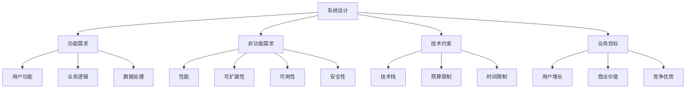
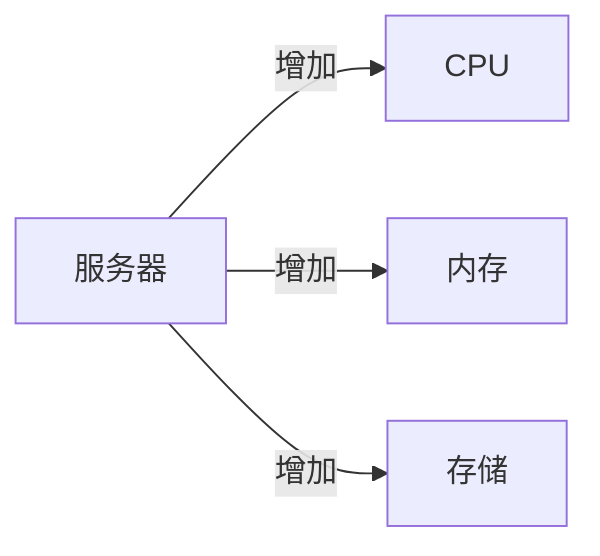
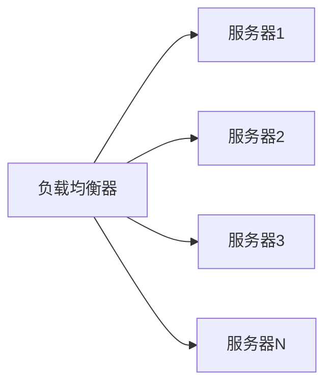
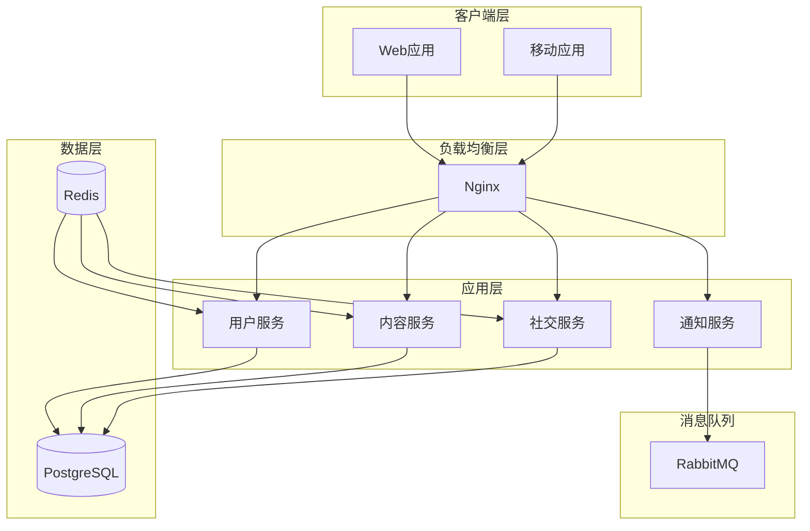

# Week 0 - 系统设计思维

## 本周内容

- **系统设计基础**：什么是系统设计、为什么重要
- **设计思维**：抽象化、模块化、分层设计
- **核心指标**：性能、可扩展性、可用性、可靠性
- **评估方法**：QPS、延迟、吞吐量、并发性
- **设计原则**：KISS、DRY、SOLID、YAGNI
- **实践项目**：系统需求分析和基础设计

## 系统设计概述

### 什么是系统设计？

**系统设计**是定义系统的架构、组件、模块、接口和数据的过程，以满足特定的功能和非功能需求。

#### 系统设计的核心要素



### 系统设计的重要性

1. **应对复杂度**：将复杂问题分解为可管理的模块
2. **确保质量**：满足性能、可用性、安全性等质量要求
3. **促进协作**：为团队提供清晰的架构蓝图
4. **支持演进**：为系统的未来发展奠定基础
5. **降低风险**：提前识别和解决潜在问题

## 系统设计思维模式

### 1. 抽象化思维

**抽象化**是忽略不重要的细节，专注于核心特征的过程。

```python
# 抽象化示例：从具体到抽象

# 具体：实现细节
class MySQLDatabase:
    def __init__(self, host, port, username, password):
        self.connection = mysql.connect(host, port, username, password)

    def execute_query(self, sql):
        return self.connection.execute(sql)

# 抽象：接口定义
class Database:
    def connect(self): pass
    def execute_query(self, sql): pass
    def close(self): pass

# 更高层次的抽象
class DataRepository:
    def __init__(self, database: Database):
        self.db = database

    def get_user(self, user_id): pass
    def save_user(self, user): pass
```

### 2. 分层设计

**分层设计**将系统按功能职责划分为不同的层次。

```
┌─────────────────────────────────┐
│           表示层 (UI)           │
├─────────────────────────────────┤
│           业务逻辑层            │
├─────────────────────────────────┤
│           数据访问层            │
├─────────────────────────────────┤
│           基础设施层            │
└─────────────────────────────────┘
```

### 3. 模块化设计

**模块化**是将系统分解为独立、可重用的组件。

```python
# 模块化设计示例
class UserModule:
    def __init__(self, user_repository, auth_service):
        self.user_repo = user_repository
        self.auth_service = auth_service

    def register_user(self, user_data):
        # 用户注册逻辑
        pass

    def authenticate_user(self, credentials):
        # 用户认证逻辑
        pass

class OrderModule:
    def __init__(self, order_repository, payment_service):
        self.order_repo = order_repository
        self.payment_service = payment_service

    def create_order(self, order_data):
        # 订单创建逻辑
        pass
```

## 系统性能指标

### 关键性能指标 (KPI)

#### 1. 响应时间 (Response Time)
- **定义**：从发送请求到收到响应的时间
- **衡量**：平均响应时间、百分位数 (P50, P95, P99)
- **目标**：Web应用 < 200ms, API < 100ms

```python
# 响应时间测量示例
import time
import statistics

response_times = []
for i in range(1000):
    start_time = time.time()
    # 模拟API调用
    result = api_call()
    end_time = time.time()
    response_times.append((end_time - start_time) * 1000)

# 计算百分位数
avg_time = statistics.mean(response_times)
p95_time = statistics.quantiles(response_times, n=20)[18]  # 95th percentile
p99_time = statistics.quantiles(response_times, n=100)[98]  # 99th percentile
```

#### 2. 吞吐量 (Throughput)
- **定义**：单位时间内处理的请求数量
- **衡量**：QPS (Queries Per Second), TPS (Transactions Per Second)
- **目标**：根据业务需求设定

#### 3. 并发用户数 (Concurrent Users)
- **定义**：同时使用系统的用户数量
- **衡量**：活跃连接数、并发会话数
- **目标**：支持预期的用户规模

#### 4. 错误率 (Error Rate)
- **定义**：失败请求占总请求的比例
- **衡量**：HTTP错误码、异常率
- **目标**：< 0.1% (99.9%成功率)

### 性能基准

| 应用类型 | 响应时间目标 | 吞吐量目标 | 可用性目标 |
|----------|-------------|-------------|-------------|
| 个人博客 | < 500ms     | 100 QPS     | 99%         |
| 电商网站 | < 200ms     | 10,000 QPS  | 99.9%       |
| 社交媒体 | < 100ms     | 100,000 QPS | 99.99%      |
| 支付系统 | < 50ms      | 1,000,000 QPS | 99.999%    |

## 系统可扩展性

### 可扩展性的类型

#### 1. 垂直扩展 (Scale Up)
- **定义**：增加单个服务器的资源 (CPU、内存、存储)
- **优点**：实现简单，无需修改代码
- **缺点**：成本高，有物理限制



#### 2. 水平扩展 (Scale Out)
- **定义**：增加服务器数量，分散负载
- **优点**：理论上无限扩展，成本效益高
- **缺点**：系统复杂度增加



### 扩展策略

#### 1. 无状态设计
```python
# 无状态服务示例
@app.route('/api/user/profile')
def get_user_profile():
    # 从请求中获取用户信息，不依赖服务器状态
    user_id = request.headers.get('User-ID')
    user_data = user_service.get_user(user_id)
    return jsonify(user_data)

# 有状态服务（不推荐）
@app.route('/api/user/profile')
def get_user_profile():
    # 依赖服务器会话状态
    if 'user_id' not in session:
        return jsonify({'error': 'Not authenticated'}), 401
    user_data = user_service.get_user(session['user_id'])
    return jsonify(user_data)
```

#### 2. 数据分区
```python
# 数据分片策略示例
class DatabaseSharding:
    def __init__(self, shard_count):
        self.shard_count = shard_count
        self.shards = [Database(f"shard_{i}") for i in range(shard_count)]

    def get_shard(self, key):
        # 使用一致性哈希选择分片
        shard_id = hash(key) % self.shard_count
        return self.shards[shard_id]

    def insert(self, key, value):
        shard = self.get_shard(key)
        return shard.insert(key, value)

    def get(self, key):
        shard = self.get_shard(key)
        return shard.get(key)
```

## 系统可用性

### 可用性计算

**可用性** = (MTBF - MTTR) / MTBF × 100%

其中：
- MTBF (Mean Time Between Failures)：平均故障间隔时间
- MTTR (Mean Time To Repair)：平均修复时间

### 可用性等级

| 可用性等级 | 年度停机时间 | 可用性百分比 | 典型应用 |
|------------|-------------|-------------|----------|
| 基础级     | 3.65 天     | 99%         | 个人博客 |
| 高可用     | 8.76 小时   | 99.9%       | 企业应用 |
| 极高可用   | 52.6 分钟   | 99.99%      | 电商系统 |
| 超高可用   | 5.26 分钟   | 99.999%     | 金融系统 |
| 容错系统   | 31.5 秒     | 99.9999%    | 关键基础设施 |

### 提高可用性的策略

#### 1. 冗余设计
```python
# 服务冗余示例
class RedundantService:
    def __init__(self, primary, secondary):
        self.primary = primary
        self.secondary = secondary

    def execute(self, request):
        try:
            # 首先尝试主服务
            return self.primary.execute(request)
        except Exception as e:
            # 主服务失败，切换到备用服务
            logger.warning(f"Primary service failed: {e}")
            return self.secondary.execute(request)
```

#### 2. 故障转移
```python
# 故障转移机制
class FailoverManager:
    def __init__(self, health_checker, service_pool):
        self.health_checker = health_checker
        self.service_pool = service_pool
        self.current_service = None

    def get_healthy_service(self):
        # 健康检查
        healthy_services = []
        for service in self.service_pool:
            if self.health_checker.is_healthy(service):
                healthy_services.append(service)

        if not healthy_services:
            raise ServiceUnavailableException("No healthy services available")

        # 使用轮询算法选择服务
        selected_service = healthy_services[
            len(healthy_services) % len(healthy_services)
        ]
        return selected_service
```

## 设计原则

### 1. KISS原则 (Keep It Simple, Stupid)
- **核心思想**：保持设计简单明了
- **应用**：避免过度设计，选择最简单的解决方案

```python
# 简单设计示例
def calculate_total(prices):
    """简单直接的计算总价"""
    return sum(prices)

# 过度设计示例（不推荐）
class PriceCalculator:
    def __init__(self, calculation_strategy):
        self.strategy = calculation_strategy

    def calculate_total(self, prices):
        if self.strategy == "simple":
            return sum(prices)
        elif self.strategy == "complex":
            # 复杂的计算逻辑
            pass
```

### 2. DRY原则 (Don't Repeat Yourself)
- **核心思想**：避免重复代码，提高可维护性
- **应用**：提取公共逻辑，创建可重用组件

```python
# 重复代码（不推荐）
def process_user_data(user_data):
    # 验证逻辑
    if not user_data.get('name'):
        raise ValueError("Name is required")
    if not user_data.get('email'):
        raise ValueError("Email is required")

    # 处理逻辑
    user_data['processed'] = True
    return user_data

def process_order_data(order_data):
    # 重复的验证逻辑
    if not order_data.get('user_id'):
        raise ValueError("User ID is required")
    if not order_data.get('items'):
        raise ValueError("Items are required")

    # 处理逻辑
    order_data['processed'] = True
    return order_data

# DRY原则应用
class DataProcessor:
    @staticmethod
    def validate_required_fields(data, required_fields):
        """通用验证逻辑"""
        for field in required_fields:
            if not data.get(field):
                raise ValueError(f"{field} is required")

    @staticmethod
    def mark_processed(data):
        """通用处理逻辑"""
        data['processed'] = True
        return data

def process_user_data(user_data):
    DataProcessor.validate_required_fields(user_data, ['name', 'email'])
    return DataProcessor.mark_processed(user_data)
```

### 3. SOLID原则

#### Single Responsibility Principle (SRP)
一个类应该只有一个改变的理由。

#### Open/Closed Principle (OCP)
对扩展开放，对修改关闭。

#### Liskov Substitution Principle (LSP)
子类必须能够替换其基类。

#### Interface Segregation Principle (ISP)
客户端不应该依赖它不需要的接口。

#### Dependency Inversion Principle (DIP)
依赖抽象而不是具体实现。

## 实践项目：系统需求分析

### 项目描述

为一个社交媒体应用设计基础架构，支持以下功能：
- 用户注册和登录
- 发布和查看动态
- 点赞和评论
- 个人资料管理

### 需求分析

#### 功能需求
1. **用户管理**：注册、登录、资料管理
2. **内容管理**：发布动态、查看动态、删除动态
3. **社交互动**：点赞、评论、关注
4. **通知系统**：新消息、互动提醒

#### 非功能需求
1. **性能**：页面加载时间 < 2秒
2. **可扩展性**：支持100万用户
3. **可用性**：99.9%的可用性
4. **安全性**：用户数据加密存储

### 系统设计练习

#### 步骤1：识别关键组件
```
社交媒体系统 = 用户服务 + 内容服务 + 社交服务 + 通知服务
```

#### 步骤2：估算资源需求
- **用户量**：100万用户
- **日活用户**：10万
- **峰值QPS**：1000 QPS
- **数据量**：每个用户平均100条动态

#### 步骤3：选择技术栈
- **前端**：React + TypeScript
- **后端**：Python + FastAPI
- **数据库**：PostgreSQL + Redis
- **消息队列**：RabbitMQ

#### 步骤4：绘制系统架构图



## 总结

本周我们建立了系统设计的思维框架，学习了：

1. **系统设计基础**：理解了系统设计的定义和重要性
2. **设计思维**：掌握了抽象化、分层、模块化等思维模式
3. **性能指标**：学习了响应时间、吞吐量、可用性等关键指标
4. **可扩展性**：理解了垂直扩展和水平扩展的概念
5. **设计原则**：掌握了KISS、DRY、SOLID等重要原则

## 课后练习

1. **思考题**：分析你常用的一个应用（如微信、抖音），尝试识别其主要组件和可能的架构设计。

2. **实践题**：为一个在线购物网站设计基础架构，考虑用户量、并发访问、数据存储等因素。

3. **扩展阅读**：《系统设计面试》第1-2章，《设计数据密集型应用》第1章。

## 下一周预告

Week 1我们将深入学习设计模式，包括创建型、结构型和行为型模式，并学习如何在实际项目中应用这些模式。

---

**记住**：好的系统设计不是一蹴而就的，需要在实践中不断迭代和优化！