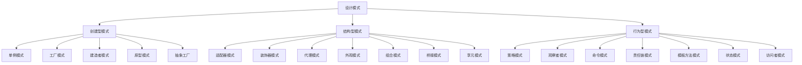

# Week 1 - 设计模式与软件架构

## 本周内容

- **设计模式基础**：什么是设计模式、为什么重要、分类
- **创建型模式**：单例、工厂、建造者、原型、抽象工厂
- **结构型模式**：适配器、装饰器、代理、外观、组合、桥接、享元
- **行为型模式**：策略、观察者、命令、责任链、模板方法、状态、访问者
- **软件架构模式**：分层架构、微服务、事件驱动、CQRS
- **实践项目**：设计模式应用案例分析

## 设计模式概述

### 什么是设计模式？

**设计模式**是软件开发中针对特定问题的可重用解决方案，是经过验证的最佳实践。

#### 设计模式的四个基本要素
1. **模式名称**：简洁的名称描述模式
2. **问题描述**：何时使用该模式
3. **解决方案**：设计的组成部分及其关系
4. **效果**：模式的优缺点和适用性

### 设计模式的重要性

1. **提高代码质量**：提供经过验证的解决方案
2. **增强可维护性**：标准化设计，便于理解和修改
3. **促进沟通**：使用通用语言描述设计
4. **减少错误**：避免常见的设计陷阱
5. **提升开发效率**：重用成熟的设计方案

### GoF设计模式分类



## 创建型模式

### 1. 单例模式 (Singleton Pattern)

**目的**：确保类只有一个实例，并提供全局访问点。

**应用场景**：
- 配置管理器
- 日志记录器
- 数据库连接池
- 缓存管理器

```python
# 单例模式实现
class Singleton:
    _instance = None

    def __new__(cls, *args, **kwargs):
        if cls._instance is None:
            cls._instance = super().__new__(cls)
        return cls._instance

    def __init__(self):
        # 初始化逻辑
        self.data = {}

# 使用示例
singleton1 = Singleton()
singleton2 = Singleton()

print(singleton1 is singleton2)  # True

# 线程安全的单例模式
import threading

class ThreadSafeSingleton:
    _instance = None
    _lock = threading.Lock()

    def __new__(cls, *args, **kwargs):
        if cls._instance is None:
            with cls._lock:
                if cls._instance is None:
                    cls._instance = super().__new__(cls)
        return cls._instance
```

### 2. 工厂模式 (Factory Pattern)

**目的**：定义创建对象的接口，让子类决定实例化哪个类。

**应用场景**：
- 对象创建逻辑复杂
- 需要根据参数创建不同类型对象
- 系统需要独立于产品的创建与组合

```python
# 工厂模式实现
from abc import ABC, abstractmethod

class Product(ABC):
    @abstractmethod
    def operation(self):
        pass

class ConcreteProductA(Product):
    def operation(self):
        return "ConcreteProductA operation"

class ConcreteProductB(Product):
    def operation(self):
        return "ConcreteProductB operation"

class Creator(ABC):
    @abstractmethod
    def factory_method(self):
        pass

    def some_operation(self):
        product = self.factory_method()
        return product.operation()

class ConcreteCreatorA(Creator):
    def factory_method(self):
        return ConcreteProductA()

class ConcreteCreatorB(Creator):
    def factory_method(self):
        return ConcreteProductB()

# 使用示例
creator_a = ConcreteCreatorA()
print(creator_a.some_operation())  # ConcreteProductA operation

creator_b = ConcreteCreatorB()
print(creator_b.some_operation())  # ConcreteProductB operation
```

### 3. 建造者模式 (Builder Pattern)

**目的**：将复杂对象的构建与其表示分离，使得同样的构建过程可以创建不同的表示。

**应用场景**：
- 需要创建具有多个组成部分的复杂对象
- 需要支持对象的不同表示形式
- 创建对象的算法独立于其组成部分

```python
# 建造者模式实现
class Computer:
    def __init__(self):
        self.cpu = None
        self.memory = None
        self.storage = None
        self.gpu = None

    def __str__(self):
        return f"Computer(CPU={self.cpu}, Memory={self.memory}, Storage={self.storage}, GPU={self.gpu})"

class ComputerBuilder:
    def __init__(self):
        self.computer = Computer()

    def add_cpu(self, cpu):
        self.computer.cpu = cpu
        return self

    def add_memory(self, memory):
        self.computer.memory = memory
        return self

    def add_storage(self, storage):
        self.computer.storage = storage
        return self

    def add_gpu(self, gpu):
        self.computer.gpu = gpu
        return self

    def build(self):
        return self.computer

# 使用示例
builder = ComputerBuilder()
computer = (builder
           .add_cpu("Intel i7")
           .add_memory("16GB")
           .add_storage("512GB SSD")
           .add_gpu("NVIDIA RTX 3080")
           .build())

print(computer)
```

## 结构型模式

### 1. 适配器模式 (Adapter Pattern)

**目的**：将一个类的接口转换成客户希望的另一个接口，使原本接口不兼容的类可以协同工作。

**应用场景**：
- 需要使用现有的类，但其接口与需要的接口不匹配
- 想要创建一个可以复用的类，该类可以与其他不相关的类或不可预见的类协同工作
- 需要使用几个现有的子类，但通过对每个子类进行子类化来适配它们的接口是不现实的

```python
# 适配器模式实现
class Target:
    def request(self):
        return "Target: Default target's behavior"

class Adaptee:
    def specific_request(self):
        return ".eetpadA eht fo roivaheb laicepS"

class Adapter(Target):
    def __init__(self, adaptee):
        self.adaptee = adaptee

    def request(self):
        return f"Adapter: (TRANSLATED) {self.adaptee.specific_request()[::-1]}"

# 使用示例
print("Client: I can work just fine with the Target objects:")
target = Target()
print(target.request())

adaptee = Adaptee()
print("Client: The Adaptee class has a weird interface. See, I don't understand it:")
print(f"Adaptee: {adaptee.specific_request()}")

print("Client: But I can work with it via the Adapter:")
adapter = Adapter(adaptee)
print(adapter.request())
```

### 2. 装饰器模式 (Decorator Pattern)

**目的**：动态地给对象添加一些额外的职责，就增加功能来说，装饰器模式比生成子类更为灵活。

**应用场景**：
- 需要扩展一个类的功能，或给一个类添加附加职责
- 需要动态地给一个对象增加功能，这些功能可以再动态地被撤销
- 需要增加由一些基本功能的排列组合而产生的非常大量的功能

```python
# 装饰器模式实现
class Component:
    def operation(self):
        pass

class ConcreteComponent(Component):
    def operation(self):
        return "ConcreteComponent"

class Decorator(Component):
    def __init__(self, component):
        self._component = component

    def operation(self):
        return self._component.operation()

class ConcreteDecoratorA(Decorator):
    def operation(self):
        return f"ConcreteDecoratorA({self._component.operation()})"

class ConcreteDecoratorB(Decorator):
    def operation(self):
        return f"ConcreteDecoratorB({self._component.operation()})"

# 使用示例
simple = ConcreteComponent()
print("Simple component:", simple.operation())

decorated_a = ConcreteDecoratorA(simple)
print("Decorated A:", decorated_a.operation())

decorated_b = ConcreteDecoratorB(decorated_a)
print("Decorated B:", decorated_b.operation())
```

### 3. 代理模式 (Proxy Pattern)

**目的**：为其他对象提供一种代理以控制对这个对象的访问。

**应用场景**：
- 远程代理：为一个位于不同的地址空间的对象提供一个本地的代表对象
- 虚拟代理：根据需要创建开销很大的对象
- 保护代理：控制对原始对象的访问，用于对象应该有不同的访问权限的时候
- 智能引用：取代了简单的指针，它在访问对象时执行一些附加操作

```python
# 代理模式实现
class Subject:
    def request(self):
        pass

class RealSubject(Subject):
    def request(self):
        return "RealSubject: Handling request."

class Proxy(Subject):
    def __init__(self):
        self._real_subject = None

    def request(self):
        if self._real_subject is None:
            print("Proxy: Instantiating RealSubject")
            self._real_subject = RealSubject()

        return f"Proxy: (Before) {self._real_subject.request()} (After)"

# 使用示例
proxy = Proxy()
print(proxy.request())
print(proxy.request())
```

## 行为型模式

### 1. 策略模式 (Strategy Pattern)

**目的**：定义一系列的算法，把它们一个个封装起来，并且使它们可相互替换。

**应用场景**：
- 多个类只在算法上稍有不同
- 算法需要自由切换
- 算法需要屏蔽实现细节
- 一个类定义了多种行为，这些行为在这个类的操作中以多个条件语句的形式出现

```python
# 策略模式实现
from abc import ABC, abstractmethod

class Strategy(ABC):
    @abstractmethod
    def execute(self, a, b):
        pass

class AddStrategy(Strategy):
    def execute(self, a, b):
        return a + b

class SubtractStrategy(Strategy):
    def execute(self, a, b):
        return a - b

class MultiplyStrategy(Strategy):
    def execute(self, a, b):
        return a * b

class Context:
    def __init__(self, strategy):
        self._strategy = strategy

    def set_strategy(self, strategy):
        self._strategy = strategy

    def execute_strategy(self, a, b):
        return self._strategy.execute(a, b)

# 使用示例
context = Context(AddStrategy())
print("10 + 5 =", context.execute_strategy(10, 5))

context.set_strategy(SubtractStrategy())
print("10 - 5 =", context.execute_strategy(10, 5))

context.set_strategy(MultiplyStrategy())
print("10 * 5 =", context.execute_strategy(10, 5))
```

### 2. 观察者模式 (Observer Pattern)

**目的**：定义对象间的一种一对多依赖关系，使得每当一个对象状态发生改变时，其相关依赖对象皆得到通知并被自动更新。

**应用场景**：
- 当一个抽象模型有两个方面，其中一个方面依赖于另一方面。将这二者封装在独立的对象中以使它们可以各自独立地改变和复用
- 当对一个对象的改变需要同时改变其他对象的时候
- 当一个对象必须通知其他对象，而它又不能假定其他对象是谁

```python
# 观察者模式实现
from abc import ABC, abstractmethod

class Observer(ABC):
    @abstractmethod
    def update(self, subject):
        pass

class Subject(ABC):
    @abstractmethod
    def attach(self, observer):
        pass

    @abstractmethod
    def detach(self, observer):
        pass

    @abstractmethod
    def notify(self):
        pass

class ConcreteSubject(Subject):
    def __init__(self):
        self._observers = []
        self._state = None

    def attach(self, observer):
        self._observers.append(observer)

    def detach(self, observer):
        self._observers.remove(observer)

    def notify(self):
        for observer in self._observers:
            observer.update(self)

    def some_business_logic(self):
        print("\nSubject: I'm doing something important.")
        self._state = random.randrange(0, 10)
        print(f"Subject: My state has just changed to: {self._state}")
        self.notify()

class ConcreteObserverA(Observer):
    def update(self, subject):
        if subject._state < 3:
            print("ConcreteObserverA: Reacted to the event")

class ConcreteObserverB(Observer):
    def update(self, subject):
        if subject._state >= 3:
            print("ConcreteObserverB: Reacted to the event")

# 使用示例
import random

subject = ConcreteSubject()

observer_a = ConcreteObserverA()
observer_b = ConcreteObserverB()

subject.attach(observer_a)
subject.attach(observer_b)

subject.some_business_logic()
subject.some_business_logic()

subject.detach(observer_a)
subject.some_business_logic()
```

### 3. 命令模式 (Command Pattern)

**目的**：将一个请求封装为一个对象，从而使你可用不同的请求对客户进行参数化，对请求排队或记录请求日志，以及支持可撤销的操作。

**应用场景**：
- 需要将请求调用者和请求接收者解耦
- 需要在不同的时间指定请求、将请求排队
- 需要支持取消/重做操作
- 需要支持事务操作

```python
# 命令模式实现
from abc import ABC, abstractmethod

class Command(ABC):
    @abstractmethod
    def execute(self):
        pass

    @abstractmethod
    def undo(self):
        pass

class Light:
    def turn_on(self):
        print("Light is ON")

    def turn_off(self):
        print("Light is OFF")

class TurnOnCommand(Command):
    def __init__(self, light):
        self.light = light

    def execute(self):
        self.light.turn_on()

    def undo(self):
        self.light.turn_off()

class TurnOffCommand(Command):
    def __init__(self, light):
        self.light = light

    def execute(self):
        self.light.turn_off()

    def undo(self):
        self.light.turn_on()

class RemoteControl:
    def __init__(self):
        self.command = None
        self.history = []

    def set_command(self, command):
        self.command = command

    def press_button(self):
        if self.command:
            self.command.execute()
            self.history.append(self.command)

    def press_undo(self):
        if self.history:
            last_command = self.history.pop()
            last_command.undo()

# 使用示例
light = Light()
remote = RemoteControl()

turn_on = TurnOnCommand(light)
turn_off = TurnOffCommand(light)

remote.set_command(turn_on)
remote.press_button()

remote.set_command(turn_off)
remote.press_button()

remote.press_undo()
remote.press_undo()
```

## 软件架构模式

### 1. 分层架构 (Layered Architecture)

**特点**：
- 将系统按功能职责分为多个层次
- 每层只能与相邻层交互
- 遵循依赖倒置原则

```python
# 分层架构示例
class PresentationLayer:
    def __init__(self, business_logic):
        self.business_logic = business_logic

    def handle_request(self, request):
        # 处理用户界面逻辑
        processed_request = self.process_user_input(request)
        response = self.business_logic.process(processed_request)
        return self.format_response(response)

class BusinessLogicLayer:
    def __init__(self, data_access):
        self.data_access = data_access

    def process(self, request):
        # 处理业务逻辑
        data = self.data_access.get_data(request)
        return self.apply_business_rules(data)

class DataAccessLayer:
    def get_data(self, request):
        # 数据访问逻辑
        return self.query_database(request)

    def query_database(self, request):
        # 实际数据库查询
        pass
```

### 2. 微服务架构 (Microservices Architecture)

**特点**：
- 将应用拆分为小型、独立的服务
- 每个服务专注于单一业务功能
- 服务间通过轻量级协议通信

```python
# 微服务架构示例
class UserService:
    def __init__(self, user_repository):
        self.user_repository = user_repository

    def create_user(self, user_data):
        # 用户创建逻辑
        return self.user_repository.save(user_data)

class OrderService:
    def __init__(self, order_repository, user_service):
        self.order_repository = order_repository
        self.user_service = user_service

    def create_order(self, order_data):
        # 订单创建逻辑
        user = self.user_service.get_user(order_data['user_id'])
        return self.order_repository.save(order_data)

class NotificationService:
    def send_notification(self, user_id, message):
        # 通知发送逻辑
        pass

# API Gateway
class APIGateway:
    def __init__(self):
        self.user_service = UserService()
        self.order_service = OrderService()
        self.notification_service = NotificationService()

    def route_request(self, request):
        if request['path'] == '/users':
            return self.user_service.handle_request(request)
        elif request['path'] == '/orders':
            return self.order_service.handle_request(request)
        elif request['path'] == '/notifications':
            return self.notification_service.handle_request(request)
```

### 3. 事件驱动架构 (Event-Driven Architecture)

**特点**：
- 基于事件的异步通信
- 松耦合的组件设计
- 高可扩展性和响应性

```python
# 事件驱动架构示例
from abc import ABC, abstractmethod
import asyncio

class Event(ABC):
    pass

class UserCreatedEvent(Event):
    def __init__(self, user_id, user_data):
        self.user_id = user_id
        self.user_data = user_data

class EventHandler(ABC):
    @abstractmethod
    async def handle(self, event):
        pass

class WelcomeEmailHandler(EventHandler):
    async def handle(self, event):
        # 发送欢迎邮件
        print(f"Sending welcome email to user {event.user_id}")

class UserAnalyticsHandler(EventHandler):
    async def handle(self, event):
        # 更新用户分析数据
        print(f"Updating analytics for user {event.user_id}")

class EventBus:
    def __init__(self):
        self.handlers = {}

    def register_handler(self, event_type, handler):
        if event_type not in self.handlers:
            self.handlers[event_type] = []
        self.handlers[event_type].append(handler)

    async def publish(self, event):
        event_type = type(event)
        if event_type in self.handlers:
            for handler in self.handlers[event_type]:
                await handler.handle(event)

# 使用示例
async def main():
    event_bus = EventBus()

    # 注册事件处理器
    event_bus.register_handler(UserCreatedEvent, WelcomeEmailHandler())
    event_bus.register_handler(UserCreatedEvent, UserAnalyticsHandler())

    # 发布事件
    event = UserCreatedEvent(1, {"name": "John Doe", "email": "john@example.com"})
    await event_bus.publish(event)

asyncio.run(main())
```

## 实践项目：电商平台设计模式应用

### 项目背景

设计一个电商平台，应用本周学习的设计模式来优化系统架构。

### 需求分析

1. **用户管理**：注册、登录、权限控制
2. **商品管理**：商品发布、库存管理、价格策略
3. **订单处理**：下单、支付、发货、取消
4. **通知系统**：订单状态变更、促销活动

### 设计模式应用

#### 1. 单例模式 - 配置管理
```python
class ConfigManager:
    _instance = None

    def __new__(cls):
        if cls._instance is None:
            cls._instance = super().__new__(cls)
            cls._instance._config = {}
        return cls._instance

    def get_config(self, key):
        return self._config.get(key)

    def set_config(self, key, value):
        self._config[key] = value
```

#### 2. 工厂模式 - 支付方式
```python
class PaymentMethod(ABC):
    @abstractmethod
    def process_payment(self, amount):
        pass

class CreditCardPayment(PaymentMethod):
    def process_payment(self, amount):
        return f"Processed credit card payment: ${amount}"

class PayPalPayment(PaymentMethod):
    def process_payment(self, amount):
        return f"Processed PayPal payment: ${amount}"

class PaymentFactory:
    @staticmethod
    def create_payment(method_type):
        if method_type == "credit_card":
            return CreditCardPayment()
        elif method_type == "paypal":
            return PayPalPayment()
        else:
            raise ValueError(f"Unknown payment method: {method_type}")
```

#### 3. 策略模式 - 促销策略
```python
class PromotionStrategy(ABC):
    @abstractmethod
    def calculate_discount(self, order_amount):
        pass

class NoDiscountStrategy(PromotionStrategy):
    def calculate_discount(self, order_amount):
        return 0

class PercentageDiscountStrategy(PromotionStrategy):
    def __init__(self, percentage):
        self.percentage = percentage

    def calculate_discount(self, order_amount):
        return order_amount * (self.percentage / 100)

class FreeShippingStrategy(PromotionStrategy):
    def __init__(self, shipping_cost):
        self.shipping_cost = shipping_cost

    def calculate_discount(self, order_amount):
        return self.shipping_cost

class Order:
    def __init__(self, amount, promotion_strategy):
        self.amount = amount
        self.promotion_strategy = promotion_strategy

    def get_final_amount(self):
        discount = self.promotion_strategy.calculate_discount(self.amount)
        return self.amount - discount
```

#### 4. 观察者模式 - 订单状态通知
```python
class OrderStatusObserver(ABC):
    @abstractmethod
    def on_status_change(self, order, old_status, new_status):
        pass

class EmailNotificationObserver(OrderStatusObserver):
    def on_status_change(self, order, old_status, new_status):
        print(f"Email: Order {order.id} status changed from {old_status} to {new_status}")

class SMSNotificationObserver(OrderStatusObserver):
    def on_status_change(self, order, old_status, new_status):
        print(f"SMS: Order {order.id} status changed from {old_status} to {new_status}")

class Order:
    def __init__(self, order_id):
        self.id = order_id
        self.status = "pending"
        self.observers = []

    def add_observer(self, observer):
        self.observers.append(observer)

    def set_status(self, new_status):
        old_status = self.status
        self.status = new_status
        self._notify_observers(old_status, new_status)

    def _notify_observers(self, old_status, new_status):
        for observer in self.observers:
            observer.on_status_change(self, old_status, new_status)
```

## 总结

本周我们深入学习了设计模式和软件架构：

1. **设计模式基础**：理解了设计模式的定义、重要性和分类
2. **创建型模式**：掌握了单例、工厂、建造者等模式的实现和应用
3. **结构型模式**：学习了适配器、装饰器、代理等模式的使用场景
4. **行为型模式**：理解了策略、观察者、命令等模式的原理
5. **软件架构模式**：了解了分层架构、微服务、事件驱动等架构模式

## 课后练习

1. **实践题**：选择一个你熟悉的应用，分析其中可能使用的设计模式，并尝试用代码实现。

2. **设计题**：为一个文件压缩工具设计架构，应用至少3种不同的设计模式。

3. **扩展阅读**：《设计模式：可复用面向对象软件的基础》相关章节，《Head First设计模式》。

## 下一周预告

Week 2我们将学习数据存储与数据库设计，包括关系型数据库、NoSQL数据库、数据建模和分片策略等内容。

---

**记住**：设计模式不是银弹，需要在合适的场景选择合适的模式，避免过度设计！