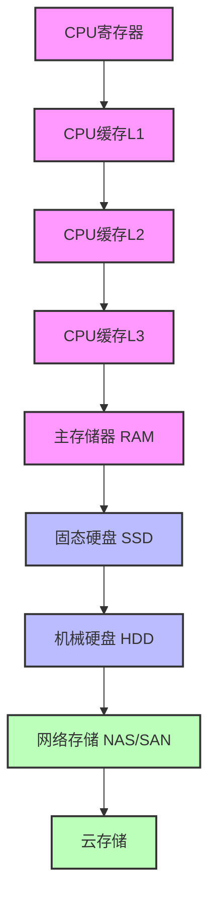
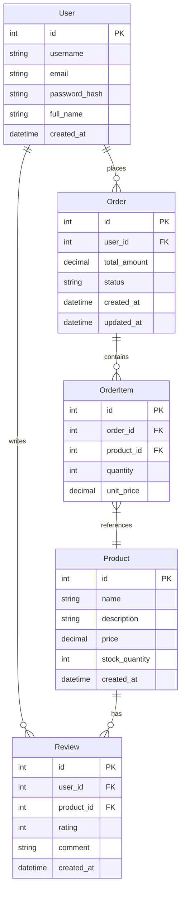
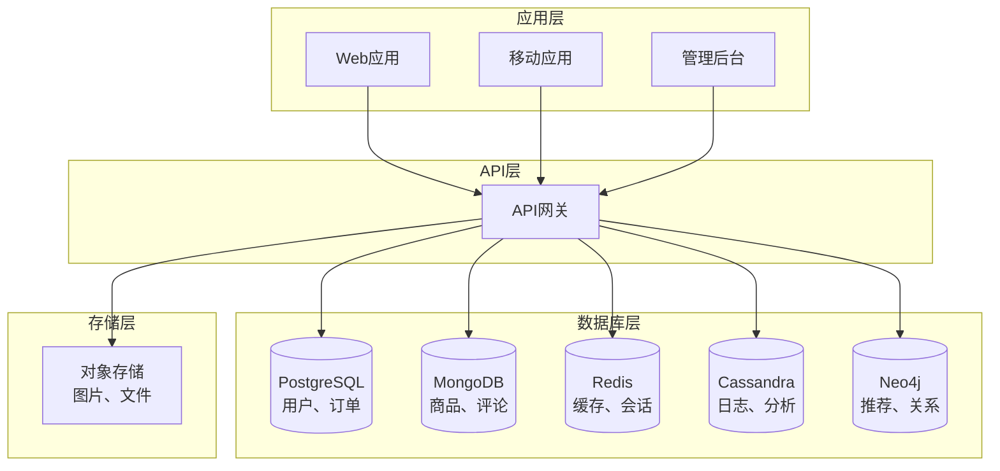

# Week 2 - 数据存储与数据库设计

## 本周内容

- **数据存储基础**：存储层次结构、数据类型、访问模式
- **关系型数据库**：SQL、ACID、索引、事务、优化
- **NoSQL数据库**：文档型、键值型、列族型、图数据库
- **数据建模**：ER模型、数据范式、反范式化
- **分片策略**：水平分片、垂直分片、一致性哈希
- **实践项目**：多数据库架构设计和优化

## 数据存储基础

### 存储层次结构

现代计算机系统中的存储层次结构：



### 存储性能对比

| 存储类型 | 容量 | 访问速度 | 成本/GB | 持久性 | 用途 |
|----------|------|----------|---------|--------|------|
| CPU寄存器 | 几KB | <1ns | 极高 | 否 | 临时计算 |
| CPU缓存 | KB-MB | 1-10ns | 极高 | 否 | 数据缓存 |
| RAM | GB-TB | 10-100ns | 高 | 否 | 程序运行 |
| SSD | GB-TB | 10-100μs | 中 | 是 | 系统盘 |
| HDD | TB-PB | 1-10ms | 低 | 是 | 数据存储 |
| 网络存储 | PB+ | 10-100ms | 很低 | 是 | 备份归档 |

### 数据访问模式

#### 1. 随机访问
```python
# 随机访问示例
def random_access_demo():
    import random
    data = list(range(1000000))  # 100万个元素

    # 随机访问不同位置的元素
    for i in range(1000):
        index = random.randint(0, len(data) - 1)
        value = data[index]  # O(1)时间复杂度
```

#### 2. 顺序访问
```python
# 顺序访问示例
def sequential_access_demo():
    data = list(range(1000000))

    # 顺序访问所有元素
    for value in data:  # O(n)时间复杂度
        process(value)
```

#### 3. 范围访问
```python
# 范围访问示例
def range_access_demo():
    data = sorted(list(range(1000000)))

    # 访问特定范围的元素
    start, end = 1000, 2000
    for i in range(start, end):
        value = data[i]
```

## 关系型数据库

### SQL基础

#### 核心概念
- **表（Table）**：数据的结构化集合
- **行（Row）**：表中的单条记录
- **列（Column）**：表中的字段
- **主键（Primary Key）**：唯一标识行的字段
- **外键（Foreign Key）**：关联其他表的字段

#### SQL语句示例
```sql
-- 创建表
CREATE TABLE users (
    id INT PRIMARY KEY AUTO_INCREMENT,
    username VARCHAR(50) NOT NULL UNIQUE,
    email VARCHAR(100) NOT NULL UNIQUE,
    password_hash VARCHAR(255) NOT NULL,
    full_name VARCHAR(100),
    created_at TIMESTAMP DEFAULT CURRENT_TIMESTAMP,
    updated_at TIMESTAMP DEFAULT CURRENT_TIMESTAMP ON UPDATE CURRENT_TIMESTAMP
);

-- 插入数据
INSERT INTO users (username, email, password_hash, full_name)
VALUES ('john_doe', 'john@example.com', 'hashed_password', 'John Doe');

-- 查询数据
SELECT id, username, email, full_name
FROM users
WHERE username = 'john_doe' AND created_at > '2024-01-01';

-- 更新数据
UPDATE users
SET full_name = 'John Smith', updated_at = CURRENT_TIMESTAMP
WHERE id = 1;

-- 删除数据
DELETE FROM users WHERE id = 1;

-- 连接查询
SELECT u.username, o.order_id, o.total_amount
FROM users u
JOIN orders o ON u.id = o.user_id
WHERE u.id = 1;
```

### ACID特性

#### 原子性（Atomicity）
事务中的操作要么全部完成，要么全部不完成。

```python
# 原子性示例
def transfer_money(from_account, to_account, amount):
    try:
        # 开始事务
        db.begin_transaction()

        # 扣款
        db.execute("UPDATE accounts SET balance = balance - ? WHERE id = ?",
                 [amount, from_account])

        # 加款
        db.execute("UPDATE accounts SET balance = balance + ? WHERE id = ?",
                 [amount, to_account])

        # 提交事务
        db.commit()

    except Exception as e:
        # 回滚事务
        db.rollback()
        raise e
```

#### 一致性（Consistency）
事务必须使数据库从一个一致性状态转换到另一个一致性状态。

```python
# 一致性约束示例
def create_order(user_id, items):
    # 检查用户信用额度
    user = db.query("SELECT credit_limit FROM users WHERE id = ?", [user_id])
    total_amount = sum(item['price'] * item['quantity'] for item in items)

    if total_amount > user['credit_limit']:
        raise Exception("Insufficient credit limit")

    # 创建订单
    order_id = db.insert("INSERT INTO orders (user_id, total_amount) VALUES (?, ?)",
                        [user_id, total_amount])

    return order_id
```

#### 隔离性（Isolation）
并发事务的执行相互隔离，互不干扰。

```python
# 隔离级别示例
def demonstrate_isolation():
    import threading
    import time

    def transaction1():
        db.set_isolation_level("READ_COMMITTED")
        db.begin()

        # 读取数据
        balance = db.query("SELECT balance FROM accounts WHERE id = 1")[0]['balance']
        print(f"Transaction 1 read balance: {balance}")

        time.sleep(1)  # 等待事务2

        # 再次读取数据
        balance = db.query("SELECT balance FROM accounts WHERE id = 1")[0]['balance']
        print(f"Transaction 1 read balance again: {balance}")

        db.commit()

    def transaction2():
        time.sleep(0.5)  # 确保事务1先开始
        db.set_isolation_level("READ_COMMITTED")
        db.begin()

        # 修改数据
        db.execute("UPDATE accounts SET balance = balance + 100 WHERE id = 1")
        db.commit()
        print("Transaction 2 committed")

    # 并发执行
    t1 = threading.Thread(target=transaction1)
    t2 = threading.Thread(target=transaction2)

    t1.start()
    t2.start()

    t1.join()
    t2.join()
```

#### 持久性（Durability）
一旦事务提交，其结果就是永久性的。

```python
# 持久性保证示例
def ensure_durability():
    try:
        db.begin()

        # 执行写操作
        db.execute("INSERT INTO orders (user_id, total_amount) VALUES (?, ?)",
                 [1, 100.50])

        # 确保写入磁盘
        db.sync_to_disk()

        # 提交事务
        db.commit()

        # 记录日志
        log_operation("order_created", {"order_id": db.last_insert_id()})

    except Exception as e:
        db.rollback()
        # 检查数据是否真的没有写入
        count = db.query("SELECT COUNT(*) FROM orders WHERE user_id = ?")[0]['count']
        print(f"Orders count after rollback: {count}")
```

### 数据库索引

#### 索引类型

```python
# 索引类型示例
def create_indexes():
    # 主键索引（自动创建）
    db.execute("CREATE TABLE users (id INT PRIMARY KEY, name VARCHAR(100))")

    # 唯一索引
    db.execute("CREATE UNIQUE INDEX idx_users_email ON users(email)")

    # 复合索引
    db.execute("CREATE INDEX idx_users_name_email ON users(name, email)")

    # 全文索引
    db.execute("CREATE FULLTEXT INDEX idx_users_profile ON users(profile_text)")

    # 空间索引
    db.execute("CREATE SPATIAL INDEX idx_users_location ON users(location)")
```

#### 索引优化策略

```python
# 索引优化示例
def optimize_queries():
    # 创建合适的索引
    db.execute("CREATE INDEX idx_orders_user_date ON orders(user_id, created_at)")

    # 避免索引失效的情况
    # 错误：在索引列上使用函数
    bad_query = "SELECT * FROM users WHERE UPPER(name) = 'JOHN'"

    # 正确：使用索引列
    good_query = "SELECT * FROM users WHERE name = 'john'"

    # 使用覆盖索引
    db.execute("CREATE INDEX idx_orders_cover ON orders(user_id, status, created_at)")
    covered_query = "SELECT user_id, status, created_at FROM orders WHERE user_id = 1"

    # 定期维护索引
    db.execute("ANALYZE TABLE orders")
    db.execute("OPTIMIZE TABLE orders")
```

### 查询优化

#### 执行计划分析
```python
# 执行计划分析示例
def analyze_query_performance():
    # 获取执行计划
    plan = db.explain("SELECT * FROM orders WHERE user_id = 1 AND created_at > '2024-01-01'")

    # 分析执行计划
    for step in plan:
        print(f"Type: {step['type']}")
        print(f"Table: {step['table']}")
        print(f"Rows: {step['rows']}")
        print(f"Key: {step.get('key', 'None')}")
        print("-" * 40)
```

#### 查询优化技巧
```python
# 查询优化示例
def optimized_queries():
    # 避免SELECT *
    bad_query = "SELECT * FROM users WHERE id = 1"
    good_query = "SELECT id, name, email FROM users WHERE id = 1"

    # 使用LIMIT限制结果集
    db.execute("SELECT * FROM orders WHERE user_id = 1 LIMIT 100")

    # 使用JOIN替代子查询
    # bad: SELECT * FROM orders WHERE user_id IN (SELECT id FROM users WHERE status = 'active')
    # good: SELECT o.* FROM orders o JOIN users u ON o.user_id = u.id WHERE u.status = 'active'

    # 使用批量插入
    db.execute_batch("INSERT INTO users (name, email) VALUES (?, ?)",
                    [('user1', 'email1'), ('user2', 'email2')])
```

## NoSQL数据库

### NoSQL类型和适用场景

#### 1. 键值存储（Key-Value）
- **特点**：简单的键值对存储
- **适用场景**：缓存、会话管理、配置存储
- **代表产品**：Redis, Memcached, Amazon DynamoDB

```python
# Redis键值存储示例
import redis

r = redis.Redis(host='localhost', port=6379, db=0)

# 基本操作
r.set('user:1:name', 'John Doe')
r.set('user:1:email', 'john@example.com')
r.set('user:1:last_login', '2024-01-01')

# 获取数据
name = r.get('user:1:name')
print(f"User name: {name}")

# 批量操作
pipe = r.pipeline()
pipe.set('session:1', 'user_data')
pipe.expire('session:1', 3600)  # 1小时过期
pipe.execute()

# 列表操作
r.lpush('user:1:notifications', 'Welcome')
r.lpush('user:1:notifications', 'New message')
notifications = r.lrange('user:1:notifications', 0, -1)
```

#### 2. 文档数据库（Document）
- **特点**：存储JSON/BSON格式的文档
- **适用场景**：内容管理、用户配置、产品目录
- **代表产品**：MongoDB, CouchDB, Amazon DocumentDB

```python
# MongoDB文档存储示例
from pymongo import MongoClient
from bson import ObjectId
import datetime

client = MongoClient('mongodb://localhost:27017/')
db = client['social_media']
users = db['users']
posts = db['posts']

# 插入用户文档
user = {
    "username": "john_doe",
    "email": "john@example.com",
    "profile": {
        "first_name": "John",
        "last_name": "Doe",
        "age": 30,
        "interests": ["programming", "music", "travel"]
    },
    "settings": {
        "privacy": "public",
        "notifications": True,
        "language": "en"
    },
    "created_at": datetime.datetime.utcnow()
}

user_id = users.insert_one(user).inserted_id

# 插入帖子文档
post = {
    "user_id": user_id,
    "content": "Hello, world!",
    "likes": 0,
    "comments": [],
    "tags": ["hello", "world"],
    "created_at": datetime.datetime.utcnow()
}

post_id = posts.insert_one(post).inserted_id

# 复杂查询
# 查找特定年龄段的用户
active_users = users.find({
    "profile.age": {"$gte": 25, "$lte": 35},
    "settings.notifications": True
})

# 聚合查询
popular_posts = posts.aggregate([
    {"$match": {"likes": {"$gt": 10}}},
    {"$group": {
        "_id": "$user_id",
        "total_likes": {"$sum": "$likes"},
        "post_count": {"$sum": 1}
    }},
    {"$sort": {"total_likes": -1}}
])
```

#### 3. 列族数据库（Column Family）
- **特点**：按列族存储数据，适合大规模数据
- **适用场景**：日志分析、时序数据、大数据存储
- **代表产品**：Apache Cassandra, HBase, Amazon DynamoDB

```python
# Cassandra列族存储示例
from cassandra.cluster import Cluster
from cassandra.query import SimpleStatement

cluster = Cluster(['localhost'])
session = cluster.connect()

# 创建键空间
session.execute("""
    CREATE KEYSPACE IF NOT EXISTS social_media
    WITH replication = {'class': 'SimpleStrategy', 'replication_factor': 1}
""")

session.set_keyspace('social_media')

# 创建列族（表）
session.execute("""
    CREATE TABLE IF NOT EXISTS user_activity (
        user_id UUID,
        activity_type TEXT,
        timestamp TIMESTAMP,
        data TEXT,
        PRIMARY KEY (user_id, timestamp)
    ) WITH CLUSTERING ORDER BY (timestamp DESC)
""")

# 插入数据
prepared = session.prepare("""
    INSERT INTO user_activity (user_id, activity_type, timestamp, data)
    VALUES (?, ?, ?, ?)
""")

import uuid
import datetime

activity_data = [
    (uuid.uuid4(), 'login', datetime.datetime.utcnow(), 'Logged in from mobile'),
    (uuid.uuid4(), 'post', datetime.datetime.utcnow(), 'Created new post'),
    (uuid.uuid4(), 'like', datetime.datetime.utcnow(), 'Liked post 123')
]

for user_id, activity_type, timestamp, data in activity_data:
    session.execute(prepared, (user_id, activity_type, timestamp, data))

# 查询用户活动
rows = session.execute(
    "SELECT * FROM user_activity WHERE user_id = ? LIMIT 10",
    [activity_data[0][0]]
)

for row in rows:
    print(f"{row.activity_type}: {row.data} at {row.timestamp}")
```

#### 4. 图数据库（Graph）
- **特点**：存储节点和边的关系，适合复杂关系查询
- **适用场景**：社交网络、推荐系统、知识图谱
- **代表产品**：Neo4j, Amazon Neptune, ArangoDB

```python
# Neo4j图数据库示例
from neo4j import GraphDatabase

driver = GraphDatabase.driver("bolt://localhost:7687", auth=("neo4j", "password"))

def create_social_network(tx):
    # 创建用户节点
    tx.run("CREATE (alice:User {name: 'Alice', age: 30})")
    tx.run("CREATE (bob:User {name: 'Bob', age: 25})")
    tx.run("CREATE (charlie:User {name: 'Charlie', age: 35})")

    # 创建关注关系
    tx.run("MATCH (alice:User {name: 'Alice'}), (bob:User {name: 'Bob'}) "
           "CREATE (alice)-[:FOLLOWS]->(bob)")

    tx.run("MATCH (bob:User {name: 'Bob'}), (charlie:User {name: 'Charlie'}) "
           "CREATE (bob)-[:FOLLOWS]->(charlie)")

    # 创建帖子节点
    tx.run("CREATE (post1:Post {title: 'Hello World', content: 'My first post'})")
    tx.run("MATCH (alice:User {name: 'Alice'}), (post1:Post {title: 'Hello World'}) "
           "CREATE (alice)-[:POSTED]->(post1)")

def find_mutual_friends(tx, user_name):
    result = tx.run(
        "MATCH (user:User {name: $name})-[:FOLLOWS]->friend-[:FOLLOWS]->mutual_friend "
        "WHERE user <> mutual_friend "
        "RETURN DISTINCT mutual_friend.name AS mutual_friend_name",
        name=user_name
    )
    return [record["mutual_friend_name"] for record in result]

def recommend_posts(tx, user_name):
    result = tx.run(
        "MATCH (user:User {name: $name})-[:FOLLOWS]->friend-[:POSTED]->post "
        "WHERE NOT (user)-[:POSTED]->post "
        "RETURN post.title AS post_title, friend.name AS friend_name "
        "ORDER BY post.created_at DESC "
        "LIMIT 5",
        name=user_name
    )
    return [(record["post_title"], record["friend_name"]) for record in result]

# 执行操作
with driver.session() as session:
    session.execute_write(create_social_network)

    mutual_friends = session.execute_read(find_mutual_friends, "Alice")
    print(f"Alice's mutual friends: {mutual_friends}")

    recommendations = session.execute_read(recommend_posts, "Alice")
    print("Recommended posts for Alice:")
    for title, author in recommendations:
        print(f"  '{title}' by {author}")
```

### NoSQL vs SQL对比

| 特性 | 关系型数据库 | NoSQL数据库 |
|------|-------------|-------------|
| 数据模型 | 表格、结构化 | 文档、键值、列族、图 |
| 模式 | 固定模式 | 灵活模式 |
| 扩展性 | 垂直扩展 | 水平扩展 |
| 一致性 | 强一致性 | 最终一致性 |
| 查询语言 | SQL | 特定API或查询语言 |
| 事务 | ACID事务 | 基础事务或无事务 |
| 适用场景 | 复杂查询、事务处理 | 大数据、高并发、灵活数据模型 |

## 数据建模

### ER模型设计

#### 实体关系图


#### 数据范式

**第一范式（1NF）**：确保每列都是原子值
```sql
-- 不符合1NF
CREATE TABLE orders (
    id INT PRIMARY KEY,
    user_id INT,
    product_ids VARCHAR(255),  -- "1,2,3"
    quantities VARCHAR(255)     -- "2,1,1"
);

-- 符合1NF
CREATE TABLE orders (
    id INT PRIMARY KEY,
    user_id INT,
    order_date DATE
);

CREATE TABLE order_items (
    order_id INT,
    product_id INT,
    quantity INT,
    PRIMARY KEY (order_id, product_id)
);
```

**第二范式（2NF）**：满足1NF，且非主键属性完全依赖于主键
```sql
-- 不符合2NF
CREATE TABLE order_items (
    order_id INT,
    product_id INT,
    quantity INT,
    product_name VARCHAR(100),  -- 依赖于product_id，不是主键
    product_price DECIMAL(10,2), -- 依赖于product_id，不是主键
    PRIMARY KEY (order_id, product_id)
);

-- 符合2NF
CREATE TABLE order_items (
    order_id INT,
    product_id INT,
    quantity INT,
    PRIMARY KEY (order_id, product_id)
);

CREATE TABLE products (
    product_id INT PRIMARY KEY,
    product_name VARCHAR(100),
    product_price DECIMAL(10,2)
);
```

**第三范式（3NF）**：满足2NF，且非主键属性之间不存在传递依赖
```sql
-- 不符合3NF
CREATE TABLE employees (
    id INT PRIMARY KEY,
    name VARCHAR(100),
    department_id INT,
    department_name VARCHAR(100),  -- 传递依赖于department_id
    location VARCHAR(100)          -- 传递依赖于department_id
);

-- 符合3NF
CREATE TABLE employees (
    id INT PRIMARY KEY,
    name VARCHAR(100),
    department_id INT,
    FOREIGN KEY (department_id) REFERENCES departments(id)
);

CREATE TABLE departments (
    id INT PRIMARY KEY,
    department_name VARCHAR(100),
    location VARCHAR(100)
);
```

### 反范式化策略

#### 适当冗余
```sql
-- 规范化设计
CREATE TABLE posts (
    id INT PRIMARY KEY,
    user_id INT,
    content TEXT,
    created_at DATETIME,
    FOREIGN KEY (user_id) REFERENCES users(id)
);

-- 查询用户帖子需要JOIN
SELECT p.*, u.username
FROM posts p
JOIN users u ON p.user_id = u.id
WHERE p.user_id = 1;

-- 反范式化设计
CREATE TABLE posts (
    id INT PRIMARY KEY,
    user_id INT,
    username VARCHAR(50),  -- 冗余用户名
    content TEXT,
    created_at DATETIME,
    FOREIGN KEY (user_id) REFERENCES users(id)
);

-- 查询更高效
SELECT * FROM posts WHERE user_id = 1;
```

#### 物化视图
```sql
-- 创建物化视图
CREATE MATERIALIZED VIEW user_post_stats AS
SELECT
    u.id,
    u.username,
    COUNT(p.id) as post_count,
    MAX(p.created_at) as last_post_date
FROM users u
LEFT JOIN posts p ON u.id = p.user_id
GROUP BY u.id, u.username;

-- 定期刷新物化视图
REFRESH MATERIALIZED VIEW user_post_stats;
```

#### 缓存表
```sql
-- 创建缓存表存储热门数据
CREATE TABLE trending_posts (
    id INT PRIMARY KEY,
    title VARCHAR(200),
    view_count INT,
    like_count INT,
    share_count INT,
    last_updated DATETIME
);

-- 定期更新缓存表
INSERT INTO trending_posts
SELECT p.id, p.title, p.view_count, p.like_count, p.share_count, NOW()
FROM posts p
ORDER BY (p.view_count + p.like_count + p.share_count) DESC
LIMIT 100;
```

## 分片策略

### 水平分片

#### 范围分片
```python
# 范围分片实现
class RangeSharding:
    def __init__(self, shard_ranges):
        self.shard_ranges = shard_ranges  # [(0, 1000), (1000, 2000), ...]

    def get_shard(self, key):
        """根据键值获取分片"""
        for i, (start, end) in enumerate(self.shard_ranges):
            if start <= key < end:
                return i
        return len(self.shard_ranges) - 1

# 使用示例
sharding = RangeSharding([(0, 1000), (1000, 2000), (2000, 3000)])
print(sharding.get_shard(500))   # 0
print(sharding.get_shard(1500))  # 1
print(sharding.get_shard(2500))  # 2
```

#### 哈希分片
```python
# 哈希分片实现
class HashSharding:
    def __init__(self, shard_count):
        self.shard_count = shard_count

    def get_shard(self, key):
        """使用哈希函数确定分片"""
        return hash(key) % self.shard_count

# 使用示例
sharding = HashSharding(4)
print(sharding.get_shard("user123"))  # 2
print(sharding.get_shard("user456"))  # 1
```

#### 一致性哈希
```python
# 一致性哈希实现
import hashlib

class ConsistentHash:
    def __init__(self, nodes=None, virtual_nodes=100):
        self.virtual_nodes = virtual_nodes
        self.ring = {}
        self.sorted_keys = []

        if nodes:
            for node in nodes:
                self.add_node(node)

    def add_node(self, node):
        """添加节点"""
        for i in range(self.virtual_nodes):
            virtual_node = f"{node}#{i}"
            hash_value = self._hash(virtual_node)
            self.ring[hash_value] = node
            self.sorted_keys.append(hash_value)

        self.sorted_keys.sort()

    def remove_node(self, node):
        """移除节点"""
        for i in range(self.virtual_nodes):
            virtual_node = f"{node}#{i}"
            hash_value = self._hash(virtual_node)
            if hash_value in self.ring:
                del self.ring[hash_value]
                self.sorted_keys.remove(hash_value)

    def get_node(self, key):
        """获取key对应的节点"""
        if not self.ring:
            return None

        hash_value = self._hash(key)

        # 找到第一个大于等于hash_value的节点
        for node_hash in self.sorted_keys:
            if node_hash >= hash_value:
                return self.ring[node_hash]

        # 如果没有找到，返回第一个节点
        return self.ring[self.sorted_keys[0]]

    def _hash(self, key):
        """哈希函数"""
        return int(hashlib.md5(key.encode()).hexdigest(), 16)

# 使用示例
ch = ConsistentHash(['node1', 'node2', 'node3'])

print(ch.get_node('user123'))  # node2
print(ch.get_node('user456'))  # node1
print(ch.get_node('user789'))  # node3

# 添加新节点
ch.add_node('node4')
print(ch.get_node('user123'))  # node4
```

### 垂直分片

```python
# 垂直分片示例
class VerticalSharding:
    def __init__(self):
        self.user_shard = None  # 用户相关数据
        self.order_shard = None # 订单相关数据
        self.product_shard = None # 产品相关数据

    def route_user_query(self, query_type, data):
        """路由用户相关查询"""
        if query_type in ['user_profile', 'user_auth', 'user_settings']:
            return self.user_shard.execute(query_type, data)

    def route_order_query(self, query_type, data):
        """路由订单相关查询"""
        if query_type in ['order_create', 'order_query', 'order_update']:
            return self.order_shard.execute(query_type, data)

    def route_product_query(self, query_type, data):
        """路由产品相关查询"""
        if query_type in ['product_info', 'product_search', 'product_inventory']:
            return self.product_shard.execute(query_type, data)

# 数据库分片设计
class ShardManager:
    def __init__(self):
        self.shards = {
            'users': {
                'tables': ['users', 'user_profiles', 'user_sessions'],
                'connection': 'postgresql://user-shard:5432/userdb'
            },
            'orders': {
                'tables': ['orders', 'order_items', 'payments'],
                'connection': 'postgresql://order-shard:5432/orderdb'
            },
            'products': {
                'tables': ['products', 'categories', 'inventory'],
                'connection': 'postgresql://product-shard:5432/productdb'
            }
        }

    def get_shard_connection(self, table_name):
        """根据表名获取分片连接"""
        for shard_name, shard_info in self.shards.items():
            if table_name in shard_info['tables']:
                return shard_info['connection']
        return None
```

### 分片最佳实践

#### 1. 选择合适的分片键
```python
# 分片键选择策略
class ShardKeySelector:
    @staticmethod
    def select_user_shard_key():
        """用户分片键选择"""
        # 选项1：用户ID
        user_id_shard = "user_id"

        # 选项2：用户名哈希
        username_hash_shard = "hash(username)"

        # 选项3：地理位置
        geo_shard = "country_code"

        # 推荐：使用用户ID，保证数据均匀分布
        return user_id_shard

    @staticmethod
    def select_order_shard_key():
        """订单分片键选择"""
        # 选项1：订单ID
        order_id_shard = "order_id"

        # 选项2：用户ID（保证同一用户订单在同一分片）
        user_id_shard = "user_id"

        # 选项3：创建时间
        date_shard = "DATE(created_at)"

        # 推荐：使用用户ID，便于查询用户的所有订单
        return user_id_shard
```

#### 2. 跨分片查询处理
```python
# 跨分片查询处理
class CrossShardQuery:
    def __init__(self, shard_manager):
        self.shard_manager = shard_manager

    def query_user_orders(self, user_id):
        """查询用户的所有订单（跨分片）"""
        # 确定用户所在的分片
        user_shard = self.shard_manager.get_user_shard(user_id)

        # 确定订单所在的分片
        order_shard = self.shard_manager.get_order_shard(user_id)

        # 如果用户和订单在同一分片，直接查询
        if user_shard == order_shard:
            return order_shard.query("SELECT * FROM orders WHERE user_id = ?", [user_id])

        # 如果跨分片，需要合并结果
        else:
            user_orders = []
            all_shards = self.shard_manager.get_all_order_shards()

            for shard in all_shards:
                orders = shard.query("SELECT * FROM orders WHERE user_id = ?", [user_id])
                user_orders.extend(orders)

            return user_orders

    def aggregate_user_stats(self, user_id):
        """聚合用户统计数据（跨分片）"""
        stats = {
            'total_orders': 0,
            'total_amount': 0,
            'last_order': None
        }

        all_shards = self.shard_manager.get_all_order_shards()

        for shard in all_shards:
            result = shard.query("""
                SELECT
                    COUNT(*) as order_count,
                    SUM(total_amount) as total_amount,
                    MAX(created_at) as last_order
                FROM orders
                WHERE user_id = ?
            """, [user_id])

            if result:
                stats['total_orders'] += result[0]['order_count']
                stats['total_amount'] += result[0]['total_amount'] or 0

                if result[0]['last_order']:
                    if not stats['last_order'] or result[0]['last_order'] > stats['last_order']:
                        stats['last_order'] = result[0]['last_order']

        return stats
```

#### 3. 分片再平衡
```python
# 分片再平衡策略
class ShardRebalancer:
    def __init__(self, shard_manager):
        self.shard_manager = shard_manager

    def check_shard_balance(self):
        """检查分片平衡状态"""
        stats = []

        for shard in self.shard_manager.get_all_shards():
            shard_stats = {
                'shard_id': shard.id,
                'record_count': shard.get_record_count(),
                'storage_size': shard.get_storage_size(),
                'cpu_usage': shard.get_cpu_usage()
            }
            stats.append(shard_stats)

        # 计算平均值
        avg_records = sum(s['record_count'] for s in stats) / len(stats)
        avg_size = sum(s['storage_size'] for s in stats) / len(stats)

        # 检查不平衡
        imbalanced_shards = []
        for stat in stats:
            if (abs(stat['record_count'] - avg_records) / avg_records > 0.3 or
                abs(stat['storage_size'] - avg_size) / avg_size > 0.3):
                imbalanced_shards.append(stat)

        return imbalanced_shards

    def rebalance_shards(self):
        """重新平衡分片"""
        imbalanced = self.check_shard_balance()

        if not imbalanced:
            print("Shards are balanced")
            return

        print(f"Found {len(imbalanced)} imbalanced shards")

        # 实现再平衡逻辑
        for shard_stat in imbalanced_shards:
            if shard_stat['record_count'] > avg_records * 1.3:
                # 需要迁移数据到其他分片
                self.migrate_data(shard_stat['shard_id'])

    def migrate_data(self, source_shard_id):
        """迁移数据"""
        source_shard = self.shard_manager.get_shard(source_shard_id)

        # 找到目标分片（负载较小的）
        target_shard = self.find_target_shard()

        # 开始数据迁移
        print(f"Migrating data from shard {source_shard_id} to shard {target_shard.id}")

        # 迁移逻辑（简化版）
        # 1. 锁定源分片的写入
        # 2. 复制数据到目标分片
        # 3. 更新路由表
        # 4. 验证数据一致性
        # 5. 删除源分片数据
        # 6. 解除锁定
```

## 实践项目：多数据库电商平台

### 项目背景

设计一个电商平台的数据库架构，使用多种数据库类型来满足不同的业务需求。

### 系统架构



### 数据库设计

#### 1. PostgreSQL - 核心业务数据
```sql
-- 用户表
CREATE TABLE users (
    id SERIAL PRIMARY KEY,
    username VARCHAR(50) UNIQUE NOT NULL,
    email VARCHAR(100) UNIQUE NOT NULL,
    password_hash VARCHAR(255) NOT NULL,
    full_name VARCHAR(100) NOT NULL,
    phone VARCHAR(20),
    status VARCHAR(20) DEFAULT 'active',
    created_at TIMESTAMP DEFAULT CURRENT_TIMESTAMP,
    updated_at TIMESTAMP DEFAULT CURRENT_TIMESTAMP
);

-- 订单表
CREATE TABLE orders (
    id SERIAL PRIMARY KEY,
    user_id INTEGER REFERENCES users(id),
    order_number VARCHAR(50) UNIQUE NOT NULL,
    status VARCHAR(20) DEFAULT 'pending',
    total_amount DECIMAL(12,2) NOT NULL,
    shipping_address TEXT,
    billing_address TEXT,
    created_at TIMESTAMP DEFAULT CURRENT_TIMESTAMP,
    updated_at TIMESTAMP DEFAULT CURRENT_TIMESTAMP
);

-- 订单项表
CREATE TABLE order_items (
    id SERIAL PRIMARY KEY,
    order_id INTEGER REFERENCES orders(id),
    product_id VARCHAR(50) NOT NULL,
    quantity INTEGER NOT NULL,
    unit_price DECIMAL(12,2) NOT NULL,
    total_price DECIMAL(12,2) NOT NULL
);

-- 支付表
CREATE TABLE payments (
    id SERIAL PRIMARY KEY,
    order_id INTEGER REFERENCES orders(id),
    payment_method VARCHAR(20) NOT NULL,
    amount DECIMAL(12,2) NOT NULL,
    status VARCHAR(20) DEFAULT 'pending',
    transaction_id VARCHAR(100),
    created_at TIMESTAMP DEFAULT CURRENT_TIMESTAMP
);
```

#### 2. MongoDB - 商品和评论数据
```python
# MongoDB商品数据模型
from pymongo import MongoClient
from datetime import datetime
from typing import List, Dict, Any

class ProductRepository:
    def __init__(self):
        self.client = MongoClient('mongodb://localhost:27017/')
        self.db = self.client['ecommerce']
        self.products = self.db['products']
        self.categories = self.db['categories']
        self.reviews = self.db['reviews']

    def create_product(self, product_data: Dict[str, Any]) -> str:
        """创建商品"""
        product = {
            "name": product_data["name"],
            "description": product_data["description"],
            "price": product_data["price"],
            "category_id": product_data["category_id"],
            "brand": product_data.get("brand"),
            "images": product_data.get("images", []),
            "specifications": product_data.get("specifications", {}),
            "inventory": product_data.get("inventory", 0),
            "tags": product_data.get("tags", []),
            "rating": 0.0,
            "review_count": 0,
            "sales_count": 0,
            "status": "active",
            "created_at": datetime.utcnow(),
            "updated_at": datetime.utcnow()
        }

        result = self.products.insert_one(product)
        return str(result.inserted_id)

    def search_products(self, query: str, category: str = None,
                       min_price: float = None, max_price: float = None,
                       sort_by: str = "relevance") -> List[Dict[str, Any]]:
        """搜索商品"""
        search_filter = {}

        # 文本搜索
        if query:
            search_filter["$text"] = {"$search": query}

        # 分类过滤
        if category:
            search_filter["category_id"] = category

        # 价格范围
        price_filter = {}
        if min_price is not None:
            price_filter["$gte"] = min_price
        if max_price is not None:
            price_filter["$lte"] = max_price
        if price_filter:
            search_filter["price"] = price_filter

        # 排序
        sort_options = {
            "relevance": [("score", {"$meta": "textScore"})],
            "price_asc": [("price", 1)],
            "price_desc": [("price", -1)],
            "rating": [("rating", -1)],
            "sales": [("sales_count", -1)]
        }

        sort_field = sort_options.get(sort_by, sort_options["relevance"])

        # 执行查询
        results = self.products.find(search_filter, {"score": {"$meta": "textScore"}})
        results = results.sort(sort_field).limit(50)

        return list(results)

    def get_product_details(self, product_id: str) -> Dict[str, Any]:
        """获取商品详情"""
        product = self.products.find_one({"_id": ObjectId(product_id)})
        if product:
            # 获取评论
            reviews = list(self.reviews.find({"product_id": product_id})
            product["reviews"] = reviews

        return product

    def update_product_rating(self, product_id: str):
        """更新商品评分"""
        pipeline = [
            {"$match": {"product_id": product_id}},
            {"$group": {
                "_id": None,
                "avg_rating": {"$avg": "$rating"},
                "count": {"$sum": 1}
            }}
        ]

        result = list(self.reviews.aggregate(pipeline))
        if result:
            self.products.update_one(
                {"_id": ObjectId(product_id)},
                {"$set": {
                    "rating": result[0]["avg_rating"],
                    "review_count": result[0]["count"]
                }}
            )
```

#### 3. Redis - 缓存和会话
```python
# Redis缓存和会话管理
import redis
import json
from typing import Optional, Any
import uuid

class CacheManager:
    def __init__(self):
        self.redis_client = redis.Redis(host='localhost', port=6379, db=0)

    def cache_product(self, product_id: str, product_data: dict, ttl: int = 3600):
        """缓存商品数据"""
        key = f"product:{product_id}"
        self.redis_client.setex(key, ttl, json.dumps(product_data, default=str))

    def get_cached_product(self, product_id: str) -> Optional[dict]:
        """获取缓存的商品数据"""
        key = f"product:{product_id}"
        cached_data = self.redis_client.get(key)
        if cached_data:
            return json.loads(cached_data)
        return None

    def cache_user_session(self, session_id: str, user_data: dict, ttl: int = 86400):
        """缓存用户会话"""
        key = f"session:{session_id}"
        self.redis_client.setex(key, ttl, json.dumps(user_data, default=str))

    def get_user_session(self, session_id: str) -> Optional[dict]:
        """获取用户会话"""
        key = f"session:{session_id}"
        session_data = self.redis_client.get(key)
        if session_data:
            return json.loads(session_data)
        return None

    def increment_product_view(self, product_id: str):
        """增加商品浏览次数"""
        key = f"product_views:{product_id}"
        self.redis_client.incr(key)
        self.redis_client.expire(key, 86400)  # 24小时过期

    def get_product_view_count(self, product_id: str) -> int:
        """获取商品浏览次数"""
        key = f"product_views:{product_id}"
        count = self.redis_client.get(key)
        return int(count) if count else 0

    def cache_search_results(self, query: str, results: list, ttl: int = 1800):
        """缓存搜索结果"""
        key = f"search:{hash(query)}"
        self.redis_client.setex(key, ttl, json.dumps(results, default=str))

    def get_cached_search_results(self, query: str) -> Optional[list]:
        """获取缓存的搜索结果"""
        key = f"search:{hash(query)}"
        cached_results = self.redis_client.get(key)
        if cached_results:
            return json.loads(cached_results)
        return None

class SessionManager:
    def __init__(self, cache_manager: CacheManager):
        self.cache_manager = cache_manager

    def create_session(self, user_data: dict) -> str:
        """创建用户会话"""
        session_id = str(uuid.uuid4())
        session_data = {
            "user_id": user_data["user_id"],
            "username": user_data["username"],
            "permissions": user_data.get("permissions", []),
            "created_at": datetime.utcnow().isoformat()
        }

        self.cache_manager.cache_user_session(session_id, session_data)
        return session_id

    def validate_session(self, session_id: str) -> Optional[dict]:
        """验证用户会话"""
        return self.cache_manager.get_user_session(session_id)

    def destroy_session(self, session_id: str):
        """销毁用户会话"""
        key = f"session:{session_id}"
        self.cache_manager.redis_client.delete(key)
```

#### 4. Cassandra - 日志和分析
```python
# Cassandra日志和分析数据存储
from cassandra.cluster import Cluster
from cassandra.query import SimpleStatement
from datetime import datetime, timedelta
import uuid

class AnalyticsRepository:
    def __init__(self):
        self.cluster = Cluster(['localhost'])
        self.session = self.cluster.connect()

        # 创建键空间
        self.session.execute("""
            CREATE KEYSPACE IF NOT EXISTS analytics
            WITH replication = {'class': 'SimpleStrategy', 'replication_factor': 1}
        """)

        self.session.set_keyspace('analytics')

        # 创建表
        self.create_tables()

    def create_tables(self):
        """创建分析表"""
        # 用户行为日志
        self.session.execute("""
            CREATE TABLE IF NOT EXISTS user_activity_logs (
                user_id UUID,
                activity_type TEXT,
                timestamp TIMESTAMP,
                session_id UUID,
                data TEXT,
                PRIMARY KEY (user_id, timestamp)
            ) WITH CLUSTERING ORDER BY (timestamp DESC)
        """)

        # 商品浏览统计
        self.session.execute("""
            CREATE TABLE IF NOT EXISTS product_view_stats (
                product_id UUID,
                view_date DATE,
                view_count COUNTER,
                unique_viewers COUNTER,
                PRIMARY KEY (product_id, view_date)
        """)

        # 销售统计
        self.session.execute("""
            CREATE TABLE IF NOT EXISTS sales_stats (
                sale_date DATE,
                product_id UUID,
                category_id UUID,
                quantity COUNTER,
                revenue COUNTER,
                PRIMARY KEY (sale_date, product_id)
        """)

        # 创建用户行为索引
        self.session.execute("""
            CREATE INDEX IF NOT EXISTS ON user_activity_logs (activity_type)
        """)

    def log_user_activity(self, user_id: uuid.UUID, activity_type: str,
                         session_id: uuid.UUID, data: dict = None):
        """记录用户行为"""
        prepared = self.session.prepare("""
            INSERT INTO user_activity_logs (user_id, activity_type, timestamp, session_id, data)
            VALUES (?, ?, ?, ?, ?)
        """)

        self.session.execute(prepared, [
            user_id,
            activity_type,
            datetime.utcnow(),
            session_id,
            json.dumps(data) if data else None
        ])

    def increment_product_views(self, product_id: uuid.UUID):
        """增加商品浏览次数"""
        prepared = self.session.prepare("""
            UPDATE product_view_stats
            SET view_count = view_count + 1
            WHERE product_id = ? AND view_date = ?
        """)

        self.session.execute(prepared, [product_id, datetime.utcnow().date()])

    def record_sale(self, product_id: uuid.UUID, category_id: uuid.UUID,
                   quantity: int, revenue: float):
        """记录销售数据"""
        prepared = self.session.prepare("""
            UPDATE sales_stats
            SET quantity = quantity + ?, revenue = revenue + ?
            WHERE sale_date = ? AND product_id = ? AND category_id = ?
        """)

        self.session.execute(prepared, [
            quantity, revenue, datetime.utcnow().date(),
            product_id, category_id
        ])

    def get_user_activity_timeline(self, user_id: uuid.UUID,
                                   start_date: datetime, end_date: datetime):
        """获取用户活动时间线"""
        prepared = self.session.prepare("""
            SELECT activity_type, timestamp, data
            FROM user_activity_logs
            WHERE user_id = ? AND timestamp >= ? AND timestamp <= ?
            ORDER BY timestamp DESC
            LIMIT 100
        """)

        return self.session.execute(prepared, [user_id, start_date, end_date])

    def get_product_daily_stats(self, product_id: uuid.UUID,
                               start_date: datetime, end_date: datetime):
        """获取商品每日统计"""
        prepared = self.session.prepare("""
            SELECT view_date, view_count
            FROM product_view_stats
            WHERE product_id = ? AND view_date >= ? AND view_date <= ?
            ORDER BY view_date DESC
        """)

        return self.session.execute(prepared, [product_id, start_date.date(), end_date.date()])
```

#### 5. Neo4j - 推荐系统
```python
# Neo4j推荐系统
from neo4j import GraphDatabase
from typing import List, Dict, Any
import uuid

class RecommendationEngine:
    def __init__(self):
        self.driver = GraphDatabase.driver("bolt://localhost:7687", auth=("neo4j", "password"))
        self.setup_database()

    def setup_database(self):
        """设置数据库结构"""
        with self.driver.session() as session:
            # 创建约束
            session.run("CREATE CONSTRAINT IF NOT EXISTS FOR (u:User) REQUIRE u.id IS UNIQUE")
            session.run("CREATE CONSTRAINT IF NOT EXISTS FOR (p:Product) REQUIRE p.id IS UNIQUE")
            session.run("CREATE CONSTRAINT IF NOT EXISTS FOR (c:Category) REQUIRE c.id IS UNIQUE")

    def add_user(self, user_id: str, username: str):
        """添加用户"""
        with self.driver.session() as session:
            session.run(
                "MERGE (u:User {id: $id, username: $username})",
                id=user_id, username=username
            )

    def add_product(self, product_id: str, name: str, category_id: str):
        """添加商品"""
        with self.driver.session() as session:
            session.run(
                "MERGE (p:Product {id: $id, name: $name}) "
                "MERGE (c:Category {id: $category_id}) "
                "MERGE (p)-[:BELONGS_TO]->(c)",
                id=product_id, name=name, category_id=category_id
            )

    def record_view(self, user_id: str, product_id: str):
        """记录用户浏览"""
        with self.driver.session() as session:
            session.run(
                "MATCH (u:User {id: $user_id}), (p:Product {id: $product_id}) "
                "MERGE (u)-[:VIEWED]->(p) "
                "SET u.last_activity = timestamp()",
                user_id=user_id, product_id=product_id
            )

    def record_purchase(self, user_id: str, product_id: str):
        """记录用户购买"""
        with self.driver.session() as session:
            session.run(
                "MATCH (u:User {id: $user_id}), (p:Product {id: $product_id}) "
                "MERGE (u)-[:PURCHASED]->(p) "
                "SET u.last_activity = timestamp()",
                user_id=user_id, product_id=product_id
            )

    def get_recommendations(self, user_id: str, limit: int = 10) -> List[Dict[str, Any]]:
        """获取用户推荐"""
        with self.driver.session() as session:
            # 基于协同过滤的推荐
            query = """
                MATCH (u:User {id: $user_id})-[:VIEWED|PURCHASED]->(p:Product)
                MATCH (other:User)-[:VIEWED|PURCHASED]->(p)
                MATCH (other)-[:VIEWED|PURCHASED]->(rec:Product)
                WHERE NOT (u)-[:VIEWED|PURCHASED]->(rec) AND u <> other
                RETURN rec.id as product_id, rec.name as product_name,
                       count(*) as score
                ORDER BY score DESC
                LIMIT $limit
            """

            result = session.run(query, user_id=user_id, limit=limit)
            return [
                {
                    "product_id": record["product_id"],
                    "product_name": record["product_name"],
                    "score": record["score"]
                }
                for record in result
            ]

    def get_similar_products(self, product_id: str, limit: int = 5) -> List[Dict[str, Any]]:
        """获取相似商品"""
        with self.driver.session() as session:
            query = """
                MATCH (p:Product {id: $product_id})<-[:VIEWED|PURCHASED]-(u:User)
                MATCH (u)-[:VIEWED|PURCHASED]->(similar:Product)
                WHERE p <> similar
                RETURN similar.id as product_id, similar.name as product_name,
                       count(*) as similarity
                ORDER BY similarity DESC
                LIMIT $limit
            """

            result = session.run(query, product_id=product_id, limit=limit)
            return [
                {
                    "product_id": record["product_id"],
                    "product_name": record["product_name"],
                    "similarity": record["similarity"]
                }
                for record in result
            ]

    def get_category_recommendations(self, user_id: str, limit: int = 5) -> List[Dict[str, Any]]:
        """获取分类推荐"""
        with self.driver.session() as session:
            query = """
                MATCH (u:User {id: $user_id})-[:VIEWED|PURCHASED]->(p:Product)-[:BELONGS_TO]->(c:Category)
                WITH c, count(*) as interest
                ORDER BY interest DESC
                LIMIT 3
                MATCH (c)<-[:BELONGS_TO]-(rec:Product)
                WHERE NOT (u)-[:VIEWED|PURCHASED]->(rec)
                RETURN rec.id as product_id, rec.name as product_name,
                       c.name as category_name, interest
                ORDER BY interest DESC, rec.name
                LIMIT $limit
            """

            result = session.run(query, user_id=user_id, limit=limit)
            return [
                {
                    "product_id": record["product_id"],
                    "product_name": record["product_name"],
                    "category_name": record["category_name"],
                    "interest": record["interest"]
                }
                for record in result
            ]
```

### 数据同步和一致性

#### 1. 事件驱动的数据同步
```python
# 事件驱动的数据同步
import asyncio
import json
from typing import Callable, Dict, Any
from dataclasses import dataclass
from datetime import datetime

@dataclass
class Event:
    event_type: str
    data: Dict[str, Any]
    timestamp: datetime
    event_id: str

class EventBus:
    def __init__(self):
        self.subscribers: Dict[str, List[Callable]] = {}

    def subscribe(self, event_type: str, handler: Callable):
        """订阅事件"""
        if event_type not in self.subscribers:
            self.subscribers[event_type] = []
        self.subscribers[event_type].append(handler)

    def publish(self, event: Event):
        """发布事件"""
        if event.event_type in self.subscribers:
            for handler in self.subscribers[event.event_type]:
                try:
                    asyncio.create_task(handler(event))
                except Exception as e:
                    print(f"Error handling event {event.event_type}: {e}")

class DataSyncManager:
    def __init__(self, event_bus: EventBus):
        self.event_bus = event_bus
        self.setup_event_handlers()

    def setup_event_handlers(self):
        """设置事件处理器"""
        self.event_bus.subscribe("user_created", self.sync_user_created)
        self.event_bus.subscribe("product_created", self.sync_product_created)
        self.event_bus.subscribe("order_created", self.sync_order_created)
        self.event_bus.subscribe("product_viewed", self.sync_product_view)

    async def sync_user_created(self, event: Event):
        """同步用户创建事件"""
        user_data = event.data

        # 同步到PostgreSQL
        await self.sync_to_postgresql("users", user_data)

        # 同步到Neo4j
        await self.sync_to_neo4j("users", user_data)

        # 创建用户画像
        await self.create_user_profile(user_data["user_id"])

    async def sync_product_created(self, event: Event):
        """同步商品创建事件"""
        product_data = event.data

        # 同步到MongoDB
        await self.sync_to_mongodb("products", product_data)

        # 同步到Neo4j
        await self.sync_to_neo4j("products", product_data)

        # 缓存到Redis
        await self.cache_product(product_data["product_id"], product_data)

    async def sync_order_created(self, event: Event):
        """同步订单创建事件"""
        order_data = event.data

        # 同步到PostgreSQL
        await self.sync_to_postgresql("orders", order_data)

        # 记录到Cassandra
        await self.record_to_cassandra("sales_stats", order_data)

        # 更新用户画像
        await self.update_user_profile(order_data["user_id"], order_data)

    async def sync_product_view(self, event: Event):
        """同步商品浏览事件"""
        view_data = event.data

        # 更新Redis计数器
        await self.increment_product_view(view_data["product_id"])

        # 记录到Cassandra
        await self.record_to_cassandra("user_activity_logs", view_data)

        # 更新Neo4j
        await self.update_neo4j_relationship(view_data)

    async def sync_to_postgresql(self, table: str, data: Dict[str, Any]):
        """同步到PostgreSQL"""
        # 实现PostgreSQL同步逻辑
        pass

    async def sync_to_mongodb(self, collection: str, data: Dict[str, Any]):
        """同步到MongoDB"""
        # 实现MongoDB同步逻辑
        pass

    async def sync_to_neo4j(self, entity_type: str, data: Dict[str, Any]):
        """同步到Neo4j"""
        # 实现Neo4j同步逻辑
        pass

    async def record_to_cassandra(self, table: str, data: Dict[str, Any]):
        """记录到Cassandra"""
        # 实现Cassandra记录逻辑
        pass

    async def cache_product(self, product_id: str, product_data: Dict[str, Any]):
        """缓存商品数据"""
        # 实现Redis缓存逻辑
        pass

    async def increment_product_view(self, product_id: str):
        """增加商品浏览次数"""
        # 实现Redis计数器逻辑
        pass

    async def create_user_profile(self, user_id: str):
        """创建用户画像"""
        # 实现用户画像创建逻辑
        pass

    async def update_user_profile(self, user_id: str, order_data: Dict[str, Any]):
        """更新用户画像"""
        # 实现用户画像更新逻辑
        pass

    async def update_neo4j_relationship(self, view_data: Dict[str, Any]):
        """更新Neo4j关系"""
        # 实现Neo4j关系更新逻辑
        pass
```

## 总结

本周我们深入学习了数据存储与数据库设计：

1. **数据存储基础**：了解了存储层次结构和访问模式
2. **关系型数据库**：掌握了SQL、ACID、索引和查询优化
3. **NoSQL数据库**：学习了不同类型的NoSQL数据库及其适用场景
4. **数据建模**：掌握了ER模型、数据范式和反范式化策略
5. **分片策略**：实现了水平分片、垂直分片和一致性哈希
6. **实践项目**：设计了多数据库电商平台架构

## 课后练习

1. **设计题**：为博客系统设计数据库架构，考虑文章、评论、用户、标签等模块。

2. **实践题**：实现一个简单的键值存储系统，支持基本的CRUD操作和持久化。

3. **优化题**：分析给定的慢查询，提出优化方案并验证效果。

4. **扩展题**：设计一个支持读写分离的数据库中间件。

## 下一周预告

Week 3我们将学习缓存策略与性能优化，包括缓存类型、失效策略、分布式缓存等内容。

---

**记住**：选择合适的数据库类型和设计良好的数据模型是系统性能的基础！