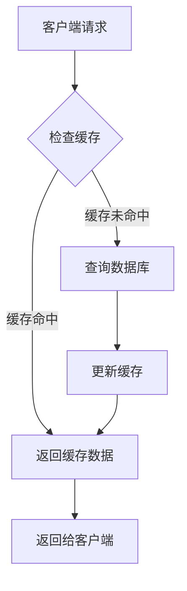
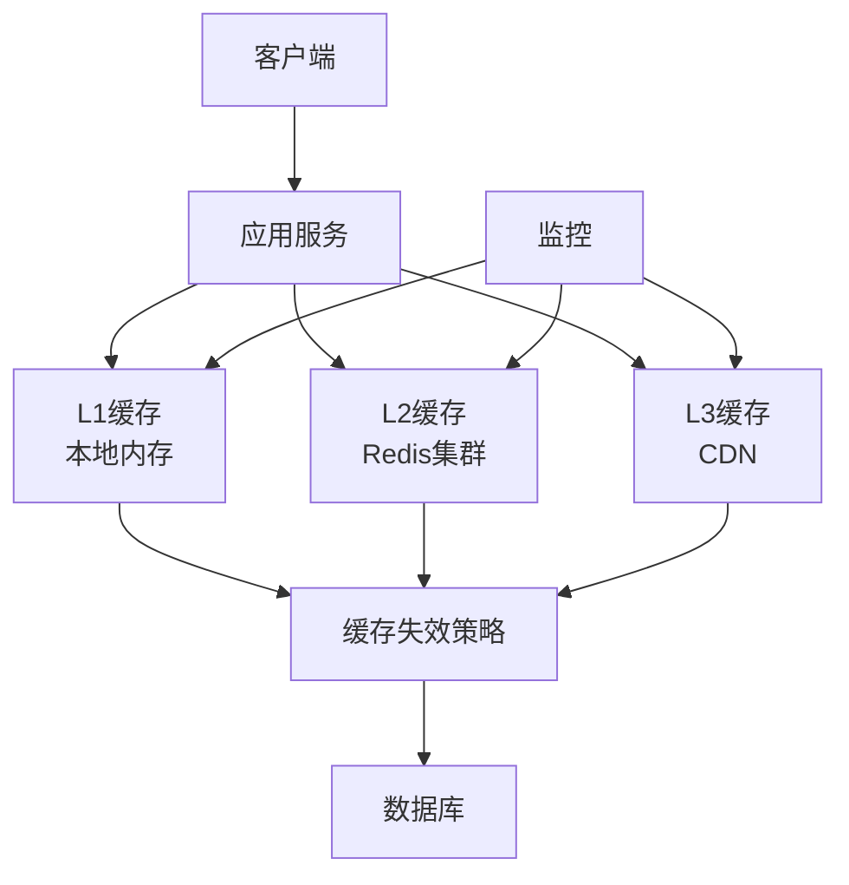

# Week 3 - 缓存策略与性能优化

## 本周内容

- **缓存基础**：缓存原理、缓存类型、缓存策略
- **缓存失效**：TTL、LRU、LFU、FIFO等失效算法
- **分布式缓存**：Redis、Memcached、集群架构
- **缓存模式**：Cache-Aside、Read-Through、Write-Through
- **性能优化**：缓存雪崩、缓存穿透、缓存击穿
- **实践项目**：多层缓存架构设计与实现

## 缓存基础概念

### 什么是缓存？

**缓存**是一种高速数据存储层，存储常用数据的副本，以便将来能够更快地访问这些数据。

#### 缓存的工作原理



### 缓存的层次结构

#### CPU缓存层次
```
L1 Cache (32KB) → L2 Cache (256KB) → L3 Cache (8MB) → 主内存
速度最快         →              →           → 速度最慢
容量最小         →              →           → 容量最大
```

#### 应用缓存层次
```
浏览器缓存 → CDN缓存 → 应用缓存 → 数据库缓存
用户端       → 边缘端    → 应用层    → 数据层
```

### 缓存类型

#### 1. 按存储位置分类

##### 本地缓存
- **内存缓存**：存储在应用进程内存中
- **磁盘缓存**：存储在本地磁盘中

```python
# 本地内存缓存示例
import time
from typing import Any, Optional
from threading import Lock

class LocalCache:
    def __init__(self, max_size: int = 1000, ttl: int = 3600):
        self.max_size = max_size
        self.ttl = ttl
        self.cache = {}
        self.access_times = {}
        self.lock = Lock()

    def get(self, key: str) -> Optional[Any]:
        """获取缓存值"""
        with self.lock:
            if key not in self.cache:
                return None

            # 检查是否过期
            if time.time() - self.access_times[key] > self.ttl:
                del self.cache[key]
                del self.access_times[key]
                return None

            # 更新访问时间
            self.access_times[key] = time.time()
            return self.cache[key]

    def set(self, key: str, value: Any, ttl: int = None):
        """设置缓存值"""
        with self.lock:
            # 检查缓存大小
            if len(self.cache) >= self.max_size:
                self._evict()

            self.cache[key] = value
            self.access_times[key] = time.time()

            # 如果指定了TTL，则使用指定的TTL
            if ttl:
                self.access_times[key] = time.time() + ttl

    def _evict(self):
        """淘汰缓存（FIFO）"""
        if not self.cache:
            return

        # 找到最老的键
        oldest_key = min(self.access_times.keys(), key=lambda k: self.access_times[k])
        del self.cache[oldest_key]
        del self.access_times[oldest_key]

    def clear(self):
        """清空缓存"""
        with self.lock:
            self.cache.clear()
            self.access_times.clear()

# 使用示例
cache = LocalCache(max_size=100, ttl=300)  # 100个元素，5分钟过期

cache.set("user:1", {"name": "John", "age": 30})
user_data = cache.get("user:1")
print(user_data)  # {'name': 'John', 'age': 30}

# 过期后
time.sleep(301)
user_data = cache.get("user:1")
print(user_data)  # None
```

##### 分布式缓存
- **Redis**：内存数据结构存储，支持多种数据类型
- **Memcached**：简单的键值存储系统
- **Hazelcast**：分布式内存数据网格

```python
# Redis分布式缓存示例
import redis
import json
from typing import Any, Optional
from datetime import datetime, timedelta

class RedisCache:
    def __init__(self, host: str = 'localhost', port: int = 6379, db: int = 0):
        self.redis_client = redis.Redis(
            host=host,
            port=port,
            db=db,
            decode_responses=True
        )

    def get(self, key: str) -> Optional[Any]:
        """获取缓存值"""
        value = self.redis_client.get(key)
        if value:
            try:
                return json.loads(value)
            except json.JSONDecodeError:
                return value
        return None

    def set(self, key: str, value: Any, ttl: int = None):
        """设置缓存值"""
        if isinstance(value, (dict, list)):
            value = json.dumps(value)

        if ttl:
            self.redis_client.setex(key, ttl, value)
        else:
            self.redis_client.set(key, value)

    def delete(self, key: str):
        """删除缓存"""
        self.redis_client.delete(key)

    def exists(self, key: str) -> bool:
        """检查键是否存在"""
        return self.redis_client.exists(key)

    def ttl(self, key: str) -> int:
        """获取键的剩余TTL"""
        return self.redis_client.ttl(key)

    def increment(self, key: str, amount: int = 1) -> int:
        """递增键值"""
        return self.redis_client.incr(key, amount)

    def decrement(self, key: str, amount: int = 1) -> int:
        """递减键值"""
        return self.redis_client.decr(key, amount)

# 使用示例
redis_cache = RedisCache()

# 设置缓存
redis_cache.set("user:1", {"name": "Alice", "email": "alice@example.com"}, ttl=300)

# 获取缓存
user_data = redis_cache.get("user:1")
print(user_data)  # {'name': 'Alice', 'email': 'alice@example.com'}

# 计数器
redis_cache.increment("page_views:home")
views = redis_cache.get("page_views:home")
print(f"Home page views: {views}")
```

#### 2. 按功能分类

##### 通用缓存
- **对象缓存**：缓存对象数据
- **查询缓存**：缓存数据库查询结果
- **页面缓存**：缓存完整页面内容

##### 专用缓存
- **会话缓存**：存储用户会话数据
- **CDN缓存**：缓存静态资源
- **查询结果缓存**：缓存复杂查询结果

### 缓存策略

#### 1. 缓存位置策略

##### Cache-Aside（旁路缓存）
```python
# Cache-Aside策略示例
class CacheAsideCache:
    def __init__(self, cache, database):
        self.cache = cache
        self.database = database

    def get(self, key: str) -> Any:
        """获取数据"""
        # 1. 先从缓存获取
        data = self.cache.get(key)
        if data is not None:
            return data

        # 2. 缓存未命中，从数据库获取
        data = self.database.get(key)
        if data is not None:
            # 3. 将数据写入缓存
            self.cache.set(key, data)

        return data

    def set(self, key: str, value: Any):
        """设置数据"""
        # 1. 更新数据库
        self.database.set(key, value)

        # 2. 删除缓存（可选）
        self.cache.delete(key)

    def delete(self, key: str):
        """删除数据"""
        # 1. 删除数据库中的数据
        self.database.delete(key)

        # 2. 删除缓存
        self.cache.delete(key)
```

##### Read-Through（读穿透）
```python
# Read-Through策略示例
class ReadThroughCache:
    def __init__(self, cache, database):
        self.cache = cache
        self.database = database

    def get(self, key: str) -> Any:
        """获取数据"""
        # 1. 先从缓存获取
        data = self.cache.get(key)
        if data is not None:
            return data

        # 2. 缓存未命中，从数据库获取
        data = self.database.get(key)
        if data is not None:
            # 3. 自动更新缓存
            self.cache.set(key, data)

        return data

    def set(self, key: str, value: Any):
        """设置数据"""
        # 1. 更新数据库
        self.database.set(key, value)

        # 2. 自动更新缓存
        self.cache.set(key, value)
```

##### Write-Through（写穿透）
```python
# Write-Through策略示例
class WriteThroughCache:
    def __init__(self, cache, database):
        self.cache = cache
        self.database = database

    def get(self, key: str) -> Any:
        """获取数据"""
        return self.cache.get(key)

    def set(self, key: str, value: Any):
        """设置数据"""
        # 1. 先更新缓存
        self.cache.set(key, value)

        # 2. 同步更新数据库
        self.database.set(key, value)
```

##### Write-Behind（写回）
```python
# Write-Behind策略示例
import threading
import queue
import time

class WriteBehindCache:
    def __init__(self, cache, database, batch_size: int = 100, flush_interval: int = 5):
        self.cache = cache
        self.database = database
        self.batch_size = batch_size
        self.flush_interval = flush_interval
        self.write_queue = queue.Queue()
        self.lock = threading.Lock()
        self.stop_event = threading.Event()

        # 启动后台写线程
        self.writer_thread = threading.Thread(target=self._background_writer)
        self.writer_thread.daemon = True
        self.writer_thread.start()

    def get(self, key: str) -> Any:
        """获取数据"""
        return self.cache.get(key)

    def set(self, key: str, value: Any):
        """设置数据"""
        # 1. 立即更新缓存
        self.cache.set(key, value)

        # 2. 将写操作加入队列
        with self.lock:
            self.write_queue.put(('set', key, value))

    def delete(self, key: str):
        """删除数据"""
        # 1. 立即从缓存删除
        self.cache.delete(key)

        # 2. 将删除操作加入队列
        with self.lock:
            self.write_queue.put(('delete', key, None))

    def _background_writer(self):
        """后台写线程"""
        batch = []

        while not self.stop_event.is_set():
            try:
                # 从队列获取操作
                operation = self.write_queue.get(timeout=self.flush_interval)
                batch.append(operation)

                # 批量处理
                if len(batch) >= self.batch_size:
                    self._flush_batch(batch)
                    batch = []

            except queue.Empty:
                # 超时，刷新批量操作
                if batch:
                    self._flush_batch(batch)
                    batch = []

        # 停止前刷新剩余操作
        if batch:
            self._flush_batch(batch)

    def _flush_batch(self, batch: list):
        """刷新批量操作到数据库"""
        operations = {}
        deletes = set()

        for op, key, value in batch:
            if op == 'set':
                operations[key] = value
            elif op == 'delete':
                deletes.add(key)

        # 执行批量更新
        if operations:
            self.database.batch_set(operations)

        # 执行批量删除
        if deletes:
            self.database.batch_delete(deletes)

    def stop(self):
        """停止后台线程"""
        self.stop_event.set()
        self.writer_thread.join()
```

#### 2. 缓存刷新策略

##### 基于时间的刷新
```python
# 基于时间的缓存刷新
import time
from typing import Callable, Any

class TimeBasedRefreshCache:
    def __init__(self, cache, data_loader: Callable, refresh_interval: int):
        self.cache = cache
        self.data_loader = data_loader
        self.refresh_interval = refresh_interval
        self.last_refresh = {}
        self.lock = threading.Lock()

    def get(self, key: str) -> Any:
        """获取数据，必要时刷新"""
        with self.lock:
            # 检查是否需要刷新
            if (key not in self.last_refresh or
                time.time() - self.last_refresh[key] > self.refresh_interval):

                self._refresh_key(key)

            return self.cache.get(key)

    def _refresh_key(self, key: str):
        """刷新指定键的数据"""
        try:
            # 加载新数据
            new_data = self.data_loader(key)

            # 更新缓存
            self.cache.set(key, new_data)

            # 更新刷新时间
            self.last_refresh[key] = time.time()

        except Exception as e:
            print(f"Error refreshing key {key}: {e}")

    def force_refresh(self, key: str):
        """强制刷新指定键"""
        with self.lock:
            self._refresh_key(key)
```

##### 基于事件的刷新
```python
# 基于事件的缓存刷新
from typing import Dict, List, Callable
import threading

class EventBasedRefreshCache:
    def __init__(self, cache):
        self.cache = cache
        self.event_handlers: Dict[str, List[Callable]] = {}
        self.lock = threading.Lock()

    def subscribe(self, event_type: str, handler: Callable):
        """订阅事件"""
        with self.lock:
            if event_type not in self.event_handlers:
                self.event_handlers[event_type] = []
            self.event_handlers[event_type].append(handler)

    def publish_event(self, event_type: str, data: dict):
        """发布事件"""
        with self.lock:
            if event_type in self.event_handlers:
                for handler in self.event_handlers[event_type]:
                    try:
                        handler(data)
                    except Exception as e:
                        print(f"Error handling event {event_type}: {e}")

    def get(self, key: str) -> Any:
        """获取数据"""
        return self.cache.get(key)

    def set(self, key: str, value: Any):
        """设置数据"""
        self.cache.set(key, value)

    def delete(self, key: str):
        """删除数据"""
        self.cache.delete(key)

# 使用示例
def user_updated_handler(event_data):
    """用户更新事件处理器"""
    user_id = event_data['user_id']
    cache.delete(f"user:{user_id}")
    cache.delete(f"user_profile:{user_id}")

def product_updated_handler(event_data):
    """商品更新事件处理器"""
    product_id = event_data['product_id']
    cache.delete(f"product:{product_id}")
    cache.delete(f"product_details:{product_id}")

# 设置事件处理器
cache = EventBasedRefreshCache(redis_cache)
cache.subscribe('user_updated', user_updated_handler)
cache.subscribe('product_updated', product_updated_handler)

# 发布事件
cache.publish_event('user_updated', {'user_id': '123'})
cache.publish_event('product_updated', {'product_id': '456'})
```

## 缓存失效算法

### 1. TTL（Time To Live）
```python
# TTL实现
import time
from typing import Dict, Any, Optional

class TTLCache:
    def __init__(self, default_ttl: int = 3600):
        self.cache: Dict[str, Any] = {}
        self.timestamps: Dict[str, float] = {}
        self.default_ttl = default_ttl
        self.lock = threading.Lock()

    def get(self, key: str) -> Optional[Any]:
        """获取数据"""
        with self.lock:
            if key not in self.cache:
                return None

            # 检查是否过期
            if time.time() - self.timestamps[key] > self.default_ttl:
                del self.cache[key]
                del self.timestamps[key]
                return None

            return self.cache[key]

    def set(self, key: str, value: Any, ttl: int = None):
        """设置数据"""
        with self.lock:
            self.cache[key] = value
            self.timestamps[key] = time.time() + (ttl or self.default_ttl)

    def cleanup_expired(self):
        """清理过期数据"""
        with self.lock:
            current_time = time.time()
            expired_keys = [
                key for key, timestamp in self.timestamps.items()
                if current_time > timestamp
            ]

            for key in expired_keys:
                del self.cache[key]
                del self.timestamps[key]
```

### 2. LRU（Least Recently Used）
```python
# LRU实现
from collections import OrderedDict
from typing import Any, Optional

class LRUCache:
    def __init__(self, capacity: int):
        self.cache = OrderedDict()
        self.capacity = capacity

    def get(self, key: str) -> Optional[Any]:
        """获取数据"""
        if key not in self.cache:
            return None

        # 移动到最前面（最近使用）
        self.cache.move_to_end(key)
        return self.cache[key]

    def set(self, key: str, value: Any):
        """设置数据"""
        if key in self.cache:
            # 移动到最前面
            self.cache.move_to_end(key)
        else:
            if len(self.cache) >= self.capacity:
                # 删除最久未使用的项
                self.cache.popitem(last=False)

        self.cache[key] = value

    def __str__(self):
        return str(list(self.cache.keys()))
```

### 3. LFU（Least Frequently Used）
```python
# LFU实现
import heapq
from typing import Dict, Any, Optional
from collections import defaultdict

class LFUCache:
    def __init__(self, capacity: int):
        self.capacity = capacity
        self.cache: Dict[str, Any] = {}
        self.freq_map: Dict[str, int] = defaultdict(int)
        self.freq_heap = []  # 最小堆 (freq, key, timestamp)

    def get(self, key: str) -> Optional[Any]:
        """获取数据"""
        if key not in self.cache:
            return None

        # 增加访问频率
        self.freq_map[key] += 1

        # 更新堆
        self._update_heap(key)

        return self.cache[key]

    def set(self, key: str, value: Any):
        """设置数据"""
        if key in self.cache:
            # 更新现有数据
            self.cache[key] = value
            self.freq_map[key] += 1
            self._update_heap(key)
        else:
            # 检查容量
            if len(self.cache) >= self.capacity:
                self._evict()

            # 添加新数据
            self.cache[key] = value
            self.freq_map[key] = 1
            heapq.heappush(self.freq_heap, (1, key, time.time()))

    def _update_heap(self, key: str):
        """更新堆中的数据"""
        freq = self.freq_map[key]
        timestamp = time.time()

        # 添加新记录
        heapq.heappush(self.freq_heap, (freq, key, timestamp))

    def _evict(self):
        """淘汰最不常用的数据"""
        while self.freq_heap:
            freq, key, timestamp = heapq.heappop(self.freq_heap)

            # 检查是否还有效
            if (key in self.cache and
                self.freq_map[key] == freq):

                del self.cache[key]
                del self.freq_map[key]
                break
```

### 4. FIFO（First In First Out）
```python
# FIFO实现
from collections import deque
from typing import Dict, Any, Optional

class FIFOCache:
    def __init__(self, capacity: int):
        self.capacity = capacity
        self.cache: Dict[str, Any] = {}
        self.queue = deque()

    def get(self, key: str) -> Optional[Any]:
        """获取数据"""
        return self.cache.get(key)

    def set(self, key: str, value: Any):
        """设置数据"""
        if key in self.cache:
            # 更新现有数据
            self.cache[key] = value
        else:
            # 检查容量
            if len(self.cache) >= self.capacity:
                # 删除最先进来的数据
                oldest_key = self.queue.popleft()
                del self.cache[oldest_key]

            # 添加新数据
            self.cache[key] = value
            self.queue.append(key)
```

### 5. ARC（Adaptive Replacement Cache）
```python
# ARC实现（简化版）
from typing import Dict, Any, Optional, List
from collections import deque

class ARCCache:
    def __init__(self, capacity: int):
        self.capacity = capacity
        self.cache: Dict[str, Any] = {}

        # 两个LRU列表
        self.t1 = deque()  # 最近只访问一次的页面
        self.t2 = deque()  # 最近访问过两次或以上的页面
        self.b1 = deque()  # 最近被淘汰的，只访问过一次的页面
        self.b2 = deque()  # 最近被淘汰的，访问过两次或以上的页面

        self.p = 0  # t1和t2的目标大小比例

    def get(self, key: str) -> Optional[Any]:
        """获取数据"""
        if key in self.cache:
            # 在t1中
            if key in self.t1:
                self.t1.remove(key)
                self.t2.appendleft(key)
            return self.cache[key]

        return None

    def set(self, key: str, value: Any):
        """设置数据"""
        if key in self.cache:
            # 更新现有数据
            self.cache[key] = value
            if key in self.t1:
                self.t1.remove(key)
                self.t2.appendleft(key)
            return

        # 新数据
        if len(self.cache) >= self.capacity:
            self._evict()

        self.cache[key] = value
        self.t1.appendleft(key)

    def _evict(self):
        """淘汰数据"""
        # 根据ARC算法决定淘汰策略
        if len(self.t1) >= max(1, self.p):
            # 从t1淘汰
            key = self.t1.pop()
            self.b1.appendleft(key)
        else:
            # 从t2淘汰
            key = self.t2.pop()
            self.b2.appendleft(key)

        del self.cache[key]
```

## 缓存问题与解决方案

### 1. 缓存雪崩

**问题描述**：大量缓存在同一时间失效，导致所有请求都直接访问数据库。

#### 解决方案

##### 随机TTL
```python
# 随机TTL避免缓存雪崩
import random
import time

class AntiAvalancheCache:
    def __init__(self, base_ttl: int = 3600, ttl_variance: int = 300):
        self.base_ttl = base_ttl
        self.ttl_variance = ttl_variance
        self.cache = {}

    def get_ttl(self) -> int:
        """获取随机TTL"""
        return self.base_ttl + random.randint(-self.ttl_variance, self.ttl_variance)

    def set(self, key: str, value: Any):
        """设置缓存值"""
        ttl = self.get_ttl()
        self.cache[key] = {
            'value': value,
            'expire_time': time.time() + ttl
        }

    def get(self, key: str) -> Optional[Any]:
        """获取缓存值"""
        if key not in self.cache:
            return None

        entry = self.cache[key]
        if time.time() > entry['expire_time']:
            del self.cache[key]
            return None

        return entry['value']
```

##### 缓存预热
```python
# 缓存预热策略
class CacheWarmup:
    def __init__(self, cache, data_loader):
        self.cache = cache
        self.data_loader = data_loader

    async def warmup_hot_keys(self, hot_keys: List[str]):
        """预热热点数据"""
        for key in hot_keys:
            try:
                # 检查是否已存在
                if not self.cache.exists(key):
                    # 加载数据
                    data = await self.data_loader.load(key)
                    # 设置缓存，使用较长TTL
                    self.cache.set(key, data, ttl=7200)  # 2小时
                    print(f"Warmed up key: {key}")
            except Exception as e:
                print(f"Error warming up key {key}: {e}")

    async def warmup_by_pattern(self, pattern: str, limit: int = 1000):
        """按模式预热缓存"""
        # 从数据库获取热点数据的键
        hot_keys = await self.data_loader.get_hot_keys(pattern, limit)
        await self.warmup_hot_keys(hot_keys)

    async def scheduled_warmup(self, interval: int = 3600):
        """定时预热缓存"""
        while True:
            try:
                print("Starting scheduled cache warmup...")
                await self.warmup_by_pattern("user:*", limit=1000)
                await self.warmup_by_pattern("product:*", limit=500)
                print("Cache warmup completed")
            except Exception as e:
                print(f"Error during cache warmup: {e}")

            await asyncio.sleep(interval)
```

##### 互斥锁防止并发重建
```python
# 互斥锁防止缓存雪崩
import threading
from typing import Optional, Any, Callable

class MutexCache:
    def __init__(self, cache, data_loader: Callable):
        self.cache = cache
        self.data_loader = data_loader
        self.locks = {}
        self.global_lock = threading.Lock()

    def get(self, key: str) -> Optional[Any]:
        """获取数据"""
        # 先尝试从缓存获取
        data = self.cache.get(key)
        if data is not None:
            return data

        # 获取键级锁
        key_lock = self._get_key_lock(key)

        with key_lock:
            # 再次检查缓存（双重检查）
            data = self.cache.get(key)
            if data is not None:
                return data

            # 加载数据
            data = self.data_loader(key)

            # 更新缓存
            self.cache.set(key, data)

            # 释放键级锁
            self._release_key_lock(key)

        return data

    def _get_key_lock(self, key: str):
        """获取键级锁"""
        with self.global_lock:
            if key not in self.locks:
                self.locks[key] = threading.Lock()
            return self.locks[key]

    def _release_key_lock(self, key: str):
        """释放键级锁"""
        with self.global_lock:
            if key in self.locks:
                del self.locks[key]
```

### 2. 缓存穿透

**问题描述**：大量请求查询不存在的数据，导致缓存无法命中，直接访问数据库。

#### 解决方案

##### 布隆过滤器
```python
# 布隆过滤器防止缓存穿透
import mmh3
from bitarray import bitarray
import math

class BloomFilter:
    def __init__(self, capacity: int, error_rate: float = 0.001):
        self.capacity = capacity
        self.error_rate = error_rate

        # 计算需要的位数和哈希函数数量
        self.bit_size = self._calculate_bit_size(capacity, error_rate)
        self.hash_count = self._calculate_hash_count(self.bit_size, capacity)

        self.bit_array = bitarray(self.bit_size)
        self.bit_array.setall(0)

    def _calculate_bit_size(self, capacity: int, error_rate: float) -> int:
        """计算需要的位数"""
        return int(-capacity * math.log(error_rate) / (math.log(2) ** 2))

    def _calculate_hash_count(self, bit_size: int, capacity: int) -> int:
        """计算哈希函数数量"""
        return int(bit_size / capacity * math.log(2))

    def add(self, key: str):
        """添加键"""
        for seed in range(self.hash_count):
            index = mmh3.hash(key, seed) % self.bit_size
            self.bit_array[index] = 1

    def contains(self, key: str) -> bool:
        """检查键是否存在"""
        for seed in range(self.hash_count):
            index = mmh3.hash(key, seed) % self.bit_size
            if not self.bit_array[index]:
                return False
        return True

# 使用布隆过滤器的缓存
class BloomFilterCache:
    def __init__(self, cache, data_loader, capacity: int = 1000000):
        self.cache = cache
        self.data_loader = data_loader
        self.bloom_filter = BloomFilter(capacity)
        self.null_cache = {}  # 缓存空结果

    def add_existing_keys(self, keys: List[str]):
        """添加已存在的键到布隆过滤器"""
        for key in keys:
            self.bloom_filter.add(key)

    def get(self, key: str) -> Optional[Any]:
        """获取数据"""
        # 检查布隆过滤器
        if not self.bloom_filter.contains(key):
            # 键不存在，直接返回None
            return None

        # 检查空缓存
        if key in self.null_cache:
            return None

        # 从缓存获取
        data = self.cache.get(key)
        if data is not None:
            return data

        # 从数据库加载
        data = self.data_loader(key)

        if data is None:
            # 缓存空结果
            self.null_cache[key] = True
        else:
            # 添加到布隆过滤器
            self.bloom_filter.add(key)
            # 缓存数据
            self.cache.set(key, data)

        return data
```

##### 空值缓存
```python
# 空值缓存
class NullValueCache:
    def __init__(self, cache, null_ttl: int = 300):
        self.cache = cache
        self.null_ttl = null_ttl

    def get(self, key: str, data_loader: Callable) -> Optional[Any]:
        """获取数据"""
        # 先从缓存获取
        data = self.cache.get(key)
        if data is not None:
            if data == "__NULL__":
                return None
            return data

        # 从数据库加载
        data = data_loader(key)

        if data is None:
            # 缓存空值
            self.cache.set(key, "__NULL__", ttl=self.null_ttl)
        else:
            # 缓存数据
            self.cache.set(key, data)

        return data
```

### 3. 缓存击穿

**问题描述**：热点数据过期时，大量并发请求同时访问数据库。

#### 解决方案

##### 热点数据永不过期
```python
# 热点数据永不过期
import time
from typing import Dict, Any, Optional, Set

class HotspotCache:
    def __init__(self, cache, data_loader: Callable):
        self.cache = cache
        self.data_loader = data_loader
        self.hotspot_keys: Set[str] = set()
        self.access_counts: Dict[str, int] = {}
        self.last_update: Dict[str, float] = {}

    def get(self, key: str) -> Optional[Any]:
        """获取数据"""
        # 更新访问计数
        self._update_access_count(key)

        # 检查是否是热点数据
        if self._is_hotspot(key):
            # 热点数据，使用缓存或后台更新
            return self._get_hotspot_data(key)

        # 普通数据，正常处理
        return self._get_normal_data(key)

    def _update_access_count(self, key: str):
        """更新访问计数"""
        now = time.time()

        if key not in self.access_counts:
            self.access_counts[key] = 0
            self.last_update[key] = now

        self.access_counts[key] += 1

        # 定期清理旧数据
        if now - self.last_update[key] > 3600:  # 1小时
            self.access_counts[key] = 1
            self.last_update[key] = now

    def _is_hotspot(self, key: str) -> bool:
        """检查是否是热点数据"""
        return self.access_counts.get(key, 0) > 100  # 每小时访问超过100次

    def _get_hotspot_data(self, key: str) -> Optional[Any]:
        """获取热点数据"""
        data = self.cache.get(key)
        if data is not None:
            return data

        # 后台异步加载
        self._background_load(key)

        # 返回旧数据或默认值
        return self._get_fallback_data(key)

    def _get_normal_data(self, key: str) -> Optional[Any]:
        """获取普通数据"""
        data = self.cache.get(key)
        if data is not None:
            return data

        data = self.data_loader(key)
        if data is not None:
            self.cache.set(key, data, ttl=3600)  # 1小时

        return data

    def _background_load(self, key: str):
        """后台加载数据"""
        try:
            data = self.data_loader(key)
            if data is not None:
                self.cache.set(key, data, ttl=7200)  # 2小时
        except Exception as e:
            print(f"Error loading hotspot data for key {key}: {e}")

    def _get_fallback_data(self, key: str) -> Optional[Any]:
        """获取备用数据"""
        # 这里可以返回一些默认值或旧数据
        return None
```

##### 异步刷新
```python
# 异步刷新缓存
import asyncio
from typing import Optional, Any, Callable
import threading

class AsyncRefreshCache:
    def __init__(self, cache, data_loader: Callable):
        self.cache = cache
        self.data_loader = data_loader
        self.refreshing = set()  # 正在刷新的键
        self.lock = threading.Lock()

    def get(self, key: str) -> Optional[Any]:
        """获取数据"""
        # 先从缓存获取
        data = self.cache.get(key)
        if data is not None:
            return data

        # 检查是否正在刷新
        with self.lock:
            if key in self.refreshing:
                return self._get_stale_data(key)

            # 开始刷新
            self.refreshing.add(key)

        # 异步刷新
        threading.Thread(target=self._async_refresh, args=(key,)).start()

        # 返回旧数据或None
        return self._get_stale_data(key)

    def _async_refresh(self, key: str):
        """异步刷新数据"""
        try:
            data = self.data_loader(key)
            if data is not None:
                self.cache.set(key, data, ttl=3600)
        except Exception as e:
            print(f"Error refreshing data for key {key}: {e}")
        finally:
            with self.lock:
                self.refreshing.discard(key)

    def _get_stale_data(self, key: str) -> Optional[Any]:
        """获取旧数据"""
        # 这里可以实现获取旧数据的逻辑
        # 例如从备份存储或返回默认值
        return None
```

## 分布式缓存

### Redis集群架构

#### 1. 主从复制
```python
# Redis主从复制配置
class RedisMasterSlave:
    def __init__(self, master_config, slave_configs):
        self.master = redis.Redis(**master_config)
        self.slaves = [redis.Redis(**config) for config in slave_configs]

    def write(self, key: str, value: Any):
        """写入主节点"""
        self.master.set(key, value)

    def read(self, key: str) -> Any:
        """从从节点读取"""
        # 轮询选择从节点
        import random
        slave = random.choice(self.slaves)
        return slave.get(key)

    def setup_replication(self):
        """设置主从复制"""
        for slave in self.slaves:
            slave.execute_command('SLAVEOF', self.master.host, self.master.port)
```

#### 2. 哨兵模式
```python
# Redis哨兵模式
import redis.sentinel

class RedisSentinelCache:
    def __init__(self, sentinel_configs, master_name):
        self.sentinel = redis.sentinel.Sentinel(sentinel_configs)
        self.master_name = master_name
        self.master = None
        self.slaves = None

    def get_connection(self):
        """获取连接"""
        if self.master is None:
            self.master = self.sentinel.master_for(self.master_name)
        return self.master

    def get_slave_connection(self):
        """获取从节点连接"""
        if self.slaves is None:
            self.slaves = self.sentinel.slave_for(self.master_name)
        return self.slaves

    def write(self, key: str, value: Any):
        """写入数据"""
        master = self.get_connection()
        master.set(key, value)

    def read(self, key: str) -> Any:
        """读取数据"""
        slave = self.get_slave_connection()
        return slave.get(key)
```

#### 3. 集群模式
```python
# Redis集群
import rediscluster

class RedisClusterCache:
    def __init__(self, startup_nodes):
        self.redis_client = rediscluster.RedisCluster(
            startup_nodes=startup_nodes,
            decode_responses=True
        )

    def get(self, key: str) -> Any:
        """获取数据"""
        return self.redis_client.get(key)

    def set(self, key: str, value: Any, ttl: int = None):
        """设置数据"""
        if ttl:
            self.redis_client.setex(key, ttl, value)
        else:
            self.redis_client.set(key, value)

    def delete(self, key: str):
        """删除数据"""
        self.redis_client.delete(key)
```

### 缓存一致性策略

#### 1. 强一致性
```python
# 强一致性缓存（使用分布式锁）
import redis

class StrongConsistencyCache:
    def __init__(self, redis_client):
        self.redis = redis_client

    def get_with_lock(self, key: str, data_loader: Callable) -> Any:
        """使用分布式锁保证一致性"""
        # 创建锁
        lock_key = f"lock:{key}"
        lock_value = str(uuid.uuid4())

        # 尝试获取锁
        acquired = self.redis.set(lock_key, lock_value, nx=True, ex=10)
        if acquired:
            try:
                # 获取数据
                data = data_loader(key)

                # 更新缓存
                self.redis.set(key, data)

                return data
            finally:
                # 释放锁
                if self.redis.get(lock_key) == lock_value:
                    self.redis.delete(lock_key)
        else:
            # 等待锁释放后重试
            time.sleep(0.1)
            return self.get_with_lock(key, data_loader)
```

#### 2. 最终一致性
```python
# 最终一致性缓存（使用消息队列）
import json
import threading
import queue

class EventuallyConsistentCache:
    def __init__(self, cache, message_queue):
        self.cache = cache
        self.message_queue = message_queue
        self.pending_updates = {}
        self.lock = threading.Lock()

    def update(self, key: str, value: Any):
        """更新数据（最终一致）"""
        # 立即更新本地缓存
        self.cache.set(key, value)

        # 发送更新消息
        self.message_queue.send({
            'type': 'cache_update',
            'key': key,
            'value': value,
            'timestamp': time.time()
        })

    def process_updates(self):
        """处理更新消息"""
        while True:
            try:
                message = self.message_queue.receive(timeout=1)
                if message['type'] == 'cache_update':
                    self._process_update(message)
            except queue.Empty:
                continue

    def _process_update(self, message: dict):
        """处理更新消息"""
        key = message['key']
        value = message['value']
        timestamp = message['timestamp']

        with self.lock:
            # 检查是否是最新更新
            if (key not in self.pending_updates or
                timestamp > self.pending_updates[key]):

                # 更新缓存
                self.cache.set(key, value)
                self.pending_updates[key] = timestamp
```

## 实践项目：多层缓存架构

### 项目背景

设计一个高性能的多层缓存架构，用于电商平台的商品信息缓存。

### 架构设计



### 实现代码

#### 1. 多层缓存管理器
```python
# 多层缓存管理器
import time
from typing import Optional, Any, Dict, List
from abc import ABC, abstractmethod

class CacheLayer(ABC):
    """缓存层抽象基类"""
    @abstractmethod
    def get(self, key: str) -> Optional[Any]:
        pass

    @abstractmethod
    def set(self, key: str, value: Any, ttl: int = None):
        pass

    @abstractmethod
    def delete(self, key: str):
        pass

    @abstractmethod
    def exists(self, key: str) -> bool:
        pass

class LocalMemoryCache(CacheLayer):
    """本地内存缓存"""
    def __init__(self, max_size: int = 10000, default_ttl: int = 300):
        self.max_size = max_size
        self.default_ttl = default_ttl
        self.cache: Dict[str, Dict] = {}
        self.access_order: List[str] = []
        self.lock = threading.RLock()

    def get(self, key: str) -> Optional[Any]:
        with self.lock:
            if key not in self.cache:
                return None

            entry = self.cache[key]
            if time.time() > entry['expire_time']:
                self._remove_key(key)
                return None

            # 更新访问顺序
            if key in self.access_order:
                self.access_order.remove(key)
            self.access_order.append(key)

            return entry['value']

    def set(self, key: str, value: Any, ttl: int = None):
        with self.lock:
            # 检查容量
            if len(self.cache) >= self.max_size and key not in self.cache:
                self._evict()

            expire_time = time.time() + (ttl or self.default_ttl)
            self.cache[key] = {
                'value': value,
                'expire_time': expire_time
            }

            # 更新访问顺序
            if key in self.access_order:
                self.access_order.remove(key)
            self.access_order.append(key)

    def delete(self, key: str):
        with self.lock:
            self._remove_key(key)

    def exists(self, key: str) -> bool:
        with self.lock:
            if key not in self.cache:
                return False
            return time.time() <= self.cache[key]['expire_time']

    def _remove_key(self, key: str):
        """移除键"""
        if key in self.cache:
            del self.cache[key]
        if key in self.access_order:
            self.access_order.remove(key)

    def _evict(self):
        """淘汰数据（LRU）"""
        while self.access_order and len(self.cache) >= self.max_size:
            oldest_key = self.access_order.pop(0)
            self._remove_key(oldest_key)

class RedisCache(CacheLayer):
    """Redis缓存"""
    def __init__(self, redis_client, default_ttl: int = 3600):
        self.redis = redis_client
        self.default_ttl = default_ttl

    def get(self, key: str) -> Optional[Any]:
        value = self.redis.get(key)
        if value:
            try:
                return json.loads(value)
            except json.JSONDecodeError:
                return value
        return None

    def set(self, key: str, value: Any, ttl: int = None):
        if isinstance(value, (dict, list)):
            value = json.dumps(value)

        if ttl:
            self.redis.setex(key, ttl, value)
        else:
            self.redis.set(key, value)

    def delete(self, key: str):
        self.redis.delete(key)

    def exists(self, key: str) -> bool:
        return self.redis.exists(key)

class MultiLayerCache:
    """多层缓存管理器"""
    def __init__(self, layers: List[CacheLayer], data_loader: Callable):
        self.layers = layers
        self.data_loader = data_loader
        self.stats = {
            'hits': 0,
            'misses': 0,
            'layer_hits': [0] * len(layers)
        }

    def get(self, key: str) -> Optional[Any]:
        """获取数据"""
        # 从L1到LN逐层查找
        for i, layer in enumerate(self.layers):
            data = layer.get(key)
            if data is not None:
                self.stats['hits'] += 1
                self.stats['layer_hits'][i] += 1

                # 回填策略：将数据填充到上层缓存
                self._fill_upper_layers(i, key, data)
                return data

        # 所有层都未命中
        self.stats['misses'] += 1

        # 从数据源加载
        data = self.data_loader(key)
        if data is not None:
            # 填充所有层
            self._fill_all_layers(key, data)

        return data

    def set(self, key: str, value: Any, ttl: int = None):
        """设置数据"""
        for layer in self.layers:
            layer.set(key, value, ttl)

    def delete(self, key: str):
        """删除数据"""
        for layer in self.layers:
            layer.delete(key)

    def _fill_upper_layers(self, hit_layer: int, key: str, value: Any):
        """回填上层缓存"""
        for i in range(hit_layer):
            self.layers[i].set(key, value)

    def _fill_all_layers(self, key: str, value: Any):
        """填充所有层"""
        for layer in self.layers:
            layer.set(key, value)

    def get_hit_rate(self) -> float:
        """获取命中率"""
        total = self.stats['hits'] + self.stats['misses']
        if total == 0:
            return 0.0
        return self.stats['hits'] / total

    def get_layer_stats(self) -> Dict[str, List[int]]:
        """获取层级统计"""
        return {
            'hits': self.stats['hits'],
            'misses': self.stats['misses'],
            'layer_hits': self.stats['layer_hits']
        }
```

#### 2. 缓存策略管理器
```python
# 缓存策略管理器
from enum import Enum
from dataclasses import dataclass
from typing import Optional, Dict, Any

class CacheStrategy(Enum):
    LRU = "lru"
    LFU = "lfu"
    TTL = "ttl"
    ARC = "arc"

@dataclass
class CacheConfig:
    max_size: int
    default_ttl: int
    strategy: CacheStrategy
    enable_stats: bool = True

class StrategyManager:
    def __init__(self, cache_configs: Dict[str, CacheConfig]):
        self.cache_configs = cache_configs
        self.caches = {}

    def get_cache(self, cache_type: str) -> CacheLayer:
        """获取指定类型的缓存"""
        if cache_type not in self.caches:
            self.caches[cache_type] = self._create_cache(cache_type)

        return self.caches[cache_type]

    def _create_cache(self, cache_type: str) -> CacheLayer:
        """创建缓存实例"""
        config = self.cache_configs[cache_type]

        if config.strategy == CacheStrategy.LRU:
            return LocalMemoryCache(
                max_size=config.max_size,
                default_ttl=config.default_ttl
            )
        elif config.strategy == CacheStrategy.LFU:
            return LFUCache(
                capacity=config.max_size,
                default_ttl=config.default_ttl
            )
        elif config.strategy == CacheStrategy.TTL:
            return TTLCache(
                default_ttl=config.default_ttl
            )
        else:
            return LocalMemoryCache(
                max_size=config.max_size,
                default_ttl=config.default_ttl
            )

    def update_config(self, cache_type: str, new_config: CacheConfig):
        """更新缓存配置"""
        self.cache_configs[cache_type] = new_config

        # 重新创建缓存
        if cache_type in self.caches:
            del self.caches[cache_type]
```

#### 3. 性能监控
```python
# 缓存性能监控
import time
from typing import Dict, List, Any
from dataclasses import dataclass
from datetime import datetime, timedelta

@dataclass
class CacheMetrics:
    total_requests: int = 0
    cache_hits: int = 0
    cache_misses: int = 0
    avg_response_time: float = 0.0
    memory_usage: float = 0.0
    hit_rate: float = 0.0

class CacheMonitor:
    def __init__(self, cache_manager):
        self.cache_manager = cache_manager
        self.metrics = CacheMetrics()
        self.request_times = []
        self.start_time = time.time()

    def record_request(self, key: str, hit: bool, response_time: float):
        """记录请求"""
        self.metrics.total_requests += 1
        self.request_times.append(response_time)

        if hit:
            self.metrics.cache_hits += 1
        else:
            self.metrics.cache_misses += 1

        # 计算命中率
        self.metrics.hit_rate = (
            self.metrics.cache_hits / self.metrics.total_requests
            if self.metrics.total_requests > 0 else 0.0
        )

        # 计算平均响应时间
        if len(self.request_times) > 1000:
            self.request_times = self.request_times[-1000:]

        self.metrics.avg_response_time = (
            sum(self.request_times) / len(self.request_times)
            if self.request_times else 0.0
        )

    def get_metrics(self) -> Dict[str, Any]:
        """获取监控指标"""
        uptime = time.time() - self.start_time
        requests_per_second = (
            self.metrics.total_requests / uptime
            if uptime > 0 else 0.0
        )

        return {
            'uptime_seconds': uptime,
            'total_requests': self.metrics.total_requests,
            'cache_hits': self.metrics.cache_hits,
            'cache_misses': self.metrics.cache_misses,
            'hit_rate': self.metrics.hit_rate,
            'avg_response_time_ms': self.metrics.avg_response_time * 1000,
            'requests_per_second': requests_per_second,
            'memory_usage_mb': self._get_memory_usage()
        }

    def _get_memory_usage(self) -> float:
        """获取内存使用量"""
        import psutil
        process = psutil.Process()
        return process.memory_info().rss / 1024 / 1024  # MB

    def generate_report(self) -> str:
        """生成性能报告"""
        metrics = self.get_metrics()

        report = f"""
缓存性能报告
========================================
运行时间: {metrics['uptime_seconds']:.1f}秒
总请求数: {metrics['total_requests']}
缓存命中: {metrics['cache_hits']}
缓存未命中: {metrics['cache_misses']}
命中率: {metrics['hit_rate']:.2%}
平均响应时间: {metrics['avg_response_time_ms']:.2f}ms
每秒请求数: {metrics['requests_per_second']:.1f}
内存使用: {metrics['memory_usage_mb']:.1f}MB
========================================
        """
        return report.strip()
```

#### 4. 自动调优
```python
# 缓存自动调优
import numpy as np
from typing import Dict, List, Tuple

class CacheAutoTuner:
    def __init__(self, cache_manager, monitor):
        self.cache_manager = cache_manager
        self.monitor = monitor
        self.tuning_history = []

    def auto_tune(self, optimization_target: str = 'hit_rate'):
        """自动调优缓存"""
        current_metrics = self.monitor.get_metrics()
        current_config = self._get_current_config()

        # 生成候选配置
        candidate_configs = self._generate_candidates(current_config)

        # 评估候选配置
        best_config = current_config
        best_score = self._evaluate_config(current_config, optimization_target)

        for config in candidate_configs:
            score = self._evaluate_config(config, optimization_target)
            if score > best_score:
                best_score = score
                best_config = config

        # 应用最佳配置
        if best_config != current_config:
            self._apply_config(best_config)
            print(f"Applied new cache configuration: {best_config}")

        return best_config

    def _get_current_config(self) -> Dict[str, Any]:
        """获取当前配置"""
        return {
            'l1_max_size': 10000,
            'l1_ttl': 300,
            'l2_max_size': 100000,
            'l2_ttl': 3600
        }

    def _generate_candidates(self, current_config: Dict[str, Any]) -> List[Dict[str, Any]]:
        """生成候选配置"""
        candidates = []

        # 基于当前配置生成变化
        variations = [
            ('l1_max_size', 0.5),
            ('l1_max_size', 2.0),
            ('l1_ttl', 0.5),
            ('l1_ttl', 2.0),
            ('l2_max_size', 0.5),
            ('l2_max_size', 2.0),
            ('l2_ttl', 0.5),
            ('l2_ttl', 2.0)
        ]

        for param, factor in variations:
            config = current_config.copy()
            config[param] = int(config[param] * factor)
            candidates.append(config)

        return candidates

    def _evaluate_config(self, config: Dict[str, Any], target: str) -> float:
        """评估配置分数"""
        # 这里应该在实际环境中测试配置
        # 为了演示，使用启发式评估
        score = 0.0

        if target == 'hit_rate':
            # 根据配置估算命中率
            l1_size_factor = min(config['l1_max_size'] / 10000, 2.0)
            l2_size_factor = min(config['l2_max_size'] / 100000, 2.0)
            ttl_factor = min(config['l1_ttl'] / 300, 2.0)

            score = l1_size_factor * 0.4 + l2_size_factor * 0.4 + ttl_factor * 0.2

        return score

    def _apply_config(self, config: Dict[str, Any]):
        """应用配置"""
        # 更新缓存配置
        for cache_type, cache_config in config.items():
            if cache_type in self.cache_manager.cache_configs:
                self.cache_manager.update_config(cache_type, cache_config)

        # 记录调优历史
        self.tuning_history.append({
            'timestamp': datetime.now(),
            'config': config,
            'metrics': self.monitor.get_metrics()
        })
```

### 使用示例

```python
# 多层缓存使用示例
import redis
from typing import Any, Optional

# 初始化Redis
redis_client = redis.Redis(host='localhost', port=6379, db=0)

# 创建缓存层
l1_cache = LocalMemoryCache(max_size=1000, default_ttl=300)
l2_cache = RedisCache(redis_client, default_ttl=3600)

# 创建多层缓存
def product_data_loader(product_id: str) -> Optional[dict]:
    """商品数据加载器"""
    # 这里应该是从数据库加载商品数据
    # 为了演示，返回模拟数据
    return {
        'id': product_id,
        'name': f'Product {product_id}',
        'price': 99.99,
        'stock': 100
    }

multi_cache = MultiLayerCache([l1_cache, l2_cache], product_data_loader)

# 创建监控
monitor = CacheMonitor(multi_cache)

# 使用缓存
def get_product(product_id: str) -> Optional[dict]:
    """获取商品信息"""
    start_time = time.time()
    data = multi_cache.get(product_id)
    response_time = time.time() - start_time

    # 记录监控
    hit = data is not None
    monitor.record_request(product_id, hit, response_time)

    return data

# 测试
for i in range(1000):
    product_id = f"product_{i % 100}"  # 模拟100个商品
    get_product(product_id)

# 生成报告
print(monitor.generate_report())

# 自动调优
tuner = CacheAutoTuner(multi_cache, monitor)
best_config = tuner.auto_tune()
print(f"Best configuration: {best_config}")
```

## 总结

本周我们深入学习了缓存策略与性能优化：

1. **缓存基础**：理解了缓存的工作原理和类型
2. **缓存策略**：掌握了Cache-Aside、Read-Through、Write-Through等模式
3. **缓存失效算法**：实现了TTL、LRU、LFU、FIFO等算法
4. **缓存问题**：解决了缓存雪崩、缓存穿透、缓存击穿等问题
5. **分布式缓存**：学习了Redis集群和一致性策略
6. **实践项目**：设计了多层缓存架构

## 课后练习

1. **实现题**：实现一个支持多种失效算法的缓存系统。

2. **优化题**：分析给定系统的缓存性能，提出优化方案。

3. **设计题**：为一个高并发秒杀系统设计缓存架构。

4. **实验题**：比较不同缓存策略在实际应用中的性能差异。

## 下一周预告

Week 4我们将学习消息队列与异步处理，包括发布订阅模式、事件驱动架构、消息队列选型等内容。

---

**记住**：合理的缓存策略是提升系统性能的关键，但需要权衡缓存一致性和性能！** 🚀