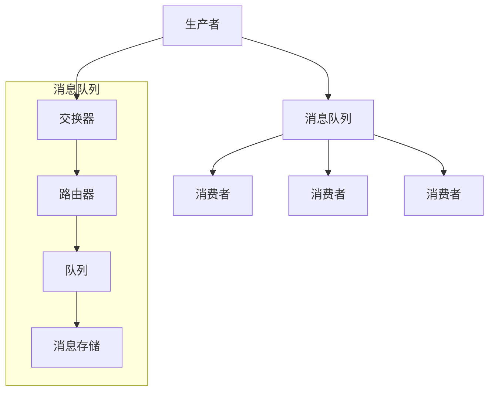
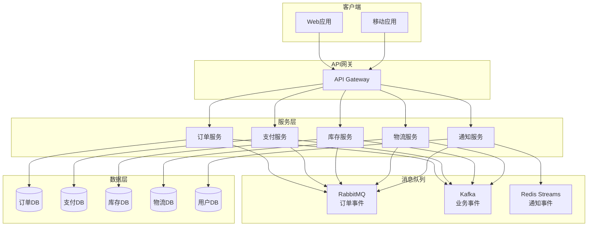

# Week 4 - 消息队列与异步处理

## 本周内容

- **消息队列基础**：消息队列概念、架构模式、核心特性
- **消息模式**：点对点、发布订阅、请求响应
- **事件驱动架构**：事件溯源、CQRS、 saga模式
- **消息队列技术**：RabbitMQ、Kafka、Redis Streams
- **异步处理**：任务队列、工作队列、结果处理
- **实践项目**：事件驱动的电商平台架构

## 消息队列基础

### 什么是消息队列？

**消息队列**是一种应用程序间的通信方法，通过异步消息传递实现系统间的解耦。

#### 消息队列的核心组件



### 消息队列的优势

1. **解耦**：生产者和消费者不需要直接连接
2. **异步**：提高系统响应速度
3. **削峰**：处理突发流量
4. **可靠**：确保消息不丢失
5. **扩展**：易于水平扩展

### 消息队列的核心概念

#### 1. 消息（Message）
```python
# 消息结构
from dataclasses import dataclass
from typing import Dict, Any, Optional
from datetime import datetime
import uuid

@dataclass
class Message:
    """消息数据结构"""
    id: str
    body: Any
    headers: Dict[str, Any]
    timestamp: datetime
    correlation_id: Optional[str] = None
    reply_to: Optional[str] = None
    content_type: str = "application/json"
    delivery_mode: int = 2  # 1=非持久化, 2=持久化

    @classmethod
    def create(cls, body: Any, headers: Dict[str, Any] = None) -> 'Message':
        """创建消息"""
        return cls(
            id=str(uuid.uuid4()),
            body=body,
            headers=headers or {},
            timestamp=datetime.utcnow()
        )

    def to_dict(self) -> Dict[str, Any]:
        """转换为字典"""
        return {
            'id': self.id,
            'body': self.body,
            'headers': self.headers,
            'timestamp': self.timestamp.isoformat(),
            'correlation_id': self.correlation_id,
            'reply_to': self.reply_to,
            'content_type': self.content_type,
            'delivery_mode': self.delivery_mode
        }
```

#### 2. 队列（Queue）
```python
# 队列抽象
from typing import List, Optional
from abc import ABC, abstractmethod
import threading
import time

class Queue(ABC):
    """队列抽象基类"""
    @abstractmethod
    def enqueue(self, message: Message):
        """入队"""
        pass

    @abstractmethod
    def dequeue(self, timeout: float = None) -> Optional[Message]:
        """出队"""
        pass

    @abstractmethod
    def size(self) -> int:
        """队列大小"""
        pass

    @abstractmethod
    def is_empty(self) -> bool:
        """是否为空"""
        pass

class MemoryQueue(Queue):
    """内存队列实现"""
    def __init__(self, name: str, max_size: int = 1000):
        self.name = name
        self.max_size = max_size
        self.queue: List[Message] = []
        self.lock = threading.Lock()
        self.not_empty = threading.Condition(self.lock)
        self.not_full = threading.Condition(self.lock)

    def enqueue(self, message: Message):
        """入队"""
        with self.not_full:
            while len(self.queue) >= self.max_size:
                self.not_full.wait()

            self.queue.append(message)
            self.not_empty.notify()

    def dequeue(self, timeout: float = None) -> Optional[Message]:
        """出队"""
        with self.not_empty:
            if not self.queue:
                if timeout is None:
                    self.not_empty.wait()
                else:
                    if not self.not_empty.wait(timeout):
                        return None

            return self.queue.pop(0)

    def size(self) -> int:
        """队列大小"""
        with self.lock:
            return len(self.queue)

    def is_empty(self) -> bool:
        """是否为空"""
        with self.lock:
            return len(self.queue) == 0
```

#### 3. 交换器（Exchange）
```python
# 交换器抽象
from typing import List, Dict, Any
from abc import ABC, abstractmethod

class Exchange(ABC):
    """交换器抽象基类"""
    @abstractmethod
    def bind(self, queue: Queue, routing_key: str):
        """绑定队列"""
        pass

    @abstractmethod
    def unbind(self, queue: Queue, routing_key: str):
        """解绑队列"""
        pass

    @abstractmethod
    def route(self, message: Message, routing_key: str):
        """路由消息"""
        pass

class DirectExchange(Exchange):
    """直接交换器"""
    def __init__(self, name: str):
        self.name = name
        self.bindings: Dict[str, List[Queue]] = {}

    def bind(self, queue: Queue, routing_key: str):
        """绑定队列"""
        if routing_key not in self.bindings:
            self.bindings[routing_key] = []
        self.bindings[routing_key].append(queue)

    def unbind(self, queue: Queue, routing_key: str):
        """解绑队列"""
        if routing_key in self.bindings:
            self.bindings[routing_key].remove(queue)
            if not self.bindings[routing_key]:
                del self.bindings[routing_key]

    def route(self, message: Message, routing_key: str):
        """路由消息"""
        if routing_key in self.bindings:
            for queue in self.bindings[routing_key]:
                queue.enqueue(message)

class TopicExchange(Exchange):
    """主题交换器"""
    def __init__(self, name: str):
        self.name = name
        self.bindings: Dict[str, List[Queue]] = {}

    def bind(self, queue: Queue, routing_key: str):
        """绑定队列"""
        if routing_key not in self.bindings:
            self.bindings[routing_key] = []
        self.bindings[routing_key].append(queue)

    def unbind(self, queue: Queue, routing_key: str):
        """解绑队列"""
        if routing_key in self.bindings:
            self.bindings[routing_key].remove(queue)
            if not self.bindings[routing_key]:
                del self.bindings[routing_key]

    def route(self, message: Message, routing_key: str):
        """路由消息"""
        for pattern, queues in self.bindings.items():
            if self._match_pattern(pattern, routing_key):
                for queue in queues:
                    queue.enqueue(message)

    def _match_pattern(self, pattern: str, routing_key: str) -> bool:
        """匹配模式"""
        pattern_parts = pattern.split('.')
        key_parts = routing_key.split('.')

        if len(pattern_parts) != len(key_parts):
            return False

        for i, pattern_part in enumerate(pattern_parts):
            if pattern_part != '*' and pattern_part != key_parts[i]:
                if pattern_part == '#':
                    return True
                return False

        return True

class FanoutExchange(Exchange):
    """扇出交换器"""
    def __init__(self, name: str):
        self.name = name
        self.queues: List[Queue] = []

    def bind(self, queue: Queue, routing_key: str = None):
        """绑定队列"""
        self.queues.append(queue)

    def unbind(self, queue: Queue, routing_key: str = None):
        """解绑队列"""
        if queue in self.queues:
            self.queues.remove(queue)

    def route(self, message: Message, routing_key: str = None):
        """路由消息"""
        for queue in self.queues:
            queue.enqueue(message)
```

## 消息模式

### 1. 点对点模式（Point-to-Point）

```python
# 点对点模式实现
class PointToPointBroker:
    """点对点消息代理"""
    def __init__(self):
        self.queues: Dict[str, Queue] = {}
        self.exchanges: Dict[str, Exchange] = {}

    def create_queue(self, name: str, max_size: int = 1000) -> Queue:
        """创建队列"""
        queue = MemoryQueue(name, max_size)
        self.queues[name] = queue
        return queue

    def create_exchange(self, name: str, exchange_type: str = "direct") -> Exchange:
        """创建交换器"""
        if exchange_type == "direct":
            exchange = DirectExchange(name)
        elif exchange_type == "topic":
            exchange = TopicExchange(name)
        elif exchange_type == "fanout":
            exchange = FanoutExchange(name)
        else:
            raise ValueError(f"Unknown exchange type: {exchange_type}")

        self.exchanges[name] = exchange
        return exchange

    def send(self, exchange_name: str, routing_key: str, message: Message):
        """发送消息"""
        if exchange_name not in self.exchanges:
            raise ValueError(f"Exchange {exchange_name} not found")

        exchange = self.exchanges[exchange_name]
        exchange.route(message, routing_key)

    def receive(self, queue_name: str, timeout: float = None) -> Optional[Message]:
        """接收消息"""
        if queue_name not in self.queues:
            raise ValueError(f"Queue {queue_name} not found")

        queue = self.queues[queue_name]
        return queue.dequeue(timeout)

# 使用示例
broker = PointToPointBroker()

# 创建队列和交换器
task_queue = broker.create_queue("tasks", max_size=1000)
exchange = broker.create_exchange("tasks_exchange", "direct")

# 绑定队列到交换器
exchange.bind(task_queue, "task.process")

# 发送消息
message = Message.create({
    "task_type": "email_notification",
    "recipient": "user@example.com",
    "subject": "Welcome",
    "body": "Welcome to our platform!"
})

broker.send("tasks_exchange", "task.process", message)

# 接收消息
received_message = broker.receive("tasks")
if received_message:
    print(f"Received task: {received_message.body}")
```

### 2. 发布订阅模式（Publish-Subscribe）

```python
# 发布订阅模式实现
class PubSubBroker:
    """发布订阅消息代理"""
    def __init__(self):
        self.topics: Dict[str, List[Queue]] = {}
        self.subscribers: Dict[str, List[str]] = {}

    def create_topic(self, topic_name: str):
        """创建主题"""
        if topic_name not in self.topics:
            self.topics[topic_name] = []

    def subscribe(self, topic_name: str, subscriber_id: str) -> Queue:
        """订阅主题"""
        if topic_name not in self.topics:
            self.create_topic(topic_name)

        # 为订阅者创建专用队列
        queue_name = f"{topic_name}_{subscriber_id}"
        queue = MemoryQueue(queue_name)

        self.topics[topic_name].append(queue)

        if subscriber_id not in self.subscribers:
            self.subscribers[subscriber_id] = []
        self.subscribers[subscriber_id].append(topic_name)

        return queue

    def unsubscribe(self, topic_name: str, subscriber_id: str):
        """取消订阅"""
        if topic_name in self.topics and subscriber_id in self.subscribers:
            # 查找并移除订阅者的队列
            for i, queue in enumerate(self.topics[topic_name]):
                if queue.name.startswith(f"{topic_name}_{subscriber_id}"):
                    self.topics[topic_name].pop(i)
                    break

            self.subscribers[subscriber_id].remove(topic_name)

    def publish(self, topic_name: str, message: Message):
        """发布消息"""
        if topic_name not in self.topics:
            return

        # 将消息发送到所有订阅者的队列
        for queue in self.topics[topic_name]:
            queue.enqueue(message)

    def get_subscriber_topics(self, subscriber_id: str) -> List[str]:
        """获取订阅者的主题列表"""
        return self.subscribers.get(subscriber_id, [])

# 使用示例
pubsub = PubSubBroker()

# 创建主题
pubsub.create_topic("notifications")
pubsub.create_topic("orders")
pubsub.create_topic("payments")

# 订阅者订阅
user1_queue = pubsub.subscribe("notifications", "user1")
user1_queue = pubsub.subscribe("orders", "user1")

user2_queue = pubsub.subscribe("notifications", "user2")
user2_queue = pubsub.subscribe("payments", "user2")

# 发布消息
notification_msg = Message.create({
    "type": "email",
    "recipient": "user1@example.com",
    "content": "Your order has been shipped!"
})

pubsub.publish("notifications", notification_msg)

# 接收消息
msg = user1_queue.dequeue()
if msg:
    print(f"User1 received: {msg.body}")

msg = user2_queue.dequeue()
if msg:
    print(f"User2 received: {msg.body}")
```

### 3. 请求响应模式（Request-Response）

```python
# 请求响应模式实现
class RequestResponseBroker:
    """请求响应消息代理"""
    def __init__(self):
        self.request_queues: Dict[str, Queue] = {}
        self.response_queues: Dict[str, Queue] = {}
        self.services: Dict[str, Queue] = {}
        self.pending_requests: Dict[str, Any] = {}

    def register_service(self, service_name: str) -> Queue:
        """注册服务"""
        if service_name in self.services:
            raise ValueError(f"Service {service_name} already registered")

        request_queue = MemoryQueue(f"service_{service_name}_requests")
        self.services[service_name] = request_queue
        return request_queue

    def create_response_queue(self, client_id: str) -> Queue:
        """创建响应队列"""
        queue_name = f"client_{client_id}_responses"
        queue = MemoryQueue(queue_name)
        self.response_queues[client_id] = queue
        return queue

    def send_request(self, service_name: str, request: dict,
                    client_id: str, timeout: float = 30.0) -> Optional[dict]:
        """发送请求"""
        if service_name not in self.services:
            raise ValueError(f"Service {service_name} not found")

        # 创建请求消息
        request_message = Message.create({
            "type": "request",
            "data": request,
            "client_id": client_id
        })

        # 设置响应队列
        request_message.reply_to = f"client_{client_id}_responses"

        # 发送请求
        self.services[service_name].enqueue(request_message)

        # 等待响应
        if client_id not in self.response_queues:
            self.create_response_queue(client_id)

        response_queue = self.response_queues[client_id]

        start_time = time.time()
        while time.time() - start_time < timeout:
            response_message = response_queue.dequeue(timeout=1.0)
            if (response_message and
                response_message.correlation_id == request_message.id):
                return response_message.body

        return None  # 超时

    def send_response(self, request_message: Message, response: dict):
        """发送响应"""
        response_message = Message.create({
            "type": "response",
            "data": response,
            "status": "success"
        })

        response_message.correlation_id = request_message.id

        if request_message.reply_to:
            # 解析客户端ID
            client_id = request_message.reply_to.replace("client_", "").replace("_responses", "")
            if client_id in self.response_queues:
                self.response_queues[client_id].enqueue(response_message)

    def process_requests(self, service_name: str, handler: callable):
        """处理请求"""
        if service_name not in self.services:
            raise ValueError(f"Service {service_name} not found")

        queue = self.services[service_name]

        while True:
            request_message = queue.dequeue(timeout=1.0)
            if request_message:
                try:
                    # 处理请求
                    request_data = request_message.body
                    response_data = handler(request_data)

                    # 发送响应
                    self.send_response(request_message, response_data)

                except Exception as e:
                    # 发送错误响应
                    self.send_response(request_message, {
                        "status": "error",
                        "error": str(e)
                    })

# 使用示例
broker = RequestResponseBroker()

# 注册服务
def user_service_handler(request):
    """用户服务处理器"""
    if request["action"] == "get_user":
        return {
            "user_id": request["user_id"],
            "name": "John Doe",
            "email": "john@example.com"
        }
    elif request["action"] == "create_user":
        return {"status": "created", "user_id": "new_user_123"}
    else:
        raise ValueError("Unknown action")

broker.register_service("user_service")

# 启动服务处理线程
import threading
service_thread = threading.Thread(
    target=broker.process_requests,
    args=("user_service", user_service_handler)
)
service_thread.daemon = True
service_thread.start()

# 客户端发送请求
client_id = "client_1"
response = broker.send_request(
    "user_service",
    {"action": "get_user", "user_id": "123"},
    client_id
)

print(f"Response: {response}")
```

## 事件驱动架构

### 事件溯源（Event Sourcing）

```python
# 事件溯源实现
from typing import List, Dict, Any, Optional
from dataclasses import dataclass
from datetime import datetime
import json

@dataclass
class Event:
    """事件基类"""
    event_id: str
    event_type: str
    aggregate_id: str
    data: Dict[str, Any]
    timestamp: datetime
    version: int
    metadata: Dict[str, Any]

    @classmethod
    def create(cls, event_type: str, aggregate_id: str,
               data: Dict[str, Any], version: int = 1) -> 'Event':
        """创建事件"""
        return cls(
            event_id=str(uuid.uuid4()),
            event_type=event_type,
            aggregate_id=aggregate_id,
            data=data,
            timestamp=datetime.utcnow(),
            version=version,
            metadata={}
        )

class EventStore:
    """事件存储"""
    def __init__(self):
        self.events: Dict[str, List[Event]] = {}

    def save_events(self, aggregate_id: str, events: List[Event]):
        """保存事件"""
        if aggregate_id not in self.events:
            self.events[aggregate_id] = []

        for event in events:
            event.version = len(self.events[aggregate_id]) + 1
            self.events[aggregate_id].append(event)

    def get_events(self, aggregate_id: str) -> List[Event]:
        """获取聚合的事件"""
        return self.events.get(aggregate_id, [])

    def get_events_by_type(self, event_type: str) -> List[Event]:
        """按类型获取事件"""
        events = []
        for aggregate_events in self.events.values():
            events.extend([e for e in aggregate_events if e.event_type == event_type])
        return events

class Aggregate:
    """聚合根基类"""
    def __init__(self, aggregate_id: str):
        self.aggregate_id = aggregate_id
        self.version = 0
        self.changes: List[Event] = []

    def apply_event(self, event: Event):
        """应用事件"""
        self.version = event.version
        self._apply_event(event)

    def _apply_event(self, event: Event):
        """应用事件的具体逻辑（子类实现）"""
        raise NotImplementedError

    def add_change(self, event: Event):
        """添加变更"""
        self.changes.append(event)

    def get_changes(self) -> List[Event]:
        """获取未提交的变更"""
        return self.changes

    def clear_changes(self):
        """清除已提交的变更"""
        self.changes = []

class UserAggregate(Aggregate):
    """用户聚合"""
    def __init__(self, aggregate_id: str):
        super().__init__(aggregate_id)
        self.name = ""
        self.email = ""
        self.created = False

    def create_user(self, name: str, email: str):
        """创建用户"""
        if self.created:
            raise ValueError("User already created")

        event = Event.create(
            "user_created",
            self.aggregate_id,
            {"name": name, "email": email}
        )

        self.add_change(event)
        self.apply_event(event)

    def update_email(self, new_email: str):
        """更新邮箱"""
        if not self.created:
            raise ValueError("User not created")

        event = Event.create(
            "user_email_updated",
            self.aggregate_id,
            {"old_email": self.email, "new_email": new_email}
        )

        self.add_change(event)
        self.apply_event(event)

    def _apply_event(self, event: Event):
        """应用事件"""
        if event.event_type == "user_created":
            self.name = event.data["name"]
            self.email = event.data["email"]
            self.created = True
        elif event.event_type == "user_email_updated":
            self.email = event.data["new_email"]

class UserRepository:
    """用户仓库"""
    def __init__(self, event_store: EventStore):
        self.event_store = event_store

    def save(self, user: UserAggregate):
        """保存用户"""
        events = user.get_changes()
        if events:
            self.event_store.save_events(user.aggregate_id, events)
            user.clear_changes()

    def get_by_id(self, user_id: str) -> UserAggregate:
        """根据ID获取用户"""
        user = UserAggregate(user_id)
        events = self.event_store.get_events(user_id)

        for event in events:
            user.apply_event(event)

        return user

# 使用示例
event_store = EventStore()
user_repo = UserRepository(event_store)

# 创建用户
user = UserAggregate("user_123")
user.create_user("John Doe", "john@example.com")
user_repo.save(user)

# 更新用户
user.update_email("john.new@example.com")
user_repo.save(user)

# 重构用户状态
reconstructed_user = user_repo.get_by_id("user_123")
print(f"User name: {reconstructed_user.name}")
print(f"User email: {reconstructed_user.email}")
```

### CQRS（Command Query Responsibility Segregation）

```python
# CQRS实现
from abc import ABC, abstractmethod
from typing import List, Dict, Any
from dataclasses import dataclass

@dataclass
class Command:
    """命令基类"""
    command_id: str
    command_type: str
    data: Dict[str, Any]

@dataclass
class Query:
    """查询基类"""
    query_id: str
    query_type: str
    criteria: Dict[str, Any]

@dataclass
class QueryResult:
    """查询结果"""
    query_id: str
    data: Any
    success: bool
    error: str = None

class CommandHandler(ABC):
    """命令处理器基类"""
    @abstractmethod
    def handle(self, command: Command) -> bool:
        """处理命令"""
        pass

class QueryHandler(ABC):
    """查询处理器基类"""
    @abstractmethod
    def handle(self, query: Query) -> QueryResult:
        """处理查询"""
        pass

class UserCommandHandler(CommandHandler):
    """用户命令处理器"""
    def __init__(self, event_store: EventStore):
        self.event_store = event_store

    def handle(self, command: Command) -> bool:
        """处理用户命令"""
        if command.command_type == "create_user":
            return self._create_user(command.data)
        elif command.command_type == "update_user_email":
            return self._update_user_email(command.data)
        else:
            return False

    def _create_user(self, data: Dict[str, Any]) -> bool:
        """创建用户"""
        user = UserAggregate(data["user_id"])
        user.create_user(data["name"], data["email"])

        event_store.save_events(user.aggregate_id, user.get_changes())
        return True

    def _update_user_email(self, data: Dict[str, Any]) -> bool:
        """更新用户邮箱"""
        user = UserAggregate(data["user_id"])
        events = self.event_store.get_events(data["user_id"])

        for event in events:
            user.apply_event(event)

        user.update_email(data["new_email"])
        event_store.save_events(user.aggregate_id, user.get_changes())
        return True

class UserQueryHandler(QueryHandler):
    """用户查询处理器"""
    def __init__(self, event_store: EventStore):
        self.event_store = event_store
        self.read_model = {}  # 简化的读模型

    def handle(self, query: Query) -> QueryResult:
        """处理用户查询"""
        try:
            if query.query_type == "get_user":
                user_data = self._get_user(query.criteria["user_id"])
                return QueryResult(query.query_id, user_data, True)
            elif query.query_type == "get_all_users":
                users = self._get_all_users()
                return QueryResult(query.query_id, users, True)
            else:
                return QueryResult(query.query_id, None, False, "Unknown query type")
        except Exception as e:
            return QueryResult(query.query_id, None, False, str(e))

    def _get_user(self, user_id: str) -> Dict[str, Any]:
        """获取用户"""
        # 重建用户状态
        user = UserAggregate(user_id)
        events = self.event_store.get_events(user_id)

        for event in events:
            user.apply_event(event)

        return {
            "user_id": user.aggregate_id,
            "name": user.name,
            "email": user.email,
            "version": user.version
        }

    def _get_all_users(self) -> List[Dict[str, Any]]:
        """获取所有用户"""
        users = []
        for aggregate_id in self.event_store.events.keys():
            user_data = self._get_user(aggregate_id)
            users.append(user_data)
        return users

class CQRSBus:
    """CQRS总线"""
    def __init__(self):
        self.command_handlers: Dict[str, CommandHandler] = {}
        self.query_handlers: Dict[str, QueryHandler] = {}

    def register_command_handler(self, command_type: str, handler: CommandHandler):
        """注册命令处理器"""
        self.command_handlers[command_type] = handler

    def register_query_handler(self, query_type: str, handler: QueryHandler):
        """注册查询处理器"""
        self.query_handlers[query_type] = handler

    def send_command(self, command: Command) -> bool:
        """发送命令"""
        handler = self.command_handlers.get(command.command_type)
        if handler:
            return handler.handle(command)
        return False

    def send_query(self, query: Query) -> QueryResult:
        """发送查询"""
        handler = self.query_handlers.get(query.query_type)
        if handler:
            return handler.handle(query)
        return QueryResult(query.query_id, None, False, "Handler not found")

# 使用示例
cqrs_bus = CQRSBus()
event_store = EventStore()

# 注册处理器
command_handler = UserCommandHandler(event_store)
query_handler = UserQueryHandler(event_store)

cqrs_bus.register_command_handler("create_user", command_handler)
cqrs_bus.register_command_handler("update_user_email", command_handler)
cqrs_bus.register_query_handler("get_user", query_handler)
cqrs_bus.register_query_handler("get_all_users", query_handler)

# 执行命令
create_command = Command(
    command_id="cmd_1",
    command_type="create_user",
    data={"user_id": "user_123", "name": "John Doe", "email": "john@example.com"}
)

success = cqrs_bus.send_command(create_command)
print(f"Command success: {success}")

# 执行查询
get_user_query = Query(
    query_id="query_1",
    query_type="get_user",
    criteria={"user_id": "user_123"}
)

result = cqrs_bus.send_query(get_user_query)
print(f"Query result: {result.data}")
```

### Saga模式

```python
# Saga模式实现
from enum import Enum
from typing import List, Dict, Any, Callable
from dataclasses import dataclass
import time

class SagaStepStatus(Enum):
    PENDING = "pending"
    COMPLETED = "completed"
    FAILED = "failed"
    COMPENSATED = "compensated"

@dataclass
class SagaStep:
    """Saga步骤"""
    step_id: str
    name: str
    action: Callable
    compensation: Callable
    status: SagaStepStatus = SagaStepStatus.PENDING
    result: Any = None
    error: str = None

class Saga:
    """Saga流程"""
    def __init__(self, saga_id: str):
        self.saga_id = saga_id
        self.steps: List[SagaStep] = []
        self.current_step_index = 0
        self.compensation_mode = False

    def add_step(self, step: SagaStep):
        """添加步骤"""
        self.steps.append(step)

    def execute(self) -> bool:
        """执行Saga"""
        try:
            for i, step in enumerate(self.steps):
                self.current_step_index = i
                print(f"Executing step {step.name}...")

                # 执行步骤
                result = step.action()
                step.result = result
                step.status = SagaStepStatus.COMPLETED

                print(f"Step {step.name} completed successfully")

            return True

        except Exception as e:
            print(f"Step {self.steps[self.current_step_index].name} failed: {e}")
            self.steps[self.current_step_index].status = SagaStepStatus.FAILED
            self.steps[self.current_step_index].error = str(e)

            # 执行补偿
            self.compensate()
            return False

    def compensate(self):
        """执行补偿"""
        print("Starting compensation...")
        self.compensation_mode = True

        # 反向执行补偿
        for i in range(self.current_step_index, -1, -1):
            step = self.steps[i]
            if step.status == SagaStepStatus.COMPLETED:
                try:
                    print(f"Compensating step {step.name}...")
                    step.compensation()
                    step.status = SagaStepStatus.COMPENSATED
                    print(f"Step {step.name} compensated successfully")
                except Exception as e:
                    print(f"Failed to compensate step {step.name}: {e}")
                    # 继续尝试补偿其他步骤

        print("Compensation completed")

class OrderSaga:
    """订单Saga"""
    def __init__(self, order_id: str):
        self.saga = Saga(f"order_saga_{order_id}")
        self.order_id = order_id
        self._setup_steps()

    def _setup_steps(self):
        """设置Saga步骤"""
        # 步骤1：创建订单
        step1 = SagaStep(
            step_id="create_order",
            name="Create Order",
            action=self._create_order,
            compensation=self._cancel_order
        )

        # 步骤2：扣减库存
        step2 = SagaStep(
            step_id="reserve_inventory",
            name="Reserve Inventory",
            action=self._reserve_inventory,
            compensation=self._release_inventory
        )

        # 步骤3：处理支付
        step3 = SagaStep(
            step_id="process_payment",
            name="Process Payment",
            action=self._process_payment,
            compensation=self._refund_payment
        )

        # 步骤4：安排发货
        step4 = SagaStep(
            step_id="schedule_shipping",
            name="Schedule Shipping",
            action=self._schedule_shipping,
            compensation=self._cancel_shipping
        )

        self.saga.add_step(step1)
        self.saga.add_step(step2)
        self.saga.add_step(step3)
        self.saga.add_step(step4)

    def _create_order(self):
        """创建订单"""
        print(f"Creating order {self.order_id}")
        # 模拟订单创建
        time.sleep(0.1)
        if self.order_id == "error_order":
            raise Exception("Order creation failed")
        return {"order_id": self.order_id, "status": "created"}

    def _cancel_order(self):
        """取消订单"""
        print(f"Cancelling order {self.order_id}")
        # 模拟订单取消
        time.sleep(0.1)

    def _reserve_inventory(self):
        """扣减库存"""
        print(f"Reserving inventory for order {self.order_id}")
        # 模拟库存扣减
        time.sleep(0.1)
        if self.order_id == "inventory_error_order":
            raise Exception("Insufficient inventory")
        return {"reserved": True}

    def _release_inventory(self):
        """释放库存"""
        print(f"Releasing inventory for order {self.order_id}")
        # 模拟库存释放
        time.sleep(0.1)

    def _process_payment(self):
        """处理支付"""
        print(f"Processing payment for order {self.order_id}")
        # 模拟支付处理
        time.sleep(0.1)
        if self.order_id == "payment_error_order":
            raise Exception("Payment processing failed")
        return {"payment_id": f"pay_{self.order_id}", "status": "paid"}

    def _refund_payment(self):
        """退款"""
        print(f"Refunding payment for order {self.order_id}")
        # 模拟退款
        time.sleep(0.1)

    def _schedule_shipping(self):
        """安排发货"""
        print(f"Scheduling shipping for order {self.order_id}")
        # 模拟发货安排
        time.sleep(0.1)
        return {"shipping_id": f"ship_{self.order_id}", "status": "scheduled"}

    def _cancel_shipping(self):
        """取消发货"""
        print(f"Cancelling shipping for order {self.order_id}")
        # 模拟发货取消
        time.sleep(0.1)

    def execute(self) -> bool:
        """执行Saga"""
        return self.saga.execute()

# 使用示例
# 正常流程
print("=== Normal Order Flow ===")
order_saga = OrderSaga("order_123")
success = order_saga.execute()
print(f"Order saga success: {success}")

# 库存错误流程
print("\n=== Inventory Error Flow ===")
inventory_error_saga = OrderSaga("inventory_error_order")
success = inventory_error_saga.execute()
print(f"Order saga success: {success}")

# 支付错误流程
print("\n=== Payment Error Flow ===")
payment_error_saga = OrderSaga("payment_error_order")
success = payment_error_saga.execute()
print(f"Order saga success: {success}")
```

## 消息队列技术

### 1. RabbitMQ

```python
# RabbitMQ集成
import pika
import json
from typing import Dict, Any, Optional
import threading

class RabbitMQClient:
    """RabbitMQ客户端"""
    def __init__(self, host: str = 'localhost', port: int = 5672,
                 username: str = 'guest', password: str = 'guest'):
        self.host = host
        self.port = port
        self.username = username
        self.password = password
        self.connection = None
        self.channel = None
        self.consumers = {}

    def connect(self):
        """连接到RabbitMQ"""
        credentials = pika.PlainCredentials(self.username, self.password)
        parameters = pika.ConnectionParameters(
            host=self.host,
            port=self.port,
            credentials=credentials
        )

        self.connection = pika.BlockingConnection(parameters)
        self.channel = self.connection.channel()

        # 设置QoS
        self.channel.basic_qos(prefetch_count=1)

    def declare_exchange(self, exchange_name: str, exchange_type: str = 'direct'):
        """声明交换器"""
        self.channel.exchange_declare(
            exchange=exchange_name,
            exchange_type=exchange_type,
            durable=True
        )

    def declare_queue(self, queue_name: str, durable: bool = True):
        """声明队列"""
        self.channel.queue_declare(
            queue=queue_name,
            durable=durable
        )

    def bind_queue(self, queue_name: str, exchange_name: str, routing_key: str):
        """绑定队列"""
        self.channel.queue_bind(
            queue=queue_name,
            exchange=exchange_name,
            routing_key=routing_key
        )

    def publish_message(self, exchange_name: str, routing_key: str,
                       message: Dict[str, Any], persistent: bool = True):
        """发布消息"""
        properties = pika.BasicProperties(
            delivery_mode=2 if persistent else 1
        )

        self.channel.basic_publish(
            exchange=exchange_name,
            routing_key=routing_key,
            body=json.dumps(message),
            properties=properties
        )

    def consume_messages(self, queue_name: str, callback: callable,
                       auto_ack: bool = False):
        """消费消息"""
        def wrapper(ch, method, properties, body):
            try:
                message = json.loads(body)
                callback(message)
                if not auto_ack:
                    ch.basic_ack(delivery_tag=method.delivery_tag)
            except Exception as e:
                print(f"Error processing message: {e}")
                if not auto_ack:
                    ch.basic_nack(delivery_tag=method.delivery_tag, requeue=False)

        self.channel.basic_consume(
            queue=queue_name,
            on_message_callback=wrapper,
            auto_ack=auto_ack
        )

        # 启动消费者线程
        consumer_thread = threading.Thread(target=self._start_consuming)
        consumer_thread.daemon = True
        consumer_thread.start()

    def _start_consuming(self):
        """开始消费"""
        try:
            self.channel.start_consuming()
        except KeyboardInterrupt:
            self.close()

    def close(self):
        """关闭连接"""
        if self.connection and self.connection.is_open:
            self.connection.close()

# 使用示例
def order_callback(message):
    """订单消息处理回调"""
    print(f"Received order message: {message}")
    # 处理订单逻辑
    order_id = message.get('order_id')
    customer_id = message.get('customer_id')
    total_amount = message.get('total_amount')

    print(f"Processing order {order_id} for customer {customer_id}")

def payment_callback(message):
    """支付消息处理回调"""
    print(f"Received payment message: {message}")
    # 处理支付逻辑
    payment_id = message.get('payment_id')
    order_id = message.get('order_id')
    amount = message.get('amount')

    print(f"Processing payment {payment_id} for order {order_id}")

# 创建RabbitMQ客户端
rabbitmq = RabbitMQClient()
rabbitmq.connect()

# 声明交换器和队列
rabbitmq.declare_exchange('orders_exchange', 'direct')
rabbitmq.declare_exchange('payments_exchange', 'direct')

rabbitmq.declare_queue('orders_queue')
rabbitmq.declare_queue('payments_queue')

# 绑定队列
rabbitmq.bind_queue('orders_queue', 'orders_exchange', 'order.created')
rabbitmq.bind_queue('payments_queue', 'payments_exchange', 'payment.processed')

# 设置消费者
rabbitmq.consume_messages('orders_queue', order_callback)
rabbitmq.consume_messages('payments_queue', payment_callback)

# 发布消息
rabbitmq.publish_message('orders_exchange', 'order.created', {
    'order_id': 'order_123',
    'customer_id': 'customer_456',
    'total_amount': 99.99,
    'items': ['item1', 'item2']
})

rabbitmq.publish_message('payments_exchange', 'payment.processed', {
    'payment_id': 'payment_789',
    'order_id': 'order_123',
    'amount': 99.99,
    'status': 'completed'
})

# 保持运行
try:
    while True:
        time.sleep(1)
except KeyboardInterrupt:
    rabbitmq.close()
```

### 2. Kafka

```python
# Kafka集成
from kafka import KafkaProducer, KafkaConsumer
from kafka.errors import KafkaError
import json
from typing import Dict, Any, Callable
import threading

class KafkaClient:
    """Kafka客户端"""
    def __init__(self, bootstrap_servers: List[str]):
        self.bootstrap_servers = bootstrap_servers
        self.producer = None
        self.consumers = {}

    def create_producer(self):
        """创建生产者"""
        self.producer = KafkaProducer(
            bootstrap_servers=self.bootstrap_servers,
            value_serializer=lambda v: json.dumps(v).encode('utf-8'),
            key_serializer=lambda v: str(v).encode('utf-8'),
            acks='all',
            retries=3
        )

    def create_consumer(self, group_id: str, topics: List[str],
                      auto_offset_reset: str = 'earliest'):
        """创建消费者"""
        consumer = KafkaConsumer(
            *topics,
            bootstrap_servers=self.bootstrap_servers,
            group_id=group_id,
            auto_offset_reset=auto_offset_reset,
            value_deserializer=lambda m: json.loads(m.decode('utf-8')),
            key_deserializer=lambda m: m.decode('utf-8')
        )
        return consumer

    def produce_message(self, topic: str, key: str, value: Dict[str, Any]):
        """生产消息"""
        if not self.producer:
            self.create_producer()

        try:
            self.producer.send(topic, key=key, value=value)
            self.producer.flush()
            return True
        except KafkaError as e:
            print(f"Error producing message: {e}")
            return False

    def consume_messages(self, group_id: str, topics: List[str],
                       callback: callable, auto_offset_reset: str = 'earliest'):
        """消费消息"""
        consumer = self.create_consumer(group_id, topics, auto_offset_reset)

        def consume_loop():
            for message in consumer:
                try:
                    callback({
                        'topic': message.topic,
                        'key': message.key,
                        'value': message.value,
                        'partition': message.partition,
                        'offset': message.offset
                    })
                except Exception as e:
                    print(f"Error processing message: {e}")

        # 启动消费者线程
        consumer_thread = threading.Thread(target=consume_loop)
        consumer_thread.daemon = True
        consumer_thread.start()

        return consumer

# 使用示例
def user_activity_callback(message):
    """用户活动消息处理回调"""
    print(f"Received user activity: {message}")
    user_id = message['value'].get('user_id')
    activity_type = message['value'].get('activity_type')
    timestamp = message['value'].get('timestamp')

    print(f"User {user_id} performed {activity_type} at {timestamp}")

def order_event_callback(message):
    """订单事件消息处理回调"""
    print(f"Received order event: {message}")
    order_id = message['value'].get('order_id')
    event_type = message['value'].get('event_type')
    data = message['value'].get('data')

    print(f"Order {order_id} event: {event_type}")

# 创建Kafka客户端
kafka = KafkaClient(['localhost:9092'])

# 创建生产者
kafka.create_producer()

# 发布用户活动消息
kafka.produce_message('user-activities', 'user_123', {
    'user_id': 'user_123',
    'activity_type': 'login',
    'timestamp': '2024-01-01T10:00:00Z',
    'metadata': {
        'ip_address': '192.168.1.1',
        'user_agent': 'Mozilla/5.0'
    }
})

# 发布订单事件消息
kafka.produce_message('order-events', 'order_456', {
    'order_id': 'order_456',
    'event_type': 'order_created',
    'data': {
        'customer_id': 'customer_789',
        'total_amount': 199.99,
        'items': [
            {'product_id': 'prod_1', 'quantity': 2, 'price': 49.99},
            {'product_id': 'prod_2', 'quantity': 1, 'price': 100.01}
        ]
    },
    'timestamp': '2024-01-01T10:01:00Z'
})

# 设置消费者
kafka.consume_messages('user-activity-group', ['user-activities'], user_activity_callback)
kafka.consume_messages('order-events-group', ['order-events'], order_event_callback)

# 保持运行
try:
    while True:
        time.sleep(1)
except KeyboardInterrupt:
    print("Shutting down...")
```

### 3. Redis Streams

```python
# Redis Streams集成
import redis
import json
from typing import Dict, Any, Callable, List
import threading
import time

class RedisStreamsClient:
    """Redis Streams客户端"""
    def __init__(self, host: str = 'localhost', port: int = 6379, db: int = 0):
        self.redis_client = redis.Redis(host=host, port=port, db=db)
        self.consumers = {}

    def create_stream(self, stream_name: str):
        """创建流"""
        # Redis Streams会自动创建，这里可以初始化一些配置
        pass

    def add_message(self, stream_name: str, fields: Dict[str, Any]) -> str:
        """添加消息到流"""
        return self.redis_client.xadd(stream_name, fields)

    def read_messages(self, stream_name: str, count: int = 10,
                     block: int = None) -> List[Dict[str, Any]]:
        """读取消息"""
        try:
            if block:
                messages = self.redis_client.xread(
                    {stream_name: '$'}, count=count, block=block
                )
            else:
                messages = self.redis_client.xread(
                    {stream_name: '0'}, count=count
                )

            result = []
            for stream, msgs in messages:
                for msg_id, fields in msgs:
                    result.append({
                        'id': msg_id,
                        'fields': {k.decode(): v.decode() for k, v in fields.items()}
                    })

            return result
        except redis.RedisError as e:
            print(f"Error reading messages: {e}")
            return []

    def create_consumer_group(self, stream_name: str, group_name: str):
        """创建消费者组"""
        try:
            self.redis_client.xgroup_create(stream_name, group_name, id='0', mkstream=True)
        except redis.ResponseError as e:
            if "BUSYGROUP" not in str(e):
                print(f"Error creating consumer group: {e}")

    def consume_with_group(self, stream_name: str, group_name: str,
                          consumer_name: str, callback: callable):
        """使用消费者组消费消息"""
        def consume_loop():
            while True:
                try:
                    messages = self.redis_client.xreadgroup(
                        group_name, consumer_name, {stream_name: '>'}, count=1, block=5000
                    )

                    for stream, msgs in messages:
                        for msg_id, fields in msgs:
                            try:
                                message = {
                                    'id': msg_id,
                                    'fields': {k.decode(): v.decode() for k, v in fields.items()}
                                }
                                callback(message)

                                # 确认消息处理完成
                                self.redis_client.xack(stream_name, group_name, msg_id)
                            except Exception as e:
                                print(f"Error processing message {msg_id}: {e}")
                                # 消息处理失败，不确认，会重新投递

                except redis.RedisError as e:
                    print(f"Error in consumer loop: {e}")
                    time.sleep(1)

        # 启动消费者线程
        consumer_thread = threading.Thread(target=consume_loop)
        consumer_thread.daemon = True
        consumer_thread.start()

    def get_stream_info(self, stream_name: str) -> Dict[str, Any]:
        """获取流信息"""
        return self.redis_client.xinfo_stream(stream_name)

    def delete_message(self, stream_name: str, message_id: str):
        """删除消息"""
        self.redis_client.xdel(stream_name, message_id)

# 使用示例
def order_event_callback(message):
    """订单事件处理回调"""
    print(f"Processing order event: {message}")
    event_type = message['fields'].get('event_type')
    order_id = message['fields'].get('order_id')

    print(f"Order {order_id} event: {event_type}")

    # 处理订单事件
    if event_type == 'order_created':
        print(f"Creating order {order_id}")
    elif event_type == 'order_paid':
        print(f"Marking order {order_id} as paid")
    elif event_type == 'order_shipped':
        print(f"Shipping order {order_id}")

def user_activity_callback(message):
    """用户活动处理回调"""
    print(f"Processing user activity: {message}")
    user_id = message['fields'].get('user_id')
    activity = message['fields'].get('activity')

    print(f"User {user_id} activity: {activity}")

# 创建Redis Streams客户端
redis_streams = RedisStreamsClient()

# 创建流
redis_streams.create_stream('order_events')
redis_streams.create_stream('user_activities')

# 创建消费者组
redis_streams.create_consumer_group('order_events', 'order_processors')
redis_streams.create_consumer_group('user_activities', 'activity_processors')

# 设置消费者
redis_streams.consume_with_group('order_events', 'order_processors', 'processor_1', order_event_callback)
redis_streams.consume_with_group('user_activities', 'activity_processors', 'processor_1', user_activity_callback)

# 添加消息到流
redis_streams.add_message('order_events', {
    'event_type': 'order_created',
    'order_id': 'order_123',
    'customer_id': 'customer_456',
    'total_amount': '99.99',
    'timestamp': '2024-01-01T10:00:00Z'
})

redis_streams.add_message('order_events', {
    'event_type': 'order_paid',
    'order_id': 'order_123',
    'payment_id': 'payment_789',
    'amount': '99.99',
    'timestamp': '2024-01-01T10:01:00Z'
})

redis_streams.add_message('user_activities', {
    'user_id': 'user_123',
    'activity': 'login',
    'timestamp': '2024-01-01T10:00:00Z',
    'ip_address': '192.168.1.1'
})

redis_streams.add_message('user_activities', {
    'user_id': 'user_123',
    'activity': 'view_product',
    'product_id': 'product_456',
    'timestamp': '2024-01-01T10:02:00Z'
})

# 获取流信息
print("Order Events Stream Info:")
print(redis_streams.get_stream_info('order_events'))

# 保持运行
try:
    while True:
        time.sleep(1)
except KeyboardInterrupt:
    print("Shutting down...")
```

## 异步处理

### 1. 任务队列

```python
# 任务队列实现
import asyncio
import threading
import time
from typing import Dict, Any, Callable, List
from queue import Queue, Empty
from dataclasses import dataclass
from enum import Enum

class TaskStatus(Enum):
    PENDING = "pending"
    RUNNING = "running"
    COMPLETED = "completed"
    FAILED = "failed"
    CANCELLED = "cancelled"

@dataclass
class Task:
    """任务"""
    task_id: str
    func: Callable
    args: tuple
    kwargs: dict
    status: TaskStatus = TaskStatus.PENDING
    result: Any = None
    error: str = None
    created_at: float = time.time()
    started_at: float = None
    completed_at: float = None

class TaskQueue:
    """任务队列"""
    def __init__(self, max_workers: int = 4):
        self.max_workers = max_workers
        self.task_queue = Queue()
        self.tasks: Dict[str, Task] = {}
        self.workers = []
        self.running = False
        self.lock = threading.Lock()

    def start(self):
        """启动任务队列"""
        self.running = True

        # 启动工作线程
        for i in range(self.max_workers):
            worker = threading.Thread(target=self._worker_loop, name=f"Worker-{i}")
            worker.daemon = True
            worker.start()
            self.workers.append(worker)

    def stop(self):
        """停止任务队列"""
        self.running = False

        # 等待所有工作线程结束
        for worker in self.workers:
            worker.join()

    def submit_task(self, task_id: str, func: Callable, *args, **kwargs) -> Task:
        """提交任务"""
        task = Task(task_id, func, args, kwargs)

        with self.lock:
            self.tasks[task_id] = task

        self.task_queue.put(task)
        return task

    def get_task(self, task_id: str) -> Task:
        """获取任务状态"""
        with self.lock:
            return self.tasks.get(task_id)

    def cancel_task(self, task_id: str) -> bool:
        """取消任务"""
        with self.lock:
            task = self.tasks.get(task_id)
            if task and task.status == TaskStatus.PENDING:
                task.status = TaskStatus.CANCELLED
                return True
            return False

    def get_pending_tasks(self) -> List[Task]:
        """获取待处理任务"""
        with self.lock:
            return [task for task in self.tasks.values() if task.status == TaskStatus.PENDING]

    def get_running_tasks(self) -> List[Task]:
        """获取运行中任务"""
        with self.lock:
            return [task for task in self.tasks.values() if task.status == TaskStatus.RUNNING]

    def _worker_loop(self):
        """工作线程循环"""
        while self.running:
            try:
                # 从队列获取任务
                task = self.task_queue.get(timeout=1.0)

                # 检查任务是否被取消
                with self.lock:
                    if task.status == TaskStatus.CANCELLED:
                        self.task_queue.task_done()
                        continue

                    task.status = TaskStatus.RUNNING
                    task.started_at = time.time()

                # 执行任务
                try:
                    result = task.func(*task.args, **task.kwargs)

                    with self.lock:
                        task.result = result
                        task.status = TaskStatus.COMPLETED
                        task.completed_at = time.time()

                except Exception as e:
                    with self.lock:
                        task.error = str(e)
                        task.status = TaskStatus.FAILED
                        task.completed_at = time.time()

                finally:
                    self.task_queue.task_done()

            except Empty:
                continue

# 使用示例
def send_email(to: str, subject: str, body: str):
    """发送邮件任务"""
    print(f"Sending email to {to}: {subject}")
    # 模拟邮件发送
    time.sleep(2)
    print(f"Email sent to {to}")
    return {"status": "sent", "recipient": to}

def process_image(image_path: str, quality: int = 85):
    """处理图片任务"""
    print(f"Processing image: {image_path} with quality {quality}")
    # 模拟图片处理
    time.sleep(3)
    print(f"Image processed: {image_path}")
    return {"status": "processed", "path": image_path}

def generate_report(report_type: str, start_date: str, end_date: str):
    """生成报告任务"""
    print(f"Generating {report_type} report from {start_date} to {end_date}")
    # 模拟报告生成
    time.sleep(5)
    print(f"Report generated: {report_type}")
    return {"status": "generated", "type": report_type}

# 创建任务队列
task_queue = TaskQueue(max_workers=3)
task_queue.start()

# 提交任务
task1 = task_queue.submit_task("email_1", send_email, "user@example.com", "Welcome", "Welcome to our platform!")
task2 = task_queue.submit_task("image_1", process_image, "/path/to/image.jpg", quality=90)
task3 = task_queue.submit_task("report_1", generate_report, "sales", "2024-01-01", "2024-01-31")

# 监控任务状态
def monitor_tasks():
    """监控任务状态"""
    while True:
        print("\n=== Task Status ===")
        for task_id, task in task_queue.tasks.items():
            print(f"{task_id}: {task.status.value}")
            if task.result:
                print(f"  Result: {task.result}")
            if task.error:
                print(f"  Error: {task.error}")

        time.sleep(2)

# 启动监控线程
monitor_thread = threading.Thread(target=monitor_tasks)
monitor_thread.daemon = True
monitor_thread.start()

# 等待任务完成
time.sleep(10)
task_queue.stop()
```

### 2. 工作队列

```python
# 工作队列实现
import asyncio
from typing import Dict, Any, Callable, List
import uuid
from dataclasses import dataclass
from enum import Enum

class JobStatus(Enum):
    QUEUED = "queued"
    PROCESSING = "processing"
    COMPLETED = "completed"
    FAILED = "failed"
    RETRY = "retry"

@dataclass
class Job:
    """工作"""
    job_id: str
    job_type: str
    payload: Dict[str, Any]
    status: JobStatus = JobStatus.QUEUED
    result: Any = None
    error: str = None
    retry_count: int = 0
    max_retries: int = 3
    created_at: float = None
    started_at: float = None
    completed_at: float = None

class Worker:
    """工作线程"""
    def __init__(self, worker_id: str, job_queue: 'JobQueue'):
        self.worker_id = worker_id
        self.job_queue = job_queue
        self.running = False
        self.current_job = None

    async def start(self):
        """启动工作线程"""
        self.running = True
        while self.running:
            job = await self.job_queue.get_job()
            if job:
                await self.process_job(job)

    async def process_job(self, job: Job):
        """处理工作"""
        self.current_job = job
        job.status = JobStatus.PROCESSING
        job.started_at = time.time()

        try:
            # 获取工作处理器
            handler = self.job_queue.get_handler(job.job_type)
            if not handler:
                raise ValueError(f"No handler for job type: {job.job_type}")

            # 处理工作
            result = await handler(job.payload)

            job.result = result
            job.status = JobStatus.COMPLETED
            job.completed_at = time.time()

        except Exception as e:
            job.error = str(e)

            # 重试逻辑
            if job.retry_count < job.max_retries:
                job.retry_count += 1
                job.status = JobStatus.RETRY
                await self.job_queue.retry_job(job)
            else:
                job.status = JobStatus.FAILED
                job.completed_at = time.time()

        finally:
            self.current_job = None

class JobQueue:
    """工作队列"""
    def __init__(self):
        self.jobs: Dict[str, Job] = {}
        self.queued_jobs: List[Job] = []
        self.handlers: Dict[str, Callable] = {}
        self.workers: List[Worker] = []
        self.lock = asyncio.Lock()

    def register_handler(self, job_type: str, handler: Callable):
        """注册工作处理器"""
        self.handlers[job_type] = handler

    def get_handler(self, job_type: str) -> Callable:
        """获取工作处理器"""
        return self.handlers.get(job_type)

    async def submit_job(self, job_type: str, payload: Dict[str, Any],
                        max_retries: int = 3) -> str:
        """提交工作"""
        job_id = str(uuid.uuid4())
        job = Job(
            job_id=job_id,
            job_type=job_type,
            payload=payload,
            max_retries=max_retries,
            created_at=time.time()
        )

        async with self.lock:
            self.jobs[job_id] = job
            self.queued_jobs.append(job)

        return job_id

    async def get_job(self) -> Job:
        """获取工作"""
        async with self.lock:
            if self.queued_jobs:
                return self.queued_jobs.pop(0)
            return None

    async def retry_job(self, job: Job):
        """重试工作"""
        async with self.lock:
            self.queued_jobs.append(job)

    async def get_job_status(self, job_id: str) -> Job:
        """获取工作状态"""
        async with self.lock:
            return self.jobs.get(job_id)

    async def get_jobs_by_status(self, status: JobStatus) -> List[Job]:
        """根据状态获取工作"""
        async with self.lock:
            return [job for job in self.jobs.values() if job.status == status]

    async def start_workers(self, num_workers: int = 3):
        """启动工作线程"""
        for i in range(num_workers):
            worker = Worker(f"worker_{i}", self)
            self.workers.append(worker)
            asyncio.create_task(worker.start())

    async def stop_workers(self):
        """停止工作线程"""
        for worker in self.workers:
            worker.running = False

# 使用示例
async def email_handler(payload: Dict[str, Any]):
    """邮件处理器"""
    to = payload['to']
    subject = payload['subject']
    body = payload['body']

    print(f"Sending email to {to}: {subject}")
    await asyncio.sleep(2)  # 模拟异步操作
    print(f"Email sent to {to}")

    return {"status": "sent", "recipient": to}

async def image_handler(payload: Dict[str, Any]):
    """图片处理器"""
    image_path = payload['image_path']
    quality = payload.get('quality', 85)

    print(f"Processing image: {image_path}")
    await asyncio.sleep(3)  # 模拟异步操作
    print(f"Image processed: {image_path}")

    return {"status": "processed", "path": image_path}

async def report_handler(payload: Dict[str, Any]):
    """报告处理器"""
    report_type = payload['report_type']
    start_date = payload['start_date']
    end_date = payload['end_date']

    print(f"Generating {report_type} report")
    await asyncio.sleep(5)  # 模拟异步操作
    print(f"Report generated: {report_type}")

    return {"status": "generated", "type": report_type}

async def main():
    """主函数"""
    # 创建工作队列
    job_queue = JobQueue()

    # 注册处理器
    job_queue.register_handler('email', email_handler)
    job_queue.register_handler('image', image_handler)
    job_queue.register_handler('report', report_handler)

    # 启动工作线程
    await job_queue.start_workers(num_workers=3)

    # 提交工作
    job_ids = []

    job_ids.append(await job_queue.submit_job('email', {
        'to': 'user@example.com',
        'subject': 'Welcome',
        'body': 'Welcome to our platform!'
    }))

    job_ids.append(await job_queue.submit_job('image', {
        'image_path': '/path/to/image.jpg',
        'quality': 90
    }))

    job_ids.append(await job_queue.submit_job('report', {
        'report_type': 'sales',
        'start_date': '2024-01-01',
        'end_date': '2024-01-31'
    }))

    # 监控工作状态
    while True:
        print("\n=== Job Status ===")
        for job_id in job_ids:
            job = await job_queue.get_job_status(job_id)
            if job:
                print(f"{job_id}: {job.status.value}")
                if job.result:
                    print(f"  Result: {job.result}")
                if job.error:
                    print(f"  Error: {job.error}")

        await asyncio.sleep(2)

        # 检查是否所有工作都完成
        all_completed = True
        for job_id in job_ids:
            job = await job_queue.get_job_status(job_id)
            if job and job.status not in [JobStatus.COMPLETED, JobStatus.FAILED]:
                all_completed = False
                break

        if all_completed:
            break

    await job_queue.stop_workers()

# 运行主函数
if __name__ == "__main__":
    asyncio.run(main())
```

## 实践项目：事件驱动的电商平台

### 项目背景

设计一个基于事件驱动架构的电商平台，使用消息队列处理订单、支付、库存等业务流程。

### 系统架构



### 核心实现

#### 1. 事件发布器
```python
# 事件发布器
import json
from typing import Dict, Any, List
from abc import ABC, abstractmethod

class EventPublisher(ABC):
    """事件发布器抽象基类"""
    @abstractmethod
    def publish(self, event_type: str, data: Dict[str, Any]):
        """发布事件"""
        pass

class MultiEventPublisher(EventPublisher):
    """多事件发布器"""
    def __init__(self, publishers: List[EventPublisher]):
        self.publishers = publishers

    def publish(self, event_type: str, data: Dict[str, Any]):
        """发布事件到多个发布器"""
        for publisher in self.publishers:
            publisher.publish(event_type, data)

class RabbitMQEventPublisher(EventPublisher):
    """RabbitMQ事件发布器"""
    def __init__(self, rabbitmq_client, exchange_name: str):
        self.rabbitmq = rabbitmq_client
        self.exchange_name = exchange_name

    def publish(self, event_type: str, data: Dict[str, Any]):
        """发布事件"""
        event = {
            'event_type': event_type,
            'data': data,
            'timestamp': time.time(),
            'event_id': str(uuid.uuid4())
        }

        self.rabbitmq.publish_message(
            self.exchange_name,
            event_type,
            event
        )

class KafkaEventPublisher(EventPublisher):
    """Kafka事件发布器"""
    def __init__(self, kafka_client, topic: str):
        self.kafka = kafka_client
        self.topic = topic

    def publish(self, event_type: str, data: Dict[str, Any]):
        """发布事件"""
        event = {
            'event_type': event_type,
            'data': data,
            'timestamp': time.time(),
            'event_id': str(uuid.uuid4())
        }

        self.kafka.produce_message(
            self.topic,
            event_type,
            event
        )

# 事件发布器工厂
class EventPublisherFactory:
    @staticmethod
    def create_rabbitmq_publisher(host: str, exchange_name: str) -> RabbitMQEventPublisher:
        """创建RabbitMQ发布器"""
        rabbitmq = RabbitMQClient(host)
        rabbitmq.connect()
        rabbitmq.declare_exchange(exchange_name, 'topic')
        return RabbitMQEventPublisher(rabbitmq, exchange_name)

    @staticmethod
    def create_kafka_publisher(bootstrap_servers: List[str], topic: str) -> KafkaEventPublisher:
        """创建Kafka发布器"""
        kafka = KafkaClient(bootstrap_servers)
        kafka.create_producer()
        return KafkaEventPublisher(kafka, topic)

# 使用示例
def setup_event_publishers():
    """设置事件发布器"""
    # RabbitMQ发布器
    rabbitmq_publisher = EventPublisherFactory.create_rabbitmq_publisher(
        'localhost', 'ecommerce_events'
    )

    # Kafka发布器
    kafka_publisher = EventPublisherFactory.create_kafka_publisher(
        ['localhost:9092'], 'ecommerce_stream'
    )

    # 多发布器
    multi_publisher = MultiEventPublisher([rabbitmq_publisher, kafka_publisher])

    return multi_publisher
```

#### 2. 事件处理器
```python
# 事件处理器
import asyncio
from typing import Dict, Any, Callable, List
from abc import ABC, abstractmethod

class EventHandler(ABC):
    """事件处理器抽象基类"""
    @abstractmethod
    async def handle(self, event: Dict[str, Any]):
        """处理事件"""
        pass

class OrderEventHandler(EventHandler):
    """订单事件处理器"""
    def __init__(self, order_service, inventory_service, payment_service):
        self.order_service = order_service
        self.inventory_service = inventory_service
        self.payment_service = payment_service

    async def handle(self, event: Dict[str, Any]):
        """处理订单事件"""
        event_type = event['event_type']
        data = event['data']

        if event_type == 'order_created':
            await self._handle_order_created(data)
        elif event_type == 'order_paid':
            await self._handle_order_paid(data)
        elif event_type == 'order_cancelled':
            await self._handle_order_cancelled(data)

    async def _handle_order_created(self, data: Dict[str, Any]):
        """处理订单创建事件"""
        order_id = data['order_id']
        customer_id = data['customer_id']
        total_amount = data['total_amount']

        print(f"Processing order created: {order_id}")

        # 预留库存
        try:
            await self.inventory_service.reserve_inventory(order_id, data['items'])
            print(f"Inventory reserved for order: {order_id}")
        except Exception as e:
            print(f"Failed to reserve inventory: {e}")
            # 库存不足，取消订单
            await self.order_service.cancel_order(order_id)

    async def _handle_order_paid(self, data: Dict[str, Any]):
        """处理订单支付事件"""
        order_id = data['order_id']
        payment_id = data['payment_id']

        print(f"Processing order paid: {order_id}")

        # 确认库存
        try:
            await self.inventory_service.confirm_reservation(order_id)
            print(f"Inventory confirmed for order: {order_id}")

            # 更新订单状态
            await self.order_service.update_order_status(order_id, 'processing')
            print(f"Order status updated: {order_id}")

        except Exception as e:
            print(f"Failed to confirm inventory: {e}")

    async def _handle_order_cancelled(self, data: Dict[str, Any]):
        """处理订单取消事件"""
        order_id = data['order_id']

        print(f"Processing order cancelled: {order_id}")

        # 释放库存
        try:
            await self.inventory_service.release_reservation(order_id)
            print(f"Inventory released for order: {order_id}")
        except Exception as e:
            print(f"Failed to release inventory: {e}")

class PaymentEventHandler(EventHandler):
    """支付事件处理器"""
    def __init__(self, payment_service, notification_service):
        self.payment_service = payment_service
        self.notification_service = notification_service

    async def handle(self, event: Dict[str, Any]):
        """处理支付事件"""
        event_type = event['event_type']
        data = event['data']

        if event_type == 'payment_initiated':
            await self._handle_payment_initiated(data)
        elif event_type == 'payment_completed':
            await self._handle_payment_completed(data)
        elif event_type == 'payment_failed':
            await self._handle_payment_failed(data)

    async def _handle_payment_initiated(self, data: Dict[str, Any]):
        """处理支付初始化事件"""
        payment_id = data['payment_id']
        order_id = data['order_id']
        amount = data['amount']

        print(f"Processing payment initiated: {payment_id}")

        # 处理支付
        try:
            result = await self.payment_service.process_payment(payment_id, order_id, amount)
            if result['status'] == 'success':
                # 发布支付完成事件
                await self.publish_event('payment_completed', {
                    'payment_id': payment_id,
                    'order_id': order_id,
                    'amount': amount
                })
            else:
                # 发布支付失败事件
                await self.publish_event('payment_failed', {
                    'payment_id': payment_id,
                    'order_id': order_id,
                    'amount': amount,
                    'error': result['error']
                })
        except Exception as e:
            await self.publish_event('payment_failed', {
                'payment_id': payment_id,
                'order_id': order_id,
                'amount': amount,
                'error': str(e)
            })

    async def _handle_payment_completed(self, data: Dict[str, Any]):
        """处理支付完成事件"""
        payment_id = data['payment_id']
        order_id = data['order_id']

        print(f"Processing payment completed: {payment_id}")

        # 发送支付确认通知
        await self.notification_service.send_payment_confirmation(order_id, payment_id)

    async def _handle_payment_failed(self, data: Dict[str, Any]):
        """处理支付失败事件"""
        payment_id = data['payment_id']
        order_id = data['order_id']
        error = data['error']

        print(f"Processing payment failed: {payment_id}")

        # 发送支付失败通知
        await self.notification_service.send_payment_failure(order_id, payment_id, error)

    async def publish_event(self, event_type: str, data: Dict[str, Any]):
        """发布事件"""
        # 这里应该调用事件发布器
        pass

# 事件处理器管理器
class EventHandlerManager:
    def __init__(self):
        self.handlers: Dict[str, List[EventHandler]] = {}

    def register_handler(self, event_type: str, handler: EventHandler):
        """注册事件处理器"""
        if event_type not in self.handlers:
            self.handlers[event_type] = []
        self.handlers[event_type].append(handler)

    async def process_event(self, event: Dict[str, Any]):
        """处理事件"""
        event_type = event['event_type']

        if event_type in self.handlers:
            for handler in self.handlers[event_type]:
                try:
                    await handler.handle(event)
                except Exception as e:
                    print(f"Error processing event {event_type}: {e}")
```

#### 3. Saga编排器
```python
# Saga编排器
import asyncio
from typing import Dict, Any, List, Callable
from dataclasses import dataclass
from enum import Enum

class SagaStepStatus(Enum):
    PENDING = "pending"
    IN_PROGRESS = "in_progress"
    COMPLETED = "completed"
    FAILED = "failed"
    COMPENSATED = "compensated"

@dataclass
class SagaStep:
    """Saga步骤"""
    step_id: str
    name: str
    action: Callable
    compensation: Callable
    status: SagaStepStatus = SagaStepStatus.PENDING
    result: Any = None
    error: str = None

class SagaOrchestrator:
    """Saga编排器"""
    def __init__(self, saga_id: str, event_publisher):
        self.saga_id = saga_id
        self.event_publisher = event_publisher
        self.steps: List[SagaStep] = []
        self.current_step_index = 0
        self.compensation_mode = False

    def add_step(self, step: SagaStep):
        """添加步骤"""
        self.steps.append(step)

    async def execute(self) -> bool:
        """执行Saga"""
        try:
            for i, step in enumerate(self.steps):
                self.current_step_index = i
                step.status = SagaStepStatus.IN_PROGRESS

                print(f"Executing step {step.name}...")

                # 执行步骤
                result = await step.action()
                step.result = result
                step.status = SagaStepStatus.COMPLETED

                print(f"Step {step.name} completed successfully")

            return True

        except Exception as e:
            print(f"Step {self.steps[self.current_step_index].name} failed: {e}")
            self.steps[self.current_step_index].status = SagaStepStatus.FAILED
            self.steps[self.current_step_index].error = str(e)

            # 执行补偿
            await self.compensate()
            return False

    async def compensate(self):
        """执行补偿"""
        print("Starting compensation...")
        self.compensation_mode = True

        # 反向执行补偿
        for i in range(self.current_step_index, -1, -1):
            step = self.steps[i]
            if step.status == SagaStepStatus.COMPLETED:
                try:
                    print(f"Compensating step {step.name}...")
                    await step.compensation()
                    step.status = SagaStepStatus.COMPENSATED
                    print(f"Step {step.name} compensated successfully")
                except Exception as e:
                    print(f"Failed to compensate step {step.name}: {e}")

        print("Compensation completed")

class OrderSagaOrchestrator(SagaOrchestrator):
    """订单Saga编排器"""
    def __init__(self, order_id: str, event_publisher):
        super().__init__(f"order_saga_{order_id}", event_publisher)
        self.order_id = order_id
        self._setup_steps()

    def _setup_steps(self):
        """设置Saga步骤"""
        # 步骤1：创建订单
        step1 = SagaStep(
            step_id="create_order",
            name="Create Order",
            action=self._create_order,
            compensation=self._cancel_order
        )

        # 步骤2：预留库存
        step2 = SagaStep(
            step_id="reserve_inventory",
            name="Reserve Inventory",
            action=self._reserve_inventory,
            compensation=self._release_inventory
        )

        # 步骤3：处理支付
        step3 = SagaStep(
            step_id="process_payment",
            name="Process Payment",
            action=self._process_payment,
            compensation=self._refund_payment
        )

        # 步骤4：安排发货
        step4 = SagaStep(
            step_id="schedule_shipping",
            name="Schedule Shipping",
            action=self._schedule_shipping,
            compensation=self._cancel_shipping
        )

        self.add_step(step1)
        self.add_step(step2)
        self.add_step(step3)
        self.add_step(step4)

    async def _create_order(self):
        """创建订单"""
        print(f"Creating order {self.order_id}")
        # 发布订单创建事件
        await self.event_publisher.publish('order_created', {
            'order_id': self.order_id,
            'status': 'created'
        })
        return {"order_id": self.order_id, "status": "created"}

    async def _cancel_order(self):
        """取消订单"""
        print(f"Cancelling order {self.order_id}")
        # 发布订单取消事件
        await self.event_publisher.publish('order_cancelled', {
            'order_id': self.order_id,
            'status': 'cancelled'
        })

    async def _reserve_inventory(self):
        """预留库存"""
        print(f"Reserving inventory for order {self.order_id}")
        # 模拟库存预留
        await asyncio.sleep(0.1)
        # 发布库存预留事件
        await self.event_publisher.publish('inventory_reserved', {
            'order_id': self.order_id,
            'status': 'reserved'
        })
        return {"order_id": self.order_id, "inventory": "reserved"}

    async def _release_inventory(self):
        """释放库存"""
        print(f"Releasing inventory for order {self.order_id}")
        # 发布库存释放事件
        await self.event_publisher.publish('inventory_released', {
            'order_id': self.order_id,
            'status': 'released'
        })

    async def _process_payment(self):
        """处理支付"""
        print(f"Processing payment for order {self.order_id}")
        # 模拟支付处理
        await asyncio.sleep(0.1)
        # 发布支付处理事件
        await self.event_publisher.publish('payment_processed', {
            'order_id': self.order_id,
            'status': 'processed'
        })
        return {"order_id": self.order_id, "payment": "processed"}

    async def _refund_payment(self):
        """退款"""
        print(f"Refunding payment for order {self.order_id}")
        # 发布退款事件
        await self.event_publisher.publish('payment_refunded', {
            'order_id': self.order_id,
            'status': 'refunded'
        })

    async def _schedule_shipping(self):
        """安排发货"""
        print(f"Scheduling shipping for order {self.order_id}")
        # 模拟发货安排
        await asyncio.sleep(0.1)
        # 发布发货安排事件
        await self.event_publisher.publish('shipping_scheduled', {
            'order_id': self.order_id,
            'status': 'scheduled'
        })
        return {"order_id": self.order_id, "shipping": "scheduled"}

    async def _cancel_shipping(self):
        """取消发货"""
        print(f"Cancelling shipping for order {self.order_id}")
        # 发布发货取消事件
        await self.event_publisher.publish('shipping_cancelled', {
            'order_id': self.order_id,
            'status': 'cancelled'
        })
```

### 使用示例

```python
# 事件驱动电商平台使用示例
import asyncio
import time

async def main():
    """主函数"""
    # 设置事件发布器
    event_publisher = setup_event_publishers()

    # 设置事件处理器
    handler_manager = EventHandlerManager()

    # 注册事件处理器
    # 这里应该创建实际的服务实例
    # order_handler = OrderEventHandler(order_service, inventory_service, payment_service)
    # payment_handler = PaymentEventHandler(payment_service, notification_service)

    # handler_manager.register_handler('order_created', order_handler)
    # handler_manager.register_handler('order_paid', order_handler)
    # handler_manager.register_handler('order_cancelled', order_handler)
    # handler_manager.register_handler('payment_initiated', payment_handler)
    # handler_manager.register_handler('payment_completed', payment_handler)
    # handler_manager.register_handler('payment_failed', payment_handler)

    # 创建订单Saga
    order_saga = OrderSagaOrchestrator("order_123", event_publisher)

    # 执行Saga
    success = await order_saga.execute()

    if success:
        print("Order processed successfully")
    else:
        print("Order processing failed, compensation applied")

# 运行示例
if __name__ == "__main__":
    asyncio.run(main())
```

## 总结

本周我们深入学习了消息队列与异步处理：

1. **消息队列基础**：理解了消息队列的概念、架构和优势
2. **消息模式**：掌握了点对点、发布订阅、请求响应等模式
3. **事件驱动架构**：学习了事件溯源、CQRS、Saga等架构模式
4. **消息队列技术**：掌握了RabbitMQ、Kafka、Redis Streams等技术
5. **异步处理**：实现了任务队列、工作队列等异步处理模式
6. **实践项目**：设计了事件驱动的电商平台架构

## 课后练习

1. **实现题**：实现一个基于消息队列的分布式任务调度系统。

2. **设计题**：为金融交易系统设计事件驱动架构，考虑事务一致性。

3. **优化题**：分析消息队列的性能瓶颈，提出优化方案。

4. **扩展题**：实现一个支持消息重试、死信队列的消息处理框架。

## 下一周预告

Week 5我们将学习负载均衡与服务发现，包括负载均衡算法、健康检查、服务注册与发现等内容。

---

**记住**：消息队列是实现系统解耦和异步处理的关键技术，合理使用可以大幅提升系统的可扩展性和可靠性！** 🚀