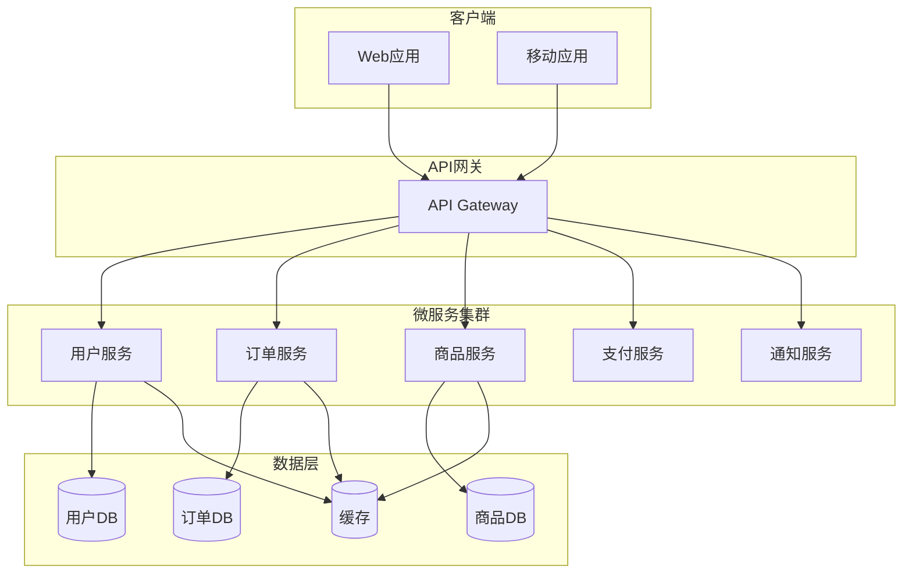
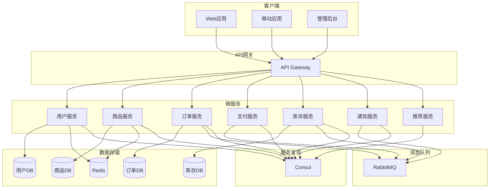

# Week 6 - 微服务架构设计

## 本周内容

- **微服务概述**：微服务定义、优势、挑战和适用场景
- **服务拆分策略**：领域驱动设计、边界上下文、服务粒度
- **服务通信**：同步通信、异步通信、API设计最佳实践
- **API网关**：网关功能、路由策略、认证授权
- **服务发现**：服务注册、发现机制、负载均衡
- **容错机制**：熔断器、重试、限流、降级
- **实践项目**：微服务架构设计与实现

## 微服务架构概述

### 什么是微服务？

**微服务**是一种将应用程序拆分为小型、独立服务的架构风格，每个服务都运行在自己的进程中，通过轻量级机制通信。

### 微服务的核心特征

1. **服务小型化**：每个服务专注于单一业务功能
2. **独立部署**：服务可以独立部署和扩展
3. **技术异构性**：不同服务可以使用不同的技术栈
4. **去中心化**：去中心化的数据管理和团队组织
5. **容错设计**：服务故障隔离，具备弹性



### 微服务vs单体架构

| 特性 | 单体架构 | 微服务架构 |
|------|----------|------------|
| 部署 | 整体部署 | 独立部署 |
| 扩展 | 垂直扩展 | 水平扩展 |
| 技术 | 统一技术栈 | 技术异构 |
| 故障影响 | 整体故障 | 故障隔离 |
| 开发效率 | 初期快 | 后期快 |
| 复杂度 | 运维简单 | 运维复杂 |

## 服务拆分策略

### 领域驱动设计 (DDD)

**领域驱动设计**是一种软件开发方法，通过将业务领域映射到软件模型来指导软件架构设计。

#### 核心概念

1. **领域 (Domain)**：业务问题的范围
2. **子域 (Subdomain)**：领域的细分部分
3. **边界上下文 (Bounded Context)**：特定模型的边界
4. **聚合 (Aggregate)**：一组相关对象的集合
5. **实体 (Entity)**：具有唯一标识的对象
6. **值对象 (Value Object)**：没有唯一标识的对象

```python
# 领域驱动设计示例
from dataclasses import dataclass
from typing import List
from enum import Enum

class OrderStatus(Enum):
    PENDING = "pending"
    CONFIRMED = "confirmed"
    SHIPPED = "shipped"
    DELIVERED = "delivered"
    CANCELLED = "cancelled"

@dataclass
class Address:
    street: str
    city: str
    state: str
    zip_code: str

@dataclass
class Money:
    amount: float
    currency: str

    def __add__(self, other):
        if self.currency != other.currency:
            raise ValueError("Currency mismatch")
        return Money(self.amount + other.amount, self.currency)

class OrderItem:
    def __init__(self, product_id: str, quantity: int, unit_price: Money):
        self.product_id = product_id
        self.quantity = quantity
        self.unit_price = unit_price

    def get_total(self) -> Money:
        return Money(self.quantity * self.unit_price.amount, self.unit_price.currency)

class Order:
    def __init__(self, order_id: str, customer_id: str):
        self.order_id = order_id
        self.customer_id = customer_id
        self.status = OrderStatus.PENDING
        self.items: List[OrderItem] = []
        self.shipping_address: Address = None
        self.total_amount: Money = Money(0, "USD")

    def add_item(self, item: OrderItem):
        """添加订单项"""
        self.items.append(item)
        self._calculate_total()

    def remove_item(self, product_id: str):
        """移除订单项"""
        self.items = [item for item in self.items if item.product_id != product_id]
        self._calculate_total()

    def confirm(self):
        """确认订单"""
        if not self.items:
            raise ValueError("Cannot confirm empty order")
        self.status = OrderStatus.CONFIRMED

    def ship(self):
        """发货"""
        if self.status != OrderStatus.CONFIRMED:
            raise ValueError("Order must be confirmed before shipping")
        self.status = OrderStatus.SHIPPED

    def _calculate_total(self):
        """计算订单总额"""
        total = Money(0, "USD")
        for item in self.items:
            total = total + item.get_total()
        self.total_amount = total
```

### 服务拆分原则

#### 1. 单一职责原则
每个服务应该专注于单一业务功能。

```python
# 错误的服务拆分
class UserService:
    def create_user(self, user_data):
        pass

    def process_payment(self, payment_data):
        pass

    def send_notification(self, notification_data):
        pass

# 正确的服务拆分
class UserService:
    def create_user(self, user_data):
        pass

class PaymentService:
    def process_payment(self, payment_data):
        pass

class NotificationService:
    def send_notification(self, notification_data):
        pass
```

#### 2. 高内聚低耦合
服务内部功能紧密相关，服务之间松散耦合。

#### 3. 数据自治
每个服务管理自己的数据存储。

```python
# 数据自治示例
class UserService:
    def __init__(self, user_repository):
        self.user_repository = user_repository

    def create_user(self, user_data):
        # 用户服务管理用户数据
        user = User(**user_data)
        return self.user_repository.save(user)

class OrderService:
    def __init__(self, order_repository):
        self.order_repository = order_repository

    def create_order(self, order_data):
        # 订单服务管理订单数据
        order = Order(**order_data)
        return self.order_repository.save(order)
```

### 服务拆分策略

#### 1. 按业务能力拆分
```python
# 按业务能力拆分示例
class UserService:
    """用户管理能力"""
    pass

class ProductService:
    """商品管理能力"""
    pass

class OrderService:
    """订单管理能力"""
    pass

class PaymentService:
    """支付处理能力"""
    pass
```

#### 2. 按子域拆分
```python
# 按子域拆分示例
class CatalogService:
    """商品目录子域"""
    pass

class InventoryService:
    """库存管理子域"""
    pass

class PricingService:
    """定价策略子域"""
    pass
```

## 服务通信

### 同步通信

#### 1. RESTful API
```python
# RESTful API服务通信示例
from fastapi import FastAPI, HTTPException
from pydantic import BaseModel
import requests

app = FastAPI()

class User(BaseModel):
    id: str
    name: str
    email: str

# 用户服务提供API
@app.get("/users/{user_id}")
async def get_user(user_id: str):
    # 模拟数据库查询
    if user_id == "1":
        return User(id="1", name="John Doe", email="john@example.com")
    raise HTTPException(status_code=404, detail="User not found")

# 其他服务调用用户服务
class OrderService:
    def __init__(self):
        self.user_service_url = "http://user-service:8000"

    def validate_user(self, user_id: str):
        """验证用户是否存在"""
        try:
            response = requests.get(f"{self.user_service_url}/users/{user_id}")
            return response.status_code == 200
        except requests.RequestException:
            return False
```

#### 2. gRPC
```python
# gRPC服务通信示例
import grpc
from concurrent import futures
import user_service_pb2
import user_service_pb2_grpc

class UserServiceServicer(user_service_pb2_grpc.UserServiceServicer):
    def GetUser(self, request, context):
        # 模拟获取用户
        return user_service_pb2.User(
            id=request.user_id,
            name="John Doe",
            email="john@example.com"
        )

def serve():
    server = grpc.server(futures.ThreadPoolExecutor(max_workers=10))
    user_service_pb2_grpc.add_UserServiceServicer_to_server(
        UserServiceServicer(), server
    )
    server.add_insecure_port('[::]:50051')
    server.start()
    server.wait_for_termination()

# 客户端调用
def get_user_grpc(user_id: str):
    with grpc.insecure_channel('localhost:50051') as channel:
        stub = user_service_pb2_grpc.UserServiceStub(channel)
        response = stub.GetUser(user_service_pb2.GetUserRequest(user_id=user_id))
        return response
```

### 异步通信

#### 1. 消息队列
```python
# 消息队列异步通信示例
import pika
import json
from abc import ABC, abstractmethod

class MessageHandler(ABC):
    @abstractmethod
    def handle(self, message):
        pass

class UserCreatedHandler(MessageHandler):
    def handle(self, message):
        user_data = json.loads(message)
        print(f"Processing user created: {user_data['user_id']}")
        # 处理用户创建后的业务逻辑

class MessageQueue:
    def __init__(self):
        self.connection = pika.BlockingConnection(
            pika.ConnectionParameters('localhost')
        )
        self.channel = self.connection.channel()
        self.handlers = {}

    def register_handler(self, routing_key, handler):
        """注册消息处理器"""
        self.handlers[routing_key] = handler

    def publish(self, routing_key, message):
        """发布消息"""
        self.channel.basic_publish(
            exchange='',
            routing_key=routing_key,
            body=json.dumps(message)
        )

    def start_consuming(self):
        """开始消费消息"""
        def callback(ch, method, properties, body):
            routing_key = method.routing_key
            if routing_key in self.handlers:
                self.handlers[routing_key].handle(body)

        for routing_key in self.handlers:
            self.channel.queue_declare(queue=routing_key)
            self.channel.basic_consume(
                queue=routing_key,
                on_message_callback=callback,
                auto_ack=True
            )

        self.channel.start_consuming()

# 使用示例
mq = MessageQueue()
mq.register_handler('user.created', UserCreatedHandler())

# 发布用户创建事件
mq.publish('user.created', {
    'user_id': '123',
    'name': 'John Doe',
    'email': 'john@example.com'
})
```

#### 2. 事件驱动架构
```python
# 事件驱动架构示例
from dataclasses import dataclass
from typing import List, Callable
from enum import Enum

class EventType(Enum):
    USER_CREATED = "user_created"
    ORDER_PLACED = "order_placed"
    PAYMENT_PROCESSED = "payment_processed"

@dataclass
class Event:
    type: EventType
    data: dict
    timestamp: str
    event_id: str

class EventDispatcher:
    def __init__(self):
        self.handlers: dict[EventType, List[Callable]] = {}

    def register_handler(self, event_type: EventType, handler: Callable):
        """注册事件处理器"""
        if event_type not in self.handlers:
            self.handlers[event_type] = []
        self.handlers[event_type].append(handler)

    def dispatch(self, event: Event):
        """分发事件"""
        if event.type in self.handlers:
            for handler in self.handlers[event.type]:
                try:
                    handler(event)
                except Exception as e:
                    print(f"Error handling event {event.type}: {e}")

# 事件处理器示例
class UserEventHandler:
    def on_user_created(self, event: Event):
        """用户创建事件处理"""
        user_data = event.data
        print(f"User created: {user_data['user_id']}")
        # 发送欢迎邮件
        # 创建用户分析数据
        # 其他业务逻辑

    def on_order_placed(self, event: Event):
        """订单创建事件处理"""
        order_data = event.data
        print(f"Order placed: {order_data['order_id']}")
        # 更新库存
        # 发送确认邮件
        # 创建物流订单
```

## API网关

### 网关核心功能

1. **路由转发**：将请求转发到相应的服务
2. **负载均衡**：在多个服务实例间分发请求
3. **认证授权**：统一的安全控制
4. **限流熔断**：保护后端服务
5. **监控日志**：请求追踪和监控

### API网关实现

```python
# API网关实现示例
from fastapi import FastAPI, Request, HTTPException, Depends
from fastapi.responses import JSONResponse
from fastapi.middleware.cors import CORSMiddleware
import httpx
from typing import Dict, Any
import time
from collections import defaultdict
import asyncio

app = FastAPI()

# 添加CORS中间件
app.add_middleware(
    CORSMiddleware,
    allow_origins=["*"],
    allow_credentials=True,
    allow_methods=["*"],
    allow_headers=["*"],
)

# 服务路由配置
SERVICE_ROUTES = {
    "user-service": "http://user-service:8001",
    "order-service": "http://order-service:8002",
    "product-service": "http://product-service:8003",
    "payment-service": "http://payment-service:8004",
}

# 限流器实现
class RateLimiter:
    def __init__(self, requests_per_minute: int = 60):
        self.requests_per_minute = requests_per_minute
        self.requests = defaultdict(list)
        self.lock = asyncio.Lock()

    async def is_allowed(self, client_id: str) -> bool:
        async with self.lock:
            now = time.time()
            # 清理过期请求
            self.requests[client_id] = [
                req_time for req_time in self.requests[client_id]
                if now - req_time < 60
            ]

            if len(self.requests[client_id]) >= self.requests_per_minute:
                return False

            self.requests[client_id].append(now)
            return True

rate_limiter = RateLimiter()

# 认证中间件
async def authenticate_request(request: Request) -> Dict[str, Any]:
    """认证请求"""
    auth_header = request.headers.get("Authorization")
    if not auth_header:
        raise HTTPException(status_code=401, detail="Missing authorization header")

    try:
        # 验证token
        token = auth_header.split(" ")[1]
        user_info = await validate_token(token)
        return user_info
    except Exception as e:
        raise HTTPException(status_code=401, detail="Invalid token")

async def validate_token(token: str) -> Dict[str, Any]:
    """验证JWT token"""
    # 这里应该实现JWT验证逻辑
    return {"user_id": "123", "roles": ["user"]}

# 熔断器实现
class CircuitBreaker:
    def __init__(self, failure_threshold: int = 5, recovery_timeout: int = 60):
        self.failure_threshold = failure_threshold
        self.recovery_timeout = recovery_timeout
        self.failure_count = 0
        self.last_failure_time = 0
        self.state = "closed"  # closed, open, half-open

    def call(self, func, *args, **kwargs):
        """调用函数并处理熔断逻辑"""
        if self.state == "open":
            if time.time() - self.last_failure_time > self.recovery_timeout:
                self.state = "half-open"
            else:
                raise Exception("Circuit breaker is open")

        try:
            result = func(*args, **kwargs)
            self.on_success()
            return result
        except Exception as e:
            self.on_failure()
            raise e

    def on_success(self):
        """成功调用处理"""
        self.failure_count = 0
        self.state = "closed"

    def on_failure(self):
        """失败调用处理"""
        self.failure_count += 1
        self.last_failure_time = time.time()
        if self.failure_count >= self.failure_threshold:
            self.state = "open"

# 服务代理
class ServiceProxy:
    def __init__(self):
        self.circuit_breakers = {}
        self.http_client = httpx.AsyncClient()

    async def forward_request(self, service_name: str, path: str, method: str,
                           headers: dict = None, body: Any = None) -> JSONResponse:
        """转发请求到指定服务"""
        if service_name not in SERVICE_ROUTES:
            raise HTTPException(status_code=404, detail="Service not found")

        # 获取熔断器
        if service_name not in self.circuit_breakers:
            self.circuit_breakers[service_name] = CircuitBreaker()

        circuit_breaker = self.circuit_breakers[service_name]

        # 构建请求URL
        url = f"{SERVICE_ROUTES[service_name]}{path}"

        # 转发请求
        async def make_request():
            response = await self.http_client.request(
                method=method,
                url=url,
                headers=headers,
                json=body
            )
            return JSONResponse(
                status_code=response.status_code,
                content=response.json()
            )

        try:
            return circuit_breaker.call(make_request)
        except Exception as e:
            raise HTTPException(status_code=503, detail="Service unavailable")

service_proxy = ServiceProxy()

# 路由处理
@app.api_route("/{path:path}", methods=["GET", "POST", "PUT", "DELETE"])
async def proxy_request(
    request: Request,
    path: str,
    user_info: dict = Depends(authenticate_request)
):
    """代理请求到相应服务"""

    # 限流检查
    client_id = request.client.host
    if not await rate_limiter.is_allowed(client_id):
        raise HTTPException(status_code=429, detail="Too many requests")

    # 路由到服务
    service_name = determine_service(path)

    # 转发请求
    return await service_proxy.forward_request(
        service_name=service_name,
        path=path,
        method=request.method,
        headers=dict(request.headers),
        body=await request.json() if request.method in ["POST", "PUT"] else None
    )

def determine_service(path: str) -> str:
    """根据路径确定目标服务"""
    if path.startswith("/users"):
        return "user-service"
    elif path.startswith("/orders"):
        return "order-service"
    elif path.startswith("/products"):
        return "product-service"
    elif path.startswith("/payments"):
        return "payment-service"
    else:
        raise HTTPException(status_code=404, detail="Route not found")

# 健康检查
@app.get("/health")
async def health_check():
    return {"status": "healthy"}

if __name__ == "__main__":
    import uvicorn
    uvicorn.run(app, host="0.0.0.0", port=8000)
```

## 服务发现

### 服务注册与发现

```python
# 服务发现实现示例
from dataclasses import dataclass
from typing import Dict, List, Optional
import time
import random
import requests
from concurrent.futures import ThreadPoolExecutor

@dataclass
class ServiceInstance:
    service_name: str
    instance_id: str
    host: str
    port: int
    health_check_url: str
    metadata: dict = None
    last_heartbeat: float = 0

class ServiceRegistry:
    def __init__(self):
        self.services: Dict[str, List[ServiceInstance]] = {}
        self.executor = ThreadPoolExecutor(max_workers=10)

    def register(self, service: ServiceInstance):
        """注册服务"""
        service.last_heartbeat = time.time()

        if service.service_name not in self.services:
            self.services[service.service_name] = []

        # 检查是否已存在
        for i, instance in enumerate(self.services[service.service_name]):
            if instance.instance_id == service.instance_id:
                self.services[service.service_name][i] = service
                return

        self.services[service.service_name].append(service)
        print(f"Service {service.service_name} registered with instance {service.instance_id}")

    def deregister(self, service_name: str, instance_id: str):
        """注销服务"""
        if service_name in self.services:
            self.services[service_name] = [
                instance for instance in self.services[service_name]
                if instance.instance_id != instance_id
            ]
            print(f"Service {service_name} instance {instance_id} deregistered")

    def heartbeat(self, service_name: str, instance_id: str):
        """心跳检测"""
        if service_name in self.services:
            for instance in self.services[service_name]:
                if instance.instance_id == instance_id:
                    instance.last_heartbeat = time.time()
                    return

    def get_service(self, service_name: str) -> Optional[ServiceInstance]:
        """获取服务实例"""
        if service_name not in self.services or not self.services[service_name]:
            return None

        # 简单的轮询负载均衡
        instances = self.services[service_name]
        return random.choice(instances)

    def get_all_services(self) -> Dict[str, List[ServiceInstance]]:
        """获取所有服务"""
        return self.services

    def health_check(self):
        """健康检查"""
        for service_name, instances in self.services.items():
            for instance in instances[:]:  # 使用切片复制避免修改列表时的问题
                try:
                    response = requests.get(instance.health_check_url, timeout=5)
                    if response.status_code != 200:
                        raise Exception("Health check failed")
                except Exception as e:
                    print(f"Health check failed for {service_name}:{instance.instance_id}: {e}")
                    self.deregister(service_name, instance.instance_id)

class ServiceClient:
    def __init__(self, service_registry: ServiceRegistry):
        self.registry = service_registry
        self.cache: Dict[str, ServiceInstance] = {}
        self.cache_ttl = 30  # 缓存30秒

    def get_service_url(self, service_name: str) -> str:
        """获取服务URL"""
        # 检查缓存
        if service_name in self.cache:
            cached_instance = self.cache[service_name]
            if time.time() - cached_instance.last_heartbeat < self.cache_ttl:
                return f"http://{cached_instance.host}:{cached_instance.port}"

        # 从注册中心获取
        instance = self.registry.get_service(service_name)
        if not instance:
            raise Exception(f"Service {service_name} not available")

        # 更新缓存
        self.cache[service_name] = instance
        return f"http://{instance.host}:{instance.port}"

    def call_service(self, service_name: str, endpoint: str, method: str = "GET",
                    data: dict = None) -> dict:
        """调用服务"""
        url = self.get_service_url(service_name)

        try:
            if method == "GET":
                response = requests.get(f"{url}{endpoint}")
            elif method == "POST":
                response = requests.post(f"{url}{endpoint}", json=data)
            elif method == "PUT":
                response = requests.put(f"{url}{endpoint}", json=data)
            elif method == "DELETE":
                response = requests.delete(f"{url}{endpoint}")

            response.raise_for_status()
            return response.json()
        except requests.RequestException as e:
            # 清除缓存，重试
            if service_name in self.cache:
                del self.cache[service_name]
            return self.call_service(service_name, endpoint, method, data)

# 使用示例
registry = ServiceRegistry()
client = ServiceClient(registry)

# 注册服务
user_service = ServiceInstance(
    service_name="user-service",
    instance_id="user-service-1",
    host="localhost",
    port=8001,
    health_check_url="http://localhost:8001/health"
)
registry.register(user_service)

# 调用服务
try:
    user_data = client.call_service("user-service", "/users/123")
    print(f"User data: {user_data}")
except Exception as e:
    print(f"Error calling service: {e}")
```

## 容错机制

### 熔断器模式

```python
# 熔断器模式实现
import time
from enum import Enum
from typing import Callable, Any
from functools import wraps

class CircuitState(Enum):
    CLOSED = "closed"
    OPEN = "open"
    HALF_OPEN = "half_open"

class CircuitBreaker:
    def __init__(self, failure_threshold: int = 5, recovery_timeout: int = 60):
        self.failure_threshold = failure_threshold
        self.recovery_timeout = recovery_timeout
        self.failure_count = 0
        self.last_failure_time = 0
        self.state = CircuitState.CLOSED

    def call(self, func: Callable, *args, **kwargs) -> Any:
        """调用函数并处理熔断逻辑"""
        if self.state == CircuitState.OPEN:
            if time.time() - self.last_failure_time > self.recovery_timeout:
                self.state = CircuitState.HALF_OPEN
            else:
                raise Exception("Circuit breaker is open")

        try:
            result = func(*args, **kwargs)
            self.on_success()
            return result
        except Exception as e:
            self.on_failure()
            raise e

    def on_success(self):
        """成功调用处理"""
        self.failure_count = 0
        self.state = CircuitState.CLOSED

    def on_failure(self):
        """失败调用处理"""
        self.failure_count += 1
        self.last_failure_time = time.time()
        if self.failure_count >= self.failure_threshold:
            self.state = CircuitState.OPEN

    def get_state(self) -> CircuitState:
        """获取当前状态"""
        return self.state

# 装饰器版本
def circuit_breaker(failure_threshold: int = 5, recovery_timeout: int = 60):
    def decorator(func):
        cb = CircuitBreaker(failure_threshold, recovery_timeout)

        @wraps(func)
        def wrapper(*args, **kwargs):
            return cb.call(func, *args, **kwargs)

        return wrapper
    return decorator
```

### 重试机制

```python
# 重试机制实现
import time
import random
from typing import Callable, Any, Optional

class RetryPolicy:
    def __init__(self, max_attempts: int = 3, base_delay: float = 1.0,
                 max_delay: float = 60.0, backoff_factor: float = 2.0):
        self.max_attempts = max_attempts
        self.base_delay = base_delay
        self.max_delay = max_delay
        self.backoff_factor = backoff_factor

    def should_retry(self, attempt: int, error: Exception) -> bool:
        """判断是否应该重试"""
        if attempt >= self.max_attempts:
            return False

        # 根据错误类型判断
        if isinstance(error, (ConnectionError, TimeoutError)):
            return True

        return False

    def get_delay(self, attempt: int) -> float:
        """获取重试延迟时间"""
        # 指数退避 + 随机抖动
        delay = min(self.base_delay * (self.backoff_factor ** (attempt - 1)),
                   self.max_delay)

        # 添加随机抖动避免同步重试
        jitter = random.uniform(0, delay * 0.1)
        return delay + jitter

def retry_with_policy(policy: RetryPolicy):
    """带策略的重试装饰器"""
    def decorator(func: Callable) -> Callable:
        @wraps(func)
        def wrapper(*args, **kwargs) -> Any:
            last_error = None

            for attempt in range(1, policy.max_attempts + 1):
                try:
                    return func(*args, **kwargs)
                except Exception as e:
                    last_error = e

                    if not policy.should_retry(attempt, e):
                        break

                    delay = policy.get_delay(attempt)
                    print(f"Attempt {attempt} failed, retrying in {delay:.2f}s: {e}")
                    time.sleep(delay)

            raise last_error

        return wrapper
    return decorator

def retry(max_attempts: int = 3, delay: float = 1.0):
    """简单的重试装饰器"""
    def decorator(func: Callable) -> Callable:
        @wraps(func)
        def wrapper(*args, **kwargs) -> Any:
            last_error = None

            for attempt in range(max_attempts):
                try:
                    return func(*args, **kwargs)
                except Exception as e:
                    last_error = e
                    if attempt < max_attempts - 1:
                        time.sleep(delay)

            raise last_error

        return wrapper
    return decorator
```

### 限流机制

```python
# 限流机制实现
import time
from collections import defaultdict, deque
from threading import Lock

class RateLimiter:
    def __init__(self, max_requests: int, time_window: int):
        self.max_requests = max_requests
        self.time_window = time_window
        self.requests = defaultdict(deque)
        self.lock = Lock()

    def is_allowed(self, key: str) -> bool:
        """检查是否允许请求"""
        with self.lock:
            now = time.time()

            # 清理过期请求
            while self.requests[key] and self.requests[key][0] <= now - self.time_window:
                self.requests[key].popleft()

            # 检查是否超过限制
            if len(self.requests[key]) >= self.max_requests:
                return False

            # 记录新请求
            self.requests[key].append(now)
            return True

class TokenBucket:
    """令牌桶限流算法"""
    def __init__(self, capacity: int, refill_rate: float):
        self.capacity = capacity
        self.refill_rate = refill_rate
        self.tokens = capacity
        self.last_refill = time.time()
        self.lock = Lock()

    def consume(self, tokens: int = 1) -> bool:
        """消费令牌"""
        with self.lock:
            now = time.time()

            # 补充令牌
            elapsed = now - self.last_refill
            self.tokens = min(self.capacity,
                            self.tokens + elapsed * self.refill_rate)
            self.last_refill = now

            # 检查是否有足够的令牌
            if self.tokens >= tokens:
                self.tokens -= tokens
                return True

            return False

class SlidingWindow:
    """滑动窗口限流算法"""
    def __init__(self, max_requests: int, time_window: int):
        self.max_requests = max_requests
        self.time_window = time_window
        self.requests = defaultdict(list)
        self.lock = Lock()

    def is_allowed(self, key: str) -> bool:
        """检查是否允许请求"""
        with self.lock:
            now = time.time()

            # 清理过期请求
            self.requests[key] = [
                timestamp for timestamp in self.requests[key]
                if timestamp > now - self.time_window
            ]

            # 检查是否超过限制
            if len(self.requests[key]) >= self.max_requests:
                return False

            # 记录新请求
            self.requests[key].append(now)
            return True

# 限流装饰器
def rate_limit(max_requests: int, time_window: int, key_func=None):
    """限流装饰器"""
    limiter = RateLimiter(max_requests, time_window)

    def decorator(func):
        @wraps(func)
        def wrapper(*args, **kwargs):
            # 获取限流key
            if key_func:
                key = key_func(*args, **kwargs)
            else:
                key = "default"

            # 检查是否允许请求
            if not limiter.is_allowed(key):
                raise Exception("Rate limit exceeded")

            return func(*args, **kwargs)

        return wrapper
    return decorator
```

## 实践项目：电商平台微服务架构

### 项目背景

设计一个电商平台的微服务架构，应用本周学习的微服务设计原则和模式。

### 系统架构



### 核心服务实现

#### 1. 用户服务
```python
# 用户服务实现
from fastapi import FastAPI, HTTPException
from pydantic import BaseModel
from typing import Optional
import redis
import json

app = FastAPI()

# Redis连接
redis_client = redis.Redis(host='localhost', port=6379, db=0)

class User(BaseModel):
    id: Optional[str] = None
    name: str
    email: str
    password: str
    created_at: Optional[str] = None

class UserService:
    def __init__(self):
        self.users_db = {}  # 模拟数据库
        self.redis_client = redis_client

    def create_user(self, user: User) -> User:
        """创建用户"""
        # 验证邮箱是否已存在
        if any(u.email == user.email for u in self.users_db.values()):
            raise HTTPException(status_code=400, detail="Email already exists")

        # 生成用户ID
        user_id = str(len(self.users_db) + 1)
        user.id = user_id

        # 保存到数据库
        self.users_db[user_id] = user

        # 缓存到Redis
        self.redis_client.set(f"user:{user_id}", json.dumps(user.dict()))

        return user

    def get_user(self, user_id: str) -> Optional[User]:
        """获取用户"""
        # 先从缓存获取
        cached_user = self.redis_client.get(f"user:{user_id}")
        if cached_user:
            return User(**json.loads(cached_user))

        # 从数据库获取
        user = self.users_db.get(user_id)
        if user:
            # 缓存到Redis
            self.redis_client.set(f"user:{user_id}", json.dumps(user.dict()))

        return user

    def update_user(self, user_id: str, user_data: dict) -> Optional[User]:
        """更新用户"""
        user = self.users_db.get(user_id)
        if not user:
            return None

        # 更新用户数据
        for key, value in user_data.items():
            setattr(user, key, value)

        # 更新数据库
        self.users_db[user_id] = user

        # 更新缓存
        self.redis_client.set(f"user:{user_id}", json.dumps(user.dict()))

        return user

user_service = UserService()

@app.post("/users")
async def create_user(user: User):
    """创建用户"""
    return user_service.create_user(user)

@app.get("/users/{user_id}")
async def get_user(user_id: str):
    """获取用户"""
    user = user_service.get_user(user_id)
    if not user:
        raise HTTPException(status_code=404, detail="User not found")
    return user

@app.put("/users/{user_id}")
async def update_user(user_id: str, user_data: dict):
    """更新用户"""
    user = user_service.update_user(user_id, user_data)
    if not user:
        raise HTTPException(status_code=404, detail="User not found")
    return user

@app.get("/health")
async def health_check():
    """健康检查"""
    return {"status": "healthy"}
```

#### 2. 订单服务
```python
# 订单服务实现
from fastapi import FastAPI, HTTPException
from pydantic import BaseModel
from typing import List, Optional
import pika
import json
from datetime import datetime

app = FastAPI()

# 消息队列连接
connection = pika.BlockingConnection(pika.ConnectionParameters('localhost'))
channel = connection.channel()

class OrderItem(BaseModel):
    product_id: str
    quantity: int
    price: float

class Order(BaseModel):
    id: Optional[str] = None
    user_id: str
    items: List[OrderItem]
    total_amount: float
    status: str = "pending"
    created_at: Optional[str] = None

class OrderService:
    def __init__(self):
        self.orders_db = {}
        self.channel = channel

    def create_order(self, order: Order) -> Order:
        """创建订单"""
        # 生成订单ID
        order_id = str(len(self.orders_db) + 1)
        order.id = order_id
        order.created_at = datetime.now().isoformat()

        # 保存到数据库
        self.orders_db[order_id] = order

        # 发布订单创建事件
        self.publish_event("order.created", {
            "order_id": order_id,
            "user_id": order.user_id,
            "total_amount": order.total_amount
        })

        return order

    def get_order(self, order_id: str) -> Optional[Order]:
        """获取订单"""
        return self.orders_db.get(order_id)

    def update_order_status(self, order_id: str, status: str) -> Optional[Order]:
        """更新订单状态"""
        order = self.orders_db.get(order_id)
        if not order:
            return None

        old_status = order.status
        order.status = status

        # 发布状态变更事件
        self.publish_event("order.status_changed", {
            "order_id": order_id,
            "old_status": old_status,
            "new_status": status
        })

        return order

    def publish_event(self, event_type: str, data: dict):
        """发布事件"""
        event = {
            "type": event_type,
            "data": data,
            "timestamp": datetime.now().isoformat()
        }

        self.channel.basic_publish(
            exchange='',
            routing_key='orders',
            body=json.dumps(event)
        )

order_service = OrderService()

@app.post("/orders")
async def create_order(order: Order):
    """创建订单"""
    return order_service.create_order(order)

@app.get("/orders/{order_id}")
async def get_order(order_id: str):
    """获取订单"""
    order = order_service.get_order(order_id)
    if not order:
        raise HTTPException(status_code=404, detail="Order not found")
    return order

@app.put("/orders/{order_id}/status")
async def update_order_status(order_id: str, status: str):
    """更新订单状态"""
    order = order_service.update_order_status(order_id, status)
    if not order:
        raise HTTPException(status_code=404, detail="Order not found")
    return order

@app.get("/health")
async def health_check():
    """健康检查"""
    return {"status": "healthy"}
```

## 总结

本周我们深入学习了微服务架构设计：

1. **微服务概述**：理解了微服务的定义、特征和适用场景
2. **服务拆分策略**：掌握了基于DDD的服务拆分方法
3. **服务通信**：学习了同步和异步通信模式
4. **API网关**：实现了完整的API网关功能
5. **服务发现**：掌握了服务注册和发现机制
6. **容错机制**：实现了熔断器、重试、限流等容错模式

## 课后练习

1. **实践题**：实现一个完整的微服务系统，包含至少3个服务和API网关。

2. **设计题**：为一个在线教育平台设计微服务架构，考虑课程管理、用户管理、支付系统等模块。

3. **扩展阅读**：《微服务设计》相关章节，《Building Microservices》。

## 下一周预告

Week 7我们将学习容错与高可用设计，包括容错模式、高可用架构、监控告警等内容。

---

**记住**：微服务不是银弹，需要根据业务需求和团队能力选择合适的架构模式！